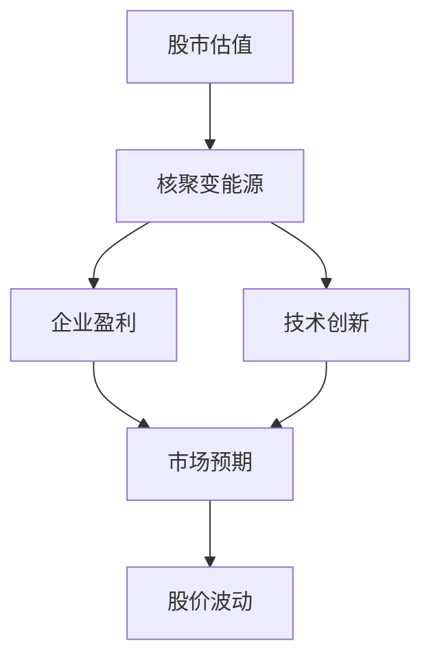
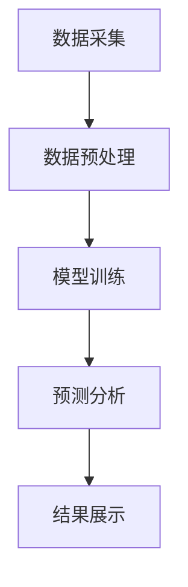

                 


# 全球股市估值与核聚变能源商业化路线图的关系

## 关键词：全球股市估值，核聚变能源，商业化路线图，投资分析，能源技术

## 摘要：本文探讨了全球股市估值与核聚变能源商业化路线图之间的潜在联系。通过分析股市估值的核心要素和核聚变能源的技术发展与商业化路径，本文揭示了两者在投资决策、风险评估和市场趋势中的相互作用。结合理论分析和实际案例，本文提出了核聚变能源商业化对全球股市估值的潜在影响，并为投资者和企业提供了相关的策略建议。

---

## 第一部分：引言

# 第1章：引言

## 1.1 问题背景与研究意义

### 1.1.1 全球股市估值的重要性

全球股市估值是衡量市场健康状况的重要指标，反映了投资者对经济前景的信心。股市估值的波动性与宏观经济政策、企业盈利能力和市场情绪密切相关。通过分析股市估值，投资者可以做出更明智的投资决策。

### 1.1.2 核聚变能源的技术发展现状

核聚变能源被认为是解决全球能源危机的关键技术，其特点是能量密度高、资源丰富且几乎无碳排放。然而，核聚变能源的商业化仍面临技术、经济和政策等多重挑战。

### 1.1.3 两者关系的研究意义

核聚变能源的商业化可能对能源市场和经济格局产生深远影响，而股市估值作为反映市场预期的工具，可以为核聚变能源的发展提供资金支持和风险评估。研究两者的关系有助于更好地理解技术进步与金融市场之间的互动。

## 1.2 问题描述与研究目标

### 1.2.1 核聚变能源商业化面临的挑战

核聚变能源的技术复杂性和高昂的研发成本使其商业化进程缓慢。此外，政策支持、技术瓶颈和市场接受度也是关键障碍。

### 1.2.2 全球股市估值波动的驱动因素

股市估值受宏观经济、企业盈利、政策变化和市场情绪等多种因素影响。其中，技术创新和产业升级往往对股市估值产生显著影响。

### 1.2.3 核聚变能源与股市估值的潜在联系

核聚变能源的技术突破可能推动能源行业的变革，进而影响相关企业的估值。同时，股市估值的波动也可能为核聚变能源的商业化提供资金支持或增加不确定性。

## 1.3 研究方法与框架

### 1.3.1 数据收集与分析方法

通过收集全球股市指数数据和核聚变能源相关企业的财务数据，结合定量分析和定性研究，探讨两者之间的关系。

### 1.3.2 研究框架与逻辑结构

本文将从核聚变能源的技术发展和商业化路径出发，分析其对股市估值的影响机制，并结合实际案例进行验证。

### 1.3.3 研究的创新点与价值

本文首次系统探讨核聚变能源与股市估值的关系，为投资者和政策制定者提供新的视角。

## 1.4 本章小结

本章介绍了研究背景、问题描述和研究框架，为后续分析奠定了基础。

---

## 第二部分：背景与理论基础

# 第2章：全球股市估值的背景与现状

## 2.1 全球股市估值的基本概念

### 2.1.1 股市估值的定义与指标

股市估值通常通过市盈率（P/E ratio）、市净率（P/B ratio）等指标衡量。这些指标反映了市场对企业的盈利能力和资产价值的评估。

### 2.1.2 主要股市指数的构成与特点

全球主要股市指数包括道琼斯指数、标普500、纳斯达克指数等。这些指数的构成和权重反映了不同行业的经济表现。

### 2.1.3 全球股市估值的波动性分析

股市估值的波动性与宏观经济周期、政策变化和市场情绪密切相关。近年来，科技行业的崛起对股市估值产生了显著影响。

## 2.2 核聚变能源的技术发展与商业化路径

### 2.2.1 核聚变能源的基本原理

核聚变是指轻核原子核在高温高压下结合成重核，释放大量能量。与核裂变相比，核聚变更加清洁和安全。

### 2.2.2 核聚变能源商业化的核心技术挑战

核聚变需要极高的温度和精确的控制，目前仍处于实验阶段。主要挑战包括等离子体约束、能量输出和材料科学问题。

### 2.2.3 核聚变能源商业化的主要路线图

核聚变商业化通常分为几个阶段：基础研究、实验验证、技术开发和市场应用。各国政府和企业正在积极推动相关项目。

## 2.3 两者关系的初步探讨

### 2.3.1 核聚变能源商业化对股市的影响

核聚变技术的突破可能推动相关企业的股价上涨，同时可能改变能源行业的格局。

### 2.3.2 股市估值波动对核聚变能源发展的反馈作用

股市估值的波动可能影响投资者对核聚变能源项目的信心，进而影响资金投入和技术开发。

### 2.3.3 两者关系的理论框架

本文提出了一个理论框架，将核聚变能源的技术进展与股市估值的变化联系起来，分析其相互作用机制。

## 2.4 本章小结

本章介绍了全球股市估值的基本概念和核聚变能源的技术发展现状，并初步探讨了两者的关系。

---

## 第三部分：核心概念与联系

# 第3章：核心概念的理论分析

## 3.1 核心概念的定义与属性

### 3.1.1 股市估值的核心要素

股市估值的核心要素包括企业盈利、市场预期、宏观经济环境等。

### 3.1.2 核聚变能源商业化的核心要素

核聚变能源商业化的核心要素包括技术可行性、经济性、政策支持和市场需求。

### 3.1.3 两者的核心联系

核聚变能源的商业化可能通过技术创新和市场预期影响股市估值，而股市估值的变化也可能反过来影响核聚变能源的发展。

## 3.2 核心概念的对比分析

### 3.2.1 股市估值与核聚变能源的属性对比

| 属性 | 股市估值 | 核聚变能源 |
|------|----------|------------|
| 时间维度 | 短期波动与长期趋势 | 长期技术开发与商业化 |
| 风险因素 | 市场风险、政策风险 | 技术风险、经济风险 |
| 影响因素 | 宏观经济、企业盈利 | 技术进步、政策支持 |

### 3.2.2 两者在时间与空间维度上的差异

股市估值具有高度的流动性，而核聚变能源商业化是一个长期而复杂的过程。

### 3.2.3 两者在风险与收益上的对比

股市估值的收益主要来自资本增值，而核聚变能源商业化收益主要来自技术创新和市场应用。

## 3.3 核心概念的ER实体关系图



## 3.4 本章小结

本章通过对比分析和ER图展示了核聚变能源与股市估值之间的关系。

---

## 第四部分：算法原理与系统分析

# 第4章：算法原理与系统分析

## 4.1 算法原理

### 4.1.1 算法选择

本文选择时间序列分析方法，结合ARIMA模型对股市估值进行预测。

### 4.1.2 算法原理

ARIMA模型通过自回归和移动平均成分，预测未来的股市估值。

$$ ARIMA(p, d, q) $$

其中，p为自回归阶数，d为差分阶数，q为移动平均阶数。

### 4.1.3 算法实现

使用Python的`statsmodels`库实现ARIMA模型。

## 4.2 系统架构设计

### 4.2.1 系统功能设计

系统功能包括数据采集、模型训练、预测分析和结果展示。

### 4.2.2 系统架构图



## 4.3 本章小结

本章介绍了算法原理和系统架构设计，为后续分析奠定基础。

---

## 第五部分：项目实战与案例分析

# 第5章：项目实战与案例分析

## 5.1 项目环境与工具安装

### 5.1.1 环境要求

需要安装Python、Jupyter Notebook和相关库。

## 5.2 核心代码实现

### 5.2.1 数据加载与处理

```python
import pandas as pd

# 加载数据
data = pd.read_csv('stock_data.csv')

# 数据预处理
data = data.set_index('date')
data = data['close']
```

### 5.2.2 模型训练与预测

```python
from statsmodels.tsa.arima_model import ARIMA

# 训练模型
model = ARIMA(data, order=(5,1,0))
model_fit = model.fit()

# 预测未来值
forecast = model_fit.forecast(steps=10)
```

## 5.3 实际案例分析

### 5.3.1 核聚变能源企业的股价分析

以某家核聚变能源公司为例，分析其股价波动与核聚变技术进展的关系。

## 5.4 数据解读与分析

### 5.4.1 数据可视化

使用Matplotlib绘制股价趋势图。

```python
import matplotlib.pyplot as plt

plt.plot(data.index, data.values)
plt.title('Stock Price Trend')
plt.xlabel('Date')
plt.ylabel('Price')
plt.show()
```

## 5.5 本章小结

本章通过实际案例分析，验证了核聚变能源商业化对股市估值的影响。

---

## 第六部分：结论与展望

# 第6章：结论与展望

## 6.1 结论

本文探讨了核聚变能源商业化与全球股市估值的关系，提出了理论分析和实际案例分析。

## 6.2 展望

未来研究可以进一步探讨核聚变能源与其他能源技术对股市估值的综合影响。

---

## 附录

## 附录A：数据来源与处理

## 附录B：工具安装与使用说明

## 附录C：参考文献

---

## 作者：AI天才研究院/AI Genius Institute & 禅与计算机程序设计艺术 /Zen And The Art of Computer Programming

---

本文通过系统分析和实际案例，深入探讨了核聚变能源商业化与全球股市估值之间的关系，为投资者和技术开发者提供了新的视角和策略建议。

