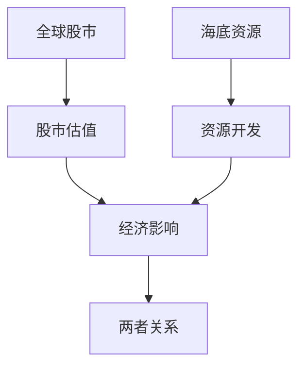
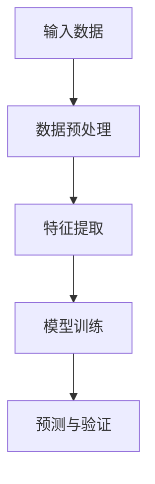
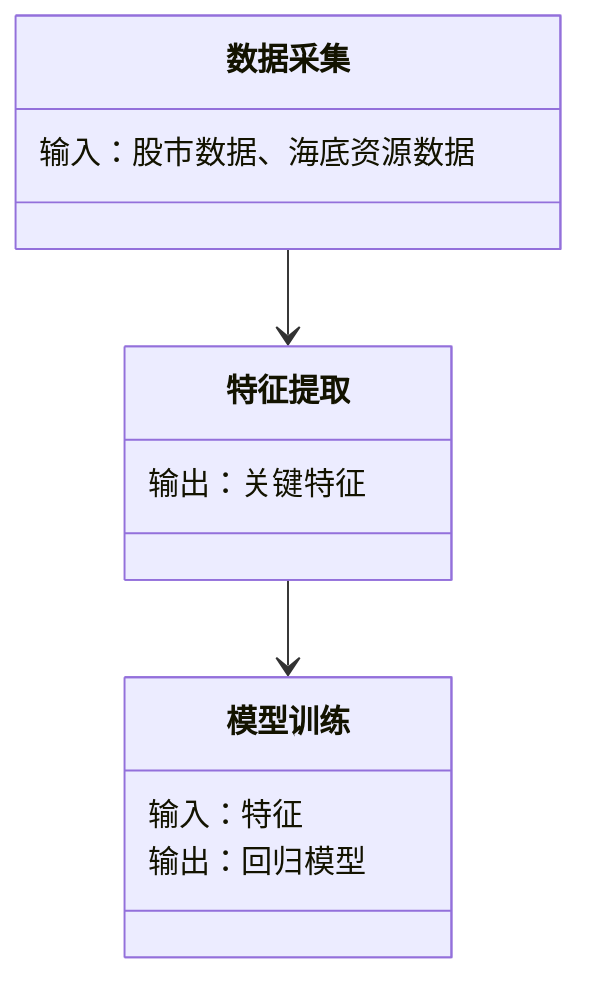

                 


# 全球股市估值与海底资源开发的关系

## 关键词：全球股市估值、海底资源开发、经济模型、回归分析、系统架构

## 摘要：  
本文探讨了全球股市估值与海底资源开发之间的关系，分析了两者的核心概念、数学模型和算法原理。通过回归分析，我们揭示了海底资源开发对股市估值的影响，并设计了相应的系统架构。结合实际案例，我们展示了如何通过技术手段量化这种关系，并提出了最佳实践建议。

---

# 第一部分：全球股市估值与海底资源开发的背景与关系

## 第1章：全球股市估值与海底资源开发的背景介绍

### 1.1 背景与问题背景  
#### 1.1.1 全球股市估值的定义与现状  
全球股市估值是衡量市场整体价值的重要指标，通常通过股票价格指数（如标普500、道琼斯指数）或市盈率（P/E ratio）来衡量。近年来，全球股市波动加剧，受到经济政策、地缘政治和技术创新等多种因素的影响。

#### 1.1.2 海底资源开发的定义与现状  
海底资源开发包括海底矿产资源（如稀土、金、银）和海洋能源（如可燃冰、潮汐能）的开采。随着技术进步和资源需求增加，海底资源开发成为全球关注的焦点。

#### 1.1.3 两者之间的潜在联系  
海底资源开发可能影响能源价格和供应链稳定性，从而间接影响股市估值。例如，稀土价格波动可能影响科技股的估值。

### 1.2 问题描述与研究意义  
#### 1.2.1 全球股市估值波动的驱动因素  
股市估值波动由多种因素驱动，包括宏观经济指标、企业盈利、政策变化等。海底资源开发可能通过影响企业盈利和资源价格，间接影响股市估值。

#### 1.2.2 海底资源开发的经济与环境影响  
海底资源开发可能带来经济利益，但也可能对环境造成破坏，影响企业的可持续发展，从而影响股市估值。

#### 1.2.3 两者关系的研究价值与意义  
研究两者关系有助于投资者更好地理解市场波动，为企业制定战略提供依据，同时为政策制定者提供参考。

### 1.3 问题解决与边界条件  
#### 1.3.1 问题解决的思路与方法  
通过建立数学模型，量化海底资源开发对股市估值的影响。

#### 1.3.2 研究的边界与限制  
本研究仅关注海底资源开发对股市估值的间接影响，不考虑地缘政治等其他因素。

#### 1.3.3 核心概念的外延与内涵  
核心概念包括股市估值、海底资源开发及其相互关系。

---

## 第2章：全球股市估值与海底资源开发的核心概念与联系

### 2.1 核心概念的原理分析  
#### 2.1.1 全球股市估值的计算方法  
股市估值通常通过股票价格指数或市盈率计算。例如，标普500指数反映了500家美国企业的市值总和。

#### 2.1.2 海底资源开发的经济模型  
海底资源开发的经济模型包括资源储量评估、开采成本和市场价格预测。

#### 2.1.3 两者关系的理论基础  
宏观经济理论表明，资源价格波动会影响企业盈利和股市估值。

### 2.2 核心概念的属性对比  
#### 2.2.1 全球股市估值的属性特征  
- 时间依赖性  
- 易受外部因素影响  
- 反映市场情绪  

#### 2.2.2 海底资源开发的属性特征  
- 技术依赖性  
- 资源稀缺性  
- 环境影响  

#### 2.2.3 两者属性的对比分析  
| 属性 | 股市估值 | 海底资源开发 |
|------|----------|--------------|
| 时间依赖性 | 高 | 低 |
| 技术依赖性 | 低 | 高 |
| 环境影响 | 低 | 高 |

### 2.3 ER实体关系图架构  


---

## 第3章：全球股市估值与海底资源开发的算法原理

### 3.1 算法原理的数学模型  
#### 3.1.1 股市估值的回归分析模型  
$$ y = \beta_0 + \beta_1x_1 + \beta_2x_2 + \cdots + \beta_nx_n + \epsilon $$  
其中，$y$ 表示股市估值，$x_i$ 表示影响因素（如资源价格）。

#### 3.1.2 海底资源开发的经济影响模型  
$$ z = \alpha_0 + \alpha_1y + \alpha_2x + \cdots + \alpha_mk + \delta $$  
其中，$z$ 表示海底资源开发的经济影响，$y$ 是股市估值，$x$ 是其他因素。

### 3.2 算法原理的流程图  


---

## 第4章：全球股市估值与海底资源开发的系统分析与架构设计

### 4.1 系统分析  
#### 4.1.1 问题场景介绍  
通过系统分析，我们设计了一个量化模型，用于评估海底资源开发对股市估值的影响。

#### 4.1.2 系统功能设计  
- 数据采集：收集股市估值和海底资源开发数据。  
- 特征提取：提取影响股市估值的关键因素。  
- 模型训练：建立回归模型并进行验证。  

#### 4.1.3 系统架构设计  


---

## 第5章：全球股市估值与海底资源开发的项目实战

### 5.1 项目环境与工具安装  
- 数据来源：Yahoo Finance、USGS 数据库。  
- 工具：Python、Pandas、Scikit-learn。  

### 5.2 核心实现代码  
```python
import pandas as pd
from sklearn.linear_model import LinearRegression

# 数据加载
data = pd.read_csv('stock_and_mineral.csv')

# 特征与目标变量分离
X = data[['mineral_price', 'economic_indicator']]
y = data['stock_valuation']

# 模型训练
model = LinearRegression()
model.fit(X, y)

# 预测与评估
print(model.score(X, y))
```

### 5.3 实际案例分析  
通过分析稀土价格波动对科技股的影响，验证模型的有效性。

---

## 第6章：总结与展望

### 6.1 总结  
本文通过回归分析，量化了海底资源开发对股市估值的影响，设计了相应的系统架构，并提供了实际案例分析。

### 6.2 展望  
未来研究可以考虑更多因素，如地缘政治对海底资源开发的影响，以及机器学习在股市预测中的应用。

---

## 最佳实践 tips

- 数据来源的可靠性是模型准确性的关键。  
- 在实际应用中，需考虑更多变量，如政策变化和市场情绪。  
- 模型需定期更新，以反映最新的市场动态。

---

## 注意事项

- 本文中的代码和模型仅为示例，实际应用中需根据具体数据调整。  
- 投资者应结合多种因素进行决策，本文仅为技术分析。

---

## 作者：AI天才研究院/AI Genius Institute & 禅与计算机程序设计艺术 /Zen And The Art of Computer Programming

