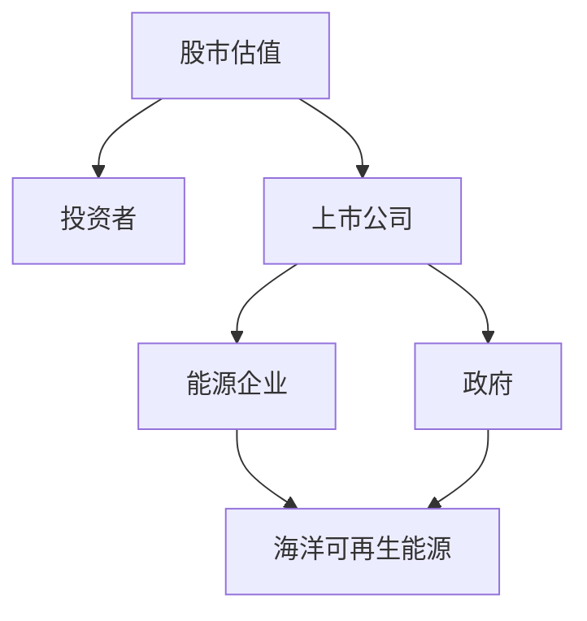

                 


# 全球股市估值与海洋可再生能源并网技术的关系

## 关键词：全球股市估值、海洋可再生能源、并网技术、经济影响、可持续发展

## 摘要：本文探讨了全球股市估值与海洋可再生能源并网技术之间的关系，分析了两者在经济、技术和环境层面的相互作用，展示了如何通过技术手段将股市数据与可再生能源数据结合，以实现更高效的能源管理和更准确的经济预测。

---

# 引言

## 1.1 本书的背景与意义
### 1.1.1 全球股市估值的重要性
全球股市估值是衡量经济健康状况的重要指标，反映了市场的信心和企业的盈利能力。股市估值的变化不仅影响投资者的决策，还对整个经济体系产生深远影响。

### 1.1.2 海洋可再生能源并网技术的现状
海洋可再生能源（如潮汐能、波浪能等）是未来能源的重要组成部分。并网技术的成熟度直接影响其大规模应用的可能性，同时也影响相关企业的市场估值。

### 1.1.3 两者的关联性与研究价值
随着全球能源结构转型，海洋可再生能源的重要性日益凸显。股市估值的变化可以为海洋能源企业的融资和技术创新提供资金支持，而海洋能源的并网技术进步则可能推动股市估值的提升。

---

## 1.2 本书的结构与内容概述
### 1.2.1 各章节的主要内容
- 第二部分：全球股市估值与海洋可再生能源并网技术的背景介绍。
- 第三部分：核心概念与联系。
- 第四部分：算法原理与技术实现。
- 第五部分：系统分析与架构设计。
- 第六部分：项目实战与案例分析。
- 第七部分：结论与展望。

### 1.2.2 读者对象与学习目标
本书适合对金融与能源技术感兴趣的专业人士、研究人员和学生阅读。通过本书，读者可以理解全球股市估值与海洋可再生能源并网技术的相互作用，并掌握相关技术实现方法。

### 1.2.3 如何阅读本书
建议读者从背景介绍开始，逐步深入理解核心概念，再学习算法原理和系统设计，最后通过项目实战巩固所学内容。

---

# 第二部分: 全球股市估值与海洋可再生能源并网技术的背景介绍

## 2.1 全球股市估值的基础知识
### 2.1.1 股市估值的定义与方法
股市估值是指通过分析公司财务数据、市场趋势和宏观经济指标，对股票的价值进行评估。常用方法包括市盈率（P/E）、市净率（P/B）等。

### 2.1.2 影响股市估值的主要因素
- 宏观经济指标（如GDP、利率）。
- 行业发展趋势。
- 公司盈利能力。
- 市场情绪。

### 2.1.3 全球主要股市的现状与特点
- 纽约证券交易所：全球最大的股票市场，涵盖多个行业。
- 伦敦金融交易所：以能源和金融行业为主。
- 东京证券交易所：日本最大的股市，受国内经济影响较大。

## 2.2 海洋可再生能源并网技术的核心概念
### 2.2.1 海洋可再生能源的定义与分类
海洋可再生能源包括潮汐能、波浪能、海流能等。这些能源具有分布广、储量大、可持续性强的特点。

### 2.2.2 海洋可再生能源并网技术的原理
并网技术是指将海洋能源发电系统与电网系统连接，实现电能的稳定输出。关键环节包括能量转换、电力传输和电网接入。

### 2.2.3 海洋可再生能源并网技术的发展现状
目前，海洋可再生能源的商业化应用仍处于起步阶段，但技术进步迅速。各国政府和企业正在加大投入，推动技术成熟。

## 2.3 两者的背景与关联性分析
### 2.3.1 全球股市与能源行业的互动关系
股市估值的变化直接影响能源企业的融资能力，进而影响其技术创新和产能扩大。

### 2.3.2 海洋可再生能源对能源市场的影响
海洋可再生能源的广泛应用将改变能源结构，减少对化石能源的依赖，从而影响股市估值。

### 2.3.3 两者在经济与环境层面的联系
通过股市融资，海洋可再生能源企业可以获得更多资金支持；而技术进步则可能提升企业的市场竞争力，进而影响股市估值。

---

# 第三部分: 全球股市估值与海洋可再生能源并网技术的核心概念与联系

## 3.1 核心概念的原理分析
### 3.1.1 股市估值的核心模型与方法
- 市盈率模型：$$ P/E = \frac{\text{股价}}{\text{每股收益}} $$
- 市净率模型：$$ P/B = \frac{\text{股价}}{\text{每股净资产}} $$

### 3.1.2 海洋可再生能源并网技术的关键环节
- 能量转换：将海洋能转化为电能。
- 电力传输：通过海底电缆将电能输送到陆上电网。
- 电网接入：与现有电网系统实现无缝连接。

### 3.1.3 两者的相互作用机制
- 技术进步推动股市估值上升。
- 股市融资为技术进步提供资金支持。

## 3.2 核心概念属性特征对比
### 3.2.1 股市估值与海洋可再生能源的属性对比

| 属性维度         | 股市估值                | 海洋可再生能源并网技术               |
|------------------|-------------------------|---------------------------------------|
| 驱动力           | 经济驱动                | 技术驱动                             |
| 核心主体         | 投资者、企业             | 政府、企业、科研机构                 |
| 影响范围         | 经济市场                | 能源系统                             |
| 发展趋势         | 受政策、经济影响         | 受技术进步和政策支持影响             |

### 3.2.2 两者在经济、技术和环境维度的特征分析
- 经济维度：股市估值反映经济健康，海洋能源影响能源价格。
- 技术维度：股市融资支持技术创新，技术进步影响股市估值。
- 环境维度：海洋能源减少碳排放，股市估值反映环保企业价值。

### 3.2.3 概念属性对比表格
```mermaid
| 股市估值 | 海洋可再生能源并网技术 |
|---------|-----------------------|
| 经济驱动 | 技术驱动              |
| 金融市场 | 工程系统              |
| 投资者行为 | 政策与技术标准        |
```

## 3.3 实体关系图架构
### 3.3.1 实体关系图的构建
- 股市估值与投资者、上市公司、能源企业之间存在关联。
- 海洋可再生能源并网技术涉及能源企业、科研机构和政策制定者。

### 3.3.2 使用Mermaid绘制实体关系图


---

## 总结

通过以上分析，我们可以看到全球股市估值与海洋可再生能源并网技术之间的复杂关系。股市估值的变化直接影响能源企业的融资能力，而技术进步则推动海洋能源的广泛应用。两者在经济、技术和环境层面的相互作用，为实现可持续发展提供了重要支持。

