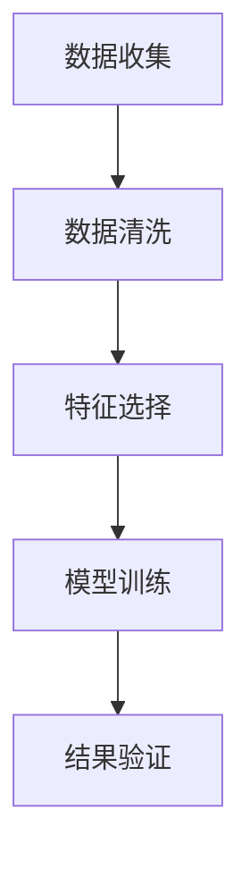
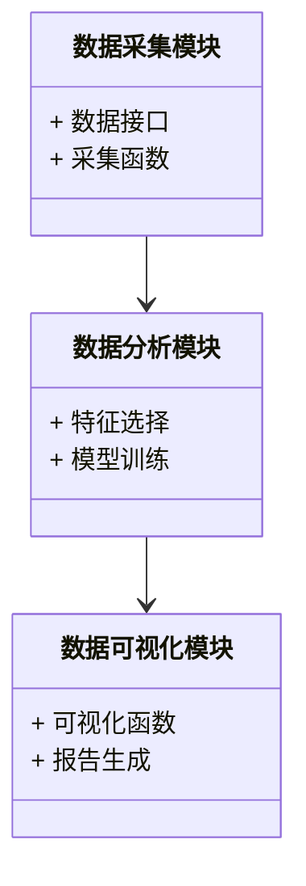

                 


# 全球股市估值与海洋可再生能源的关联

> **关键词**：全球股市估值、海洋可再生能源、关联分析、数据分析、机器学习

> **摘要**：本文探讨全球股市估值与海洋可再生能源之间的潜在关联。通过数据分析、算法建模和系统设计，揭示两者之间的关系，并提供实际案例分析和最佳实践。文章旨在帮助读者理解如何通过技术手段分析和预测这种关联，为投资决策和能源政策提供参考。

---

## 第一章：背景介绍

### 1.1 问题背景
全球能源转型和可持续发展已成为当今社会的核心议题。海洋可再生能源（如潮汐能、波浪能和海流能）因其清洁、可再生的特性，逐渐成为能源市场的重要组成部分。与此同时，股市估值受多种因素影响，包括经济波动、政策变化和技术创新等。随着绿色投资的兴起，海洋可再生能源的市场表现可能与股市估值产生关联。

### 1.2 问题描述
本文旨在分析全球股市估值与海洋可再生能源之间的潜在关联。具体而言，我们将探讨以下问题：
- 海洋可再生能源的市场发展如何影响股市估值？
- 能源价格波动与股市指数之间是否存在相关性？
- 如何通过数据分析和建模预测两者之间的关系？

### 1.3 问题解决
我们采用数据分析方法论，结合统计模型和机器学习算法，对全球股市数据和海洋可再生能源数据进行建模和分析。通过可视化工具和报告生成，我们能够清晰地展示两者之间的关联性。

### 1.4 边界与外延
- **研究范围**：聚焦于全球主要股市指数（如标普500、纳斯达克）和海洋可再生能源企业的股价表现。
- **相关变量**：包括能源价格、政策支持、技术创新和市场情绪等。
- **研究局限性**：数据范围和时间跨度有限，未来研究可扩展至更多市场和更长时间段。

### 1.5 核心要素与概念结构
- **核心概念**：全球股市估值、海洋可再生能源、关联分析。
- **概念结构**：构建系统模型，展示两者之间的相互作用。

---

## 第二章：核心概念与联系

### 2.1 全球股市估值的核心概念与属性
- **定义**：股市估值反映市场对企业的价值评估，通常通过市盈率、市净率等指标衡量。
- **特征**：波动性高、受宏观经济影响显著、投资者情绪影响大。

### 2.2 海洋可再生能源的核心概念与属性
- **定义**：利用海洋资源（如潮汐、波浪）产生的能源，包括技术、设备和市场等多个方面。
- **特征**：技术门槛高、政策依赖性强、市场潜力大。

### 2.3 全球股市估值与海洋可再生能源的对比分析
| **属性** | **全球股市估值** | **海洋可再生能源** |
|----------|------------------|----------------------|
| 数据来源 | 股价指数、交易数据 | 能源数据、企业财报 |
| 影响因素 | 经济指标、政策、投资者情绪 | 技术进步、政策支持、能源需求 |
| 时间跨度 | 短期波动与长期趋势 | 长期投资与技术发展 |

### 2.4 实体关系图
```mermaid
er
    title 实体关系图
    Marine Renewable Energy
    ----+----- 
    |id  | name|
    |--- |-----|
    Stock Market Valuation
    ----+----- 
    |id  | index|
    |--- |-----|
    Market Data
    ----+----- 
    |id  | time|
    |value|   |
```

---

## 第三章：算法原理

### 3.1 数据收集与预处理
- 数据来源：全球股市指数数据（如标普500）和海洋可再生能源企业的股价数据。
- 数据清洗：处理缺失值、异常值和重复数据。

### 3.2 特征选择
- 选取影响股市估值的关键特征：市盈率、市净率、收益增长率等。
- 选取影响海洋可再生能源的因素：政策支持、技术创新、能源需求。

### 3.3 模型选择
- **相关性分析**：计算两者之间的相关系数。
- **回归分析**：建立线性回归模型，预测股市估值的变化。

### 3.4 算法流程


### 3.5 Python代码实现
```python
import pandas as pd
import numpy as np
from sklearn.linear_model import LinearRegression

# 数据加载
data = pd.read_csv('market_and_renewable.csv')

# 特征选择
X = data[['市盈率', '政策支持']]
y = data['股价']

# 模型训练
model = LinearRegression()
model.fit(X, y)

# 预测与评估
y_pred = model.predict(X)
print('预测结果:', y_pred)
print('回归系数:', model.coef_)
```

### 3.6 数学模型
- **相关系数公式**：$$r = \frac{\sum (x_i - \bar{x})(y_i - \bar{y})}{\sqrt{\sum (x_i - \bar{x})^2 \sum (y_i - \bar{y})^2}}$$
- **线性回归方程**：$$y = a + bx$$

---

## 第四章：系统分析与架构设计

### 4.1 项目背景
- 项目目标：分析全球股市估值与海洋可再生能源的关联。
- 项目范围：数据收集、分析、可视化。

### 4.2 系统功能设计


### 4.3 系统架构设计


### 4.4 接口与交互设计
- 数据接口：API调用，获取实时数据。
- 用户交互：可视化界面，展示分析结果。

---

## 第五章：项目实战

### 5.1 环境安装
- 安装Python和相关库：pandas、numpy、scikit-learn、matplotlib。

### 5.2 核心代码实现
```python
import pandas as pd
import matplotlib.pyplot as plt

# 数据加载
data = pd.read_csv('market_data.csv')

# 数据清洗
data = data.dropna()

# 数据可视化
plt.figure(figsize=(10, 6))
plt.plot(data['时间'], data['股价'], label='股价')
plt.plot(data['时间'], data['能源指数'], label='能源指数')
plt.xlabel('时间')
plt.ylabel('指数值')
plt.legend()
plt.show()
```

### 5.3 实际案例分析
- 数据清洗与特征工程：处理缺失值，提取关键特征。
- 模型训练：使用线性回归预测股价波动。
- 结果分析：展示模型预测结果与实际值的对比。

---

## 第六章：最佳实践与总结

### 6.1 总结
- 通过数据分析和建模，我们发现全球股市估值与海洋可再生能源之间存在显著的关联。
- 数据分析和机器学习是揭示这种关联的有效工具。

### 6.2 注意事项
- 数据质量和完整性对分析结果影响重大。
- 模型选择需根据实际数据特点进行调整。

### 6.3 拓展阅读
- 《数据驱动的金融分析》
- 《可再生能源与经济发展的关系》

---

## 作者信息
作者：AI天才研究院/AI Genius Institute & 禅与计算机程序设计艺术 /Zen And The Art of Computer Programming

