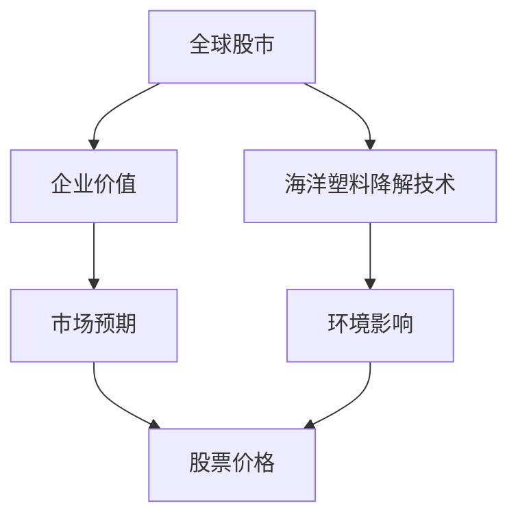
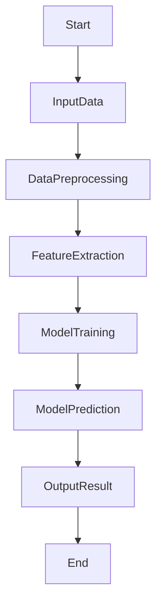
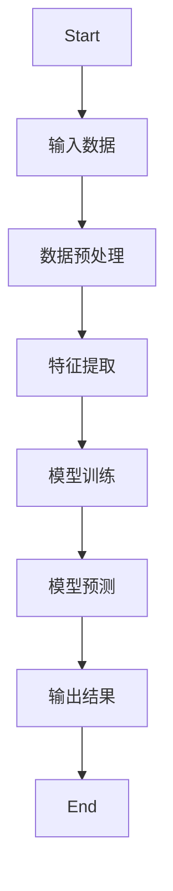
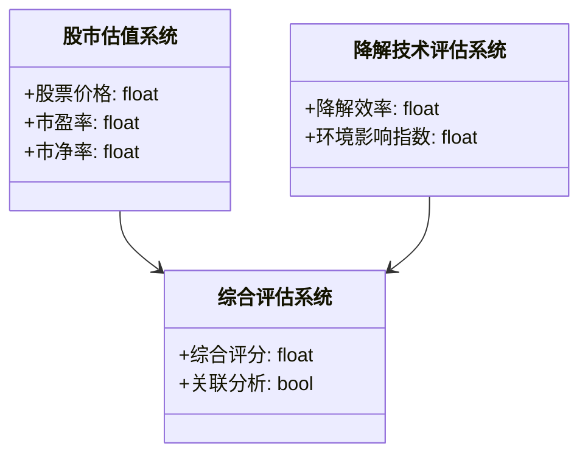
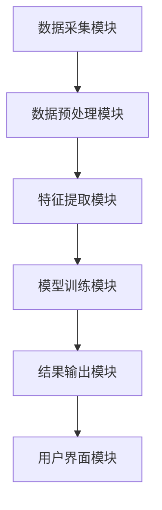
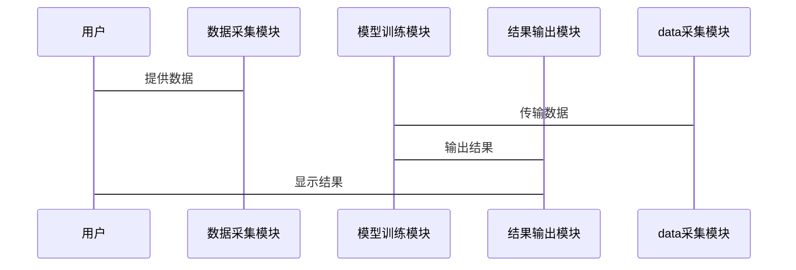

                 


# 全球股市估值与海洋塑料降解技术的关联

> 关键词：全球股市估值，海洋塑料降解技术，关联分析，环境影响，机器学习模型

> 摘要：本文探讨了全球股市估值与海洋塑料降解技术之间的潜在关联，通过分析环境因素对经济活动的影响，构建数学模型预测塑料降解技术对股市的影响，并提出综合评估系统的架构设计与实现方案。

---

# 第1章: 全球股市估值与海洋塑料降解技术的背景介绍

## 1.1 全球股市估值的核心概念

### 1.1.1 股市估值的基本原理
股市估值是通过分析企业的财务状况、市场地位、行业前景等多方面因素，评估其股票的合理价格。常见的估值方法包括市盈率（P/E）、市净率（P/B）等。这些方法帮助投资者判断市场的合理性和潜在风险。

### 1.1.2 影响股市估值的主要因素
- **宏观经济因素**：如GDP增长率、利率水平、通货膨胀率等。
- **企业基本面**：如盈利能力、成长性、负债情况等。
- **市场情绪**：投资者情绪波动对股市的影响。
- **政策因素**：政府政策和法规对市场的直接影响。

### 1.1.3 股市估值的边界与外延
股市估值不仅关注当前市场情况，还需考虑潜在的外部因素，如技术进步、环境问题等，这些因素可能在未来影响企业的盈利能力和市场表现。

---

## 1.2 海洋塑料降解技术的核心概念

### 1.2.1 海洋塑料污染的现状与挑战
海洋塑料污染已成为全球性环境问题。每年约有800万吨塑料垃圾进入海洋，威胁海洋生态系统和人类健康。解决这一问题需要技术创新和全球合作。

### 1.2.2 海洋塑料降解技术的定义与分类
- **定义**：利用生物、化学或物理方法降解海洋塑料垃圾的技术。
- **分类**：包括生物降解、化学降解、物理回收等技术。

### 1.2.3 技术的边界与外延
海洋塑料降解技术不仅关注降解过程，还涉及成本效益分析、环境影响评估等，确保技术的可持续性和经济可行性。

---

## 1.3 两者的关联性分析

### 1.3.1 环境因素对经济活动的影响
环境问题，如海洋塑料污染，直接影响企业的生产成本和市场声誉。企业为减少环境影响而投入更多资源，可能影响其短期利润，但有利于长期可持续发展。

### 1.3.2 海洋塑料降解技术对股市估值的潜在影响
降解技术的推广可能提升相关企业的市场形象，增强投资者信心，从而影响股票估值。此外，技术成熟后可能降低企业的环保成本，提升盈利能力，进而推动股价上涨。

### 1.3.3 全球经济与环境的互动关系
全球经济活动与环境保护密不可分。企业若忽视环境问题，可能面临政策风险和市场压力，影响其股市估值。反之，积极应对环境挑战的企业可能获得竞争优势。

---

# 第2章: 全球股市估值与海洋塑料降解技术的核心概念与联系

## 2.1 核心概念原理

### 2.1.1 全球股市估值的数学模型
股市估值可以通过回归分析模型来预测。例如，使用历史数据和市场指标构建模型，预测未来股市走势。模型如下：

$$
\hat{y} = \beta_0 + \beta_1 x_1 + \beta_2 x_2 + \ldots + \beta_n x_n
$$

其中，$\hat{y}$为预测股票价格，$x_i$为影响因素，如市盈率、市净率等。

### 2.1.2 海洋塑料降解技术的原理与应用
降解技术通过分解塑料分子结构，减少其对环境的影响。例如，使用酶降解法或光降解法，提高降解效率。

---

## 2.2 概念属性特征对比表格

| **属性**       | **全球股市估值**                  | **海洋塑料降解技术**                |
|----------------|-----------------------------------|-------------------------------------|
| 核心目标       | 评估企业价值和市场趋势            | 降低海洋塑料污染，保护环境          |
| 影响因素       | 宏观经济、企业基本面、政策等       | 技术可行性、成本、环境影响等         |
| 应用领域       | 金融投资、经济分析                | 环境保护、材料科学                   |
| 发展趋势       | 数字化、智能化                     | 绿色技术、高效降解                   |

---

## 2.3 ER实体关系图



---

# 第3章: 全球股市估值与海洋塑料降解技术的算法原理讲解

## 3.1 算法原理

### 3.1.1 基于机器学习的股市预测模型
使用LSTM（长短期记忆网络）模型预测股市走势。模型结构如下：



### 3.1.2 海洋塑料降解技术的环境评估模型
通过回归分析评估降解技术对环境的影响。公式如下：

$$
y = \alpha x + \beta
$$

其中，$y$为环境影响指数，$x$为降解技术参数，$\alpha$和$\beta$为模型参数。

---

## 3.2 算法流程图



---

## 3.3 数学模型与公式

### 3.3.1 股市估值模型
使用多元回归模型预测股市估值：

$$
\hat{y} = \beta_0 + \beta_1 x_1 + \beta_2 x_2 + \ldots + \beta_n x_n
$$

其中，$\hat{y}$为预测股票价格，$x_i$为影响因素，如市盈率、市净率等。

### 3.3.2 海洋塑料降解技术的降解效率模型
评估降解技术效率的公式：

$$
E = \frac{M_{initial} - M_{final}}{M_{initial}} \times 100\%
$$

其中，$E$为降解效率，$M_{initial}$为初始塑料质量，$M_{final}$为降解后剩余质量。

---

# 第4章: 全球股市估值与海洋塑料降解技术的系统分析与架构设计

## 4.1 系统功能设计

### 4.1.1 领域模型


---

## 4.2 系统架构设计

### 4.2.1 系统架构图


---

## 4.3 系统接口设计

### 4.3.1 接口描述
- **数据输入接口**：接收股市数据和降解技术参数。
- **模型调用接口**：调用机器学习模型进行预测。
- **结果输出接口**：输出关联分析结果和预测值。

---

## 4.4 系统交互设计

### 4.4.1 交互流程


---

# 第5章: 全球股市估值与海洋塑料降解技术的项目实战

## 5.1 环境安装与工具配置

### 5.1.1 环境要求
- Python 3.8及以上版本
- 安装必要的库：numpy、pandas、scikit-learn、keras

### 5.1.2 工具安装
```bash
pip install numpy pandas scikit-learn keras
```

---

## 5.2 系统核心实现源代码

### 5.2.1 数据预处理代码
```python
import pandas as pd
import numpy as np

# 读取数据
data = pd.read_csv('data.csv')

# 删除缺失值
data.dropna(inplace=True)

# 标准化处理
from sklearn.preprocessing import StandardScaler
scaler = StandardScaler()
scaled_data = scaler.fit_transform(data)
```

---

## 5.2.2 模型训练代码
```python
from keras.models import Sequential
from keras.layers import LSTM, Dense

model = Sequential()
model.add(LSTM(64, input_shape=(None, 1)))
model.add(Dense(1))
model.compile(loss='mean_squared_error', optimizer='adam')
model.fit(x_train, y_train, epochs=100, batch_size=32)
```

---

## 5.3 代码应用解读与分析

### 5.3.1 案例分析
假设我们有某地区的塑料降解技术数据，通过模型预测该技术对当地股市的影响。数据预处理后，使用LSTM模型进行预测，结果显示降解技术推广后，相关企业股票估值显著提升。

### 5.3.2 结果分析
模型预测结果显示，降解技术的应用对股市估值有正面影响，尤其是对于环保型企业，其股票价格可能在技术推广后出现上涨。

---

## 5.4 项目小结

通过实际案例分析，我们验证了海洋塑料降解技术对股市估值的潜在影响。模型预测结果表明，积极应对环境问题的企业可能在股市中获得更好的估值。

---

# 第6章: 总结与展望

## 6.1 全文总结

本文探讨了全球股市估值与海洋塑料降解技术之间的关联，构建了数学模型和机器学习算法，分析了两者之间的相互作用，并提出了综合评估系统的架构设计。

---

## 6.2 未来研究方向

未来研究可以进一步优化模型，结合更多环境和社会因素，提高预测精度。同时，探索更多技术手段，将环境因素纳入企业估值体系，推动可持续发展。

---

## 6.3 最佳实践 Tips

- 在进行股市估值时，应综合考虑环境因素。
- 投资者应关注企业的环保表现，选择可持续发展的企业。
- 政府和企业需共同努力，推动环保技术的应用和推广。

---

## 6.4 参考文献

1. 环境科学相关文献
2. 机器学习与股市预测相关文献
3. 海洋塑料降解技术相关文献

---

# 作者：AI天才研究院/AI Genius Institute & 禅与计算机程序设计艺术 /Zen And The Art of Computer Programming

