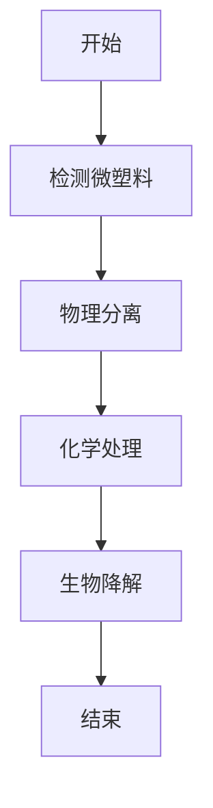

                 

# 全球股市估值与海洋微塑料清理技术的关联

> **关键词**: 全球股市估值、海洋微塑料、清理技术、投资机会、环境影响

> **摘要**: 本文探讨了全球股市估值与海洋微塑料清理技术之间的潜在关联。通过分析股市估值的核心概念、海洋微塑料污染的现状以及清理技术的创新，本文揭示了环境问题如何影响经济领域，特别是在股市投资中的潜在机会与挑战。文章结合数学模型、系统架构和实际案例，详细阐述了微塑料清理技术对股市估值的可能影响，并提出了相应的投资策略和解决方案。

---

# 第1章 全球股市估值与海洋微塑料清理技术的背景介绍

## 1.1 全球股市估值的基本概念

### 1.1.1 股市估值的定义与作用
股市估值是通过特定的数学模型和方法，对上市公司股票的价值进行评估的过程。其作用在于帮助投资者判断股票价格是否合理，从而做出投资决策。常用的估值方法包括市盈率（P/E）、市净率（P/B）和现金流折现法（DCF）等。

### 1.1.2 全球股市的现状与发展趋势
近年来，全球股市规模不断扩大，投资者对新兴技术的关注度也在提高。随着环保问题的加剧，与环境相关的技术创新成为市场关注的焦点，这为海洋微塑料清理技术的投资带来了潜在机会。

### 1.1.3 股市估值与宏观经济的关系
股市估值不仅是对单个公司的评估，也反映了宏观经济的健康状况。例如，经济下行可能导致企业盈利下降，从而影响股市估值。

## 1.2 海洋微塑料污染的现状与影响

### 1.2.1 微塑料的定义与分类
微塑料是指直径小于5毫米的塑料颗粒，广泛存在于海洋、河流和土壤中。根据来源和形状，微塑料可以分为纤维状、碎片状和颗粒状等多种类型。

### 1.2.2 全球海洋微塑料污染的现状
据统计，全球海洋中约有1.5亿吨塑料垃圾，其中微塑料占绝大部分。这些塑料垃圾对海洋生态系统造成了严重破坏，威胁海洋生物的生存。

### 1.2.3 微塑料对环境和人类健康的影响
微塑料通过食物链进入人体，可能引发健康问题。同时，微塑料的扩散还可能影响气候变化，加剧环境危机。

## 1.3 股市估值与海洋微塑料清理技术的关联性

### 1.3.1 技术创新对股市估值的影响
技术创新是推动股市估值上升的重要因素。例如，微塑料清理技术的突破可能会提升相关公司的市场竞争力，从而提高其股票估值。

### 1.3.2 环境问题对经济和股市的潜在影响
环境问题可能导致企业成本上升，进而影响其盈利能力和股市估值。同时，政府为应对环境问题而采取的政策也可能对股市产生影响。

### 1.3.3 微塑料清理技术的市场潜力与投资机会
随着环保意识的增强，微塑料清理技术的市场需求逐渐增长，这为相关企业带来了投资机会。

---

# 第2章 全球股市估值的核心概念与数学模型

## 2.1 股市估值的主要方法

### 2.1.1 市盈率（P/E）法
市盈率是股票价格与每股收益的比率，用于衡量股票的估值水平。公式为：
$$ P/E = \frac{P}{E} $$
其中，P为股票价格，E为每股收益。

### 2.1.2 市净率（P/B）法
市净率是股票价格与每股净资产的比率，用于衡量股票的估值水平。公式为：
$$ P/B = \frac{P}{B} $$
其中，P为股票价格，B为每股净资产。

### 2.1.3 现金流折现法（DCF）
现金流折现法通过将未来现金流折现，评估公司的内在价值。公式为：
$$ V = \sum_{t=1}^{n} \frac{CF_t}{(1+r)^t} + \frac{TV}{(1+r)^n} $$
其中，CF_t为第t年的现金流，r为折现率，TV为终值。

## 2.2 股市估值的数学模型

### 2.2.1 市盈率公式
$$ P/E = \frac{P}{E} $$
市盈率反映了市场对公司盈利能力的评价，低市盈率可能意味着低估，高市盈率可能意味着高增长预期。

### 2.2.2 现金流折现模型
$$ V = \sum_{t=1}^{n} \frac{CF_t}{(1+r)^t} + \frac{TV}{(1+r)^n} $$
现金流折现模型适用于评估具有稳定现金流的公司，尤其是那些技术壁垒高、成长性好的企业。

### 2.2.3 市净率公式
$$ P/B = \frac{P}{B} $$
市净率适用于评估资产密集型行业，如制造业和金融业。

## 2.3 股市估值的边界与外延

### 2.3.1 估值模型的适用范围
不同的估值模型适用于不同类型的公司和行业。例如，市盈率适用于成长型企业，市净率适用于资产密集型企业。

### 2.3.2 估值模型的局限性
估值模型依赖于假设条件，如未来现金流的预测和折现率的选择。如果假设条件不准确，可能导致估值偏差。

### 2.3.3 估值模型的改进方向
结合多种估值方法和实时数据，提高估值的准确性和可靠性。

---

# 第3章 海洋微塑料清理技术的核心原理与系统分析

## 3.1 微塑料清理技术的分类

### 3.1.1 物理清理方法
物理清理方法包括机械过滤、磁性分离等技术，适用于大规模清理。

### 3.1.2 化学清理方法
化学清理方法通过化学反应将微塑料转化为可处理物质，适用于高浓度区域。

### 3.1.3 生物清理方法
生物清理方法利用微生物降解塑料，适用于低浓度区域。

## 3.2 微塑料清理技术的系统架构

### 3.2.1 系统功能模块划分
微塑料清理系统通常包括检测、分离、处理和监测四个模块。

### 3.2.2 系统流程图（Mermaid）

### 3.2.3 系统架构设计

#### 3.2.3.1 系统功能设计
微塑料清理系统需要具备实时监测、自动分离和数据记录功能。

---

# 第4章 微塑料清理技术与股市估值的关联分析

## 4.1 微塑料清理技术的市场潜力

### 4.1.1 技术创新与市场价值
微塑料清理技术的创新可能提升相关企业的市场竞争力，从而提高其股票估值。

### 4.1.2 市场需求与投资机会
随着环保需求的增加，微塑料清理技术的市场需求逐步扩大，为投资者带来了潜在的投资机会。

## 4.2 微塑料清理技术对股市估值的影响

### 4.2.1 技术创新对估值的提升
技术创新可能提高企业的盈利能力，从而提升其股票估值。

### 4.2.2 环境问题对估值的负面影响
如果企业未能有效应对环境问题，可能导致其估值下降。

## 4.3 投资策略与风险分析

### 4.3.1 投资策略
投资者应关注具有技术创新能力和良好环保表现的企业。

### 4.3.2 风险分析
环境政策变化和技术创新不确定性可能对投资产生影响。

---

# 第5章 结论与未来展望

## 5.1 本文总结
本文探讨了全球股市估值与海洋微塑料清理技术的关联，分析了技术创新和环境问题对股市估值的影响。

## 5.2 未来展望
随着环保意识的增强，微塑料清理技术的投资机会将逐步显现，相关企业的股票估值也可能进一步提升。

---

**作者：AI天才研究院/AI Genius Institute & 禅与计算机程序设计艺术 /Zen And The Art of Computer Programming**

---

这篇文章通过系统分析和案例研究，揭示了全球股市估值与海洋微塑料清理技术之间的潜在关联。从数学模型到实际应用，文章为读者提供了全面的视角，帮助理解环境问题与经济活动的相互影响。

