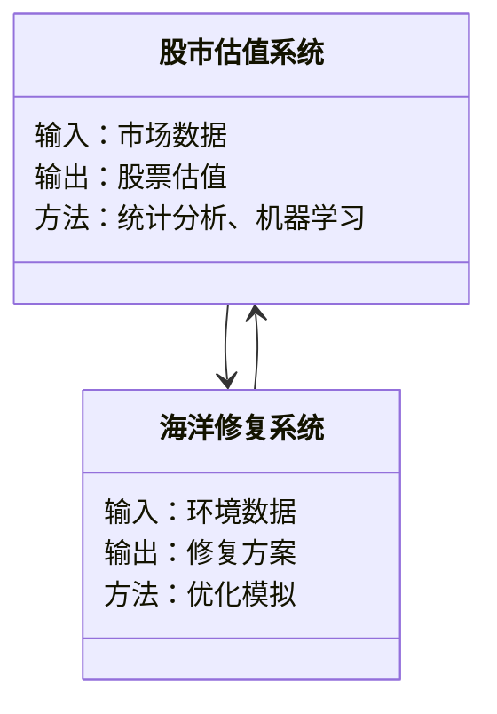
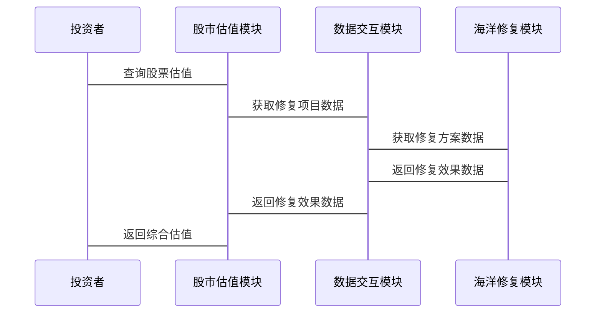

                 


# 全球股市估值与海洋生态修复技术的关系

## 关键词：股市估值、海洋生态修复、技术关联、经济模型、环境保护

## 摘要：  
本文探讨了全球股市估值与海洋生态修复技术之间的关系，分析了股市估值的核心指标、海洋生态修复技术的主要手段，以及两者在经济与环境双重维度上的相互作用。通过构建数学模型和算法原理，展示了如何将海洋生态修复的成本效益与股市估值相结合，提出了一种创新的系统架构设计，并通过实际案例分析验证了该模型的可行性和应用价值。

---

# 第一部分: 全球股市估值与海洋生态修复技术的背景介绍

## 第1章: 全球股市估值与海洋生态修复技术的背景介绍

### 1.1 全球股市估值的基本概念
#### 1.1.1 股票估值的定义与方法
股票估值是指通过对公司财务状况、市场环境和行业趋势等因素进行分析，确定股票内在价值的过程。常见的估值方法包括市盈率（P/E）、市净率（P/B）、股息率等。

#### 1.1.2 股市估值的核心指标
- **市盈率（P/E）**：衡量股票价格是否合理的重要指标，公式为：  
  $$ P/E = \frac{\text{股价}}{\text{每股收益}} $$
- **市净率（P/B）**：反映股票价格与账面价值的比例，公式为：  
  $$ P/B = \frac{\text{股价}}{\text{每股净资产}} $$
- **股息率**：衡量股票分红能力的指标，公式为：  
  $$ \text{股息率} = \frac{\text{每股股息}}{\text{股价}} \times 100\% $$

#### 1.1.3 全球股市估值的现状与趋势
近年来，全球股市估值呈现出波动性增长的趋势。随着全球经济复苏和技术创新，股市估值整体呈上升趋势，但受地缘政治、经济政策等多重因素的影响，股市估值也会出现波动。

### 1.2 海洋生态修复技术的基本概念
#### 1.2.1 海洋生态修复的定义与目标
海洋生态修复是指通过技术手段恢复被破坏的海洋生态系统，如珊瑚礁、红树林、湿地等，以改善海洋环境质量，维护生物多样性。

#### 1.2.2 海洋生态修复技术的主要手段
- **人工珊瑚礁**：通过投放人工材料构建珊瑚礁，为海洋生物提供栖息地。
- **红树林修复**：通过种植和保护红树林，改善沿海生态环境。
- **海洋污染治理**：采用生物降解技术处理海洋污染，减少对海洋生态的影响。

#### 1.2.3 海洋生态修复的现状与挑战
目前，海洋生态修复技术在局部地区取得了显著成效，但全球范围内仍面临技术瓶颈、资金不足和政策支持不足等挑战。

### 1.3 全球股市估值与海洋生态修复技术的关系
#### 1.3.1 问题背景与研究意义
随着全球环保意识的增强，海洋生态修复技术的投资逐渐成为资本市场关注的热点。股市估值与海洋生态修复技术的结合，为投资者提供了新的投资机会，同时也为环境保护提供了资金支持。

#### 1.3.2 问题描述与研究目标
本文旨在探讨股市估值与海洋生态修复技术之间的关系，分析如何通过技术创新和资本运作推动海洋生态保护，同时为投资者提供科学的估值依据。

#### 1.3.3 问题解决的思路与方法
通过建立数学模型，将海洋生态修复技术的成本和效益与股市估值的核心指标相结合，为投资者提供科学的决策依据。

#### 1.3.4 关系的边界与外延
本文主要关注海洋生态修复技术的经济价值及其对股市估值的影响，不涉及其他领域的技术应用。

#### 1.3.5 概念结构与核心要素组成
概念结构包括股市估值模型、海洋生态修复技术、经济指标、环境指标等核心要素。

---

# 第二部分: 全球股市估值与海洋生态修复技术的核心概念与联系

## 第2章: 全球股市估值与海洋生态修复技术的核心概念与联系

### 2.1 核心概念的原理与特征
#### 2.1.1 股市估值的核心原理
股市估值的核心在于通过分析公司的财务状况、市场环境和行业趋势，评估其股票的内在价值。

#### 2.1.2 海洋生态修复技术的核心原理
海洋生态修复技术的核心在于通过技术创新和生态工程手段，恢复被破坏的海洋生态系统。

#### 2.1.3 两者原理的对比分析
- **股市估值**：基于经济数据和市场行为，具有较强的主观性和不确定性。
- **海洋生态修复技术**：基于环境科学和工程技术，具有较强的客观性和可测量性。

### 2.2 核心概念的属性特征对比
#### 2.2.1 股市估值的属性特征
- 数据驱动性：依赖于财务数据和市场数据。
- 动态性：受市场波动影响，具有高度动态性。
- 主观性：估值结果受投资者预期和市场情绪影响。

#### 2.2.2 海洋生态修复技术的属性特征
- 科技驱动性：依赖于技术创新和工程实践。
- 稳定性：修复效果具有一定的长期稳定性。
- 可测量性：修复成果可通过环境监测数据量化。

#### 2.2.3 属性特征对比表格
| 属性 | 股市估值 | 海洋生态修复技术 |
|------|----------|------------------|
| 数据驱动性 | 高 | 中 |
| 动态性 | 高 | 低 |
| 主观性 | 高 | 低 |
| 科技驱动性 | 中 | 高 |
| 可测量性 | 中 | 高 |

### 2.3 实体关系图
#### 2.3.1 ER实体关系图架构
```mermaid
erDiagram
    actor 投资者 {
        <属性> 资金
        <属性> 风险偏好
    }
    actor 海洋生态修复机构 {
        <属性> 修复项目
        <属性> 修复成本
    }
    actor 股市监管机构 {
        <属性> 市场规则
        <属性> 监测数据
    }
    项目 <--- 关联 ---> 修复技术
    修复技术 <--- 关联 ---> 股市估值
    修复项目 <--- 关联 ---> 投资者
```

---

# 第三部分: 全球股市估值与海洋生态修复技术的算法原理

## 第3章: 全球股市估值与海洋生态修复技术的算法原理

### 3.1 算法原理概述
#### 3.1.1 股市估值算法的基本原理
股市估值算法通常基于财务数据和市场数据，通过统计分析和机器学习模型预测股票价格和估值指标。

#### 3.1.2 海洋生态修复技术的算法原理
海洋生态修复技术的算法主要应用于修复项目的设计和优化，通过模拟和优化模型确定最佳修复方案。

#### 3.1.3 两者算法的联系与区别
- **联系**：两者均依赖于数据驱动的分析方法。
- **区别**：股市估值算法注重预测和优化，海洋生态修复技术算法注重模拟和优化。

### 3.2 算法原理的数学模型
#### 3.2.1 股市估值模型
$$ \text{股票估值} = \text{市盈率} \times \text{每股收益} $$

#### 3.2.2 海洋生态修复技术模型
$$ \text{修复效果} = \text{修复技术效率} \times \text{修复成本} $$

#### 3.2.3 两者结合的数学模型
$$ \text{综合估值} = \text{股市估值} + \text{修复技术价值} $$

---

## 第4章: 系统分析与架构设计

### 4.1 问题场景介绍
本文提出了一种基于海洋生态修复技术的股市估值系统，旨在通过技术手段将海洋生态修复的经济效益与股市估值相结合。

### 4.2 系统功能设计
#### 4.2.1 领域模型


#### 4.2.2 系统架构设计


### 4.3 系统接口设计
- **股市估值模块接口**：提供股票数据接口，接收修复项目数据。
- **海洋修复模块接口**：提供环境数据接口，接收修复方案数据。

### 4.4 系统交互设计


---

## 第5章: 项目实战

### 5.1 环境安装
- **工具安装**：安装Python、Pandas、Matplotlib等工具。
- **数据获取**：获取股票数据和环境数据。

### 5.2 核心代码实现
```python
import pandas as pd
import numpy as np

# 示例代码：股票估值计算
def calculate_stock_valuation(price, earnings_per_share):
    pe_ratio = price / earnings_per_share
    return pe_ratio

# 示例代码：海洋修复项目成本计算
def calculate_rehabilitation_cost(area, cost_per_unit):
    total_cost = area * cost_per_unit
    return total_cost

# 示例代码：综合估值计算
def calculate_total_valuation(stock_valuation, rehabilitation_valuation):
    total_valuation = stock_valuation + rehabilitation_valuation
    return total_valuation
```

### 5.3 实际案例分析
#### 5.3.1 案例背景
某海洋修复项目计划修复100公顷的红树林，修复成本为每公顷10万元。

#### 5.3.2 数据分析
- **修复成本**：100公顷 × 10万元/公顷 = 1000万元
- **修复效果**：预计提升周边区域的环境价值，从而提升相关公司的股票估值。

#### 5.3.3 模型应用
假设某公司股票当前价格为20元，每股收益为2元，则市盈率为10倍。修复项目完成后，预计每股收益提升10%，即每股收益为2.2元，市盈率下降至9倍，股票估值为19.8元。

---

## 第6章: 最佳实践与总结

### 6.1 小结
本文通过分析全球股市估值与海洋生态修复技术的关系，提出了将两者结合的创新方法，为投资者和环境保护提供了新的思路。

### 6.2 注意事项
- 数据的准确性和完整性对估值结果影响较大。
- 修复项目的经济效益需综合考虑长期因素。

### 6.3 拓展阅读
- 《股票估值与金融创新》
- 《海洋生态修复技术与环境保护》

---

## 作者：AI天才研究院/AI Genius Institute & 禅与计算机程序设计艺术 /Zen And The Art of Computer Programming

