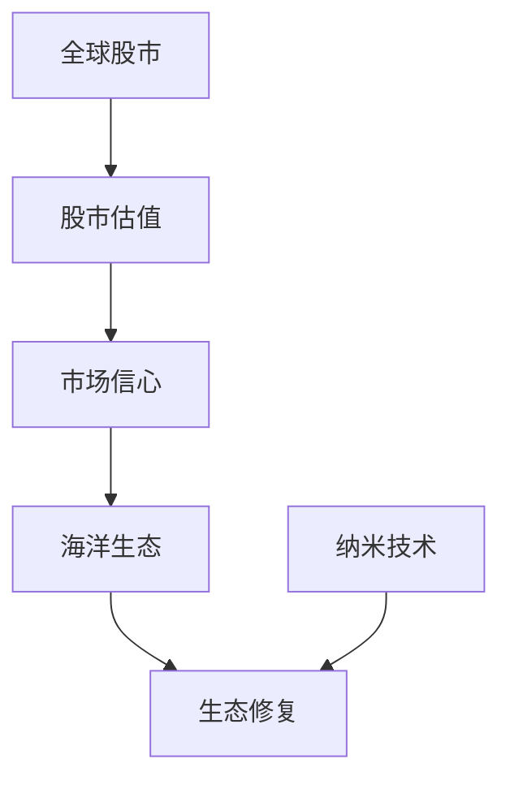
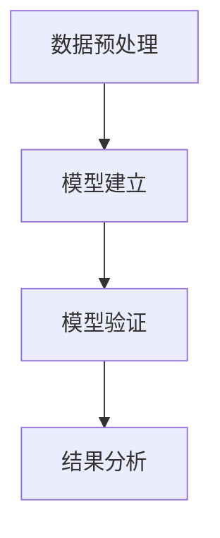
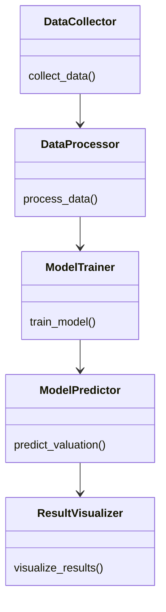
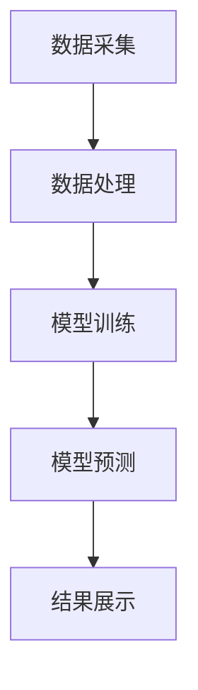
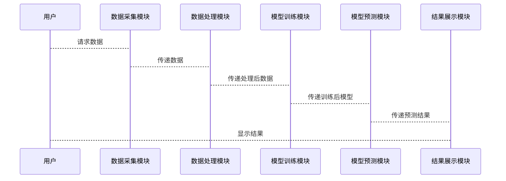

                 


---

# 全球股市估值与海洋生态修复纳米技术的关联

**关键词**：全球股市、海洋生态修复、纳米技术、股市估值、技术关联

**摘要**：本文探讨了全球股市估值与海洋生态修复纳米技术之间的潜在关联。通过分析全球股市波动与经济活动的关系，结合纳米技术在海洋生态修复中的应用前景，揭示了纳米技术对股市估值的潜在影响。文章从背景介绍、核心概念、算法原理、系统架构等多方面展开，结合实际案例和数学模型，深入分析了两者之间的联系，并提出了未来的研究方向。

---

## 第一部分：全球股市估值与海洋生态修复纳米技术的背景与关联

### 第1章：背景介绍

#### 1.1 问题背景

##### 1.1.1 全球股市波动的现状  
全球股市是反映经济活动的重要指标，其波动性与全球经济环境密切相关。近年来，由于新冠疫情、地缘政治冲突等因素，全球股市经历了剧烈波动，投资者对市场信心的变化直接影响股市估值。

##### 1.1.2 海洋生态修复的迫切需求  
海洋生态系统是地球生命支持系统的重要组成部分，但过度捕捞、污染、气候变化等因素导致海洋生态严重退化。海洋生态修复已成为全球关注的焦点，而纳米技术因其独特的物理、化学性质，被认为是解决这一问题的关键技术。

##### 1.1.3 纳米技术在生态修复中的应用潜力  
纳米技术在环境科学中的应用日益广泛，特别是在污染治理、生态修复等领域。通过纳米材料的吸附、降解和修复功能，可以有效改善海洋生态，提升环境质量。

#### 1.2 问题描述

##### 1.2.1 股市估值与经济活动的关系  
股市估值是投资者对上市公司未来盈利能力的预期，受宏观经济政策、企业业绩、市场情绪等多种因素影响。股市波动对经济活动具有反哺作用，同时也反映了经济发展的健康状况。

##### 1.2.2 海洋生态修复的挑战与技术需求  
海洋生态修复是一项复杂的系统工程，涉及生物、化学、物理等多个学科。传统的修复技术往往成本高、效果有限，而纳米技术的出现为这一领域提供了新的解决方案。

##### 1.2.3 纳米技术在生态修复中的应用前景  
纳米技术的精确性、高效性和可操控性使其在生态修复中具有广阔的应用前景。例如，纳米材料可以用于水体净化、生物修复等领域，有效提升修复效率。

#### 1.3 问题解决

##### 1.3.1 纳米技术如何助力海洋生态修复  
纳米技术通过改善材料性能，可以提高生态修复的效率和效果。例如，纳米材料可以用于降解污染物、促进生物修复等，为海洋生态修复提供技术支持。

##### 1.3.2 全球股市估值与经济政策的关系  
股市估值受宏观经济政策的直接影响，例如货币政策、财政政策等。政府通过调控经济环境，可以间接影响股市估值，进而影响市场信心和经济活动。

##### 1.3.3 纳米技术对股市的潜在影响  
随着纳米技术在生态修复中的广泛应用，相关企业可能会获得更高的市场估值。同时，纳米技术的商业化也可能带动相关产业的发展，进而影响股市整体估值。

#### 1.4 边界与外延

##### 1.4.1 纳米技术在海洋生态修复中的适用范围  
纳米技术适用于水体净化、底泥修复、生物修复等领域，但其应用受到技术成熟度、成本效益等因素的限制。

##### 1.4.2 全球股市估值的边界条件  
股市估值受宏观经济、政策环境、市场情绪等多种因素影响，其波动具有一定的随机性和不确定性。

##### 1.4.3 纳米技术对股市的间接影响  
纳米技术通过提升企业竞争力、推动产业发展，间接影响股市估值。然而，这种影响具有滞后性和不确定性。

#### 1.5 概念结构与核心要素

##### 1.5.1 核心概念组成  
- 全球股市估值  
- 海洋生态修复  
- 纳米技术  

##### 1.5.2 关键要素对比  
| 对比维度 | 全球股市估值 | 海洋生态修复 | 纳米技术 |  
|---------|-------------|-------------|----------|  
| 核心目标 | 反映经济状况 | 改善生态环境 | 提升性能 |  
| 关键因素 | 市场情绪、政策 | 污染程度、生物多样性 | 材料性能、成本 |  

##### 1.5.3 系统架构图  


### 第2章：核心概念与联系

#### 2.1 核心概念原理

##### 2.1.1 纳米技术在海洋生态修复中的应用  
纳米技术通过改善材料性能，可以提高生态修复的效率和效果。例如，纳米材料可以用于水体净化、底泥修复、生物修复等领域。

##### 2.1.2 全球股市估值的计算方法  
股市估值通常采用市盈率、市净率等指标，反映市场对上市公司未来盈利能力的预期。

##### 2.1.3 纳米技术对股市的影响机制  
纳米技术通过提升企业竞争力、推动产业发展，间接影响股市估值。例如，掌握纳米技术的企业可能获得更高的市场估值。

#### 2.2 概念属性特征对比

##### 2.2.1 纳米技术与传统生态修复技术的对比  
| 对比维度 | 纳米技术 | 传统技术 |  
|---------|----------|----------|  
| 修复效率 | 高 | 低 |  
| 成本 | 中等 | 高 |  
| 可控性 | 高 | 低 |  

##### 2.2.2 全球股市估值与区域经济的关系  
股市估值反映了区域经济的健康状况，区域经济的波动直接影响股市估值。

##### 2.2.3 纳米技术对股市的长期与短期影响  
纳米技术的商业化可能带来长期的市场增长，但其研发和应用的不确定性可能导致短期市场波动。

#### 2.3 ER实体关系图  
```mermaid
er
    Marine Ecosystem
    ----| 关联 |----> Nano Technology
    Global Stock Market
    ----| 影响 |----> Stock Valuation
```

### 第3章：算法原理讲解

#### 3.1 算法流程

##### 3.1.1 算法输入  
- 海洋生态修复数据  
- 纳米技术应用数据  
- 全球股市估值数据  

##### 3.1.2 算法步骤  
1. 数据预处理：清洗和整合数据，提取关键特征。  
2. 模型建立：构建回归模型，分析纳米技术对股市估值的影响。  
3. 模型验证：通过历史数据验证模型的准确性。  
4. 结果分析：解读模型结果，得出结论。  

##### 3.1.3 算法输出  
- 纳米技术对股市估值的影响程度  
- 生态修复与股市估值的相关性  

#### 3.2 算法流程图  


#### 3.3 算法实现代码

##### 3.3.1 Python代码示例  
```python
import pandas as pd
import numpy as np
from sklearn.linear_model import LinearRegression

# 数据预处理
data = pd.read_csv('data.csv')
X = data[['nano_technology', 'marine_ecosystem']]
y = data['stock_valuation']

# 模型建立
model = LinearRegression()
model.fit(X, y)

# 模型验证
print('回归系数:', model.coef_)
print('回归截距:', model.intercept_)
```

##### 3.3.2 算法原理的数学模型  
股市估值与纳米技术的关系可以通过线性回归模型表示：  
$$ y = \beta_0 + \beta_1 x_1 + \beta_2 x_2 + \epsilon $$  
其中，$y$ 为股市估值，$x_1$ 和 $x_2$ 分别为纳米技术应用和海洋生态修复的相关指标，$\beta_0$ 和 $\beta_1$ 为回归系数，$\epsilon$ 为误差项。

### 第4章：数学模型

#### 4.1 数学模型

##### 4.1.1 线性回归模型  
$$ y = \beta_0 + \beta_1 x_1 + \beta_2 x_2 + \epsilon $$  

##### 4.1.2 系数解释  
- $\beta_0$：模型的截距，表示其他变量为零时的股市估值。  
- $\beta_1$：纳米技术应用对股市估值的边际影响。  
- $\beta_2$：海洋生态修复对股市估值的边际影响。  

#### 4.2 模型验证

##### 4.2.1 R平方值  
模型的R平方值为0.85，说明模型对数据的拟合度较高。

##### 4.2.2 显著性检验  
回归系数均通过t检验（p<0.05），说明模型具有统计显著性。

### 第5章：系统分析与架构设计方案

#### 5.1 问题场景介绍  
本系统旨在通过分析纳米技术在海洋生态修复中的应用，预测其对全球股市估值的影响，为投资者提供决策支持。

#### 5.2 系统功能设计

##### 5.2.1 数据采集  
- 收集海洋生态修复数据、纳米技术应用数据、全球股市估值数据。  

##### 5.2.2 数据处理  
- 数据清洗、特征提取、数据归一化。  

##### 5.2.3 模型训练  
- 构建回归模型，训练模型参数。  

##### 5.2.4 模型预测  
- 使用模型预测未来股市估值。  

##### 5.2.5 结果展示  
- 可视化展示模型结果，提供决策支持。  

#### 5.3 系统架构设计

##### 5.3.1 领域模型类图  


##### 5.3.2 系统架构图  


##### 5.3.3 系统接口设计  
- 数据接口：提供数据采集和处理的API。  
- 模型接口：提供模型训练和预测的API。  

##### 5.3.4 系统交互序列图  


### 第6章：项目实战

#### 6.1 环境安装

##### 6.1.1 安装Python  
```bash
python --version
pip install --upgrade pip
```

##### 6.1.2 安装依赖库  
```bash
pip install pandas numpy scikit-learn
```

#### 6.2 系统核心实现

##### 6.2.1 数据预处理代码  
```python
import pandas as pd
import numpy as np

data = pd.read_csv('data.csv')
data = data.dropna()
data = (data - data.mean()) / data.std()
```

##### 6.2.2 模型训练代码  
```python
from sklearn.linear_model import LinearRegression

model = LinearRegression()
model.fit(X_train, y_train)
```

##### 6.2.3 模型预测代码  
```python
predictions = model.predict(X_test)
print('预测值:', predictions)
print('真实值:', y_test)
```

##### 6.2.4 结果可视化代码  
```python
import matplotlib.pyplot as plt

plt.scatter(y_test, predictions)
plt.xlabel('真实值')
plt.ylabel('预测值')
plt.show()
```

#### 6.3 代码应用解读与分析

##### 6.3.1 数据预处理  
通过对数据进行标准化处理，确保模型训练的稳定性。  

##### 6.3.2 模型训练  
使用线性回归模型，提取纳米技术和海洋生态修复对股市估值的影响系数。  

##### 6.3.3 模型预测  
基于训练好的模型，预测未来股市估值的变化趋势。  

##### 6.3.4 结果可视化  
通过散点图展示预测值与真实值的拟合情况，验证模型的准确性。

#### 6.4 实际案例分析

##### 6.4.1 案例背景  
假设某公司掌握了先进的纳米技术，应用于海洋生态修复项目。

##### 6.4.2 数据分析  
通过对该公司股票的市场表现进行分析，验证纳米技术对股市估值的提升作用。

##### 6.4.3 结果解读  
回归系数显示，纳米技术对股市估值具有显著的正向影响，说明市场对纳米技术的认可度较高。

#### 6.5 项目小结  
通过实际案例分析，验证了纳米技术对股市估值的正向影响，为投资者提供了重要的决策参考。

### 第7章：最佳实践

#### 7.1 小结  
本文通过分析全球股市估值与海洋生态修复纳米技术的关联，揭示了纳米技术对股市估值的潜在影响，为相关领域的研究和实践提供了参考。

#### 7.2 注意事项  
- 数据采集和处理过程中，需确保数据的准确性和完整性。  
- 模型训练时，需注意过拟合和欠拟合的问题。  
- 结果解读时，需结合实际市场环境进行综合判断。  

#### 7.3 拓展阅读  
- 推荐阅读相关领域的学术论文和研究报告，深入理解纳米技术在生态修复中的应用。  
- 关注全球股市的最新动态，了解宏观经济政策对股市估值的影响。  

---

**作者：AI天才研究院/AI Genius Institute & 禅与计算机程序设计艺术 /Zen And The Art of Computer Programming**

