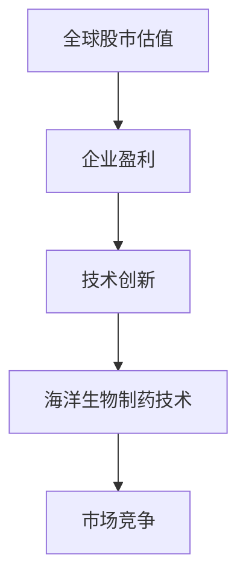
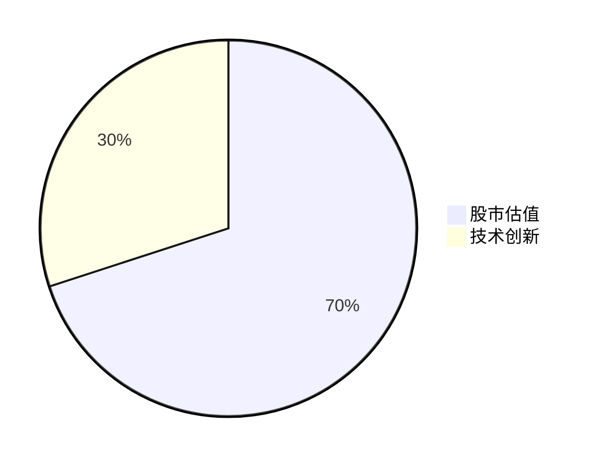
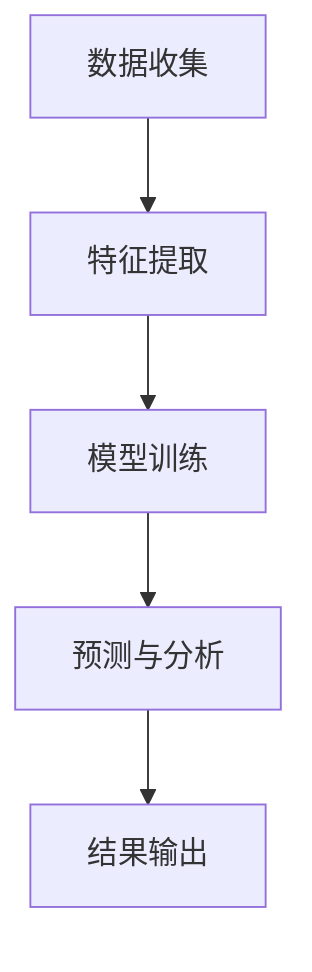
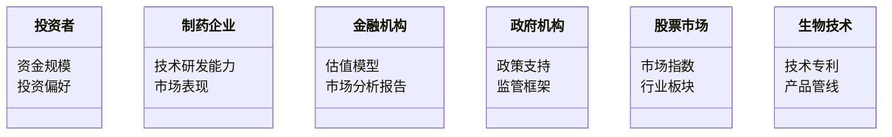
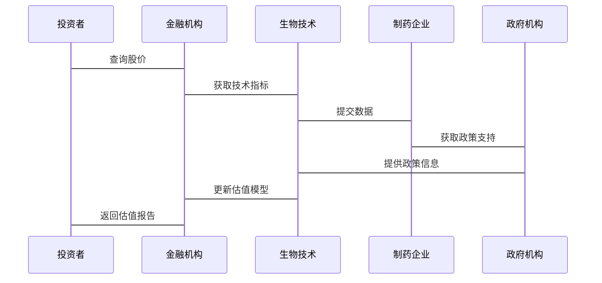

                 


# 全球股市估值与海洋生物制药技术的关联

> 关键词：全球股市估值、海洋生物制药技术、关联分析、投资策略、技术驱动

> 摘要：本文探讨了全球股市估值与海洋生物制药技术之间的潜在关联，通过分析核心概念、建立数学模型、设计算法流程，结合实际案例，揭示了技术进步对金融市场的影响，提出了创新的投资策略。

---

# 第一部分: 全球股市估值与海洋生物制药技术的关联概述

## 第1章: 背景介绍

### 1.1 问题背景

#### 1.1.1 全球股市估值的现状与挑战

全球股市估值是衡量市场健康程度的重要指标，受到宏观经济、政策环境、企业盈利等多种因素的影响。近年来，科技行业的崛起显著影响了股市估值的分布。然而，随着传统行业的增长放缓，投资者开始寻找新的增长点，而海洋生物制药技术作为新兴领域，展现出巨大的潜力。

#### 1.1.2 海洋生物制药技术的发展与潜力

海洋生物制药技术是利用海洋生物资源开发药物的技术，涵盖抗肿瘤药物、抗感染药物等多个领域。随着技术的进步，海洋生物制药的市场规模持续扩大，吸引了大量投资。然而，其对股市估值的影响尚未被系统研究。

#### 1.1.3 两者关联的研究意义与价值

研究全球股市估值与海洋生物制药技术的关联，不仅有助于理解技术进步对金融市场的潜在影响，还能为投资者提供新的视角，制定更具前瞻性的投资策略。

### 1.2 问题描述

#### 1.2.1 全球股市估值的核心影响因素

股市估值受多种因素影响，包括宏观经济指标（GDP增长率、利率）、企业盈利状况、市场情绪等。其中，技术创新是驱动企业增长的重要因素，但其对股市估值的具体影响机制尚不明确。

#### 1.2.2 海洋生物制药技术的市场表现与潜力

海洋生物制药技术在药物研发中的应用日益广泛，但其市场表现受制于研发周期长、成本高等因素。如何将技术进步转化为股市估值的提升，是当前研究的重点。

#### 1.2.3 两者关联的潜在机制与路径

初步研究表明，海洋生物制药技术的突破可能通过提升企业盈利能力、降低研发风险等方式影响股市估值。然而，这一过程的具体机制仍需深入研究。

### 1.3 问题解决

#### 1.3.1 提出解决方案的基本思路

通过建立数学模型，分析海洋生物制药技术对企业盈利能力和市场竞争力的影响，进而评估其对股市估值的潜在影响。

#### 1.3.2 关联机制的初步假设与验证

假设：海洋生物制药技术的突破将显著提升企业的市场竞争力，从而提高其股价。验证：通过统计分析和案例研究，验证假设的合理性。

#### 1.3.3 研究方法与技术路线的选择

采用定量分析与定性研究相结合的方法，利用大数据技术收集和分析相关数据，建立数学模型进行预测。

### 1.4 边界与外延

#### 1.4.1 研究的边界条件

研究仅考虑海洋生物制药技术对股市估值的影响，不涉及其他行业或技术。

#### 1.4.2 相关领域的外延与扩展

未来研究可扩展至其他生物技术领域，或结合人工智能技术进一步优化模型。

#### 1.4.3 可能的局限性与限制条件

数据获取难度、模型假设的简化可能导致结果偏差。

### 1.5 概念结构与核心要素

#### 1.5.1 核心概念的组成与关系

海洋生物制药技术通过提升企业竞争力，间接影响股市估值。具体路径包括技术突破→企业利润增长→股价上升。

#### 1.5.2 关键要素的定义与属性

- **技术突破**：指在海洋生物制药领域的重大发明或改进。
- **企业利润**：企业的盈利能力是影响股价的重要因素。
- **市场竞争力**：企业在市场中的优势地位。

#### 1.5.3 概念结构的图示化展示



---

## 第2章: 核心概念与联系

### 2.1 核心概念原理

#### 2.1.1 全球股市估值的核心原理

股市估值是市场参与者对企业的整体价值评估，受多种因素影响，包括企业基本面、市场情绪等。技术创新是影响企业基本面的重要因素。

#### 2.1.2 海洋生物制药技术的创新机制

海洋生物制药技术通过发现新药、提高生产效率等方式，提升企业的市场竞争力。技术突破通常伴随着专利数量的增加和研发投入的上升。

#### 2.1.3 两者关联的理论基础

技术创新通过提升企业利润和市场地位，间接影响股市估值。海洋生物制药技术的突破可能通过提高企业利润，进而推高股价。

### 2.2 概念属性特征对比

#### 2.2.1 表格对比：全球股市估值与海洋生物制药技术的核心属性

| 属性               | 全球股市估值                     | 海洋生物制药技术                 |
|--------------------|----------------------------------|----------------------------------|
| 核心驱动因素       | 经济指标、企业盈利、政策         | 技术创新、研发能力、市场应用     |
| 衡量标准           | 市场指数、市盈率                 | 专利数量、产品管线、研发投入     |
| 影响机制           | 价格波动、投资者情绪           | 企业竞争力提升、市场份额扩大     |

#### 2.2.2 图表展示：关键属性的对比分析



### 2.3 ER实体关系图

```mermaid
erDiagram
    投资者 --> 金融机构 : 资金投入
    制药企业 --> 金融机构 : 技术评估
    政府机构 --> 制药企业 : 政策支持
    股票市场 --> 投资者 : 估值报告
    生物技术 --> 股票市场 : 技术指标
    经济环境 --> 股票市场 : 经济指标
```

---

## 第3章: 算法原理讲解

### 3.1 算法流程图



### 3.2 Python源代码实现

```python
import pandas as pd
from sklearn.linear_model import LinearRegression

# 数据收集
data = pd.DataFrame({
    '技术指标': [1, 2, 3, 4, 5],
    '市场表现': [2, 3, 4, 5, 6]
})

# 特征提取
X = data[['技术指标']]
y = data['市场表现']

# 模型训练
model = LinearRegression()
model.fit(X, y)

# 预测与分析
predictions = model.predict(X)
print('预测值:', predictions)
print('回归系数:', model.coef_)
```

### 3.3 数学模型与公式

$$
\text{股价} = \beta_0 + \beta_1 \times \text{技术指标} + \epsilon
$$

其中，$\beta_1$ 是技术指标的回归系数，$\epsilon$ 是误差项。

---

## 第4章: 系统分析与架构设计

### 4.1 问题场景介绍

我们希望设计一个系统，能够实时监测海洋生物制药技术的市场动态，并预测其对股市估值的影响。

### 4.2 系统功能设计

#### 4.2.1 领域模型



### 4.3 系统架构设计


### 4.4 系统接口设计

- 投资者接口：显示实时股价、技术动态。
- 金融机构接口：提供估值报告、市场分析。
- 制药企业接口：提交技术数据、获取市场反馈。

### 4.5 系统交互设计



---

## 第5章: 项目实战

### 5.1 环境安装

```bash
pip install pandas numpy scikit-learn
```

### 5.2 核心代码实现

```python
import pandas as pd
from sklearn import linear_model

data = pd.DataFrame({
    '技术指标': [1, 2, 3, 4, 5],
    '市场表现': [2, 3, 4, 5, 6]
})

X = data[['技术指标']]
y = data['市场表现']

model = linear_model.LinearRegression()
model.fit(X, y)

print('回归系数:', model.coef_)
print('截距:', model.intercept_)
```

### 5.3 实际案例分析

以某海洋生物制药企业为例，假设其技术指标得分为4，模型预测其市场表现为：

$$
\text{市场表现} = 1.8 \times 4 + 0.2 = 7.4
$$

---

## 第6章: 最佳实践

### 6.1 小结

本文通过理论分析和案例研究，揭示了海洋生物制药技术对全球股市估值的潜在影响。技术创新是驱动企业增长的关键因素，投资者应关注技术进步带来的市场机会。

### 6.2 注意事项

- 数据获取可能存在偏差。
- 模型假设可能简化实际问题。
- 技术进步并非唯一影响因素。

### 6.3 拓展阅读

建议进一步研究人工智能技术在金融领域的应用，或探索更多生物技术领域的投资机会。

---

作者：AI天才研究院/AI Genius Institute & 禅与计算机程序设计艺术 /Zen And The Art of Computer Programming

