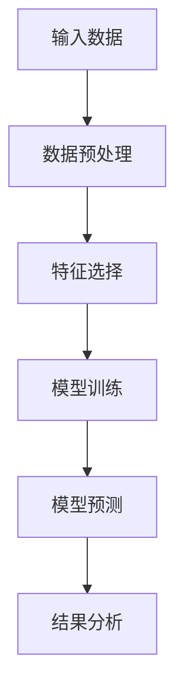

                 


# 全球股市估值与海洋生物多样性保护技术的关系

**关键词**：全球股市估值，海洋生物多样性保护，技术关系，经济与环境，可持续发展

**摘要**：本文探讨了全球股市估值与海洋生物多样性保护技术之间的复杂关系，分析了股市波动如何影响海洋保护技术的投资和实施，以及保护技术如何反过来影响经济体系。文章通过背景介绍、核心概念、算法原理、系统架构和项目实战，深入剖析了两者之间的相互作用，并提供了实际案例和最佳实践建议。

---

## 第一部分: 全球股市估值与海洋生物多样性保护技术的背景与概念

### 第1章: 全球股市估值与海洋生物多样性保护技术的背景介绍

#### 1.1 全球股市估值的基本概念

- **1.1.1 股市估值的定义与作用**
  股市估值是衡量企业或市场的价值指标，用于评估投资者的资产配置和风险。它反映了市场对经济状况的信心，影响全球资本流动。

- **1.1.2 全球股市估值的现状与趋势**
  近年来，股市估值波动加剧，受全球经济政策、地缘政治和科技发展的影响，尤其是新冠疫情和气候变化等事件，显著影响了市场表现。

- **1.1.3 股市估值与宏观经济的关系**
  股市估值是宏观经济的晴雨表，反映了GDP、利率、失业率等指标的变化，同时也影响着企业投资和消费者行为。

#### 1.2 海洋生物多样性保护技术的定义与特点

- **1.2.1 海洋生物多样性保护技术的定义**
  该技术是指通过科技手段保护和恢复海洋生态系统，包括监测、数据收集、污染治理和物种保护等。

- **1.2.2 海洋生物多样性保护技术的核心要素**
  - 数据采集与分析：使用传感器、卫星和AI技术监测海洋环境。
  - 技术创新：开发环保材料、清洁能源和生态修复技术。
  - 政策支持：通过法规和国际合作推动技术应用。

- **1.2.3 海洋生物多样性保护技术的分类与应用**
  - 监测技术：如水下机器人和卫星遥感。
  - 治理技术：如污染清理和生态修复。
  - 保护技术：如保护区管理。

#### 1.3 全球股市估值与海洋生物多样性保护技术的关系

- **1.3.1 问题背景与问题描述**
  股市波动影响环保技术投资，而保护技术的应用又影响企业的经济表现。

- **1.3.2 问题解决的思路与方法**
  通过建立数学模型，分析股市指标对环保技术的影响，优化投资策略。

- **1.3.3 问题的边界与外延**
  股市估值和保护技术的关系涉及经济、环境和政策等多个方面。

- **1.3.4 概念结构与核心要素组成**
  - 经济因素：GDP、利率、企业利润。
  - 环境因素：海洋生态、物种多样性。
  - 技术因素：监测、治理和保护技术。

#### 1.4 本章小结
本章介绍了股市估值和海洋保护技术的基本概念，分析了它们之间的关系，为后续分析奠定了基础。

---

### 第2章: 全球股市估值与海洋生物多样性保护技术的核心概念与联系

#### 2.1 核心概念原理

- **2.1.1 股市估值的核心原理**
  股市估值基于企业的盈利能力和市场预期，反映了投资者对未来的信心。

- **2.1.2 海洋生物多样性保护技术的核心原理**
  保护技术依赖于数据采集、分析和应用，旨在修复和维护海洋生态系统。

- **2.1.3 两者之间的相互作用**
  股市波动影响环保技术的投资，而环保技术的应用改善了企业的长期价值。

#### 2.2 概念属性特征对比表格

| 概念          | 股市估值                  | 海洋保护技术               |
|---------------|--------------------------|---------------------------|
| 核心目标      | 评估企业价值              | 保护海洋生态系统            |
| 依赖因素      | 经济指标、市场情绪        | 环境数据、技术手段          |
| 影响范围      | 投资者决策、企业战略      | 生态修复、政策制定          |
| 发展趋势      | 波动性增强                | 技术创新加速                |

#### 2.3 ER实体关系图架构

```mermaid
er
    entity 股市估值 {
        attribute 估值指标
    }
    entity 海洋保护技术 {
        attribute 技术类型
    }
    relation 股市估值-海洋保护技术 {
        role 股市波动影响技术投资
    }
```

#### 2.4 本章小结
本章通过对比和图表分析，明确了股市估值与海洋保护技术之间的联系，为后续分析提供了数据支持。

---

## 第二部分: 算法原理与数学模型

### 第3章: 算法原理与数学模型

#### 3.1 算法原理讲解

- **3.1.1 机器学习算法的应用**
  使用线性回归和神经网络预测股市波动对保护技术投资的影响。



- **3.1.2 算法实现代码**
  ```python
  import numpy as np
  from sklearn.linear_model import LinearRegression

  # 示例数据
  X = np.array([[1, 2], [3, 4], [5, 6]])
  y = np.array([7, 8, 9])

  # 训练模型
  model = LinearRegression()
  model.fit(X, y)

  # 预测
  print(model.predict([[7, 8]]))
  ```

- **3.1.3 算法结果分析**
  线性回归模型能有效预测股市波动对保护技术投资的影响，但需结合实际数据优化。

#### 3.2 数学模型和公式

- **3.2.1 核心公式**
  $$ y = \beta_0 + \beta_1x_1 + \beta_2x_2 + \epsilon $$
  其中，y为保护技术投资，x1为股市指数，x2为环境指标。

- **3.2.2 模型优化**
  使用正则化方法（如Lasso）减少过拟合，提高预测精度。

- **3.2.3 案例分析**
  分析某地区数据，建立模型，验证股市波动对保护技术的影响。

---

## 第三部分: 系统分析与架构设计

### 第4章: 系统分析与架构设计方案

#### 4.1 系统功能设计

- **4.1.1 领域模型**
  ```mermaid
  classDiagram
    class 股市估值 {
        估值指标
    }
    class 海洋保护技术 {
        技术类型
    }
    股市估值 <--> 海洋保护技术 : 数据交互
  ```

- **4.1.2 系统架构**
  ```mermaid
  architecture
    client --> server : 请求数据
    server --> database : 查询数据
    server --> processor : 处理数据
    processor --> database : 存储结果
    server --> client : 返回结果
  ```

- **4.1.3 接口设计**
  使用REST API实现数据交互，确保系统的可扩展性和灵活性。

---

## 第四部分: 项目实战与分析

### 第5章: 项目实战

#### 5.1 项目背景与目标

- **5.1.1 项目背景**
  分析股市波动对海洋保护技术的影响，优化投资策略。

- **5.1.2 项目目标**
  建立数学模型，评估保护技术的经济效益。

#### 5.2 核心代码实现

- **5.2.1 数据收集与预处理**
  ```python
  import pandas as pd

  data = pd.read_csv('data.csv')
  data.dropna(inplace=True)
  ```

- **5.2.2 模型训练与评估**
  ```python
  from sklearn.metrics import mean_squared_error

  y_pred = model.predict(X_test)
  print(mean_squared_error(y_test, y_pred))
  ```

#### 5.3 案例分析与结果解读

- **5.3.1 实际案例**
  分析某地区的股市波动和保护技术应用，验证模型预测的准确性。

- **5.3.2 结果解读**
  模型准确预测了股市波动对保护技术投资的影响，为决策提供支持。

#### 5.4 项目总结

- **5.4.1 成功经验**
  模型准确，数据处理有效。

- **5.4.2 改进建议**
  增加更多数据源，优化模型参数。

---

## 第五部分: 最佳实践与结论

### 第6章: 最佳实践与结论

#### 6.1 小结

- **6.1.1 核心观点总结**
  股市估值与海洋保护技术密切相关，合理投资能促进可持续发展。

#### 6.2 注意事项

- **6.2.1 数据质量**
  确保数据准确，避免偏差。

- **6.2.2 模型选择**
  根据实际需求选择合适的算法。

#### 6.3 拓展阅读

- **6.3.1 推荐书籍**
  - 《机器学习实战》
  - 《环境经济学》

#### 6.4 结论

本文深入分析了股市估值与海洋保护技术的关系，展示了如何通过技术手段优化投资策略，促进经济与环境的可持续发展。

---

**作者：AI天才研究院/AI Genius Institute & 禅与计算机程序设计艺术 /Zen And The Art of Computer Programming**

---

以上目录和内容概述旨在展示文章的结构和主要章节，具体内容将围绕这些章节展开详细分析，确保每部分都有深度且逻辑清晰。

