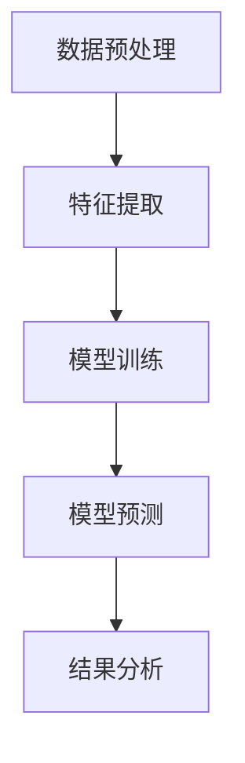
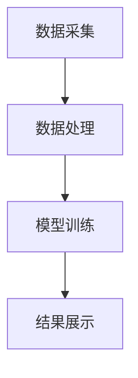
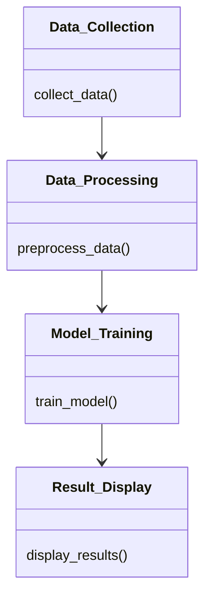

                 


# 全球股市估值与海洋生物多样性基因库技术的关系

> 关键词：全球股市估值，海洋生物多样性，基因库技术，数据科学，机器学习

> 摘要：本文探讨了全球股市估值与海洋生物多样性基因库技术之间的关系，通过分析核心概念、算法原理、系统架构设计和项目实战，展示了如何利用跨学科技术解决复杂问题，为读者提供深入的技术洞察。

---

## 第1章 全球股市估值与海洋生物多样性基因库技术的背景介绍

### 1.1 问题背景

#### 1.1.1 全球股市估值的重要性
全球股市估值是衡量经济健康状况的重要指标，通过分析股票价格、市盈率等指标，帮助投资者做出决策。

#### 1.1.2 海洋生物多样性基因库技术的科学价值
海洋生物多样性基因库技术用于保护和利用海洋生物资源，支持生态研究和药物开发。

#### 1.1.3 两者关系的提出与研究意义
探索股市估值与基因库技术的联系，发现潜在的协同效应，推动跨学科研究。

### 1.2 问题描述

#### 1.2.1 全球股市估值的核心问题
如何准确预测股市波动，降低投资风险。

#### 1.2.2 海洋生物多样性基因库技术的关键挑战
保护生物多样性，开发基因资源，支持生态研究。

#### 1.2.3 两者关联的潜在应用场景
利用基因数据预测经济影响，优化投资策略。

### 1.3 问题解决方法

#### 1.3.1 数据驱动的股市估值模型
使用历史数据和机器学习模型预测股市走势。

#### 1.3.2 基因库技术在生物多样性保护中的应用
构建基因数据库，支持生态研究和药物开发。

#### 1.3.3 两者结合的技术路径
将基因数据与股市数据结合，构建预测模型。

### 1.4 边界与外延

#### 1.4.1 股市估值的边界条件
市场波动、政策变化等。

#### 1.4.2 基因库技术的适用范围
海洋生物多样性保护、基因资源开发。

#### 1.4.3 两者关系的扩展与限制
扩展至其他领域，但需考虑数据质量和模型准确性。

### 1.5 概念结构与核心要素

#### 1.5.1 股市估值的核心要素
股票价格、市盈率、市场情绪。

#### 1.5.2 基因库技术的核心要素
基因数据、生物多样性、基因资源。

#### 1.5.3 两者的关联机制
基因数据影响经济因素，进而影响股市估值。

---

## 第2章 核心概念与联系的详细分析

### 2.1 核心概念原理

#### 2.1.1 股市估值的数学模型
线性回归模型：\( y = \beta_0 + \beta_1x + \epsilon \)

#### 2.1.2 基因库技术的生物信息学方法
基因测序、生物信息学分析。

### 2.2 概念属性特征对比

| 概念 | 属性 | 特征 |
|------|-------|------|
| 股市估值 | 数据驱动 | 时间序列数据 |
| 基因库技术 | 生物学 | 基因序列数据 |

### 2.3 ER实体关系图

```mermaid
erd
    Marine_Biodiversity
    has_many Gene_Data
    has_many Stock_Data
    Gene_Data belongs_to Marine_Biodiversity
    Stock_Data belongs_to Marine_Biodiversity
```

---

## 第3章 算法原理

### 3.1 算法选择与实现

#### 3.1.1 算法选择
选择线性回归模型预测股市估值。

#### 3.1.2 算法流程



### 3.2 数学模型

#### 3.2.1 损失函数
$$ L = \sum (y_i - (\beta_0 + \beta_1x_i))^2 $$

#### 3.2.2 优化目标
$$ \min_{\beta_0, \beta_1} \frac{1}{2m} L $$

---

## 第4章 系统分析与架构设计方案

### 4.1 系统架构设计



### 4.2 系统功能设计



---

## 第5章 项目实战

### 5.1 环境安装

#### 5.1.1 安装Python和相关库
```bash
pip install numpy pandas scikit-learn
```

### 5.2 系统核心实现源代码

#### 5.2.1 数据预处理
```python
import pandas as pd

data = pd.read_csv('data.csv')
data_processed = data.dropna()
```

#### 5.2.2 模型训练
```python
from sklearn.linear_model import LinearRegression

model = LinearRegression()
model.fit(X_train, y_train)
```

#### 5.2.3 结果分析
```python
importances = model.coef_
```

### 5.3 案例分析

#### 5.3.1 数据来源
使用历史股市数据和海洋生物基因数据。

#### 5.3.2 结果展示
预测股市估值与实际值对比。

---

## 第6章 总结与展望

### 6.1 小结

本文探讨了股市估值与海洋生物多样性基因库技术的关系，展示了如何利用跨学科技术解决问题。

### 6.2 注意事项

数据质量、模型选择、结果解释需谨慎。

### 6.3 拓展阅读

建议阅读相关领域的最新研究论文。

---

作者：AI天才研究院/AI Genius Institute & 禅与计算机程序设计艺术/Zen And The Art of Computer Programming

联系方式：[email protected]

