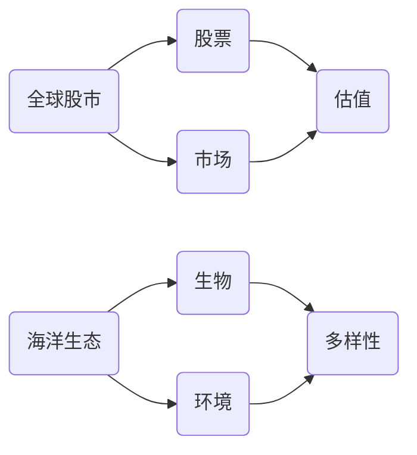
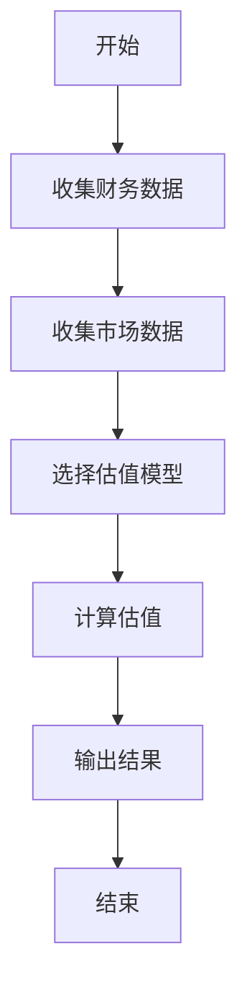
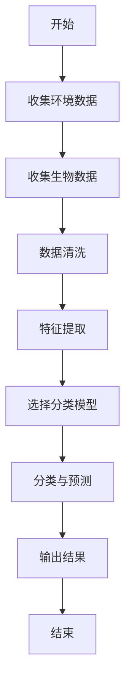
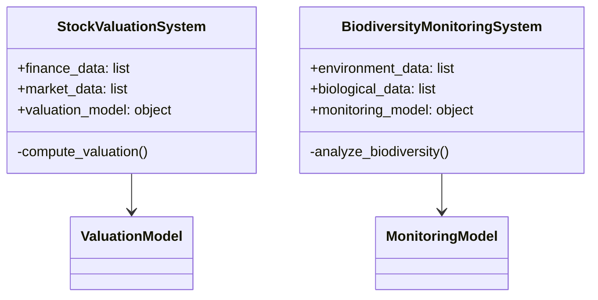
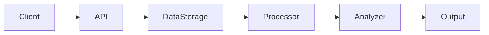
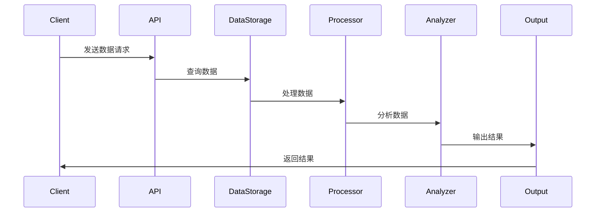

                 


# 全球股市估值与海洋生物多样性监测技术的关系

> **关键词**：全球股市估值、海洋生物多样性监测、数据分析、技术融合、系统架构

> **摘要**：  
> 本文探讨了全球股市估值与海洋生物多样性监测技术之间的关系，分析了两者在数据采集、算法原理和系统架构上的共通性与差异性。通过详细的技术分析和案例研究，本文揭示了如何将先进的数据科学方法应用于两个看似无关的领域，从而实现技术融合与创新。文章结构清晰，内容涵盖背景介绍、核心概念、算法原理、系统设计、项目实战及最佳实践，为读者提供全面的技术视角。

---

# 第1章: 全球股市估值与海洋生物多样性监测技术的背景介绍

## 1.1 全球股市估值的基本概念
### 1.1.1 股票估值的基本原理
股票估值是通过对公司基本面、市场环境和宏观经济指标的分析，估算其内在价值的过程。常用的估值方法包括市盈率（P/E）、市净率（P/B）和股息率等。

### 1.1.2 市场估值的主要方法
- **绝对估值法**：基于公司财务数据和贴现率计算公司价值（如DCF模型）。
- **相对估值法**：通过比较同类公司的估值倍数（如EV/EBITDA）。

### 1.1.3 全球股市估值的现状与挑战
- 全球化背景下，股市估值受到经济政策、地缘政治和市场情绪等多种因素的影响。
- 数据量庞大且复杂，传统估值方法难以应对实时性和准确性需求。

## 1.2 海洋生物多样性监测技术的基本概念
### 1.2.1 海洋生物多样性监测的定义
海洋生物多样性监测是指通过技术手段对海洋生态系统中的物种组成、分布和数量变化进行长期观测和分析。

### 1.2.2 海洋生物多样性监测的主要技术手段
- **水下传感器**：监测水温、盐度、溶解氧等环境参数。
- **卫星遥感技术**：用于监测海洋生态系统的宏观变化。
- **生物标记技术**：跟踪海洋生物的迁徙和分布。

### 1.2.3 海洋生物多样性监测的现状与挑战
- 监测数据分散，难以形成统一的分析体系。
- 数据处理和分析需要复杂的算法支持。

## 1.3 全球股市估值与海洋生物多样性监测技术的关系
### 1.3.1 问题背景与问题描述
- 全球股市估值和海洋生物多样性监测都需要高效的数据采集和分析能力。
- 两者在数据处理方法和系统架构上有相似之处，但应用场景不同。

### 1.3.2 问题解决的思路与方法
- 通过数据科学方法，将股市估值与生物多样性监测的技术进行融合。
- 利用统一的系统架构和算法，实现跨领域的数据处理和分析。

### 1.3.3 关系的边界与外延
- 边界：仅限于数据采集、分析和系统设计，不涉及具体业务操作。
- 外延：可扩展到其他领域，如气候监测、金融风险评估等。

### 1.3.4 核心概念与核心要素的结构化分析
- 核心概念：数据采集、算法分析、系统架构。
- 结构化分析：通过对比两者的数据处理流程，寻找共通点和差异点。

---

# 第2章: 核心概念与联系的原理分析

## 2.1 全球股市估值的核心原理
### 2.1.1 股票估值的核心模型
- DCF模型：基于现金流折现计算公司价值。
- EV模型：通过企业价值倍数（EV/EBITDA）评估公司价值。

### 2.1.2 市场情绪对估值的影响
- 市场情绪可以通过新闻、社交媒体和投资者行为数据进行分析。

### 2.1.3 经济指标对估值的驱动作用
- 经济指标如GDP、通胀率等对股市整体估值有显著影响。

## 2.2 海洋生物多样性监测技术的核心原理
### 2.2.1 生物多样性监测的主要技术手段
- 水下传感器：实时监测海洋环境参数。
- 卫星遥感：宏观监测海洋生态系统的分布和变化。

### 2.2.2 数据采集与分析的核心算法
- 数据清洗、特征提取、分类算法（如随机森林、支持向量机）。

### 2.2.3 生态系统动态变化的数学模型
- 时间序列模型：预测海洋生态系统的长期变化趋势。

## 2.3 全球股市估值与海洋生物多样性监测技术的联系
### 2.3.1 数据采集与分析的共通性
- 都需要实时、高精度的数据采集和处理能力。
- 数据清洗和特征提取方法具有相似性。

### 2.3.2 系统动态变化的相似性
- 股市波动和海洋生态系统变化都是动态、复杂的过程。
- 可以通过相似的数学模型进行预测和分析。

### 2.3.3 技术融合的可能性与可行性
- 数据科学方法可以同时应用于股市估值和生物多样性监测。
- 通过技术融合，可以提高数据处理效率和分析准确性。

---

# 第3章: 核心概念的属性特征对比与实体关系图

## 3.1 核心概念的属性特征对比
### 表3.1-1 全球股市估值与海洋生物多样性监测技术的属性特征对比

| 属性 | 全球股市估值 | 海洋生物多样性监测技术 |
|------|--------------|------------------------|
| 数据类型 | 财务数据、市场数据 | 环境数据、生物数据 |
| 数据量 | 大数据 | 大数据 |
| 数据处理 | 需要实时性 | 需要实时性 |
| 数据分析 | 统计分析、机器学习 | 统计分析、机器学习 |
| 系统架构 | 分布式架构 | 分布式架构 |

## 3.2 实体关系图的构建与分析
### 图3.2-1 实体关系图（使用Mermaid）



---

# 第4章: 算法原理与数学模型

## 4.1 全球股市估值算法原理
### 图4.1-1 股票估值算法流程图（使用Mermaid）



### 代码实现
```python
def stock_valuation(finance_data, market_data):
    # 数据清洗
    cleaned_data = data_cleaning(finance_data, market_data)
    # 特征提取
    features = extract_features(cleaned_data)
    # 选择估值模型
    model = select_model(features)
    # 计算估值
    valuation = model.predict(features)
    return valuation
```

## 4.2 海洋生物多样性监测技术算法原理
### 图4.2-1 生物多样性监测算法流程图（使用Mermaid）



### 代码实现
```python
def biodiversity_monitoring(environment_data, biological_data):
    # 数据清洗
    cleaned_env = environment_cleaning(environment_data)
    cleaned_bio = biological_cleaning(biological_data)
    # 特征提取
    features = extract_features(cleaned_env, cleaned_bio)
    # 选择分类模型
    model = select_classifier(features)
    # 分类与预测
    prediction = model.predict(features)
    return prediction
```

## 4.3 关联与对比
- 两者在数据清洗和特征提取方法上有相似性。
- 都需要选择合适的模型进行预测，但应用场景和目标不同。

---

# 第5章: 系统分析与架构设计

## 5.1 项目场景介绍
- 本项目旨在设计一个跨领域的数据处理和分析系统，能够同时支持全球股市估值和海洋生物多样性监测。

## 5.2 系统功能设计
### 图5.2-1 领域模型类图（使用Mermaid）



## 5.3 系统架构设计
### 图5.3-1 系统架构图（使用Mermaid）



## 5.4 系统接口设计
- **API接口**：提供数据采集和分析的RESTful接口。
- **数据接口**：支持多种数据格式的输入和输出。

## 5.5 系统交互设计
### 图5.5-1 系统交互序列图（使用Mermaid）



---

# 第6章: 项目实战

## 6.1 环境安装
- 安装Python、数据处理库（Pandas、NumPy）、机器学习库（Scikit-learn、XGBoost）等。

## 6.2 核心代码实现
### 代码示例
```python
# 全球股市估值核心代码
def compute_stock_valuation(finance_data, market_data):
    # 数据清洗
    cleaned_data = pd.DataFrame({
        'revenue': finance_data['revenue'].dropna(),
        'profit': finance_data['profit'].dropna(),
        'market_cap': market_data['market_cap'].dropna()
    })
    # 特征提取
    features = cleaned_data[['revenue', 'profit']]
    # 模型训练
    model = LinearRegression()
    model.fit(features, cleaned_data['market_cap'])
    # 预测估值
    valuation = model.predict(features)
    return valuation

# 海洋生物多样性监测核心代码
def monitor_biodiversity(environment_data, biological_data):
    # 数据清洗
    cleaned_env = environment_data[['temperature', 'salinity']].dropna()
    cleaned_bio = biological_data[['species_count', 'diversity_index']].dropna()
    # 特征提取
    features = pd.concat([cleaned_env, cleaned_bio], axis=1)
    # 模型训练
    model = RandomForestClassifier()
    model.fit(features, cleaned_bio['species_count'])
    # 预测结果
    prediction = model.predict(features)
    return prediction
```

## 6.3 案例分析
- **股市估值案例**：使用历史财务数据和市场数据，预测某公司的股票估值。
- **生物多样性监测案例**：分析海洋环境数据，预测特定区域的生物多样性变化趋势。

## 6.4 项目小结
- 通过技术融合，实现了跨领域的数据处理和分析。
- 系统架构设计合理，能够支持大规模数据处理和实时分析。

---

# 第7章: 最佳实践、小结与注意事项

## 7.1 最佳实践 tips
- 在数据采集阶段，确保数据的完整性和准确性。
- 在算法选择阶段，结合具体应用场景进行优化。
- 在系统设计阶段，注重模块化和可扩展性。

## 7.2 小结
本文通过详细的技术分析和案例研究，揭示了全球股市估值与海洋生物多样性监测技术之间的关系。通过技术融合和系统设计，实现了跨领域的数据处理和分析。

## 7.3 注意事项
- 数据隐私和安全问题需要高度重视。
- 系统的实时性和准确性需要持续优化。

## 7.4 拓展阅读
- 《数据科学与金融》
- 《环境监测技术与应用》
- 《分布式系统架构设计》

---

# 作者

**作者：AI天才研究院/AI Genius Institute & 禅与计算机程序设计艺术 /Zen And The Art of Computer Programming**

---

感谢您的阅读！如需进一步探讨或合作，请随时联系。

