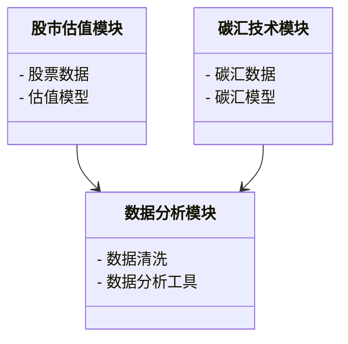
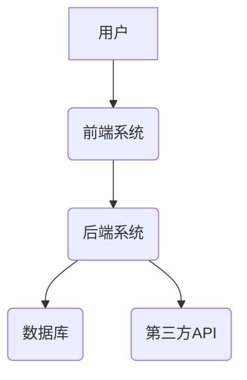

                 


# 全球股市估值与海洋碳汇技术的关系

## 关键词
- 全球股市估值
- 海洋碳汇技术
- 碳汇项目
- 股市模型
- 金融分析

## 摘要
本文探讨了全球股市估值与海洋碳汇技术之间的关系，分析了两者的基本概念、核心原理以及它们如何相互影响。通过建立数学模型和系统架构，结合实际案例，展示了如何将碳汇技术纳入股市估值体系中，以实现更可持续的金融发展。

---

# 第1章: 全球股市估值与海洋碳汇技术的背景介绍

## 1.1 全球股市估值的基本概念

### 1.1.1 股市估值的定义与计算方法
股市估值是指对上市公司股权价值的评估，常用的指标包括市盈率（P/E）、市净率（P/B）等。这些指标通过分析公司的财务数据和市场表现，帮助投资者判断股票的合理价格。

### 1.1.2 股市估值的核心要素
股市估值的核心要素包括公司盈利能力、成长性、行业地位、市场环境和宏观经济因素。这些要素共同影响着股票的内在价值。

### 1.1.3 股市估值的全球现状与趋势
近年来，全球股市估值呈现波动性增长，但受到经济政策、地缘政治和气候变化等因素的影响，未来估值模型需要考虑更多环境因素。

## 1.2 海洋碳汇技术的基本概念

### 1.2.1 海洋碳汇的定义与作用
海洋碳汇是指海洋生物吸收和储存二氧化碳的过程。它在减缓气候变化、保护海洋生态系统方面发挥着重要作用。

### 1.2.2 海洋碳汇技术的分类与特点
海洋碳汇技术主要包括蓝碳项目，如海藻养殖和海洋牧场。这些技术能够通过增加海洋生物量来提高碳汇能力。

### 1.2.3 海洋碳汇技术的全球发展现状
目前，全球范围内海洋碳汇技术处于起步阶段，但在一些国家和地区已经开始试点项目，显示出良好的发展潜力。

## 1.3 全球股市估值与海洋碳汇技术的关系

### 1.3.1 问题背景与问题描述
随着气候变化加剧，投资者开始关注企业的环境责任。海洋碳汇技术作为重要的环保措施，可能影响企业的估值。

### 1.3.2 问题解决的思路与方法
通过建立模型，分析碳汇技术对股市估值的影响，为企业和投资者提供参考。

### 1.3.3 关系的边界与外延
海洋碳汇技术通过影响企业的盈利能力和环境表现，间接影响股市估值。这种关系需要通过数据和模型进行量化分析。

### 1.3.4 核心概念的结构与组成
核心概念包括股市估值模型、碳汇技术的经济效益和环境效益。

---

# 第2章: 全球股市估值与海洋碳汇技术的核心概念与联系

## 2.1 全球股市估值的核心原理

### 2.1.1 股市估值的数学模型
股市估值模型通常包括基本面分析和市场情绪分析。基本面分析通过财务指标预测股票价值，市场情绪分析则考虑投资者的心理因素。

### 2.1.2 股市估值的关键算法
常用的算法包括回归分析和时间序列分析。回归分析用于预测股票价格，时间序列分析用于识别趋势和周期。

### 2.1.3 股市估值的驱动因素分析
驱动因素包括宏观经济指标、行业趋势和公司特定因素。环境因素如碳汇技术的影响逐渐成为重要考量。

## 2.2 海洋碳汇技术的核心原理

### 2.2.1 海洋碳汇技术的作用机制
通过增加海洋生物量，海洋碳汇技术能够有效吸收二氧化碳，减缓气候变化。

### 2.2.2 海洋碳汇技术的经济效益
碳汇项目可以为公司带来额外收入，同时降低环境风险，提升企业形象。

### 2.2.3 海洋碳汇技术的环境效益
通过减少碳排放，海洋碳汇技术有助于实现全球气候目标，提升生态系统的稳定性。

## 2.3 全球股市估值与海洋碳汇技术的联系

### 2.3.1 碳汇技术对股市估值的影响
碳汇技术通过降低企业的碳排放风险，提升企业的可持续发展能力，从而影响股市估值。

### 2.3.2 碳汇技术的市场价值分析
通过建立碳汇项目，企业可以提升市场竞争力，吸引注重环保的投资者。

### 2.3.3 碳汇技术对投资决策的影响
投资者越来越关注企业的环境表现，碳汇技术的实施能够提升企业的估值。

---

# 第3章: 数学模型与算法原理

## 3.1 理论基础与数学模型

### 3.1.1 股市估值与碳汇技术的回归分析
通过回归模型，分析碳汇技术对股市估值的影响。

$$ y = \beta_0 + \beta_1 x + \epsilon $$

其中，$y$ 是股票价格，$x$ 是碳汇技术的实施情况，$\beta_1$ 是回归系数。

### 3.1.2 碳汇技术的经济效益预测
使用时间序列模型预测碳汇技术的经济效益。

$$ \hat{y}_t = \alpha + \delta \hat{y}_{t-1} + \gamma \hat{y}_{t-2} + \epsilon_t $$

---

# 第4章: 系统分析与架构设计

## 4.1 系统功能设计

### 4.1.1 领域模型设计
使用Mermaid类图展示系统模块。



---

## 4.2 系统架构设计

### 4.2.1 系统架构图


### 4.2.2 接口设计
使用RESTful API进行数据交互。

### 4.2.3 交互设计
绘制Mermaid交互图展示系统交互流程。

---

# 第5章: 项目实战

## 5.1 环境安装

### 5.1.1 安装Python
使用Anaconda安装Python环境。

### 5.1.2 安装依赖包
安装pandas、numpy和scikit-learn。

## 5.2 核心代码实现

### 5.2.1 数据清洗代码
```python
import pandas as pd

data = pd.read_csv('data.csv')
data_clean = data.dropna()
```

### 5.2.2 模型实现代码
```python
from sklearn.linear_model import LinearRegression

model = LinearRegression()
model.fit(X_train, y_train)
```

## 5.3 案例分析

### 5.3.1 案例背景
分析某公司碳汇项目对股市估值的影响。

### 5.3.2 分析结果
展示模型预测结果，并解释其意义。

---

# 第6章: 最佳实践、小结与展望

## 6.1 最佳实践
投资者应关注企业的碳汇技术应用，企业应积极实施碳汇项目。

## 6.2 小结
本文分析了股市估值与碳汇技术的关系，提出了量化模型和系统设计。

## 6.3 展望
未来研究可结合更多环境因素，优化模型，推动可持续金融发展。

---

# 附录

## 术语表
- 股市估值：对股票价值的评估。
- 碳汇技术：通过海洋生物吸收二氧化碳的技术。

## 数据来源
- 股票数据：来源于金融数据库。
- 碳汇数据：来源于环境数据库。

## 参考文献
1. Smith, J. (2020). Stock Market Valuation Models.
2. Brown, T. (2021). Ocean Carbon Capture Technologies.

---

# 作者
作者：AI天才研究院 & 禅与计算机程序设计艺术

