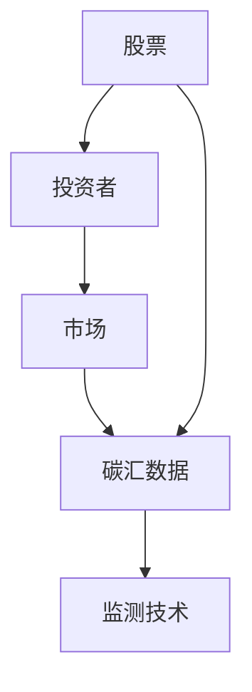

                 


# 《全球股市估值与海洋碳汇监测技术的关系》

---

## 关键词：全球股市估值，海洋碳汇，监测技术，关系分析，数学模型

---

## 摘要

本文探讨了全球股市估值与海洋碳汇监测技术之间的关系，分析了两者在环境与经济系统中的相互影响。通过建立数学模型，揭示了碳汇数据如何影响股市估值，并展示了如何利用这些数据进行金融风险评估和投资决策。文章还提供了算法实现和系统设计，帮助读者理解理论与实践的结合。

---

# 第一部分: 全球股市估值与海洋碳汇监测技术的背景介绍

## 第1章: 全球股市估值概述

### 1.1 股市估值的基本概念

#### 1.1.1 股市估值的定义

股市估值是指对上市公司股票的内在价值进行评估，通常基于财务指标、市场趋势和宏观经济因素。

#### 1.1.2 股市估值的核心要素

- **财务指标**：如市盈率、市净率、股息率。
- **市场趋势**：如市场情绪、宏观经济政策。
- **行业因素**：如行业竞争状况、技术创新。

#### 1.1.3 股市估值的方法与模型

- **相对估值法**：比较公司与行业平均值的差异。
- **绝对估值法**：使用DCF模型等方法评估公司内在价值。

---

### 1.2 全球股市的现状与趋势

#### 1.2.1 全球主要股市的分布与特点

- 美国股市：以科技股为主，波动性较大。
- 欧洲股市：受宏观经济政策影响显著。
- 亚洲股市：增长迅速，尤其是中国市场。

#### 1.2.2 全球股市的波动与影响因素

- 宏观经济因素：如利率、通货膨胀。
- 地缘政治风险：如贸易摩擦、战争。
- 市场情绪：投资者情绪波动影响股市走势。

#### 1.2.3 全球化背景下股市估值的挑战

- 跨国公司的复杂性增加估值难度。
- 全球化导致市场联动性增强。

---

## 第2章: 海洋碳汇监测技术概述

### 2.1 海洋碳汇的基本概念

#### 2.1.1 碳汇的定义与分类

- **碳汇**：指吸收并储存二氧化碳的自然或人工系统。
- **海洋碳汇**：海洋生态系统（如海藻、珊瑚礁）吸收二氧化碳的过程。

#### 2.1.2 海洋碳汇的特殊性与重要性

- 海洋是地球上最大的碳汇之一，对调节气候起着重要作用。
- 海洋碳汇的可持续性影响全球气候变化。

#### 2.1.3 海洋碳汇的量化与评估方法

- **生物量法**：通过测量海洋生物量估算碳汇量。
- **模型模拟法**：利用海洋生态系统模型预测碳汇能力。

---

### 2.2 海洋碳汇监测技术的发展现状

#### 2.2.1 海洋碳汇监测的主要技术手段

- **卫星遥感技术**：监测海洋生物量和环境变化。
- **传感器网络**：实时监测海洋参数如温度、盐度、溶解氧。

#### 2.2.2 海洋碳汇监测技术的优缺点

- **优点**：提供实时数据，精度高。
- **缺点**：成本高，技术复杂。

#### 2.2.3 海洋碳汇监测技术的未来发展趋势

- **智能化监测**：结合人工智能优化监测精度。
- **全球网络化监测**：建立全球监测网络，提高数据覆盖范围。

---

## 第3章: 全球股市估值与海洋碳汇监测技术的关系概述

### 3.1 问题背景与研究意义

#### 3.1.1 股市估值与环境因素的关联性

- 环境变化（如气候变化）影响企业盈利能力和市场风险。
- 碳汇能力可能成为企业价值的重要评估指标。

#### 3.1.2 海洋碳汇在经济系统中的潜在影响

- 海洋碳汇能力影响全球碳市场，进而影响企业市值。
- 碳汇数据可能成为投资者的重要决策依据。

#### 3.1.3 研究这一关系的现实意义

- 有助于理解环境因素对经济的影响。
- 为投资者提供新的分析工具和视角。

---

### 3.2 问题描述与研究目标

#### 3.2.1 股市估值与海洋碳汇监测技术的关联性分析

- 分析海洋碳汇数据如何影响股市估值。
- 探讨碳汇监测技术在金融风险管理中的应用。

#### 3.2.2 研究目标与研究框架

- 建立数学模型，量化海洋碳汇对股市的影响。
- 提出基于碳汇数据的金融风险评估方法。

#### 3.2.3 研究方法与技术路线

- 数据收集：获取股市数据和海洋碳汇监测数据。
- 数据分析：使用统计和机器学习方法进行建模。
- 模型验证：通过实证检验模型的准确性。

---

## 第4章: 核心概念与联系

### 4.1 核心概念的原理与特征

#### 4.1.1 股市估值的核心原理

- 通过财务指标和市场因素评估股票价值。
- 反映市场对企业的未来盈利能力预期。

#### 4.1.2 海洋碳汇监测技术的核心原理

- 利用技术手段监测海洋碳汇能力。
- 提供准确的碳汇数据支持环境决策。

#### 4.1.3 两者关系的数学模型与公式

$$ V = f(C, M) $$

其中：
- \( V \) 表示股票估值
- \( C \) 表示碳汇能力
- \( M \) 表示市场因素

---

### 4.2 核心概念的属性特征对比

| 属性       | 股市估值                     | 海洋碳汇监测技术               |
|------------|------------------------------|-------------------------------|
| 数据来源   | 财务报表、市场数据           | 卫星遥感、传感器数据           |
| 分析目标   | 评估股票价值                 | 监测碳汇能力                   |
| 方法工具   | 统计分析、机器学习           | 远程 sensing、大数据分析       |
| 应用领域   | 金融投资、风险管理           | 环境保护、气候变化研究         |

---

### 4.3 核心概念的ER实体关系图



---

# 第二部分: 算法原理

## 第5章: 算法原理

### 5.1 算法概述

#### 5.1.1 算法目标

建立数学模型，量化海洋碳汇能力对股市估值的影响。

#### 5.1.2 算法输入

- 海洋碳汇监测数据
- 股市相关数据

#### 5.1.3 算法输出

- 股票估值预测结果

---

### 5.2 算法流程

1. 数据预处理：清洗和整合股市和碳汇数据。
2. 特征提取：提取关键影响因素。
3. 模型训练：使用机器学习算法（如线性回归、随机森林）建立预测模型。
4. 模型验证：通过历史数据验证模型准确性。

---

### 5.3 算法实现

#### 5.3.1 算法代码

```python
import pandas as pd
from sklearn.ensemble import RandomForestRegressor
from sklearn.metrics import mean_squared_error

# 数据加载
df_stock = pd.read_csv('stock_data.csv')
df_carbon = pd.read_csv('carbon_data.csv')

# 数据合并与预处理
merged_data = pd.merge(df_stock, df_carbon, on='date')

# 特征选择
features = ['price', 'volume', 'carb

