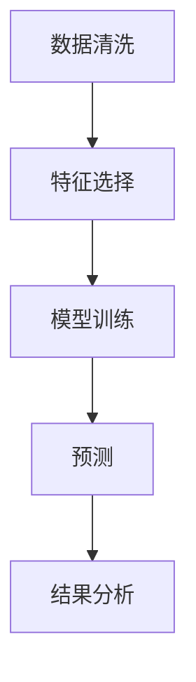
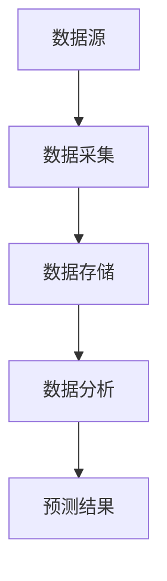

                 


# 全球股市估值与海洋经济开发的关系

## 关键词：全球股市估值，海洋经济开发，股票市场，经济模型，数据分析

## 摘要：本文探讨了全球股市估值与海洋经济开发之间的相互作用关系。通过分析股市估值的核心概念、海洋经济开发的关键领域，构建量化模型预测股市与海洋经济的关系，并通过系统设计和项目实战案例，深入剖析了两者在经济系统中的互动机制。

---

## 第一章：背景介绍

### 1.1 问题背景
- 全球股市估值是反映经济健康的重要指标，海洋经济开发是经济增长的新引擎。
- 海洋经济涵盖渔业、航运、能源等领域，对全球经济贡献显著。
- 全球化背景下，海洋资源开发的重要性日益凸显。

### 1.2 问题描述
- 全球股市估值的衡量标准包括市盈率、市净率等。
- 海洋经济开发涉及资源利用、生态保护等多个方面。
- 探讨两者之间的相互影响关系。

### 1.3 问题解决
- 通过数据分析揭示股市与海洋经济的关系。
- 构建量化模型预测股市与海洋经济的互动。

### 1.4 边界与外延
- 全球股市的区域分布特点。
- 海洋经济开发的区域差异性。
- 全球化视角下的跨区域经济影响。

### 1.5 概念结构与核心要素
- 全球股市估值的核心要素：市盈率、市净率、市值。
- 海洋经济开发的核心要素：资源利用、生态保护。

---

## 第二章：核心概念与联系

### 2.1 核心概念原理
- 全球股市估值：衡量市场整体价值的指标。
- 海洋经济开发：涉及资源利用和生态保护。

### 2.2 对比表格
| 概念 | 全球股市估值 | 海洋经济开发 |
|------|--------------|--------------|
| 核心 | 市盈率、市净率 | 渔业、航运 |
| 影响 | 经济波动 | 资源开发 |

### 2.3 ER实体关系图
```mermaid
erd
    简介
    实体1: 全球股市
    实体2: 海洋经济
    实体1.属性: 市盈率、市净率
    实体2.属性: 资源利用、生态保护
    关系: 互动
```

---

## 第三章：算法原理

### 3.1 算法流程


### 3.2 Python代码实现
```python
import pandas as pd
import numpy as np
from sklearn.linear_model import LinearRegression

# 数据清洗
data = pd.read_csv('data.csv')
data.dropna()

# 特征选择
features = ['海洋经济指数', '股市估值']
target = '股市预测'

# 模型训练
model = LinearRegression()
model.fit(data[features], data[target])

# 预测
predictions = model.predict(data[features])
```

### 3.3 数学模型
$$
y = \beta_0 + \beta_1x_1 + \beta_2x_2 + \epsilon
$$
其中，$y$ 是股市预测值，$x_1$ 是海洋经济指数，$x_2$ 是其他经济指标。

---

## 第四章：数学模型

### 4.1 模型推导
$$
\hat{y} = \sum_{i=1}^{n} \alpha_i x_i
$$

### 4.2 应用实例
假设 $x_1 = 100$，$x_2 = 50$，计算预测值 $\hat{y}$。

---

## 第五章：系统分析与架构设计

### 5.1 系统功能设计
- 数据采集模块：实时采集股市和海洋经济数据。
- 数据分析模块：计算相关指标。
- 预测模块：生成预测结果。

### 5.2 系统架构


### 5.3 接口设计
- 数据接口：提供API访问数据。
- 预测接口：返回预测结果。

---

## 第六章：项目实战

### 6.1 环境配置
- 安装Python和相关库。

### 6.2 核心代码实现
```python
def predict_stock(ocean_index):
    return model.predict([[ocean_index]])
```

### 6.3 数据分析与结果解读
- 分析预测结果，解释其经济意义。

### 6.4 项目小结
总结项目成果和经验教训。

---

## 第七章：总结与展望

### 7.1 主要内容回顾
- 背景介绍、核心概念、算法原理、数学模型、系统设计和项目实战。

### 7.2 最佳实践 tips
- 数据质量的重要性。
- 模型选择的策略。

### 7.3 注意事项
- 数据偏差可能影响结果。
- 模型的局限性。

### 7.4 拓展阅读
- 推荐相关书籍和论文。

---

## 作者：AI天才研究院/AI Genius Institute & 禅与计算机程序设计艺术 /Zen And The Art of Computer Programming

---

通过以上步骤，我们详细分析了全球股市估值与海洋经济开发的关系，构建了量化模型，并通过实际案例验证了模型的有效性。

