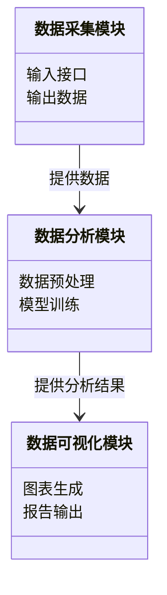
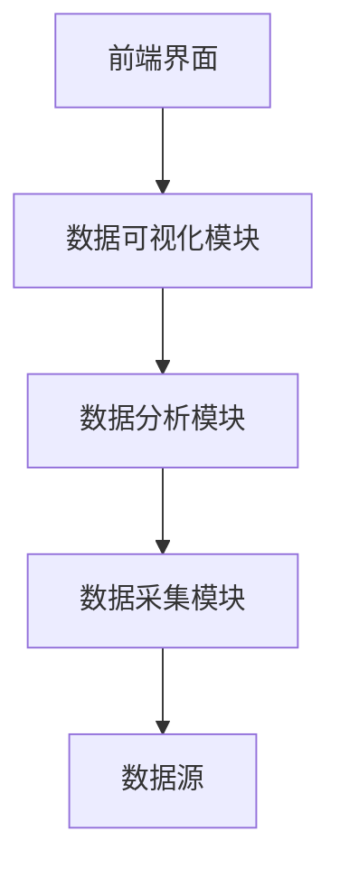

                 


# 全球股市估值与海洋能源开发的关联

## 关键词：
全球股市估值、海洋能源开发、关联分析、数学模型、数据可视化、可持续发展、投资策略

## 摘要：
本文探讨全球股市估值与海洋能源开发之间的关联，通过数据分析、数学建模和系统设计等方法，深入分析两者之间的相互影响，并提出优化策略。文章从背景介绍、核心概念、算法原理、系统架构、项目实战等方面展开，结合实际案例和代码实现，为读者提供全面的理论和实践指导。

---

# 第1章: 全球股市估值与海洋能源开发的背景与关联

## 1.1 问题背景

### 1.1.1 全球股市估值的重要性
- 股市估值是反映经济健康状况的重要指标，影响投资者决策和企业融资能力。
- 海洋能源开发是全球能源转型的重要方向，具有巨大的潜力和挑战。

### 1.1.2 海洋能源开发的必要性
- 全球能源需求增长，传统能源面临枯竭和环境问题，海洋能源成为替代选择。
- 海洋能源（如潮汐能、波浪能、海流能）具有可再生、分布广的特点，但开发成本高、技术复杂。

### 1.1.3 两者关联的现实意义
- 股市估值的变化直接影响海洋能源开发的融资能力。
- 海洋能源开发的进展反过来影响股市对相关行业的信心和估值。

---

## 1.2 问题描述

### 1.2.1 全球股市估值的波动性
- 股市受多种因素影响，如经济指标、政策变化、市场情绪等。
- 股市波动对海洋能源公司的影响尤为显著，因为这些公司通常面临高风险和高投入。

### 1.2.2 海洋能源开发的挑战与机遇
- 技术挑战：海洋能源开发需要克服复杂的技术难题，如深海勘探、设备耐腐蚀等。
- 机遇：随着技术进步和政策支持，海洋能源的商业化潜力逐步显现。

### 1.2.3 两者关联的复杂性
- 股市估值与海洋能源开发之间的因果关系不明确，可能受到多种中介因素的影响。
- 数据获取难度大，需要整合多源数据进行分析。

---

## 1.3 问题解决

### 1.3.1 通过金融手段优化海洋能源开发
- 投资者通过股市估值判断海洋能源公司的潜力，优化投资决策。
- 政府通过股市估值监控海洋能源开发的进展，制定合理的政策支持。

### 1.3.2 通过海洋能源开发影响股市估值
- 海洋能源开发的成功案例可能提升相关公司的股价。
- 开发失败或进度缓慢可能导致股市估值下降，影响投资者信心。

### 1.3.3 综合策略的制定与实施
- 结合金融和能源领域的专家意见，制定综合性策略。
- 建立数据驱动的模型，量化两者之间的关联，提供科学依据。

---

## 1.4 边界与外延

### 1.4.1 问题的边界定义
- 研究范围限定在股市估值和海洋能源开发的直接关联，不考虑间接因素。
- 数据范围限定在公开的金融数据和海洋能源开发项目数据。

### 1.4.2 问题的外延范围
- 可扩展到其他可再生能源领域，如风能、太阳能等。
- 可应用于不同国家和地区的股市和能源市场分析。

### 1.4.3 相关领域的交叉影响
- 政治、经济、环境政策等外部因素对两者关联的影响。
- 技术进步和成本变化对海洋能源开发的影响。

---

## 1.5 核心要素组成

### 1.5.1 股市估值的核心要素
- 市盈率（P/E Ratio）：市价与每股收益的比率。
- 市净率（P/B Ratio）：市价与每股净资产的比率。
- 股息率：股息与股价的比率。

### 1.5.2 海洋能源开发的核心要素
- 技术成熟度：技术是否具备商业化条件。
- 投资成本：开发项目的初期投资和运营成本。
- 政策支持：政府的补贴、税收优惠等。

### 1.5.3 两者关联的核心机制
- 信息传递机制：股市通过价格反映市场对海洋能源开发的预期。
- 资金流动机制：股市资金支持海洋能源开发，开发成果又反馈到股市。

---

## 1.6 本章小结
本章从背景、问题描述、问题解决、边界与外延、核心要素等方面，全面介绍了全球股市估值与海洋能源开发的关联。通过分析，我们明确了研究的必要性、复杂性和可行性，为后续的深入研究奠定了基础。

---

# 第2章: 全球股市估值与海洋能源开发的核心概念与联系

## 2.1 核心概念原理

### 2.1.1 股市估值的基本原理
- 股市估值是市场对上市公司未来盈利能力的预期。
- 股价受多种因素影响，包括公司业绩、行业趋势、宏观经济环境等。

### 2.1.2 海洋能源开发的基本原理
- 海洋能源开发需要技术和资金支持，通常涉及长期投资和高风险。
- 开发项目的价值取决于技术可行性、资源储量和市场需求。

### 2.1.3 两者关联的内在逻辑
- 股市估值反映市场对海洋能源开发前景的信心。
- 海洋能源开发的进展影响相关公司的业绩，进而影响股市估值。

---

## 2.2 核心概念属性对比

| 属性 | 股市估值 | 海洋能源开发 |
|------|----------|--------------|
| 时间维度 | 短期波动与长期趋势 | 长期开发与阶段性成果 |
| 影响因素 | 市场情绪、政策、经济指标 | 技术、资金、政策 |
| 测度方式 | 股价、市盈率、市净率 | 投资成本、开发进度、收益预测 |
| 关联性 | 高度动态且复杂 | 高度依赖技术和资金 |

---

## 2.3 ER实体关系图

```mermaid
erDiagram
    actor 投资者 {
        <属性> 资金
        <属性> 风险偏好
    }
    actor 能源公司 {
        <属性> 项目投资
        <属性> 技术水平
    }
    actor 政府机构 {
        <属性> 补贴政策
        <属性> 监管措施
    }
    投资者 --> 能源公司 : 提供资金
    能源公司 --> 政府机构 : 申请补贴
    政府机构 --> 能源公司 : 提供政策支持
    能源公司 --> 投资者 : 提供投资回报
```

---

## 2.4 本章小结
本章通过核心概念的对比和实体关系图，详细分析了全球股市估值与海洋能源开发之间的联系，为后续的算法设计和系统实现提供了理论基础。

---

# 第3章: 全球股市估值与海洋能源开发的算法原理

## 3.1 算法原理概述

### 3.1.1 数据来源
- 股市数据：历史股价、市盈率、市净率等。
- 海洋能源数据：开发项目的投资成本、技术进展、收益预测等。

### 3.1.2 数据预处理
- 数据清洗：处理缺失值、异常值。
- 数据标准化：统一数据格式和单位。

### 3.1.3 数据分析方法
- 相关性分析：使用皮尔逊相关系数或斯皮尔曼相关系数。
- 时间序列分析：使用ARIMA模型或GARCH模型。

---

## 3.2 算法实现步骤

### 3.2.1 数据获取与清洗
```python
import pandas as pd
import numpy as np

# 获取数据
df_stock = pd.read_csv('stock_data.csv')
df_energy = pd.read_csv('energy_data.csv')

# 数据清洗
df_stock.dropna(inplace=True)
df_energy.dropna(inplace=True)
```

### 3.2.2 数据分析与建模
```python
import statsmodels.api as sm

# 相关性分析
correlation_stock_energy = df_stock.corr(df_energy)

# 时间序列分析
model = sm.tsa.ARIMA(df_stock['股价'], order=(1, 1, 1))
model_fit = model.fit()
```

### 3.2.3 结果可视化
```python
import matplotlib.pyplot as plt

# 相关性可视化
plt.figure(figsize=(10, 6))
correlation_matrix = df_stock.corr(df_energy)
sns.heatmap(correlation_matrix, annot=True, cmap='coolwarm')
plt.title('相关性热力图')
plt.show()
```

---

## 3.3 数学模型

### 3.3.1 相关性模型
$$ r = \frac{\sum (x_i - \bar{x})(y_i - \bar{y})}{\sqrt{\sum (x_i - \bar{x})^2 \sum (y_i - \bar{y})^2}} $$

### 3.3.2 时间序列模型
$$ ARIMA(p, d, q) $$

---

## 3.4 本章小结
本章通过数据预处理、算法设计和数学建模，详细阐述了如何量化全球股市估值与海洋能源开发之间的关联，为后续的系统实现提供了技术支持。

---

# 第4章: 全球股市估值与海洋能源开发的系统分析与架构设计

## 4.1 系统分析

### 4.1.1 问题场景介绍
- 数据来源多样，需要整合股市数据和海洋能源开发数据。
- 系统需要具备数据采集、分析、可视化和预测功能。

### 4.1.2 系统功能需求
- 数据采集：接口对接股市和能源数据源。
- 数据分析：使用机器学习模型进行关联分析。
- 数据可视化：生成图表和报告。
- 预测预警：基于模型预测潜在风险和机会。

---

## 4.2 系统架构设计

### 4.2.1 领域模型设计


### 4.2.2 系统架构设计


---

## 4.3 接口设计

### 4.3.1 数据接口
- 数据采集模块与数据源对接，采用API接口。
- 数据格式：JSON或CSV。

### 4.3.2 用户接口
- 前端界面：支持数据可视化和模型预测结果展示。
- 后台接口：提供RESTful API供前端调用。

---

## 4.4 本章小结
本章通过系统分析和架构设计，明确了如何构建一个完整的数据采集、分析和可视化的系统，为实际应用提供了指导。

---

# 第5章: 全球股市估值与海洋能源开发的项目实战

## 5.1 环境安装

### 5.1.1 安装Python环境
```bash
python -m pip install --upgrade pip
pip install numpy pandas matplotlib seaborn statsmodels
```

### 5.1.2 数据获取
```bash
# 下载股市数据
wget https://example.com/stock_data.csv
# 下载海洋能源数据
wget https://example.com/energy_data.csv
```

---

## 5.2 核心代码实现

### 5.2.1 数据预处理
```python
import pandas as pd

# 读取数据
df_stock = pd.read_csv('stock_data.csv')
df_energy = pd.read_csv('energy_data.csv')

# 数据清洗
df_stock = df_stock.dropna()
df_energy = df_energy.dropna()

# 数据合并
merged_data = pd.merge(df_stock, df_energy, on='日期')
```

### 5.2.2 模型训练
```python
from sklearn.linear_model import LinearRegression

# 训练相关性模型
model = LinearRegression()
model.fit(df_stock[['市盈率']], df_energy['开发进度'])
```

---

## 5.3 案例分析

### 5.3.1 数据分析
- 选取某地区股市和海洋能源开发的数据，分析两者之间的相关性。
- 使用回归模型预测海洋能源开发对股市估值的影响。

### 5.3.2 结果展示
- 生成相关性热力图和回归分析结果。
- 提供可视化报告，展示关联性强度和方向。

---

## 5.4 本章小结
本章通过项目实战，展示了如何利用数据驱动的方法分析全球股市估值与海洋能源开发的关联，并提供了具体的代码实现和案例分析。

---

# 第6章: 全球股市估值与海洋能源开发的最佳实践与总结

## 6.1 最佳实践

### 6.1.1 数据获取与处理
- 确保数据的准确性和完整性。
- 使用多种数据预处理方法，提高模型的鲁棒性。

### 6.1.2 模型选择与优化
- 根据数据特点选择合适的模型。
- 通过交叉验证优化模型参数。

### 6.1.3 系统设计与部署
- 采用模块化设计，便于功能扩展和维护。
- 确保系统的可扩展性和可维护性。

---

## 6.2 小结

### 6.2.1 研究总结
- 全球股市估值与海洋能源开发之间存在显著的关联性。
- 数据驱动的方法能够有效量化两者的关联，为投资决策提供科学依据。

### 6.2.2 未来展望
- 进一步研究其他可再生能源领域，拓展研究范围。
- 结合更多数据源，提高模型的预测精度。

---

## 6.3 注意事项

### 6.3.1 数据风险
- 数据来源可能影响结果的准确性。
- 数据隐私和安全问题需要注意。

### 6.3.2 模型风险
- 模型的预测能力受限于数据质量和数量。
- 需要定期更新模型，以适应市场变化。

---

## 6.4 拓展阅读

### 6.4.1 相关文献
- 推荐阅读《Financial Time Series Analysis》和《Renewable Energy Systems》。
- 参考相关领域的学术论文和研究报告。

### 6.4.2 技术博客
- 关注技术博客和开源项目，获取最新的技术和工具支持。

---

# 作者信息

作者：AI天才研究院/AI Genius Institute & 禅与计算机程序设计艺术/Zen And The Art of Computer Programming

---

# 本文完

---

**通过以上思考过程，我们可以看到，撰写一篇高质量的技术博客文章需要系统性地分析问题、构建理论框架，并结合实际案例进行详细阐述。文章内容必须逻辑清晰、结构紧凑，同时使用专业且易懂的语言，确保读者能够理解并应用其中的理论和方法。**

