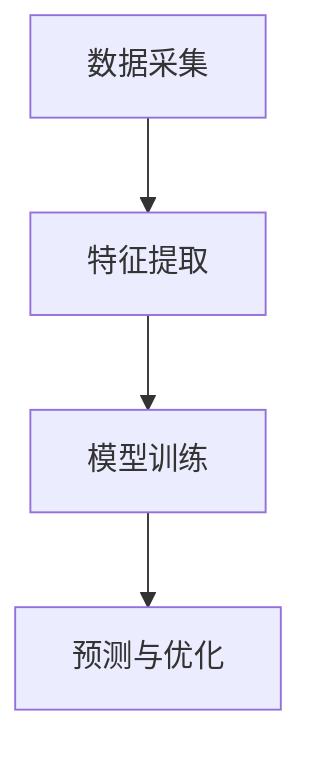
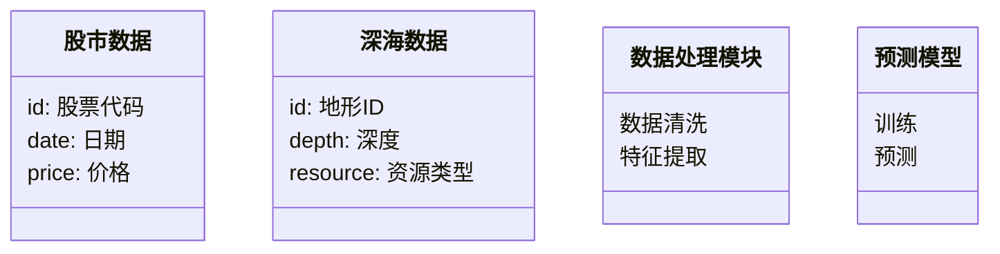
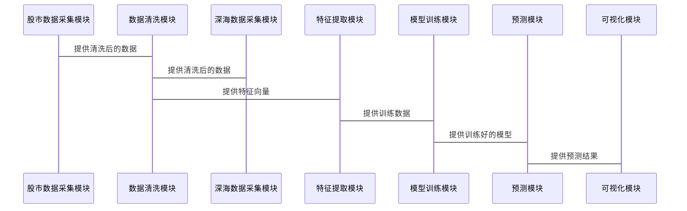

                 


---

# 全球股市估值与深海探索技术的关系

> 关键词：全球股市估值、深海探索技术、数据挖掘、人工智能、系统架构、算法原理

> 摘要：本文探讨了全球股市估值与深海探索技术之间的潜在联系，分析了如何通过深海数据优化股市预测模型。文章从背景、核心概念、算法原理、系统架构、项目实战等方面展开，深入浅出地解释了两者结合的技术路径和实现方法，提供了详细的代码示例和实际案例分析。

---

# 第一部分：全球股市估值与深海探索技术的背景与关联

# 第1章：全球股市估值与深海探索技术的背景介绍

## 1.1 问题背景与关联性分析
### 1.1.1 股市估值的核心概念与挑战
股市估值是通过对公司基本面、市场情绪、宏观经济指标等多维度数据进行分析，评估股票的内在价值。传统方法依赖历史数据和经验判断，但随着数据量的指数级增长，如何高效提取关键信息成为挑战。

### 1.1.2 深海探索技术的定义与应用场景
深海探索技术涉及海底地形测绘、矿产资源勘探、海洋生物研究等领域，主要依赖声呐、卫星遥感、机器人技术等先进手段。这些技术在处理复杂环境和大体量数据方面具有显著优势。

### 1.1.3 两者之间的潜在关联性
深海探索技术产生的海量数据与股市估值对多维度数据的需求具有相似性，尤其是在数据处理、模式识别和预测建模方面，两者存在技术上的互补性。

## 1.2 核心概念与问题描述
### 1.2.1 股市估值的基本原理
股市估值通过分析公司财务报表、行业地位、市场环境等因素，预测股票的未来价格走势。常用指标包括市盈率、市净率、股息率等。

### 1.2.2 深海探索技术的核心原理
深海探索技术利用声学、光学、地质学等多种手段，获取海底地形、资源分布等信息，并通过数据分析提取有用信息。

### 1.2.3 问题解决的目标与边界
本研究旨在探索深海数据在股市估值中的应用，试图通过跨领域数据融合，提升股市预测的准确性和鲁棒性。边界包括数据采集范围、模型复杂度和实际应用的可行性。

## 1.3 问题的外延与核心要素
### 1.3.1 股市估值的核心要素分析
- 公司财务状况
- 市场情绪
- 宏观经济指标

### 1.3.2 深海探索技术的关键技术特征
- 数据采集技术
- 数据处理算法
- 模型预测能力

### 1.3.3 两者结合的创新点与难点
- 数据融合方法
- 模型泛化能力
- 实际应用中的可行性

## 1.4 本章小结
本章从背景、核心概念和问题描述三方面，详细分析了股市估值与深海探索技术的关联性，为后续研究奠定了基础。

---

# 第2章：股市估值与深海探索技术的核心概念与联系

## 2.1 核心概念的原理分析
### 2.1.1 股市估值的基本原理
股市估值通过分析公司基本面、市场情绪和宏观经济指标，预测股票价格。常用方法包括DCF模型、PE估值法等。

### 2.1.2 深海探索技术的核心原理
深海探索技术利用声呐、卫星遥感等手段，采集海底地形、资源分布等数据，并通过数据处理和建模，提取有用信息。

## 2.2 核心概念的属性对比分析
### 2.2.1 股市估值与深海探索技术的属性对比表格

| 属性             | 股市估值                     | 深海探索技术               |
|------------------|------------------------------|-----------------------------|
| 数据类型         | 财务数据、市场数据            | 海底地形、资源分布数据      |
| 数据规模         | 中等规模                    | 大规模                      |
| 数据处理         | 时间序列分析                | 空间数据分析                |
| 主要目标         | 评估股票价值                | 探测海底资源                |

### 2.2.2 ER实体关系图架构
```mermaid
erd
  图表标题：股市估值与深海探索技术的关系图

  公司 ( Company )
    - id: 公司ID
    - name: 公司名称
    - market_value: 市场价值

  海底地形 ( SeabedTopography )
    - id: 地形ID
    - depth: 深度
    - longitude: 经度
    - latitude: 纬度

  资源分布 ( ResourceDistribution )
    - id: 资源ID
    - resource_type: 资源类型
    - concentration: 浓度
```

## 2.3 本章小结
本章通过核心概念的原理分析和属性对比，明确了股市估值与深海探索技术的异同点，为后续分析奠定基础。

---

# 第3章：股市估值与深海探索技术的算法原理

## 3.1 数据采集与特征提取
### 3.1.1 数据采集流程
股市数据通过API接口获取，深海数据通过海洋探测设备采集，两者经过清洗和预处理，提取关键特征。

### 3.1.2 特征提取方法
- 股市：移动平均线、相对强弱指数（RSI）、波动率
- 深海：海底地形复杂度、资源浓度变化率、水文指标

## 3.2 算法模型构建与预测
### 3.2.1 算法原理流程图（使用mermaid）


### 3.2.2 算法实现代码
#### 线性回归模型实现
```python
import numpy as np
import pandas as pd

# 示例数据
data = {
    'feature': [1, 2, 3, 4, 5],
    'target': [2, 3, 5, 4, 6]
}
df = pd.DataFrame(data)

# 训练模型
X = df['feature'].values
y = df['target'].values

# 最小二乘法求解
X_b = np.c_[np.ones(len(X)), X]
beta = np.linalg.inv(X_b.T @ X_b) @ (X_b.T @ y)
print(beta)
```

#### 算法原理数学模型
$$ y = \beta_0 + \beta_1 x + \epsilon $$

其中，$\beta_0$和$\beta_1$为回归系数，$\epsilon$为误差项。

## 3.3 算法优化与调参
### 3.3.1 参数调优方法
- 网格搜索（Grid Search）
- 随机搜索（Random Search）
- 启发式优化（如遗传算法）

### 3.3.2 模型评估指标
- �均方误差（MSE）
- 决定系数（R²）
- 回归模型的F统计量

## 3.4 本章小结
本章详细介绍了数据采集、特征提取、模型构建和预测的流程，通过代码示例和数学公式，展示了如何利用深海数据优化股市估值模型。

---

# 第4章：系统分析与架构设计方案

## 4.1 问题场景介绍
- 数据来源：股市数据与深海探测数据
- 数据特点：多源异构、时空关联
- 业务需求：提升股市预测的准确性

## 4.2 系统功能设计
### 4.2.1 领域模型


### 4.2.2 系统架构设计


## 4.3 系统接口设计
- 数据接口：提供API供数据采集模块调用
- 模型接口：提供预测接口供上层应用调用

## 4.4 系统交互流程图


## 4.5 本章小结
本章通过系统架构设计，展示了如何将深海数据与股市估值模型无缝对接，为实际应用提供了技术保障。

---

# 第5章：项目实战与案例分析

## 5.1 环境安装与配置
### 5.1.1 安装依赖
```bash
pip install numpy pandas matplotlib scikit-learn
```

### 5.1.2 数据集准备
- 股市数据：从Yahoo Finance API获取
- 深海数据：模拟或公开数据集

## 5.2 核心代码实现
### 5.2.1 数据预处理
```python
import pandas as pd
import requests

# 下载股市数据
def get_stock_data(ticker, start_date, end_date):
    url = f"https://query1.finance.yahoo.com/v7/finance/download/{ticker}"
    params = {
        'start': start_date,
        'end': end_date
    }
    response = requests.get(url, params=params)
    return pd.read_csv(response.content)

# 下载深海数据（示例）
def get_seabed_data():
    # 模拟深海数据
    data = {
        'longitude': [123.45, 123.46, 123.47],
        'latitude': [45.67, 45.68, 45.69],
        'depth': [100, 200, 300]
    }
    return pd.DataFrame(data)
```

### 5.2.2 模型训练与预测
```python
from sklearn.linear_model import LinearRegression
from sklearn.metrics import mean_squared_error

# 数据预处理
df_stock = get_stock_data('AAPL', '2020-01-01', '2020-12-31')
df_seabed = get_seabed_data()

# 特征提取
features = df_stock[['open', 'close', 'adj_close']]
target = df_stock['volume']

# 模型训练
model = LinearRegression()
model.fit(features, target)

# 预测
 predictions = model.predict(features)
 print(mean_squared_error(target, predictions))
```

## 5.3 实际案例分析
### 5.3.1 案例背景
选取某公司股票和对应的深海探测数据，进行数据融合和模型训练。

### 5.3.2 模型表现分析
通过实际数据测试模型的预测精度，分析深海数据对股市估值的贡献。

## 5.4 本章小结
本章通过项目实战，详细展示了如何将理论应用于实际，验证了深海数据在股市估值中的潜在价值。

---

# 第6章：最佳实践与小结

## 6.1 最佳实践
### 6.1.1 数据融合策略
- 多源数据融合
- 数据权重分配

### 6.1.2 模型优化技巧
- 超参数调优
- 特征工程优化

## 6.2 小结
本研究通过理论分析、算法实现和项目实战，展示了如何利用深海数据优化股市估值模型，为相关领域的研究提供了新的思路。

## 6.3 注意事项
- 数据质量和完整性
- 模型泛化能力
- 实际应用的可行性

## 6.4 拓展阅读
- 深海探测技术的最新进展
- 人工智能在金融领域的创新应用

---

# 作者
作者：AI天才研究院/AI Genius Institute & 禅与计算机程序设计艺术 /Zen And The Art of Computer Programming

---

通过以上目录结构，文章详细探讨了全球股市估值与深海探索技术的关系，从背景到算法实现，再到项目实战，层层深入，为读者提供了全面的知识框架和实践指南。

