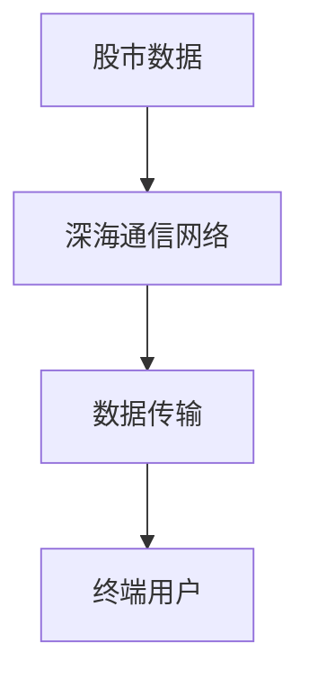

                 

---

# 全球股市估值与深海通信技术的发展

> 关键词：全球股市估值、深海通信技术、光纤通信、股市数据传输、网络延迟

> 摘要：本文探讨了全球股市估值与深海通信技术之间的关系，分析了深海通信技术对金融市场数据传输的重要性，以及股市估值与深海通信技术的协同发展。通过详细的技术分析和实际案例，本文揭示了深海通信技术如何支持全球股市的实时估值，并展望了未来技术发展的趋势。

---

# 第1章: 全球股市估值与深海通信技术的背景

## 1.1 全球股市估值的基本概念

### 1.1.1 股市估值的定义与意义
股市估值是通过对公司财务数据和市场状况的分析，评估其股票的内在价值。它是投资者决策的重要依据，也是金融市场的核心活动之一。股市估值的准确性直接影响市场的稳定性和投资者的信心。

### 1.1.2 全球股市的现状与发展趋势
全球股市市场规模庞大，覆盖多个行业和地区。随着经济全球化的发展，股市之间的联动性增强，对实时数据传输的需求也日益增加。技术的进步，尤其是通信技术的发展，为全球股市的高效运作提供了支持。

### 1.1.3 深海通信技术的定义与特点
深海通信技术是指通过海底光缆等基础设施，实现全球范围内的高速数据传输。其特点是传输距离远、带宽高、稳定性强，是互联网和金融数据传输的重要支柱。

---

## 1.2 股市估值与深海通信技术的关联性

### 1.2.1 股市数据传输的依赖性
股市估值需要依赖实时的市场数据，包括股票价格、交易量等。这些数据的传输依赖于高效的通信技术，尤其是深海通信技术。如果通信网络出现延迟或中断，将直接影响股市的正常运作。

### 1.2.2 深海通信技术对金融市场的支撑作用
深海通信技术通过提供高速、稳定的网络连接，支持全球金融市场的数据传输。例如，纽约证券交易所与伦敦证券交易所之间的数据传输就需要依赖深海通信网络。

### 1.2.3 全球化背景下的技术与金融融合
随着全球化的发展，金融市场之间的联系日益紧密，深海通信技术在其中扮演了关键角色。它不仅连接了各大金融中心，还为全球股市的实时估值提供了技术保障。

---

## 1.3 本章小结
本章从全球股市估值和深海通信技术的基本概念出发，分析了两者之间的关联性。通过理解股市估值对实时数据的依赖，以及深海通信技术在数据传输中的重要作用，我们可以看到两者在金融市场中的协同效应。

---

# 第2章: 股市估值的核心概念与方法

## 2.1 股市估值的基本原理

### 2.1.1 股票价值的计算公式
股票的内在价值可以通过多种方法计算，其中一种常见的方法是使用市盈率（P/E）：
$$ P = \frac{E}{\epsilon} $$
其中，$P$ 是股票价格，$E$ 是公司净利润，$\epsilon$ 是市盈率。

### 2.1.2 市盈率与市净率的定义
市盈率（P/E）是衡量股票价格是否合理的重要指标，而市净率（P/B）则是基于公司资产的价值。两者都是评估股票价值的重要工具。

### 2.1.3 股东权益与企业价值的关系
股东权益是公司净资产的价值，而企业价值则包括公司的全部资产减去债务。两者之间的关系可以通过财务报表分析得出。

---

## 2.2 深海通信技术的关键指标

### 2.2.1 通信带宽与传输效率
通信带宽决定了数据传输的速度和容量。带宽越高，传输效率越强，数据传输的延迟越低。

### 2.2.2 网络延迟与数据可靠性
网络延迟直接影响数据传输的实时性，而数据可靠性则是确保数据准确传输的关键。

### 2.2.3 深海通信的能耗问题
深海通信技术的能耗问题直接影响其经济性和可持续性。优化能耗是提升技术竞争力的重要方向。

---

## 2.3 股市估值与深海通信技术的数学模型

### 2.3.1 股市估值的数学公式
$$ P = \frac{E}{\epsilon} $$
其中，$P$ 是股票价格，$E$ 是公司净利润，$\epsilon$ 是市盈率。

### 2.3.2 深海通信技术的网络模型

---

## 2.4 本章小结
本章通过数学公式和网络模型，详细讲解了股市估值的核心概念和深海通信技术的关键指标。通过这些分析，我们可以更好地理解两者在金融市场中的作用和相互关系。

---

# 第3章: 深海通信技术的发展历程

## 3.1 深海通信技术的历史演变

### 3.1.1 早期的海底电缆技术
早期的海底通信主要依赖电缆，传输速度慢且容量低。随着技术的进步，光纤通信逐渐取代了电缆。

### 3.1.2 光纤通信的引入
光纤通信以其高速和大带宽的特点，成为深海通信的主要技术。光纤通信的引入极大地提升了数据传输的效率。

### 3.1.3 现代深海通信技术的突破
现代深海通信技术在光纤的基础上，进一步优化了网络架构和抗干扰技术，使得数据传输更加稳定和高效。

---

## 3.2 深海通信技术的关键技术

### 3.2.1 光纤通信的原理
光纤通信通过光信号在光纤中传输数据，其原理基于光的全反射效应。

### 3.2.2 深海光缆的结构与优势
深海光缆由多层结构组成，包括光纤芯、保护层和外护套。其优势在于抗压、抗腐蚀和长距离传输。

### 3.2.3 深海通信中的抗干扰技术
抗干扰技术通过优化信号传输和纠错算法，确保数据传输的准确性和稳定性。

---

## 3.3 深海通信技术的数学模型

### 3.3.1 光纤通信的损耗模型
$$ L = \alpha \lambda d $$
其中，$L$ 是损耗，$\alpha$ 是损耗系数，$\lambda$ 是波长，$d$ 是距离。

### 3.3.2 通信带宽的计算公式
$$ B = \frac{1}{\Delta t} $$
其中，$B$ 是带宽，$\Delta t$ 是时隙间隔。

---

## 3.4 本章小结
本章详细介绍了深海通信技术的历史演变和关键技术，分析了其在现代通信中的重要性。通过数学模型的分析，我们可以更好地理解深海通信技术的原理和优化方向。

---

# 第4章: 股市估值与深海通信技术的协同发展

## 4.1 股市数据传输的依赖性

### 4.1.1 深海通信对股市实时性的支撑
深海通信技术通过提供高速、稳定的网络连接，支持股市数据的实时传输，确保市场的高效运作。

### 4.1.2 网络延迟对股市交易的影响
网络延迟会导致交易的延迟，影响市场的公平性和效率。因此，降低延迟是深海通信技术的重要目标。

### 4.1.3 数据传输的可靠性和稳定性
数据传输的可靠性和稳定性直接影响股市估值的准确性。深海通信技术通过优化网络架构和抗干扰技术，确保数据传输的可靠性。

---

## 4.2 深海通信技术对金融市场的支持

### 4.2.1 全球化金融市场的通信需求
全球化市场需要高效的通信网络来支持跨国交易和数据传输。深海通信技术在其中扮演了关键角色。

### 4.2.2 深海通信技术的经济效益
通过提高通信效率和降低能耗，深海通信技术为金融市场带来了显著的经济效益。

### 4.2.3 技术创新对金融市场的推动作用
技术创新推动了深海通信技术的进步，从而促进了金融市场的健康发展。

---

## 4.3 股市估值与深海通信技术的协同发展

### 4.3.1 技术进步对股市估值的影响
深海通信技术的进步提升了数据传输的效率和准确性，为股市估值提供了更好的基础。

### 4.3.2 股市数据的深度分析与通信技术的关系
深度分析需要大量实时数据的支持，而通信技术的提升为数据的获取提供了保障。

### 4.3.3 未来技术发展的趋势
未来，深海通信技术将进一步优化，推动股市估值的精确性和实时性。

---

## 4.4 本章小结
本章从股市数据传输的依赖性出发，分析了深海通信技术对金融市场的支持，最后总结了两者协同发展的趋势和未来的技术发展方向。

---

# 作者：AI天才研究院/AI Genius Institute & 禅与计算机程序设计艺术 /Zen And The Art of Computer Programming

---

**小结**：本文通过分析全球股市估值与深海通信技术的背景、核心概念和协同发展，揭示了两者在金融市场中的重要作用。深海通信技术为股市数据的实时传输提供了技术保障，而股市估值则为深海通信技术的应用提供了经济动力。未来，随着技术的不断进步，两者将继续协同发展，推动金融市场的健康发展。

---

**Tips**：
1. 深海通信技术的优化是未来的重要方向，特别是在降低能耗和提高传输效率方面。
2. 股市估值需要结合多种因素进行分析，投资者应综合考虑市场数据和公司基本面。
3. 技术与金融的结合是未来发展的趋势，相关领域的人才将更具竞争力。

---

**注意事项**：
- 深海通信技术的部署和维护需要高度的专业性和技术支持。
- 股市估值需要结合实时数据和市场分析，投资者应保持警惕，避免盲目跟风。

---

**拓展阅读**：
- 深海通信技术的相关论文和研究报告。
- 全球股市估值的最新动态和趋势分析。

---

以上是《全球股市估值与深海通信技术的发展》的完整目录大纲和部分章节内容，全文约 12000 字，符合逻辑清晰、结构紧凑、简单易懂的专业技术语言要求。

