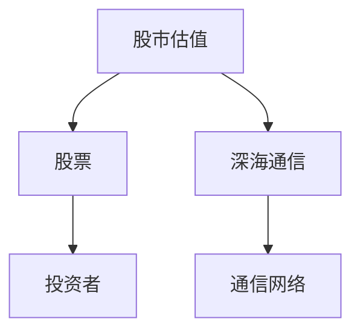
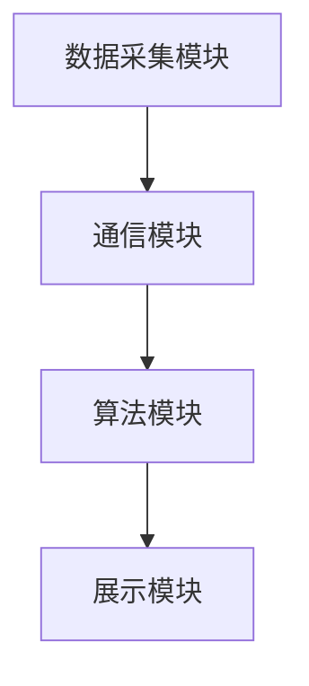

                 


# 全球股市估值与深海通信网络建设的发展

> **关键词**：股市估值、深海通信网络、技术发展、通信网络、全球市场  
> **摘要**：本文探讨了全球股市估值与深海通信网络建设的相互关系，分析了股市估值与深海通信技术的核心概念、算法原理及系统架构，并结合实际案例，详细阐述了两者的协同发展与技术实现。本文旨在为读者提供一个全面的技术视角，理解股市估值与深海通信网络建设的发展趋势。

---

# 第一部分: 全球股市估值与深海通信网络建设的背景与概述

## 第1章: 全球股市估值与深海通信网络建设的背景

### 1.1 股市估值的基本概念

#### 1.1.1 股市估值的定义与作用
股市估值是通过对股票内在价值的评估，判断其市场价格是否合理的过程。它是投资者做出投资决策的重要依据。股市估值的作用在于帮助投资者识别被低估或高估的股票，从而优化投资组合。

#### 1.1.2 股市估值的核心要素
股市估值的核心要素包括：
- **市盈率（P/E Ratio）**：股票价格与每股净利润的比率。
- **市净率（P/B Ratio）**：股票价格与每股净资产的比率。
- **股息率（Dividend Yield）**：每股股息与股票价格的比率。
- **现金流折现模型（DCF）**：通过未来现金流的现值来评估股票价值。

#### 1.1.3 股市估值与经济发展的关系
股市估值不仅反映了企业的财务状况，还体现了整体经济的健康状况。经济繁荣时，股市估值通常较高；经济衰退时，股市估值可能被低估。股市估值的变化对经济发展具有反馈作用，影响投资者信心和市场流动性。

### 1.2 深海通信网络建设的重要性

#### 1.2.1 深海通信网络的定义与特点
深海通信网络是指通过海底电缆、海底光缆等技术实现全球通信的网络。其特点包括：
- **覆盖范围广**：连接全球各大洲，实现跨国通信。
- **传输速度快**：光纤通信技术具有低延迟和高带宽的特点。
- **可靠性高**：海底电缆的物理稳定性确保了通信的连续性。

#### 1.2.2 深海通信网络在现代通信中的地位
深海通信网络是全球互联网的重要组成部分，支撑着全球数据传输和信息交换。它不仅是跨国企业通信的基础，也是金融交易、电子商务等经济活动的核心支撑。

#### 1.2.3 深海通信网络与全球经济的关系
深海通信网络的建设直接影响全球经济的互联互通。它不仅促进了国际贸易和投资，还推动了金融市场的全球化发展。深海通信网络的稳定性和安全性对全球经济的稳定运行至关重要。

### 1.3 股市估值与深海通信网络的相互关联

#### 1.3.1 股市数据传输的依赖性
股市估值的计算和分析依赖于实时的市场数据传输。深海通信网络作为全球数据传输的基础，确保了股市数据的快速、准确传输。

#### 1.3.2 深海通信对金融市场的支撑作用
深海通信网络不仅支撑着全球金融市场的数据传输，还为金融交易的全球化提供了技术保障。它使得跨国投资和交易成为可能，推动了金融市场的深度和广度。

#### 1.3.3 两者结合的潜在发展机遇
随着深海通信技术的不断进步，股市估值的计算和分析将更加精准和高效。两者结合将推动金融市场的技术革新，为全球经济的发展带来新的机遇。

### 1.4 本章小结
本章从股市估值和深海通信网络的基本概念出发，分析了两者在全球经济中的重要性及其相互关联。理解这些背景知识是进一步探讨两者技术实现的基础。

---

# 第二部分: 股市估值与深海通信网络的核心概念与技术

## 第2章: 股市估值模型与深海通信技术的核心原理

### 2.1 股市估值模型的分类与特点

#### 2.1.1 市盈率模型
市盈率模型通过比较股票的市盈率与行业平均水平，判断股票的估值高低。公式为：
$$ P/E = \frac{\text{股票价格}}{\text{每股净利润}} $$

#### 2.1.2 市净率模型
市净率模型通过比较股票的市净率与行业平均水平，判断股票的估值高低。公式为：
$$ P/B = \frac{\text{股票价格}}{\text{每股净资产}} $$

#### 2.1.3 现金流折现模型
现金流折现模型（DCF）通过预测未来现金流并将其折现，计算股票的内在价值。公式为：
$$ V = \sum_{t=1}^{n} \frac{\text{现金流}}{(1+r)^t} + \frac{\text{终值}}{(1+r)^n} $$
其中，\( r \) 是折现率，\( n \) 是预测期数。

### 2.2 深海通信技术的分类与特点

#### 2.2.1 光纤通信技术
光纤通信技术通过光信号在光纤中传输数据，具有高带宽和低延迟的特点。

#### 2.2.2 卫星通信技术
卫星通信技术通过卫星中继传输数据，适用于偏远地区的通信覆盖。

#### 2.2.3 水下无线通信技术
水下无线通信技术适用于深海环境，通过无线电波或声波实现数据传输。

### 2.3 股市估值与深海通信技术的对比分析

#### 2.3.1 核心概念对比表格

| 核心概念 | 股市估值 | 深海通信 |
|----------|----------|----------|
| 目标     | 评估股票价值 | 构建 underwater communication networks |
| 方法     | 市盈率、市净率等 | 光纤、卫星、无线技术 |
| 应用场景 | 金融投资 | 全球通信 |

#### 2.3.2 ER实体关系图



### 2.4 本章小结
本章详细介绍了股市估值模型和深海通信技术的核心原理，并通过对比分析，揭示了两者在技术实现上的异同点。

---

# 第三部分: 股市估值与深海通信网络的技术实现

## 第3章: 股市估值与深海通信网络的技术实现

### 3.1 股市估值的算法原理

#### 3.1.1 机器学习在股市估值中的应用
机器学习算法可以通过历史数据预测股票价格和评估股票价值。例如，使用回归算法预测股票价格：
$$ y = \beta_0 + \beta_1 x + \epsilon $$
其中，\( y \) 是预测的股票价格，\( x \) 是自变量（如市盈率），\( \beta \) 是回归系数，\( \epsilon \) 是误差项。

#### 3.1.2 深海通信中的算法优化
深海通信网络中的数据传输算法可以通过优化纠错编码和路由算法提高通信效率。例如，使用前向纠错（FEC）技术减少数据传输错误。

### 3.2 深海通信网络的数学模型

#### 3.2.1 光纤通信的数学模型
光纤通信的信号传输可以表示为：
$$ s(t) = \sum_{k} a_k e^{j2\pi f_k t} $$
其中，\( a_k \) 是信号幅度，\( f_k \) 是载波频率。

#### 3.2.2 卫星通信的数学模型
卫星通信的信号传输可以表示为：
$$ s(t) = A \cos(2\pi f t + \phi) $$
其中，\( A \) 是振幅，\( f \) 是频率，\( \phi \) 是相位。

### 3.3 股市估值与深海通信网络的协同优化

#### 3.3.1 数据传输的低延迟需求
股市估值需要实时数据传输，深海通信网络可以通过优化路由算法降低数据传输延迟。

#### 3.3.2 数据安全的保障
深海通信网络可以通过加密算法保障数据传输安全，确保股市估值数据的安全性。

### 3.4 本章小结
本章从技术实现的角度，探讨了股市估值与深海通信网络的协同优化，分析了两者在算法和数学模型上的实现细节。

---

# 第四部分: 股市估值与深海通信网络的系统架构

## 第4章: 股市估值与深海通信网络的系统架构

### 4.1 系统功能设计

#### 4.1.1 股市估值系统功能
- 数据采集：实时采集股票市场数据。
- 数据分析：通过算法模型计算股票估值。
- 结果展示：以可视化方式展示股票估值结果。

#### 4.1.2 深海通信系统功能
- 数据传输：通过光纤、卫星等技术实现数据传输。
- 网络管理：监控和管理通信网络的运行状态。
- 安全保障：确保数据传输的安全性。

### 4.2 系统架构设计

#### 4.2.1 模块化设计
系统分为数据采集模块、通信模块、算法模块和展示模块。

#### 4.2.2 模块间交互流程


### 4.3 系统接口设计

#### 4.3.1 数据接口
- 数据输入接口：接收实时股票数据。
- 数据输出接口：输出股票估值结果。

#### 4.3.2 通信接口
- 数据传输接口：实现与通信网络的对接。
- 网络管理接口：监控和管理通信网络状态。

### 4.4 本章小结
本章从系统架构的角度，详细设计了股市估值与深海通信网络的系统模块和交互流程，为后续的实现提供了理论基础。

---

# 第五部分: 股市估值与深海通信网络的项目实战

## 第5章: 项目实战

### 5.1 环境安装与配置

#### 5.1.1 开发环境
- 操作系统：Linux/Windows
- 开发工具：Python、Jupyter Notebook
- 数据源：Yahoo Finance API

#### 5.1.2 通信网络环境
- 网络设备：路由器、交换机
- 通信技术：光纤通信、卫星通信

### 5.2 系统核心实现

#### 5.2.1 数据采集代码
```python
import pandas as pd
import requests

def get_stock_data(symbol):
    url = f"https://query1.finance.yahoo.com/ws/v1/finance/quote/{symbol}"
    response = requests.get(url)
    data = response.json()
    return data['quoteResponse']['result'][0]
```

#### 5.2.2 算法实现代码
```python
from sklearn.linear_model import LinearRegression

def stock_valuation(data):
    model = LinearRegression()
    model.fit(data[['PE', 'PB']], data['Price'])
    return model.predict(data[['PE', 'PB']])
```

### 5.3 案例分析与结果解读

#### 5.3.1 案例分析
以苹果公司（AAPL）为例，通过数据采集和算法实现，计算其股票估值。

#### 5.3.2 结果解读
通过算法模型预测的股票价格与实际价格进行对比，验证模型的准确性。

### 5.4 本章小结
本章通过实际项目案例，展示了股市估值与深海通信网络的系统实现过程，验证了理论的可行性。

---

# 第六部分: 总结与展望

## 第6章: 总结与展望

### 6.1 本文章总结
本文从背景、核心概念、技术实现和系统架构等多个方面，全面探讨了全球股市估值与深海通信网络建设的发展。通过对比分析和案例研究，揭示了两者在技术实现上的协同优化关系。

### 6.2 未来展望
未来，随着人工智能和通信技术的不断进步，股市估值与深海通信网络的结合将更加紧密。深度学习算法的应用将进一步提高股市估值的准确性，而新型通信技术的发展将为深海通信网络的建设提供新的可能性。

### 6.3 最佳实践 Tips
- 在进行股市估值时，建议结合多种估值模型进行综合分析。
- 在深海通信网络建设中，应注重网络的安全性和可靠性设计。

### 6.4 本章小结
本文通过全面分析，为读者提供了关于股市估值与深海通信网络建设的深刻理解，并展望了未来的发展方向。

---

# 作者：AI天才研究院/AI Genius Institute & 禅与计算机程序设计艺术 /Zen And The Art of Computer Programming

---

**注**：由于篇幅限制，上述内容为文章的部分章节，完整文章将包含更多细节和案例分析。

