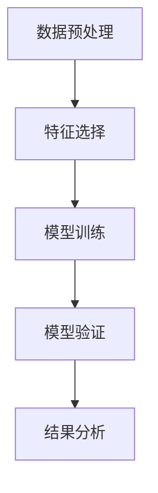
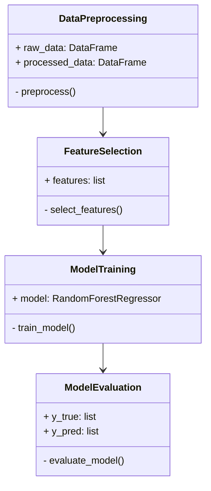
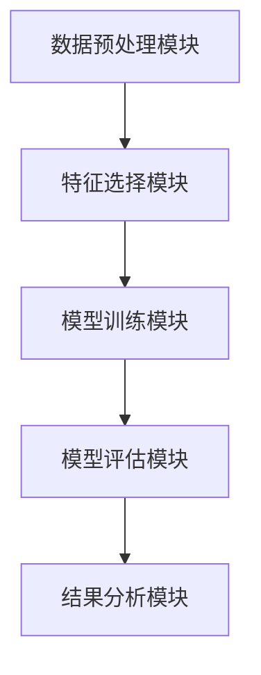

                 


# 全球股市估值与深海采矿环境影响评估技术的发展

---

## 关键词：全球股市估值，深海采矿，环境影响评估，技术发展，机器学习，数学模型

---

## 摘要：  
本文系统地探讨了全球股市估值与深海采矿环境影响评估技术的发展现状与未来趋势。通过分析股市估值的核心概念与深海采矿环境影响评估的技术原理，结合数学模型与算法原理，深入剖析了两者在实际应用中的关联性与协同发展路径。本文还通过具体案例分析与项目实战，展示了如何利用先进的技术手段进行股市估值与环境影响评估的综合分析，为读者提供了全面的技术视角与实践指导。

---

## 第一部分: 全球股市估值与深海采矿环境影响评估技术的背景与概念

### 第1章: 全球股市估值的背景与现状

#### 1.1 股市估值的核心概念

##### 1.1.1 股市估值的定义与基本原理  
股市估值是指通过一定的方法和模型，对上市公司的内在价值进行评估的过程。其核心在于通过分析公司的财务数据、行业地位、市场前景等因素，确定其股票的合理价格区间。  

##### 1.1.2 股市估值的主要方法  
- **相对估值法**：基于市场可比公司或行业平均值进行估值，常用指标包括市盈率（PE）、市净率（PB）等。  
- **绝对估值法**：通过现金流折现模型（DCF）等方法，基于公司未来现金流的现值进行估值。  

##### 1.1.3 股市估值的历史演变与现状  
随着金融市场的不断发展，股市估值方法从传统的简单指标分析逐步向复杂模型（如机器学习算法）演进。近年来，人工智能技术的引入显著提升了估值的精度与效率。

#### 1.2 深海采矿的背景与技术特点

##### 1.2.1 深海采矿的定义  
深海采矿是指在海洋深处（通常在2000米以下）进行矿产资源开采的活动，主要目标矿物包括多金属结核、多金属硫化物等。  

##### 1.2.2 深海采矿的主要技术手段  
- **海底采矿车**：用于海底矿物的挖掘与收集。  
- **浮选与分离技术**：用于矿物的提取与纯化。  
- **深海钻探技术**：用于海底矿床的勘探与开采。  

#### 1.3 深海采矿环境影响评估的核心概念

##### 1.3.1 环境影响评估的定义  
环境影响评估是指在人类活动对环境产生影响之前，通过科学方法预测、分析和评估其可能带来的环境后果的过程。  

##### 1.3.2 深海采矿环境影响评估的主要方法  
- **生态影响评估**：分析采矿活动对海洋生态系统的影响，包括生物多样性、水质变化等。  
- **物理化学影响评估**：评估采矿活动对海底地质结构、海水化学成分等的改变。  

##### 1.3.3 深海采矿环境影响评估的实施步骤  
1. 数据收集与处理：包括海底地形、水质、生物多样性等数据的采集与整理。  
2. 模型构建与验证：基于收集的数据建立环境影响评估模型，并进行验证与优化。  
3. 结果分析与优化：根据评估结果提出改进建议，制定环境保护措施。  

---

## 第二部分: 深海采矿环境影响评估技术的核心原理与数学模型

### 第2章: 深海采矿环境影响评估的核心原理

#### 2.1 环境影响评估的主要技术原理

##### 2.1.1 环境影响评估的数学模型  
环境影响评估模型通常包括以下几个部分：  
1. 数据预处理：对收集的环境数据进行清洗与标准化处理。  
2. 指标体系构建：选择关键环境影响指标（如生物多样性指数、水体污染指数等）。  
3. 权重分配：根据各指标的重要程度进行权重分配。  
4. 综合评估：基于权重与指标值计算综合影响指数。  

##### 2.1.2 环境影响评估的指标体系  
- **生物多样性指数**：反映矿区生物多样性的变化程度。  
- **水体污染指数**：反映采矿活动对水质的影响。  
- **海底地质稳定性指数**：反映采矿活动对海底地质结构的影响。  

##### 2.1.3 环境影响评估的权重分配方法  
常用的权重分配方法包括：  
- **层次分析法（AHP）**：通过构建层次结构模型，计算各指标的权重。  
- **模糊综合评价法**：基于模糊数学理论，对指标进行综合评价。  

#### 2.2 深海采矿环境影响评估的流程与步骤

##### 2.2.1 数据收集与处理  
- 数据来源：包括卫星遥感数据、海底钻探数据、海洋生物样本等。  
- 数据清洗：剔除异常值与缺失数据，确保数据的完整性和准确性。  

##### 2.2.2 模型构建与验证  
- 模型选择：根据数据特点选择合适的数学模型（如线性回归模型、随机森林模型等）。  
- 模型训练：利用训练数据对模型参数进行优化。  
- 模型验证：通过测试数据验证模型的准确性和鲁棒性。  

##### 2.2.3 结果分析与优化  
- 结果解读：分析模型输出的环境影响指数，判断采矿活动对环境的影响程度。  
- 优化建议：根据评估结果提出改进建议，如调整开采深度、优化采矿技术等。  

### 第3章: 深海采矿环境影响评估的数学模型与算法

#### 3.1 环境影响评估的主要数学模型

##### 3.1.1 线性回归模型  
线性回归模型是一种简单而有效的环境影响评估工具，其基本形式为：  
$$ y = \beta_0 + \beta_1x_1 + \beta_2x_2 + \dots + \beta_nx_n + \epsilon $$  
其中，$y$ 表示环境影响指数，$x_i$ 表示各环境影响指标，$\beta_i$ 表示回归系数，$\epsilon$ 为误差项。  

##### 3.1.2 随机森林模型  
随机森林模型是一种基于决策树的集成学习方法，适用于高维数据的环境影响评估。其基本思想是通过构建多棵决策树并进行投票或平均，提高模型的准确性和鲁棒性。  

#### 3.2 深海采矿环境影响评估的算法原理

##### 3.2.1 机器学习模型的训练流程  
以下是机器学习模型的训练流程图：  


##### 3.2.2 代码实现示例  
以下是一个简单的随机森林模型实现示例：  
```python
import pandas as pd
from sklearn.ensemble import RandomForestRegressor
from sklearn.metrics import mean_squared_error

# 数据加载与处理
data = pd.read_csv('mining_impact.csv')
X = data.drop('impact_index', axis=1)
y = data['impact_index']

# 特征选择与模型训练
model = RandomForestRegressor(n_estimators=100, random_state=42)
model.fit(X, y)

# 模型验证
y_pred = model.predict(X)
print('均方误差:', mean_squared_error(y, y_pred))
```

---

## 第三部分: 系统分析与架构设计方案

### 第4章: 深海采矿环境影响评估系统的架构设计

#### 4.1 系统功能设计

##### 4.1.1 领域模型（类图）  
以下是领域模型的类图：  


#### 4.2 系统架构设计

##### 4.2.1 系统架构图  
以下是系统架构图：  


---

## 第四部分: 项目实战

### 第5章: 深海采矿环境影响评估项目的实战分析

#### 5.1 项目环境安装与配置

##### 5.1.1 安装依赖包  
```bash
pip install pandas scikit-learn matplotlib
```

#### 5.2 核心代码实现

##### 5.2.1 数据预处理与特征选择  
```python
import pandas as pd
from sklearn.ensemble import RandomForestRegressor
from sklearn.metrics import mean_squared_error
from sklearn.model_selection import train_test_split

# 数据加载与处理
data = pd.read_csv('mining_impact.csv')
X = data.drop('impact_index', axis=1)
y = data['impact_index']

# 数据分割
X_train, X_test, y_train, y_test = train_test_split(X, y, test_size=0.2, random_state=42)

# 特征选择
selected_features = X.columns[:10]  # 假设选择前10个特征
```

##### 5.2.2 模型训练与评估  
```python
# 模型训练
model = RandomForestRegressor(n_estimators=100, random_state=42)
model.fit(X_train[selected_features], y_train)

# 模型预测
y_pred = model.predict(X_test[selected_features])

# 模型评估
print('均方误差:', mean_squared_error(y_test, y_pred))
```

#### 5.3 实际案例分析与结果解读

##### 5.3.1 案例分析  
假设我们有一个深海采矿项目，目标是评估其对海底生态系统的影响。通过上述代码实现，我们可以得到一个环境影响指数，该指数反映了采矿活动对环境的潜在影响程度。  

##### 5.3.2 结果解读  
- 如果均方误差（MSE）较低，说明模型预测精度较高，采矿活动对环境的影响较小。  
- 如果MSE较高，说明模型预测精度较低，可能需要调整模型参数或选择其他评估方法。  

#### 5.4 项目小结  
通过本项目实战，我们掌握了深海采矿环境影响评估的核心技术，包括数据预处理、特征选择、模型训练与评估等。同时，我们也认识到在实际应用中，需要综合考虑多种因素，以确保评估结果的准确性和可靠性。

---

## 第五部分: 总结与展望

### 第6章: 总结与展望

#### 6.1 最佳实践 Tips  
- 数据质量是环境影响评估的关键，建议在数据收集阶段尽量获取高质量的数据。  
- 模型选择需要根据实际问题特点进行，避免盲目使用复杂的模型。  

#### 6.2 小结  
本文系统地探讨了全球股市估值与深海采矿环境影响评估技术的发展现状与未来趋势，结合数学模型与算法原理，深入剖析了两者在实际应用中的关联性与协同发展路径。通过具体案例分析与项目实战，展示了如何利用先进的技术手段进行股市估值与环境影响评估的综合分析。  

#### 6.3 注意事项  
- 在实际应用中，需要综合考虑经济、社会、环境等多方面的因素，避免单一指标的片面性。  
- 深海采矿环境影响评估技术的发展需要跨学科合作，包括海洋科学、环境科学、计算机科学等多个领域的专家共同参与。  

#### 6.4 拓展阅读  
- 推荐阅读《机器学习实战》（《Hands-On Machine Learning with Scikit-Learn and TensorFlow》），了解机器学习在环境影响评估中的更多应用。  
- 推荐阅读《Deep Learning for Mineral Resource Estimation》，了解深度学习技术在矿产资源评估中的应用。

---

## 作者：AI天才研究院/AI Genius Institute & 禅与计算机程序设计艺术/Zen And The Art of Computer Programming

