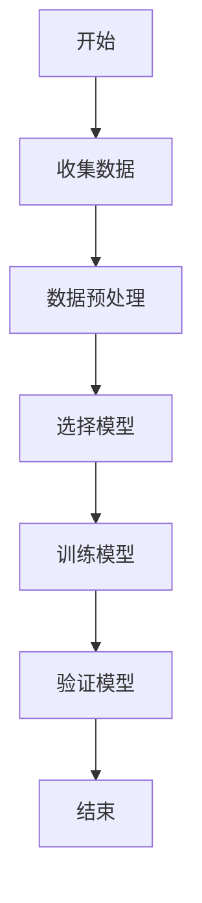
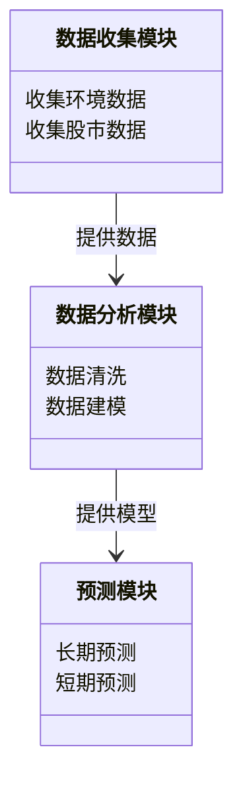

                 


# 全球股市估值与环境风险的长期关联

> 关键词：全球股市估值、环境风险、长期关联、气候变化、环境政策、回归分析

> 摘要：本文系统分析了全球股市估值与环境风险的长期关联，从环境风险的核心概念、算法原理、系统架构到项目实战，深入探讨了环境风险对股市估值的影响机制，并结合实际案例，展示了如何通过技术手段量化和预测这一关联。

---

## 第一部分：背景与概念

### 第1章：全球股市估值与环境风险的背景介绍

#### 1.1 问题背景
随着全球气候变化加剧，环境问题逐渐成为影响经济和金融市场的重要因素。企业面临的环境风险不仅影响其运营成本，还直接影响其市场估值。环境风险主要包括物理风险（如气候变化导致的自然灾害）、转型风险（如政策变化）和诉讼风险（如环境诉讼）。

#### 1.2 问题描述
本文旨在探讨环境风险如何长期影响全球股市估值。通过分析环境事件、政策变化和市场反应，揭示环境因素与股市估值之间的复杂关系。

#### 1.3 问题解决
引入环境风险评估模型，通过回归分析和时间序列分析，量化环境风险对股市估值的影响。

#### 1.4 边界与外延
仅考虑环境因素对股市估值的影响，不涉及其他经济变量。

#### 1.5 核心要素组成
- 环境因素：气候变化、政策变化
- 企业运营：成本、利润
- 市场反应：股价波动

---

## 第二部分：核心概念与联系

### 第2章：环境风险的核心概念

#### 2.1 环境风险的类型
| 风险类型 | 特征 | 影响方式 |
|----------|------|----------|
| 物理风险 | 自然灾害 | 直接影响企业运营 |
| 转型风险 | 政策变化 | 间接影响企业估值 |

#### 2.2 环境风险与企业估值的关系
环境风险通过影响企业成本、利润和市场声誉，间接影响股市估值。

#### 2.3 ER实体关系图

```mermaid
erDiagram
    class 环境因素 {
        ID
        类型
        影响程度
    }
    class 企业 {
        ID
        名称
        股票代码
    }
    class 市场 {
        ID
        指数代码
        估值
    }
    环境因素 --> 企业 : 影响
    企业 --> 市场 : 影响
```

---

## 第三部分：算法原理讲解

### 第3章：时间序列分析与回归分析

#### 3.1 算法原理
使用回归分析量化环境风险对股市估值的影响，时间序列分析预测长期趋势。

#### 3.2 算法流程图



#### 3.3 算法实现

```python
import pandas as pd
import numpy as np
from sklearn.linear_model import LinearRegression

# 数据加载
data = pd.read_csv('stock_env.csv')

# 特征与目标变量
X = data[['环境风险指数']]
y = data['股价']

# 模型训练
model = LinearRegression()
model.fit(X, y)

# 预测
 predictions = model.predict(X)

# 评价
print('R²:', model.score(X, y))
```

#### 3.4 数学模型

$$ \text{股价} = \beta_0 + \beta_1 \times \text{环境风险指数} + \epsilon $$

---

## 第四部分：系统分析与架构设计

### 第4章：系统架构与功能设计

#### 4.1 问题场景
分析气候变化对某行业股价的影响，设计一个实时监测和预测系统。

#### 4.2 系统功能设计



---

## 第五部分：项目实战

### 第5章：环境风险与股市估值的实战分析

#### 5.1 环境安装
安装Python和相关库。

#### 5.2 数据收集

```python
import requests

# 示例代码：从公开API获取数据
url = "https://api.example.com/stock_env"
data = requests.get(url).json()
```

#### 5.3 模型实现

```python
from sklearn.metrics import mean_squared_error

# 训练模型
model.fit(X_train, y_train)

# 预测与评估
y_pred = model.predict(X_test)
print('MSE:', mean_squared_error(y_test, y_pred))
```

#### 5.4 实际案例分析

#### 5.5 结果解读

---

## 第六部分：最佳实践

### 第6章：总结与建议

#### 6.1 总结
环境风险对股市估值的影响需长期关注，模型需定期更新。

#### 6.2 注意事项
数据质量、模型选择、结果验证。

#### 6.3 拓展阅读
推荐相关书籍和论文。

---

作者：AI天才研究院/AI Genius Institute & 禅与计算机程序设计艺术 /Zen And The Art of Computer Programming

