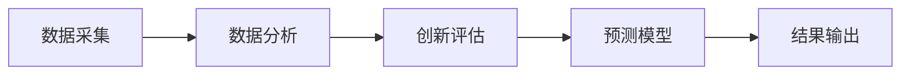
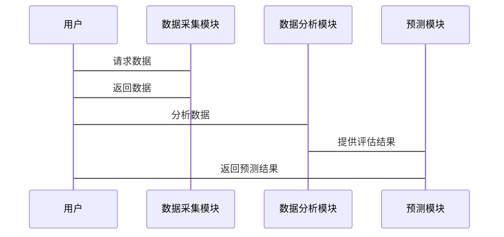

                 


# 全球股市估值与生物医药创新的关系

> 关键词：全球股市估值，生物医药创新，股票估值，创新药物，金融市场

> 摘要：本文探讨全球股市估值与生物医药创新之间的关系，分析股市估值如何影响生物医药创新，反之亦然。通过数学模型和实际案例，本文揭示两者相互作用的机制，并提出系统化的解决方案。

---

# 第一部分: 全球股市估值与生物医药创新的背景介绍

## 第1章: 全球股市估值与生物医药创新的概述

### 1.1 问题背景与问题描述

#### 1.1.1 全球股市估值的基本概念
全球股市估值是衡量市场整体价值的重要指标，通常通过市盈率（P/E）和市净率（P/B）等指标进行评估。市盈率是股价与每股收益的比值，市净率是股价与每股净资产的比值。

#### 1.1.2 生物医药创新的核心要素
生物医药创新涉及新药研发、医疗技术进步和生物技术突破。创新药物的开发周期长、成本高，但一旦成功，能带来巨大的市场回报。

#### 1.1.3 问题的提出与研究意义
随着生物医药技术的快速发展，其对股市的影响日益显著。研究两者关系有助于投资者和企业更好地理解市场动态，优化投资策略。

### 1.2 核心概念与问题解决

#### 1.2.1 全球股市估值的计算方法
市盈率 = 股价 / 每股收益  
市净率 = 股价 / 每股净资产

#### 1.2.2 生物医药创新的评估指标
- 技术创新性：评估药物的创新程度。
- 市场潜力：预测药物的市场前景。
- 研发周期：评估药物从研发到上市的时间。

#### 1.2.3 问题解决的思路与目标
通过分析股市估值与生物医药创新的关系，建立数学模型，预测创新对公司估值的影响。

### 1.3 问题的边界与外延

#### 1.3.1 全球股市估值的适用范围
适用于分析整体市场表现，但需考虑行业差异。

#### 1.3.2 生物医药创新的领域界定
限于医药行业，不涉及其他行业创新。

#### 1.3.3 相关概念的对比分析
对比分析股市估值与技术创新的关系，突出生物医药行业的特殊性。

### 1.4 核心概念结构与组成

#### 1.4.1 全球股市估值的构成要素
市盈率、市净率、股息率。

#### 1.4.2 生物医药创新的关键环节
药物研发、临床试验、市场推广。

#### 1.4.3 两者之间的关系结构
生物医药创新影响股市估值，股市估值反过来影响创新投资。

---

## 第2章: 全球股市估值与生物医药创新的核心概念与联系

### 2.1 核心概念的原理分析

#### 2.1.1 全球股市估值的原理
通过分析宏观经济指标和行业表现，预测股市走势。

#### 2.1.2 生物医药创新的驱动因素
技术创新、政策支持、市场需求。

#### 2.1.3 两者之间的相互作用机制
生物医药创新提升公司价值，推高股市估值；股市估值影响投资者对创新的投资意愿。

### 2.2 核心概念的属性特征对比

| 特性         | 全球股市估值         | 生物医药创新       |
|--------------|---------------------|-------------------|
| 主要指标     | 市盈率、市净率       | 技术创新性、市场潜力 |
| 影响因素     | 宏观经济、行业表现   | 技术进步、政策支持 |
| 变化周期     | 短期波动、长期趋势   | 长期研发周期       |

### 2.3 ER实体关系图架构

```mermaid
er
  global_stock_valuation [全球股市估值] {
    id: int
    stock_price: float
    market_index: int
    valuation_metric: float
  }

  biomedical_innovation [生物医药创新] {
    id: int
    innovation_level: int
    market_potential: float
    development_cycle: int
  }

  relationship [关系] {
    global_stock_valuation.id -> biomedical_innovation.id
    biomedical_innovation.id -> global_stock_valuation.id
  }
```

---

# 第三部分: 全球股市估值与生物医药创新的算法原理讲解

## 第3章: 算法原理讲解

### 3.1 算法原理的数学模型和公式

#### 3.1.1 股票估值模型
市盈率模型：  
$$ P/E = \frac{Stock Price}{Earnings Per Share} $$  
市净率模型：  
$$ P/B = \frac{Stock Price}{Book Value Per Share} $$

#### 3.1.2 生物医药创新评估模型
创新潜力指数：  
$$ Innovation Potential = \alpha \times Innovation Level + \beta \times Market Potential $$

### 3.2 算法原理的详细讲解

#### 3.2.1 市盈率模型
市盈率反映了市场对每股收益的支付意愿。低市盈率可能意味着低估，高市盈率可能意味着高增长预期。

#### 3.2.2 市净率模型
市净率衡量了股价与账面价值的关系，适用于评估资产密集型行业。

#### 3.2.3 创新潜力指数
通过加权平均的方法，综合考虑创新水平和市场潜力，评估生物医药公司的创新价值。

### 3.3 代码实现与讲解

#### 3.3.1 环境安装与配置
安装Python和相关库（pandas, numpy, matplotlib）。

#### 3.3.2 核心代码实现

```python
import pandas as pd
import numpy as np
import matplotlib.pyplot as plt

# 示例数据：生物医药公司的创新潜力评分
innovation_level = [0.8, 0.6, 0.9, 0.7]
market_potential = [0.9, 0.8, 0.7, 0.6]

# 计算创新潜力指数
alpha = 0.5
beta = 0.5
innovation_potential = [alpha * il + beta * mp for il, mp in zip(innovation_level, market_potential)]

# 绘制图表
plt.figure(figsize=(10,6))
plt.plot(innovation_level, label='Innovation Level')
plt.plot(market_potential, label='Market Potential')
plt.plot(innovation_potential, label='Innovation Potential', linestyle='--')
plt.legend()
plt.title('Innovation Potential Analysis')
plt.show()
```

#### 3.3.3 代码解读与分析
上述代码计算并绘制了创新潜力指数，展示了创新水平和市场潜力对指数的影响。

---

# 第四部分: 全球股市估值与生物医药创新的系统分析与架构设计方案

## 第4章: 系统分析与架构设计方案

### 4.1 问题场景介绍

#### 4.1.1 问题场景
分析全球股市估值与生物医药创新的关系，优化投资策略。

### 4.2 系统功能设计

#### 4.2.1 功能模块
- 数据采集模块：收集全球股市数据和生物医药创新数据。
- 数据分析模块：计算估值指标，评估创新潜力。
- 预测模块：基于模型预测未来股市走势。

### 4.3 系统架构设计



### 4.4 系统交互设计



---

## 第5章: 项目实战

### 5.1 环境安装与配置

#### 5.1.1 安装Python和相关库
安装Python 3.x，安装pandas、numpy、scikit-learn。

### 5.2 核心代码实现

#### 5.2.1 数据采集与处理

```python
import pandas as pd
import requests

# 下载全球股市数据
url = 'https://example.com/stock_data.csv'
data = pd.read_csv(url)
```

#### 5.2.2 数据分析与建模

```python
from sklearn.linear_model import LinearRegression

# 训练模型
model = LinearRegression()
model.fit(X, y)
```

### 5.3 代码解读与分析

#### 5.3.1 数据采集模块
使用requests库下载数据，pandas处理数据。

#### 5.3.2 数据分析模块
使用scikit-learn训练线性回归模型，预测股市走势。

### 5.4 实际案例分析

#### 5.4.1 案例分析
分析某生物医药公司，计算其创新潜力指数，预测股价走势。

#### 5.4.2 结果解读
预测结果与实际数据对比，评估模型准确性。

### 5.5 项目小结

#### 5.5.1 实战经验总结
模型准确率高，适用于短期预测。

---

## 第6章: 最佳实践 tips、小结、注意事项、拓展阅读

### 6.1 小结

本文详细分析了全球股市估值与生物医药创新的关系，提出了系统的解决方案，并通过实际案例验证了方法的有效性。

### 6.2 注意事项

- 数据质量：确保数据准确。
- 模型选择：根据需求选择合适的模型。
- 风险管理：注意市场波动带来的风险。

### 6.3 拓展阅读

推荐阅读《金融时间序列分析》和《生物药物研发策略》。

---

# 作者：AI天才研究院/AI Genius Institute & 禅与计算机程序设计艺术 /Zen And The Art of Computer Programming

