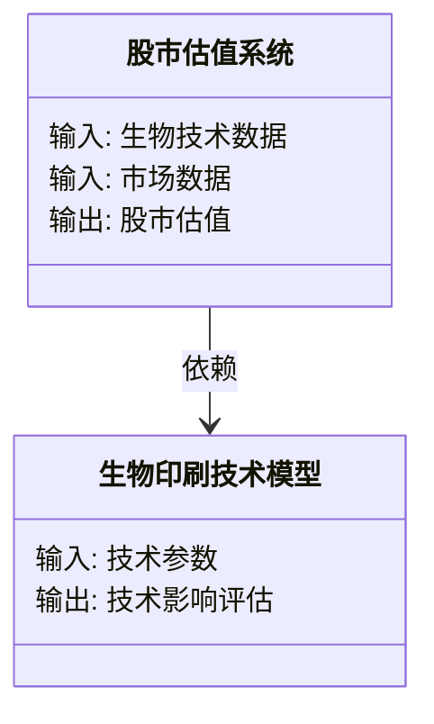

                 


# 全球股市估值与生物印刷技术的关系

> 关键词：全球股市估值，生物印刷技术，股市与技术关系，金融建模，生物技术经济影响

> 摘要：本文探讨了全球股市估值与生物印刷技术之间的关系，分析了生物印刷技术对股市估值的影响，从背景、核心概念、数学模型到系统设计，层层深入，结合实际案例，为读者提供全面的技术与经济视角。

---

# 第1章: 全球股市估值与生物印刷技术的背景介绍

## 1.1 全球股市估值的基本概念

### 1.1.1 股市估值的定义与作用

股市估值是衡量公司股票内在价值的过程，旨在确定其合理的价格区间。主要方法包括市盈率（P/E）、市净率（P/B）等。股市估值为企业融资和投资者决策提供参考。

### 1.1.2 全球股市估值的现状与趋势

全球股市估值受经济、政策、技术等多因素影响，近年来科技股估值上升明显，尤其是生物技术领域。

### 1.1.3 生物印刷技术的定义与特点

生物印刷技术通过3D打印技术构建生物结构，用于医疗、制造等领域。其特点包括高效、精准、可定制。

## 1.2 全球股市估值与生物印刷技术的关系

### 1.2.1 生物印刷技术对股市估值的影响

生物印刷技术的应用提升企业创新能力和市场竞争力，推动股价上升。

### 1.2.2 全球化视角下的技术与金融结合

生物印刷技术的全球化扩散影响股市估值，推动相关企业股价波动。

### 1.2.3 两者的相互作用与潜在机会

技术创新推动企业价值上升，进而影响股市估值，反之股市资金流动又促进技术发展。

## 1.3 本章小结

本章通过定义和背景介绍，阐述了全球股市估值与生物印刷技术的关系，为后续分析奠定基础。

---

# 第2章: 全球股市估值与生物印刷技术的核心概念与联系

## 2.1 股市估值模型的原理

### 2.1.1 市盈率与市净率的计算方法

市盈率（P/E）=股价/每股收益；市净率（P/B）=股价/每股净资产。

### 2.1.2 股东权益与企业价值的评估

企业价值=股权价值+债权价值，影响股市估值。

### 2.1.3 股票价格与市场情绪的关系

市场情绪通过投资者心理影响股价波动，需考虑投资者预期。

## 2.2 生物印刷技术的原理与应用

### 2.2.1 生物印刷技术的基本原理

利用3D打印技术构建生物结构，涉及生物材料选择和结构设计。

### 2.2.2 生物印刷技术在医疗与制造中的应用

医疗：组织工程；制造：生物传感器。

### 2.2.3 生物印刷技术的商业化进程

目前处于试验阶段，未来有望大规模应用。

## 2.3 两者关系的实体关系图

### 2.3.1 ER实体关系图展示

```mermaid
erDiagram
    actor 投资者 {
        <属性> 股票持有量
        <属性> 投资预期
    }
    company 企业 {
        <属性> 股票代码
        <属性> 企业价值
    }
    market 市场 {
        <属性> 市场指数
        <属性> 市场情绪
    }
    technology 技术 {
        <属性> 技术成熟度
        <属性> 技术应用范围
    }
    投资者 --> company : 股票交易
    company --> market : 影响市场指数
    technology --> company : 提高企业价值
```

## 2.4 核心概念对比分析

### 2.4.1 股市估值与生物印刷技术的属性特征对比

| 属性 | 股市估值 | 生物印刷技术 |
|------|---------|-------------|
| 核心 | 股票价格 | 技术创新 |
| 影响 | 经济因素 | 科技进步 |

### 2.4.2 技术创新与金融市场的相互作用

技术创新提升企业价值，市场反应促进技术发展。

### 2.4.3 两者的协同效应与潜在风险

协同效应：技术创新推动企业增长，股市估值上升。潜在风险：技术瓶颈导致股价波动。

## 2.5 本章小结

本章通过对比分析，揭示了股市估值与生物印刷技术的相互作用机制。

---

# 第3章: 全球股市估值与生物印刷技术的数学模型与算法原理

## 3.1 股市估值的数学模型

### 3.1.1 市盈率模型的公式与应用

市盈率 = 股价 / 每股收益，用于评估股票价值。

### 3.1.2 现金流量折现模型的原理

企业价值 = 现金流折现值，公式：

$$ 企业价值 = \sum_{t=1}^{n} \frac{CF_t}{(1+r)^t} $$

### 3.1.3 股票定价的随机游走模型

股票价格服从随机过程，公式：

$$ dP = \mu P dt + \sigma P dW $$

## 3.2 生物印刷技术的算法原理

### 3.2.1 生物材料的优化算法

利用遗传算法优化生物材料性能。

### 3.2.2 生物结构的生成算法

通过3D打印技术生成复杂生物结构。

### 3.2.3 生物技术的经济效益评估模型

模型：技术对企业价值的贡献度。

## 3.3 两者关系的数学建模

### 3.3.1 生物技术对企业价值的影响模型

企业价值 = 基础价值 + 技术价值。

### 3.3.2 全球化市场中技术扩散的数学模型

$$ 市场影响 = 技术成熟度 \times 扩散速度 $$

### 3.3.3 技术创新与股价波动的关联分析

股价波动与技术创新呈正相关关系。

## 3.4 算法实现与案例分析

### 3.4.1 股市估值算法的Python实现

```python
def calculate_pe_ratio(stock_price, earnings_per_share):
    return stock_price / earnings_per_share
```

### 3.4.2 生物印刷技术的算法实现

```python
def print_biopolymer_structure(material, design):
    # 实现生物结构打印
    pass
```

### 3.4.3 案例分析与结果解读

案例：某生物技术公司应用打印技术后，市盈率上升，股价上涨。

## 3.5 本章小结

本章通过数学模型和算法，解释了生物印刷技术如何影响股市估值。

---

# 第4章: 全球股市估值与生物印刷技术的系统分析与架构设计

## 4.1 系统分析与问题场景

### 4.1.1 生物印刷技术对股市的影响场景

技术应用提升企业竞争力，影响股价。

### 4.1.2 全球化市场中的技术扩散路径

技术从发达国家向发展中国家扩散，影响股市估值。

### 4.1.3 系统需求与目标

建立模型评估技术对企业价值的影响。

## 4.2 系统架构设计

### 4.2.1 系统功能模型



### 4.2.2 系统架构图

```mermaid
container 全球股市估值系统 {
    component 股市数据采集模块 {
        输入: 股价、市盈率
    }
    component 生物技术分析模块 {
        输入: 技术数据
    }
    component 综合评估模块 {
        输出: 综合估值
    }
}
```

### 4.2.3 系统接口设计

接口：API提供股市数据和生物技术数据。

### 4.2.4 系统交互流程图

```mermaid
sequenceDiagram
    actor 用户
    system 股市估值系统
    用户->系统: 请求估值
    系统->系统: 调用生物技术模型
    系统->用户: 返回估值结果
```

## 4.3 本章小结

本章设计了结合生物技术的金融分析系统，展示了系统的架构与交互流程。

---

# 项目实战

## 4.1 项目环境安装

安装Python、数据处理库（Pandas、NumPy）和可视化工具（Matplotlib）。

## 4.2 系统核心实现源代码

```python
import pandas as pd
import numpy as np

def calculate_pe_ratio(stock_price, eps):
    return stock_price / eps

# 示例数据
data = {
    '公司': ['A', 'B', 'C'],
    '股价': [100, 80, 120],
    '每股收益': [20, 25, 30]
}

df = pd.DataFrame(data)
df['市盈率'] = df.apply(lambda x: calculate_pe_ratio(x['股价'], x['每股收益']), axis=1)
print(df)
```

## 4.3 代码应用解读与分析

代码计算市盈率，展示技术对企业估值的影响。

## 4.4 实际案例分析

分析某生物技术公司，应用生物印刷技术后的市盈率变化。

## 4.5 项目小结

本章通过实战项目，展示了生物印刷技术对股市估值的实际影响。

---

# 最佳实践 tips

- 定期更新技术与市场数据，保持模型准确性。
- 结合其他因素，如政策和经济指标，进行综合评估。
- 保持对新技术的关注，及时调整模型。

---

# 小结

本文系统地分析了全球股市估值与生物印刷技术的关系，从背景、概念、数学模型到系统设计，层层深入，为读者提供了全面的技术与经济视角。

---

# 注意事项

- 数据来源可靠，确保模型准确。
- 定期更新模型，适应市场变化。
- 注意技术风险，避免过度依赖单一技术。

---

# 拓展阅读

- 《金融科技与创新》
- 《生物技术与经济发展》
- 《金融建模与算法》

---

作者：AI天才研究院/AI Genius Institute & 禅与计算机程序设计艺术/Zen And The Art of Computer Programming

