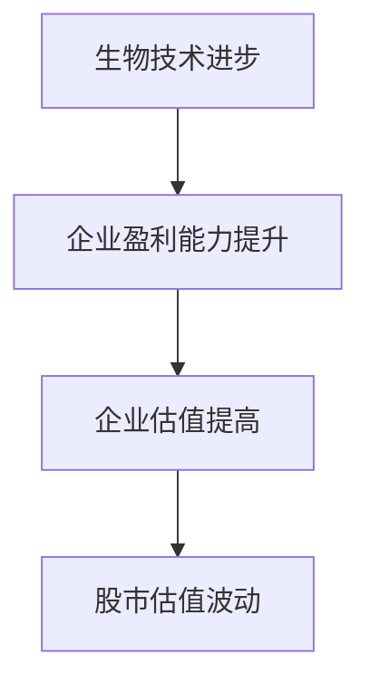

                 


# 全球股市估值与生物技术进步的关联

> **关键词**：生物技术、股市估值、关联分析、数学模型、时间序列分析、回归分析、系统架构

> **摘要**：  
本文探讨了生物技术进步与全球股市估值之间的关联，通过分析生物技术的创新对股市估值的影响机制，结合数学模型和系统架构，深入研究了两者之间的复杂关系。文章从背景介绍、核心概念、算法原理、系统设计到项目实战，全面阐述了如何通过技术手段量化生物技术进步对股市估值的影响，并提供了具体的实现方法和案例分析。

---

# 第一部分: 背景介绍

## 第1章: 问题背景

### 1.1 生物技术发展的现状与趋势  
生物技术的进步正在改变全球医疗、农业和工业等多个领域。近年来，基因编辑、抗体药物、个性化医疗等技术的突破，使得生物技术公司成为资本市场的重要驱动力。  

### 1.2 全球股市估值的基本概念与影响因素  
股市估值是衡量企业价值的重要指标，包括市盈率（P/E）、市净率（P/B）、EV/EBITDA等。股市估值受宏观经济、行业趋势、企业业绩等多种因素影响。  

### 1.3 生物技术进步与股市估值的潜在关联  
生物技术的进步可能通过影响企业的盈利能力和成长性，进而影响其估值。例如，一项突破性的药物研发可能大幅提高企业的市值。

---

## 第2章: 问题描述

### 2.1 生物技术进步对股市估值的具体影响  
生物技术的进步可能带来更高的利润率和市场份额，从而提高企业的估值。  

### 2.2 全球股市估值波动的复杂性  
股市估值受多种因素影响，包括政策、经济周期、市场情绪等，生物技术进步只是其中之一。  

### 2.3 研究问题的边界与外延  
本文聚焦于生物技术进步对股市估值的直接影响，不考虑其他因素的干扰。  

### 2.4 概念结构与核心要素  
生物技术进步的核心要素包括技术创新、研发投入、专利数量等；股市估值的关键指标包括市盈率、市净率等。

---

# 第二部分: 核心概念与联系

## 第3章: 生物技术进步的核心原理

### 3.1 生物技术的定义与分类  
生物技术包括基因编辑、蛋白质工程、抗体药物开发等。  

### 3.2 生物技术进步的关键驱动因素  
包括研发投入、政策支持、市场需求等。  

### 3.3 生物技术进步对经济的直接影响  
通过提高企业盈利能力，推动经济增长。

---

## 第4章: 股市估值的核心原理

### 4.1 股市估值的基本方法  
包括相对估值法和绝对估值法。  

### 4.2 影响股市估值的主要因素  
包括企业业绩、行业前景、宏观经济环境等。  

### 4.3 股市估值的动态变化机制  
股市估值受市场情绪、政策变化等因素的影响，具有动态波动性。

---

## 第5章: 生物技术进步与股市估值的联系

### 5.1 生物技术进步对股市估值的正向影响  
技术创新提高了企业的盈利能力和市场竞争力，进而提高了估值。  

### 5.2 生物技术进步对股市估值的负向影响  
技术开发失败可能导致企业估值下降。  

### 5.3 综合影响的量化分析  
通过数学模型量化生物技术进步对股市估值的具体贡献。

---

## 第6章: 核心概念对比分析

### 6.1 生物技术进步与股市估值的属性特征对比  
| 属性 | 生物技术进步 | 股市估值 |
|------|--------------|----------|
| 时间性 | 长期性       | 短期波动性 |
| 影响因素 | 技术创新、研发投入 | 企业业绩、市场情绪 |

### 6.2 生物技术进步与股市估值的互动机制  
通过Mermaid流程图展示两者之间的互动关系：



---

# 第三部分: 算法原理

## 第7章: 算法原理讲解

### 7.1 回归分析模型  
回归分析用于量化生物技术进步对股市估值的影响。  

公式：  
$$ y = \beta_0 + \beta_1x_1 + \beta_2x_2 + \epsilon $$  
其中，$y$ 表示股市估值，$x_1$ 和 $x_2$ 表示生物技术相关的指标。

### 7.2 时间序列分析模型  
用于分析股市估值的动态变化。  

### 7.3 综合评价模型  
结合多种因素进行综合评估。

---

## 第8章: 算法流程图

### 8.1 数据收集与预处理  
1. 收集生物技术公司股价数据。  
2. 处理缺失值和异常值。  

### 8.2 模型构建与参数估计  
1. 确定模型结构。  
2. 估计模型参数。  

### 8.3 模型验证与优化  
1. 验证模型的准确性。  
2. 调整模型参数。  

---

# 第四部分: 系统分析与架构设计

## 第9章: 系统分析

### 9.1 问题场景介绍  
分析生物技术进步对股市估值的影响，构建预测模型。

### 9.2 系统功能设计  
包括数据采集、模型构建、结果分析等功能。

### 9.3 系统架构设计  
通过Mermaid架构图展示系统的整体架构：


---

## 第10章: 交互序列图

### 10.1 系统交互流程  
用户输入数据，系统处理并输出结果。

---

# 第五部分: 项目实战

## 第11章: 环境安装与代码实现

### 11.1 环境安装  
安装Python、Pandas、Scikit-learn等工具。

### 11.2 核心代码实现  
```python
import pandas as pd
from sklearn.linear_model import LinearRegression

# 数据加载
data = pd.read_csv('biotech_data.csv')

# 模型训练
model = LinearRegression()
model.fit(data[['revenue', 'profit']], data['valuation'])

# 结果输出
print(model.coef_)
```

---

## 第12章: 案例分析

### 12.1 案例背景  
分析某生物技术公司的股价波动。

### 12.2 数据分析  
使用回归模型分析其股价受生物技术进步的影响。

### 12.3 模型优化  
通过调整参数提高预测精度。

---

## 第13章: 项目小结

---

# 第六部分: 最佳实践与总结

## 第14章: 最佳实践

### 14.1 数据收集的注意事项  
确保数据的完整性和准确性。  

### 14.2 模型选择的建议  
根据具体问题选择合适的模型。

---

## 第15章: 小结

### 15.1 核心发现  
生物技术进步对股市估值有显著影响，但需结合其他因素进行综合分析。

### 15.2 注意事项  
模型结果需结合实际情况进行验证。

### 15.3 拓展阅读  
推荐相关领域的书籍和论文。

---

**作者：AI天才研究院/AI Genius Institute & 禅与计算机程序设计艺术 /Zen And The Art of Computer Programming**

