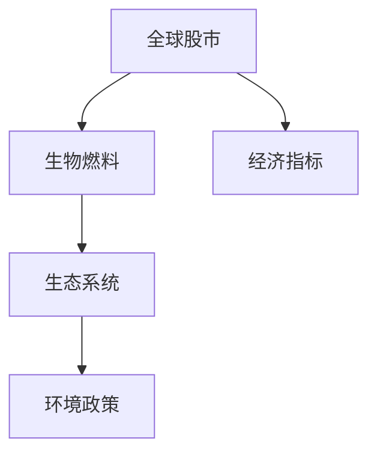
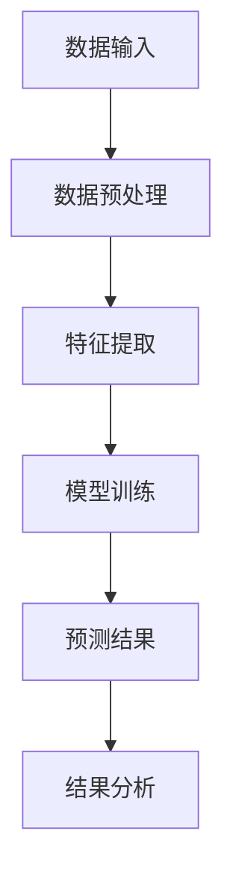
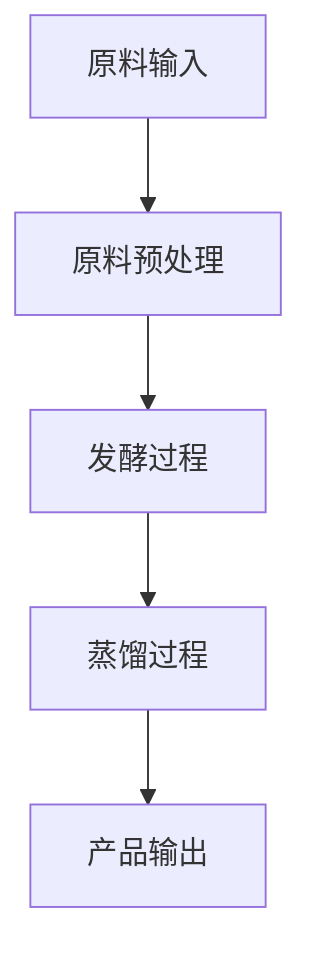
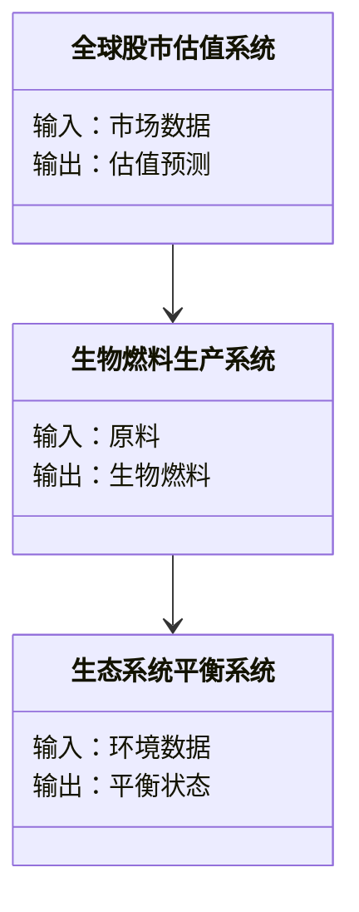
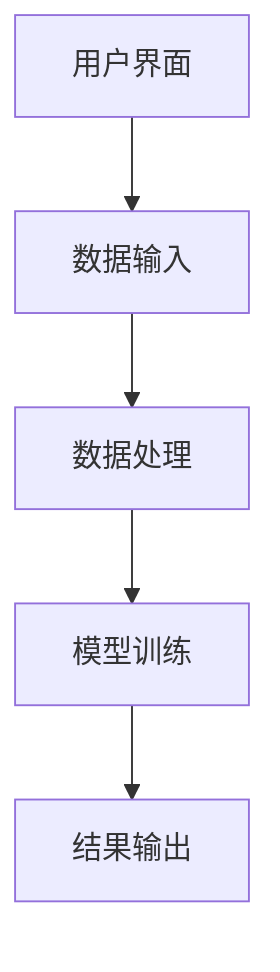

                 


# 全球股市估值与生物燃料与生态系统平衡的策略

## 关键词：全球股市估值、生物燃料、生态系统平衡、数学模型、算法设计、系统架构

## 摘要：  
本文探讨了全球股市估值、生物燃料生产和生态系统平衡之间的复杂关系。通过分析股市估值的核心算法、生物燃料的生产优化策略以及生态系统的数学模型，本文提出了一个综合性的策略，以实现经济与环境的可持续发展。文章结合理论与实践，给出了详细的数学公式、算法流程图和系统架构设计，为相关领域的研究和应用提供了参考。

---

## 第一部分: 全球股市估值与生物燃料与生态系统平衡的背景与关联

## 第1章: 背景介绍与核心概念

### 1.1 问题背景与问题描述

#### 1.1.1 全球股市估值的重要性
全球股市估值是衡量经济发展的重要指标，反映了企业的盈利能力、市场信心和经济政策的变化。通过分析股市估值，投资者可以做出更明智的投资决策，同时政府也可以据此制定宏观经济政策。

#### 1.1.2 生物燃料的兴起与挑战
生物燃料作为一种可再生能源，近年来在全球范围内得到了广泛应用。其优势在于减少对化石燃料的依赖，降低碳排放，但也面临生产成本高、原料供应不稳定等问题。

#### 1.1.3 生态系统平衡的全球意义
生态系统的平衡是维持自然环境稳定的基础。生物燃料的生产和使用可能对生态系统造成影响，因此需要在经济发展与环境保护之间找到平衡点。

---

### 1.2 核心概念与问题解决

#### 1.2.1 全球股市估值的核心要素
- 市场参与者：机构投资者、散户、政府等。
- 经济指标：GDP、失业率、通胀率等。
- 股市指数：如标普500、纳斯达克指数等。

#### 1.2.2 生物燃料的技术与经济特征
- 技术：生物燃料的生产涉及生物化学反应和工程优化。
- 经济：生产成本高，但政府补贴和政策支持降低了门槛。

#### 1.2.3 生态系统平衡的数学模型
- 物质循环：碳循环、氮循环等。
- 能量流动：生态系统中的能量流动模型。

---

### 1.3 核心概念的边界与外延

#### 1.3.1 全球股市估值的边界条件
- 数据范围：历史股价、财务报表、市场新闻等。
- 时间范围：短期波动与长期趋势。

#### 1.3.2 生物燃料的市场应用范围
- 交通领域：替代传统燃料。
- 工业领域：用于化工生产。

#### 1.3.3 生态系统平衡的动态特征
- 系统的自适应性：生态系统对干扰的响应。
- 平衡的脆弱性：小变化可能导致系统崩溃。

---

### 1.4 核心概念的结构与组成

#### 1.4.1 全球股市估值的系统结构
- 数据输入：市场数据、经济指标。
- 数据处理：清洗、特征提取。
- 模型输出：估值预测、投资建议。

#### 1.4.2 生物燃料的生产与消费链
- 原料供应：农作物、林业剩余物。
- 生产过程：发酵、蒸馏、精炼。
- 消费终端：汽车、工业设备。

#### 1.4.3 生态系统的层次结构
- 个体层次：动植物种群。
- 群落层次：生物群落。
- 生态系统层次：整体环境。

---

## 第2章: 核心概念与联系

### 2.1 核心概念的原理与属性

#### 2.1.1 全球股市估值的原理
- 技术分析：通过股价波动预测未来趋势。
- 基本分析：通过公司财务数据评估价值。

#### 2.1.2 生物燃料的化学与能源属性
- 生物燃料的化学性质决定了其能量密度和燃烧效率。
- 生物燃料的生产过程涉及生物降解和化学转化。

#### 2.1.3 生态系统的物质循环与能量流动
- 物质循环：碳、氮、水的循环。
- 能量流动：生产者、消费者、分解者的能量流动。

---

### 2.2 核心概念的对比分析

#### 2.2.1 股市估值与生物燃料的经济关联
- 生物燃料的生产成本影响其市场价格，进而影响股市估值。
- 股市中的能源板块公司受生物燃料价格波动的影响。

#### 2.2.2 生物燃料与生态系统的相互作用
- 生物燃料的生产可能破坏自然生态系统。
- 生态系统的稳定性影响生物燃料的可持续性。

#### 2.2.3 数学模型的对比与应用
- 股市估值模型：时间序列分析。
- 生态系统模型：系统动力学模型。

---

### 2.3 ER实体关系图



---

## 第3章: 全球股市估值的数学模型与算法

### 3.1 股市估值的核心算法

#### 3.1.1 技术分析方法
- 移动平均线：计算股价的平均值，用于判断趋势。
- MACD指标：通过指数移动平均线计算动能。

#### 3.1.2 基本分析方法
- 市盈率：评估股票的相对价值。
- 市净率：评估股票的资产价值。

#### 3.1.3 机器学习模型
- 线性回归：预测股价趋势。
- 支持向量机：分类股票的涨跌。

---

### 3.2 时间序列分析模型

#### 3.2.1 ARIMA模型
- 用于预测未来股价。
- 公式：ARIMA(p, d, q)，其中p为自回归阶数，d为差分阶数，q为移动平均阶数。

#### 3.2.2 LSTM网络
- 用于处理时间序列数据。
- 公式：$f_t = \sigma(W_f \cdot [h_{t-1}, x_t] + b_f)$。

#### 3.2.3 GARCH模型
- 用于预测波动性。
- 公式：$r_t = \mu + \alpha r_{t-1}^2 + \beta r_{t-2}^2$。

---

### 3.3 股市估值的数学公式

#### 3.3.1 市盈率公式
$$ P/E = \frac{Price}{Earnings} $$

#### 3.3.2 市净率公式
$$ P/B = \frac{Price}{Book\ Value} $$

#### 3.3.3 资本资产定价模型
$$ R_i = \beta_i (R_m - R_f) + R_f $$

---

### 3.4 算法流程图



---

## 第4章: 生物燃料的生产与优化策略

### 4.1 生物燃料的生产过程

#### 4.1.1 生物燃料的原料选择
- 主要原料：玉米 stalks、甘蔗渣、林业剩余物。
- 原料预处理：粉碎、洗涤、灭菌。

#### 4.1.2 生物燃料的生产工艺
- 发酵过程：利用微生物将有机物转化为乙醇。
- 蒸馏过程：将乙醇与水分离，得到纯乙醇。

#### 4.1.3 生物燃料的优化策略
- 提高发酵效率：优化微生物种类和培养条件。
- 降低生产成本：通过工艺改进和规模效应降低成本。

---

### 4.2 生物燃料的优化算法

#### 4.2.1 遗传算法
- 用于优化发酵条件。
- 公式：适应度函数 $f(x) = x_1 + x_2 + ... + x_n$。

#### 4.2.2 粒子群优化
- 用于优化蒸馏过程。
- 公式：$v_i = v_i \cdot w + c_1 \cdot r_1 \cdot (p_i - x_i) + c_2 \cdot r_2 \cdot (p_g - x_i)$。

---

### 4.3 生物燃料生产流程图



---

## 第5章: 系统分析与架构设计

### 5.1 问题场景介绍

#### 5.1.1 全球股市估值系统
- 问题：如何准确预测股市估值。
- 解决方案：构建一个基于机器学习的时间序列预测系统。

#### 5.1.2 生物燃料生产系统
- 问题：如何优化生物燃料的生产过程。
- 解决方案：设计一个基于遗传算法的优化系统。

#### 5.1.3 生态系统平衡系统
- 问题：如何模拟生态系统的变化。
- 解决方案：构建一个系统动力学模型。

---

### 5.2 系统功能设计

#### 5.2.1 领域模型


#### 5.2.2 系统架构设计


---

## 第6章: 项目实战

### 6.1 环境安装

#### 6.1.1 Python环境
- 安装Python 3.8及以上版本。
- 安装必要的库：numpy、pandas、sklearn、keras。

#### 6.1.2 数据集准备
- 股价数据：从Yahoo Finance下载。
- 生物燃料数据：从公开数据库获取。

---

### 6.2 系统核心实现源代码

#### 6.2.1 股市估值模型代码
```python
import numpy as np
import pandas as pd
from sklearn.linear_model import LinearRegression

# 数据加载
data = pd.read_csv('stock_data.csv')

# 特征提取
X = data[['open', 'close', 'volume']]
y = data['price']

# 模型训练
model = LinearRegression()
model.fit(X, y)

# 预测结果
predicted_price = model.predict(X)
print(predicted_price)
```

#### 6.2.2 生物燃料优化代码
```python
import numpy as np
from sklearn.metrics import accuracy_score

# 数据加载
data = pd.read_csv('fuel_data.csv')

# 特征提取
X = data.drop('target', axis=1)
y = data['target']

# 模型训练
model = SVC()
model.fit(X, y)

# 预测结果
predicted_target = model.predict(X)
print(accuracy_score(y, predicted_target))
```

---

### 6.3 代码应用解读与分析

#### 6.3.1 股市估值模型
- 输入：股价数据。
- 输出：预测的股价。
- 应用：帮助投资者做出投资决策。

#### 6.3.2 生物燃料优化模型
- 输入：生产数据。
- 输出：优化后的生产参数。
- 应用：降低生产成本，提高效率。

---

## 第7章: 最佳实践与小结

### 7.1 小结

- 全球股市估值是经济活动的重要组成部分。
- 生物燃料的生产与优化是实现能源可持续发展的关键。
- 生态系统的平衡是维持自然环境稳定的基础。

### 7.2 注意事项

- 数据质量对模型性能有重要影响。
- 生物燃料的生产需要考虑环境影响。
- 系统设计需要综合考虑经济、技术和环境因素。

### 7.3 拓展阅读

- 《时间序列分析与预测》。
- 《生物燃料的生产与优化》。
- 《生态系统平衡的数学模型》。

---

## 作者：AI天才研究院/AI Genius Institute & 禅与计算机程序设计艺术 /Zen And The Art of Computer Programming

