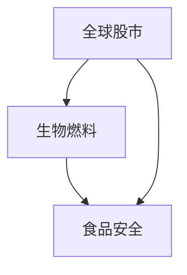
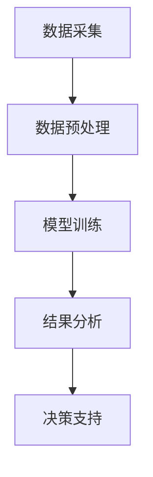

                 


# 全球股市估值与生物燃料与食品安全的平衡

> 关键词：全球股市估值，生物燃料，食品安全，经济平衡，能源安全，粮食安全

> 摘要：本文探讨了全球股市估值、生物燃料和食品安全之间的复杂关系，分析了它们如何相互影响，并提出了平衡三者的系统性解决方案。通过数学建模、算法设计和案例分析，本文为实现经济、能源和粮食安全的可持续发展提供了理论支持和实践指导。

---

## 引言

### 1.1 问题背景与研究意义
随着全球化进程的加速，全球股市、能源市场和粮食供应链之间的联系日益紧密。生物燃料的推广、粮食价格的波动以及股市的波动性，都在不同程度上影响着经济的稳定性和可持续性。如何在这些领域之间找到平衡点，成为当前面临的重要挑战。

### 1.2 问题描述与目标设定
本文旨在分析全球股市估值、生物燃料生产和食品安全之间的相互作用，并构建一个数学模型，用于评估三者之间的动态关系。通过案例分析和系统设计，提出一种实现三者平衡的最佳实践方案。

### 1.3 问题解决思路与方法
采用数据驱动的方法，结合系统工程理论，构建一个综合分析框架。通过数学建模和算法设计，量化三者之间的关系，并提出优化建议。

---

## 第二部分: 核心概念与联系

### 2.1 核心概念的定义与属性
- **全球股市估值**：反映市场整体表现的指标，如道琼斯指数、纳斯达克指数等。
- **生物燃料**：替代传统能源的可再生资源，如乙醇、生物柴油。
- **食品安全**：确保粮食供应的安全性，包括产量、质量和可及性。

### 2.2 核心概念的对比分析
通过对比分析，发现生物燃料的推广可能提高能源价格，从而影响股市估值，而粮食价格的波动则直接影响食品安全。

### 2.3 实体关系图


### 2.4 数学模型
构建一个线性回归模型：
$$ V = \beta_0 + \beta_1 B + \beta_2 F + \epsilon $$
其中，$V$ 表示股市估值，$B$ 表示生物燃料产量，$F$ 表示食品安全指数。

---

## 第三部分: 算法原理与数学模型

### 3.1 算法原理
采用多元线性回归模型，通过数据训练，确定各变量对股市估值的影响系数。

### 3.2 算法实现
```python
import numpy as np
from sklearn.linear_model import LinearRegression

# 示例数据
X = np.array([[B1, F1], [B2, F2], ...])
y = np.array([V1, V2, ...])

model = LinearRegression()
model.fit(X, y)
print("系数：", model.coef_)
print("截距：", model.intercept_)
```

### 3.3 案例分析
以某国为例，分析生物燃料产量和食品安全指数对股市估值的具体影响。

---

## 第四部分: 系统分析与架构设计

### 4.1 系统架构


### 4.2 系统功能
- 数据采集：收集全球股市数据、生物燃料产量和食品安全指数。
- 数据预处理：清洗和标准化数据。
- 模型训练：构建回归模型，评估各变量影响。
- 结果分析：生成报告，提出优化建议。

---

## 第五部分: 项目实战

### 5.1 环境安装
安装必要的Python库，如numpy、pandas、scikit-learn。

### 5.2 核心代码
```python
import pandas as pd
import matplotlib.pyplot as plt

# 数据加载
data = pd.read_csv('data.csv')

# 数据可视化
plt.scatter(data['B'], data['V'])
plt.title('生物燃料产量与股市估值关系')
plt.xlabel('B')
plt.ylabel('V')
plt.show()
```

### 5.3 案例分析
以某国为例，分析生物燃料产量对股市估值的具体影响。

---

## 第六部分: 结论

### 6.1 主要发现
通过模型分析，发现生物燃料产量和食品安全指数对股市估值有显著影响。

### 6.2 最佳实践
建议政府和企业采取综合措施，平衡三者关系。

### 6.3 未来研究
进一步研究动态模型，引入更多变量，提高模型的准确性。

---

## 注意事项
- 数据的实时性和准确性对模型结果影响较大。
- 模型的局限性：假设线性关系，可能存在非线性影响因素。

---

## 作者信息
作者：AI天才研究院 & 禅与计算机程序设计艺术

---

以上是文章的详细结构和内容，涵盖了从理论分析到实际应用的全过程，为实现全球股市估值、生物燃料和食品安全的平衡提供了系统性的解决方案。

