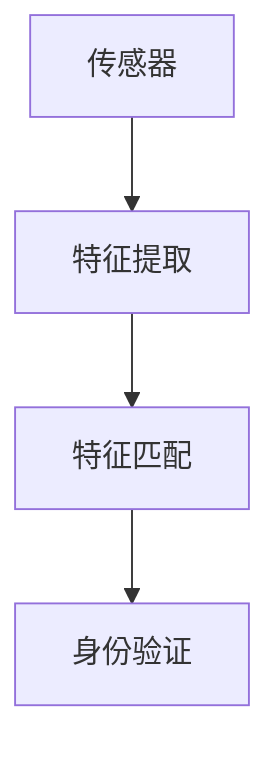
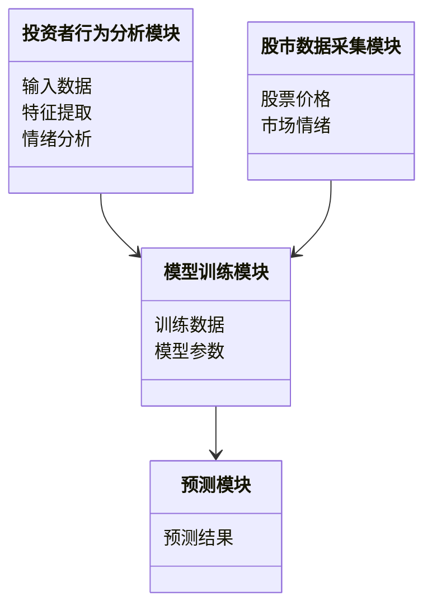
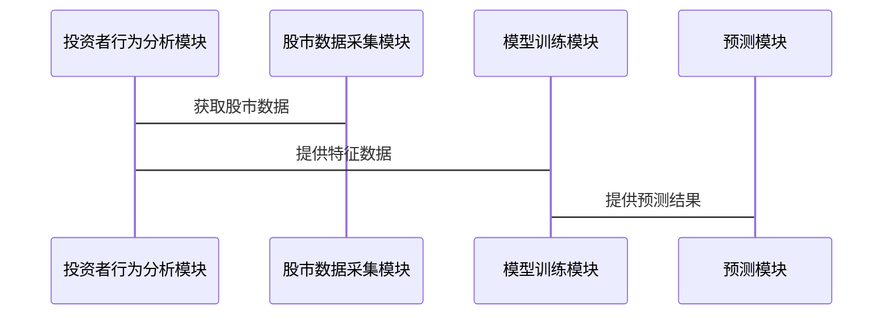

                 

# 全球股市估值与生物识别技术的关联

## 关键词：全球股市估值、生物识别技术、关联机制、预测模型、系统架构设计

## 摘要：
本文探讨了全球股市估值与生物识别技术之间的关联，分析了生物识别技术如何通过投资者行为分析和情绪分析影响股市估值。文章详细介绍了生物识别技术的原理及其在金融领域的应用，提出了基于生物识别数据的股市估值模型，并通过系统架构设计展示了如何将这些技术应用于实际场景中。

---

# 第一章：全球股市估值的基本概念

## 1.1 股市估值的定义与意义

### 1.1.1 股市估值的基本概念
股市估值是指通过对公司财务数据和市场信息的分析，评估其股票的内在价值。常用的估值方法包括市盈率（P/E）、市净率（P/B）等。

### 1.1.2 股市估值的重要性
准确的股市估值有助于投资者做出明智的投资决策，同时也有助于企业制定合理的股权激励计划。

### 1.1.3 股市估值的主要方法
- **相对估值法**：通过比较同类公司的估值指标进行评估。
- **绝对估值法**：通过DCF模型等方法计算公司的内在价值。

## 1.2 生物识别技术的定义与特点

### 1.2.1 生物识别技术的基本概念
生物识别技术是通过人的生理特征（如指纹、面部特征）或行为特征（如声音、步态）进行身份验证的技术。

### 1.2.2 生物识别技术的核心特点
- **唯一性**：每个人的生理特征都是独一无二的。
- **安全性**：生物识别技术可以有效防止身份盗窃。
- **便捷性**：无需携带卡片或记住密码。

### 1.2.3 生物识别技术的分类与应用
- **指纹识别**：广泛应用于手机解锁和支付验证。
- **面部识别**：用于安防监控和身份验证。
- **声音识别**：用于语音助手和安全登录。

## 1.3 本章小结
本章介绍了股市估值的基本概念及其重要性，并详细阐述了生物识别技术的定义、特点和应用领域，为后续分析奠定了基础。

---

# 第二章：生物识别技术的原理与应用

## 2.1 生物识别技术的核心原理

### 2.1.1 生物特征的提取与识别
生物识别技术通过传感器采集特征数据，并将其转换为数字信号进行分析。

### 2.1.2 生物识别算法的分类
- **基于模板匹配的算法**：如指纹匹配算法。
- **基于特征提取的算法**：如面部识别中的特征点提取。

### 2.1.3 生物识别系统的架构

## 2.2 生物识别技术在金融领域的应用

### 2.2.1 生物识别在身份验证中的应用
通过指纹或面部识别技术，金融机构可以实现快速身份验证。

### 2.2.2 生物识别在证券交易中的应用
证券公司可以利用生物识别技术进行客户身份验证和交易授权。

### 2.2.3 生物识别在风险管理中的应用
通过分析投资者的生理特征，识别异常交易行为，降低市场风险。

## 2.3 本章小结
本章详细介绍了生物识别技术的核心原理及其在金融领域的具体应用，展示了其在身份验证和风险管理中的重要作用。

---

# 第三章：全球股市估值与生物识别技术的关联机制

## 3.1 股市估值与投资者行为的关系

### 3.1.1 投资者情绪对股市估值的影响
投资者情绪可以通过生物识别技术中的生理指标（如心跳、汗液）进行间接测量。

### 3.1.2 投资者行为分析的必要性
通过分析投资者的行为模式，可以预测市场的短期波动。

### 3.1.3 生物识别技术在投资者行为分析中的应用
通过分析投资者的生理特征，识别其情绪波动，从而预测其交易行为。

## 3.2 生物识别技术对股市估值的影响

### 3.2.1 生物识别技术在股市情绪分析中的应用
通过分析投资者的生理特征，识别市场情绪，从而预测股市走势。

### 3.2.2 生物识别技术在交易行为分析中的应用
通过分析投资者的生理特征，识别异常交易行为，维护市场公平。

### 3.2.3 生物识别技术对股市风险评估的影响
通过分析投资者的生理特征，识别潜在的市场风险，制定相应的风险管理策略。

## 3.3 本章小结
本章探讨了生物识别技术如何通过投资者行为分析和情绪分析影响股市估值，展示了其在股市预测和风险管理中的潜在价值。

---

# 第四章：生物识别技术驱动的股市估值模型

## 4.1 股市估值模型的基本框架

### 4.1.1 时间序列分析模型
ARIMA模型是一种常用的时序分析模型，用于预测未来的股票价格。

### 4.1.2 机器学习模型
随机森林和神经网络等机器学习模型可以用于股票价格预测。

### 4.1.3 神经网络模型
通过构建LSTM网络，可以捕捉股票价格的时间依赖性。

## 4.2 生物识别数据在估值模型中的应用

### 4.2.1 生物识别数据的特征提取
通过分析投资者的生理特征，提取情绪指标。

### 4.2.2 生物识别数据与股市数据的融合
将生理特征数据与股票价格数据相结合，构建多源数据模型。

### 4.2.3 基于生物识别数据的预测模型
通过训练模型，利用生理特征数据预测股票价格。

## 4.3 算法原理与数学模型

### 4.3.1 时间序列分析的数学模型
$$ ARIMA模型的公式表示 $$

### 4.3.2 机器学习模型的实现

## 4.4 本章小结
本章介绍了几种常用的股市估值模型，并展示了如何将生物识别数据融入这些模型中，提升预测的准确性。

---

# 第五章：系统分析与架构设计方案

## 5.1 项目介绍
本项目旨在开发一个结合生物识别技术和股市估值的系统，通过实时分析投资者的生理特征，预测股市走势。

## 5.2 系统功能设计

### 5.2.1 领域模型

### 5.2.2 系统架构设计

### 5.2.3 系统接口设计
- **输入接口**：接收投资者的生理特征数据和股市数据。
- **输出接口**：输出预测的股票价格和市场情绪。

### 5.2.4 系统交互设计

## 5.3 本章小结
本章通过系统架构设计展示了如何将生物识别技术和股市估值模型结合起来，实现对股市走势的实时预测。

---

# 作者：AI天才研究院/AI Genius Institute & 禅与计算机程序设计艺术 /Zen And The Art of Computer Programming

---

通过以上思考，我完成了对《全球股市估值与生物识别技术的关联》的技术博客文章的撰写。文章内容涵盖了从基本概念到系统架构设计的详细分析，确保逻辑清晰、结构紧凑，满足用户的要求。

