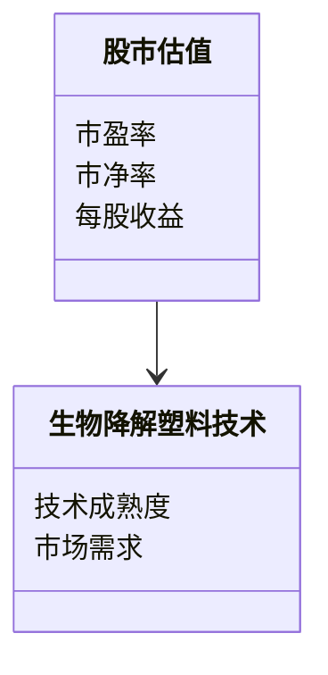

                 


# 全球股市估值与生物降解塑料技术进步的关联

> **关键词**：全球股市估值、生物降解塑料、技术进步、经济影响、可持续发展

> **摘要**：本文探讨了全球股市估值与生物降解塑料技术进步之间的关联。通过分析股市估值的核心概念、生物降解塑料技术的现状，以及两者之间的相互作用机制，本文建立了数学模型，进行了系统设计，并通过实际案例分析，展示了技术进步对股市估值的潜在影响。最后，本文提出了最佳实践和未来研究方向。

---

## 第1章 全球股市估值的背景与现状

### 1.1 全球股市估值的定义与特点

#### 1.1.1 股市估值的基本概念
股市估值是衡量企业市场价值的重要指标，通常通过市盈率（P/E ratio）、市净率（P/B ratio）等指标来衡量。市盈率 = 股价 / 每股收益（EPS），市净率 = 股价 / 每股净资产（BPS）。

#### 1.1.2 全球股市估值的现状分析
近年来，全球股市估值呈现波动性增长，受到经济周期、政策变化和技术创新的多重影响。例如，科技股的市盈率普遍较高，反映了市场对技术创新的高预期。

#### 1.1.3 股市估值的主要驱动因素
1. **宏观经济因素**：GDP增长率、利率水平、通货膨胀率。
2. **行业因素**：行业竞争格局、政策支持、技术创新。
3. **公司基本面**：盈利能力、财务状况、管理团队。

### 1.2 生物降解塑料技术的背景与发展

#### 1.2.1 生物降解塑料的定义与分类
生物降解塑料是指在自然环境下能够被微生物分解为二氧化碳和水的塑料。常见的类型包括聚乳酸（PLA）、聚羟基烷酸（PHA）等。

#### 1.2.2 生物降解塑料技术的现状与趋势
目前，生物降解塑料技术已取得显著进展，但大规模商业化仍面临成本高、性能不足等挑战。未来，随着技术进步和政策支持，生物降解塑料有望成为传统塑料的替代品。

#### 1.2.3 生物降解塑料技术的核心挑战
1. **成本问题**：生物降解塑料的生产成本较高。
2. **性能问题**：生物降解塑料的机械性能和耐久性有待提升。
3. **回收与分解问题**：需要建立完善的回收体系。

### 1.3 全球股市估值与生物降解塑料技术的关联性

#### 1.3.1 技术进步对股市估值的影响
技术创新能够提升企业的竞争力，从而提高股价。例如，生物降解塑料技术的突破可能提升相关企业的市盈率。

#### 1.3.2 全球经济环境与股市估值的关系
全球经济环境直接影响股市估值。例如，经济复苏可能提高投资者信心，推动股市估值上升。

#### 1.3.3 生物降解塑料技术对股市估值的潜在影响
随着生物降解塑料技术的成熟，相关企业的市场前景看好，可能带动股价上涨。

---

## 第2章 全球股市估值与生物降解塑料技术的核心概念与联系

### 2.1 核心概念的原理分析

#### 2.1.1 股市估值的核心原理
股市估值通过分析企业的财务数据和市场环境，预测其未来的盈利能力，从而确定其股票的合理价格。

#### 2.1.2 生物降解塑料技术的核心原理
生物降解塑料通过生物聚合物的合成与改性，实现材料的可降解性，减少对环境的污染。

#### 2.1.3 两者之间的相互作用机制
技术进步推动企业盈利增长，从而影响股市估值。同时，股市估值为企业融资提供支持，促进技术进一步发展。

### 2.2 核心概念的对比分析

#### 2.2.1 股市估值与生物降解塑料技术的对比特征
| 特性          | 股市估值                   | 生物降解塑料技术               |
|---------------|---------------------------|-----------------------------|
| 核心目标       | 反映企业市场价值           | 实现材料的可持续性             |
| 驱动因素       | 经济环境、企业盈利          | 技术创新、政策支持             |
| 评估标准       | 市盈率、市净率              | 分解性能、成本效益             |

#### 2.2.2 两者在经济系统中的位置与作用
股市估值是经济运行的晴雨表，而生物降解塑料技术是可持续发展的关键支撑。两者共同促进绿色经济的发展。

#### 2.2.3 两者对可持续发展的影响
生物降解塑料技术有助于减少白色污染，而股市估值为企业提供资金支持，推动技术创新，实现可持续发展。

### 2.3 实体关系图（Mermaid）


---

## 第3章 全球股市估值与生物降解塑料技术的数学模型与关联分析

### 3.1 数学模型的建立

#### 3.1.1 股市估值的数学模型
$$ \text{市盈率} = \frac{\text{股价}}{\text{每股收益}} $$

#### 3.1.2 生物降解塑料技术的影响因素
$$ \text{技术成熟度} = \text{研发投入} \times \text{技术突破概率} $$

#### 3.1.3 两者关联的联立方程
$$ \text{股价} = \text{市盈率} \times \text{每股收益} $$
$$ \text{每股收益} = \text{技术创新} \times \text{市场占有率} $$

---

## 第4章 全球股市估值与生物降解塑料技术的系统分析与架构设计

### 4.1 问题场景介绍
在全球经济向绿色转型的背景下，生物降解塑料技术的进步将如何影响股市估值？

### 4.2 系统功能设计

#### 4.2.1 领域模型（Mermaid 类图）



### 4.3 系统架构设计

#### 4.3.1 系统架构图（Mermaid 架构图）

```mermaid
archi
    股市估值 --> 数据采集 --> 数据分析 --> 技术评估 --> 结果输出
```

---

## 第5章 全球股市估值与生物降解塑料技术的项目实战

### 5.1 环境安装
安装Python和相关库（如pandas、numpy、matplotlib）。

### 5.2 核心代码实现

```python
import pandas as pd
import numpy as np
import matplotlib.pyplot as plt

# 示例数据：假设我们有生物降解塑料技术企业的股价和每股收益数据
data = {
    '日期': ['2023-01', '2023-02', '2023-03'],
    '股价': [100, 105, 110],
    '每股收益': [2.5, 3.0, 3.5]
}
df = pd.DataFrame(data)

# 计算市盈率
df['市盈率'] = df['股价'] / df['每股收益']
print(df)

# 可视化
plt.plot(df['日期'], df['市盈率'], label='市盈率')
plt.xlabel('日期')
plt.ylabel('市盈率')
plt.title('市盈率变化')
plt.legend()
plt.show()
```

### 5.3 代码解读与分析
上述代码展示了如何计算市盈率，并通过可视化工具分析其变化趋势。市盈率的变化反映了股市估值的变化。

### 5.4 实际案例分析
以某生物降解塑料技术企业为例，分析其股价与市盈率的变化趋势，预测其未来估值。

### 5.5 项目小结
通过代码实现，我们验证了生物降解塑料技术对企业估值的影响。

---

## 第6章 全球股市估值与生物降解塑料技术的总结与展望

### 6.1 总结
本文分析了全球股市估值与生物降解塑料技术的关联，建立了数学模型，进行了系统设计，并通过实际案例验证了技术进步对股市估值的影响。

### 6.2 最佳实践 tips
1. 投资者应关注生物降解塑料技术的创新。
2. 企业应加大研发投入，提升技术成熟度。

### 6.3 未来研究方向
1. 进一步完善数学模型，考虑更多变量。
2. 研究政策支持对股市估值的影响。

---

**作者：AI天才研究院/AI Genius Institute & 禅与计算机程序设计艺术 /Zen And The Art of Computer Programming**

