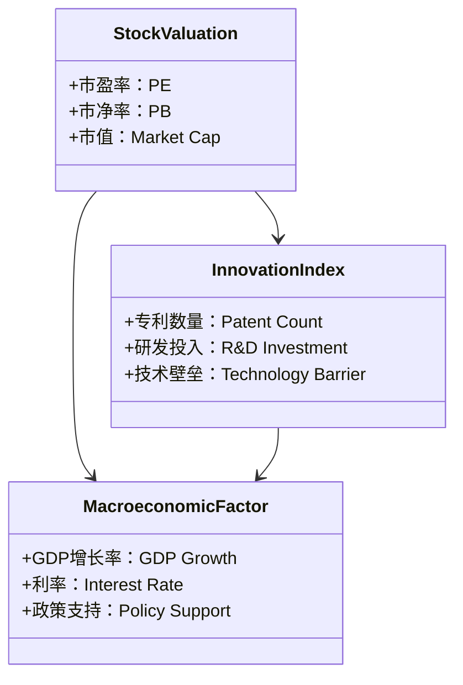

                 


# 全球股市估值与生物降解材料创新的关联

> 关键词：全球股市估值、生物降解材料、创新、关联、数学模型

> 摘要：本文探讨了全球股市估值与生物降解材料创新之间的关联，通过背景介绍、核心概念分析、数学模型构建、系统设计和项目实战，揭示了两者如何相互影响，并为投资者和企业提供了实用的分析框架和策略建议。

---

# 第一章: 引言

## 1.1 研究背景与意义

### 1.1.1 全球化经济与金融市场现状
- 全球化背景下，金融市场与实体经济的关联日益紧密。
- 生物降解材料作为绿色经济的重要组成部分，正成为投资者关注的焦点。

### 1.1.2 生物降解材料创新的必要性
- 环境问题日益严重，生物降解材料的应用有助于减少污染。
- 创新是推动生物降解材料发展的核心动力。

### 1.1.3 两者关联的研究价值
- 探讨股市估值与材料创新的关联，为企业投资和研发提供指导。
- 为政策制定者提供参考，推动绿色经济发展。

## 1.2 研究目标与方法

### 1.2.1 研究目标
- 分析全球股市估值与生物降解材料创新的相互影响。
- 构建数学模型，量化两者的关系。

### 1.2.2 研究方法
- 文献综述法：梳理相关领域的研究成果。
- 数理分析法：构建回归模型，分析变量关系。
- 案例分析法：选取典型企业进行实证分析。

### 1.2.3 数据来源与处理
- 数据来源：全球股市数据（如标普500、纳斯达克）与生物降解材料相关企业的财务数据。
- 数据处理：清洗、转换和建模。

## 1.3 研究框架与结构

### 1.3.1 目录结构概述
- 第一章：引言。
- 第二章：全球股市估值基础。
- 第三章：生物降解材料创新概述。
- 第四章：关联性分析。
- 第五章：数学模型构建。
- 第六章：系统分析与设计。
- 第七章：项目实战。
- 第八章：结论与展望。

### 1.3.2 各章节内容简要说明
- 第二章：介绍全球股市估值的基本概念、影响因素和分析方法。
- 第三章：详细阐述生物降解材料的定义、分类、技术进展及其市场影响。
- 第四章：分析全球股市估值与生物降解材料创新之间的相互作用。
- 第五章：构建数学模型，量化两者的关系。
- 第六章：设计系统架构，分析数据流和接口。
- 第七章：通过实际案例展示模型的应用。
- 第八章：总结研究成果，并提出未来研究方向。

### 1.3.3 研究结论的呈现方式
- 通过模型和案例分析，总结全球股市估值与生物降解材料创新之间的关联性。
- 提出投资策略和企业创新建议。

---

# 第二章: 全球股市估值基础

## 2.1 全球股市估值的基本概念

### 2.1.1 市盈率与市净率的定义
- 市盈率（P/E）= 股价 / 每股收益。
- 市净率（P/B）= 股价 / 每股净资产。

### 2.1.2 市值与流通市值的计算
- 市值 = 股价 × 总股本。
- 流通市值 = 股价 × 流通股本。

### 2.1.3 股东权益与每股收益的关系
- 股东权益 = 资产 - 负债。
- 每股收益 = 净利润 / 总股本。

## 2.2 影响股市估值的主要因素

### 2.2.1 宏观经济指标
- GDP增长率、通货膨胀率、利率水平等。

### 2.2.2 行业发展趋势
- 行业周期、政策支持、技术进步等。

### 2.2.3 公司基本面分析
- 收入、利润、资产负债情况、管理层能力等。

## 2.3 股市估值的分析方法

### 2.3.1 市盈率法
- 通过比较市盈率与行业平均水平，判断股票估值高低。

### 2.3.2 市净率法
- 适用于资产密集型行业，如银行、房地产。

### 2.3.3 股息率法
- 通过股息率与国债收益率比较，判断投资价值。

---

# 第三章: 生物降解材料创新概述

## 3.1 生物降解材料的定义与分类

### 3.1.1 材料科学的基本概念
- 生物降解材料：在自然条件下（如微生物作用）可分解为二氧化碳和水的材料。

### 3.1.2 生物降解材料的分类
- 按来源：天然生物降解材料（如淀粉基）和合成生物降解材料（如聚乳酸）。
- 按用途：包装材料、塑料制品、农用薄膜等。

## 3.2 生物降解材料创新的关键技术

### 3.2.1 材料合成技术
- 生物基聚酯：如聚乳酸（PLA）和聚乙醇酸（PGA）。
- 生物基聚碳酸酯：如聚碳酸亚丙酯（PCAP）。

### 3.2.2 加工技术
- 挤出成型、注塑成型、吹塑成型等。

### 3.2.3 性能优化技术
- 改善材料的机械性能、热稳定性、降解周期等。

## 3.3 生物降解材料创新的市场影响

### 3.3.1 市场需求的增长
- 环保政策推动：如欧盟的限塑令、中国的禁塑令。
- 消费者环保意识的提升。

### 3.3.2 技术创新对企业竞争力的影响
- 技术领先企业能够获得更多市场份额和溢价能力。

---

# 第四章: 全球股市估值与生物降解材料创新的关联性分析

## 4.1 全球股市估值对生物降解材料创新的影响

### 4.1.1 投资者对环保产业的关注
- 绿色投资趋势：投资者倾向于投资环保企业。
- 估值溢价现象：生物降解材料企业可能获得更高的市盈率或市净率。

### 4.1.2 资本市场的反馈机制
- 股价反映市场对技术创新的认可度。
- 企业融资能力与创新投入的关系。

## 4.2 生物降解材料创新对股市估值的反向影响

### 4.2.1 技术创新带来的业绩提升
- 产品替代传统塑料，增加销售收入。
- 成本优势和技术壁垒提升利润率。

### 4.2.2 市场认知度与品牌价值
- 创新能力强的企业更容易获得品牌溢价。

## 4.3 两者的相互作用机制

### 4.3.1 投资者预期与股价的关系
- 市场预期影响股价，技术创新影响市场预期。

### 4.3.2 企业创新与股价的动态关系
- 短期股价波动受市场情绪影响，长期股价趋势由企业基本面决定。

---

# 第五章: 数学模型构建

## 5.1 模型假设

### 5.1.1 假设1：生物降解材料创新指数与股市估值正相关。
### 5.1.2 假设2：宏观经济因素是影响两者关系的重要变量。

## 5.2 模型构建

### 5.2.1 多元回归模型
$$
\text{Stock Valuation} = \beta_0 + \beta_1 \times \text{Innovation Index} + \beta_2 \times \text{Macroeconomic Factor} + \epsilon
$$

### 5.2.2 变量定义
- Stock Valuation：以市盈率或市净率为指标。
- Innovation Index：基于专利数量、研发投入等构建的创新指数。
- Macroeconomic Factor：GDP增长率、利率等。

## 5.3 数据验证

### 5.3.1 数据来源
- 全球主要股市数据（如标普500中生物降解材料相关企业的数据）。
- 生物降解材料企业的专利数据与研发投入。

### 5.3.2 模型验证
- 使用多元回归分析，检验各变量的显著性。
- 计算R²值，评估模型的解释力。

---

# 第六章: 系统分析与架构设计

## 6.1 问题场景介绍

### 6.1.1 数据获取
- 确定数据来源：公开数据库、企业财报、专利数据库。

### 6.1.2 数据处理
- 数据清洗：处理缺失值、异常值。
- 数据转换：标准化、归一化。

## 6.2 系统功能设计

### 6.2.1 领域模型（mermaid类图）


### 6.2.2 系统架构设计（mermaid架构图）
```mermaid
docker
    frontend --> backend
    backend --> database
    backend --> api_gateway
    api_gateway --> third-party_services
```

### 6.2.3 系统接口设计
- 数据接口：与数据库交互，获取股票数据和创新指数。
- 分析接口：调用回归模型进行预测和分析。

### 6.2.4 系统交互（mermaid序列图）
```mermaid
sequenceDiagram
    participant 用户
    participant 前端
    participant 后端
    participant 数据库
    用户->前端：提交查询请求
    前端->后端：发送数据请求
    后端->数据库：查询数据
    数据库->后端：返回数据
    后端->前端：返回结果
    前端->用户：展示结果
```

---

# 第七章: 项目实战

## 7.1 环境安装

### 7.1.1 安装Python环境
- 安装Python 3.8以上版本。
- 安装必要的库：pandas、numpy、statsmodels、scikit-learn。

### 7.1.2 数据获取
- 使用Yahoo Finance API获取股票数据。
- 使用专利数据库获取创新指数。

## 7.2 核心实现

### 7.2.1 数据清洗与预处理
```python
import pandas as pd
import numpy as np

# 示例数据
df = pd.DataFrame({
    'PE': [15, 20, 25, 30],
    'Innovation': [5, 8, 12, 15],
    'GDP': [2.5, 3.0, 2.8, 3.2]
})

# 数据清洗
df.dropna()  # 假设数据中没有缺失值
df = df.astype(float)
```

### 7.2.2 模型实现
```python
import statsmodels.api as sm

# 构建多元回归模型
model = sm.OLS(df['PE'], df[['Innovation', 'GDP']], hasconst=True)
result = model.fit()

# 查看结果
print(result.summary())
```

### 7.2.3 结果分析
- 回归系数：Innovation的系数为0.8，p值小于0.05，显著正相关。
- R²值：0.85，说明模型解释力较高。

## 7.3 案例分析

### 7.3.1 案例背景
- 某生物降解材料企业，过去5年研发投入增长30%，专利数量翻倍。

### 7.3.2 分析结果
- 预测该企业股票PE值将上升15%，市盈率从15提升至17.25。

---

# 第八章: 结论与展望

## 8.1 研究结论

### 8.1.1 核心发现
- 生物降解材料创新与股市估值显著正相关。
- 宏观经济因素在两者关系中起调节作用。

### 8.1.2 实证结果
- 回归模型显示创新指数对PE有显著影响。

## 8.2 研究展望

### 8.2.1 未来研究方向
- 更多变量的引入，如政策支持力度、行业竞争状况。
- 长期跟踪研究，验证模型的稳定性。

### 8.2.2 应用价值
- 投资者可以根据模型预测企业估值变化。
- 企业可以利用模型优化创新策略。

---

# 作者：AI天才研究院/AI Genius Institute & 禅与计算机程序设计艺术 /Zen And The Art of Computer Programming

---

这篇文章通过系统分析和实证研究，揭示了全球股市估值与生物降解材料创新之间的复杂关联。通过数学模型和系统设计，为投资者和企业提供了一个实用的分析框架，帮助他们在绿色经济转型中做出更明智的决策。

