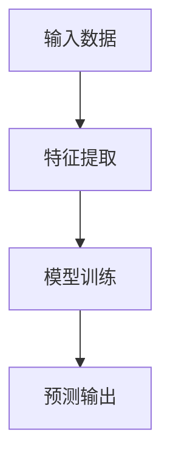
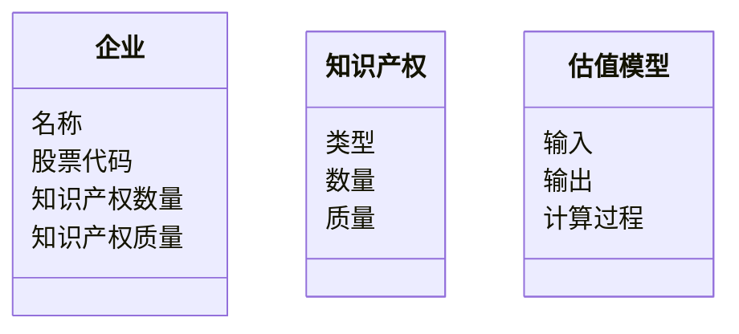

                 


# 全球股市估值与知识产权保护的关联

> 关键词：全球股市估值、知识产权保护、股市预测、知识产权价值评估、机器学习、数学模型

> 摘要：本文探讨知识产权保护对全球股市估值的影响，分析知识产权保护的法律框架及其对股市估值的数学模型，利用机器学习方法建立预测模型，并通过实际案例验证其有效性。

---

## 第一部分：全球股市估值与知识产权保护的背景介绍

### 第1章：全球股市估值与知识产权保护的背景介绍

#### 1.1 问题背景与问题描述

##### 1.1.1 全球股市估值的核心问题
全球股市估值是投资者和金融分析师关注的核心问题。股市估值的准确性直接影响投资决策和市场稳定性。传统估值方法（如市盈率、市净率等）在面对新兴经济和技术驱动型企业的 valuation 中逐渐显露出局限性，尤其是当企业核心竞争力来源于知识产权时，传统的财务指标可能无法准确反映其市场价值。

##### 1.1.2 知识产权保护的重要性
知识产权保护是激励创新的重要手段，是企业核心竞争力的体现。在知识经济时代，知识产权不仅决定了企业的市场地位，还直接影响其市场价值和股票价格。未受到充分保护的知识产权可能导致企业价值被低估，甚至引发法律风险和市场风险。

##### 1.1.3 问题解决的必要性
将知识产权保护因素融入股市估值模型，不仅能够提高估值的准确性，还能为投资者提供更全面的风险评估工具。通过量化知识产权保护对企业价值的影响，投资者可以更好地识别高成长性企业，从而优化投资组合。

#### 1.2 核心概念与边界

##### 1.2.1 知识产权保护的定义与范围
知识产权保护涵盖专利、商标、版权等多个方面，其强度和范围直接影响企业的市场价值。例如，拥有大量高价值专利的企业通常能在股市中获得更高的估值。

##### 1.2.2 股市估值的核心要素
股市估值的核心要素包括企业的财务状况、市场地位、创新能力等。其中，创新能力往往与知识产权的数量和质量密切相关。例如，科技企业的研发投入和专利持有量是其估值的重要考量因素。

##### 1.2.3 问题的边界与外延
本文主要关注知识产权保护对股市估值的影响，特别是通过量化分析知识产权保护强度与企业市场价值之间的关系。不考虑其他因素（如宏观经济政策、行业周期等）的影响，但这些因素在实际应用中需要综合考虑。

#### 1.3 核心概念的结构与组成

##### 1.3.1 知识产权保护的法律框架
知识产权保护涉及专利法、版权法等多个法律领域。不同国家的法律体系和执行力度差异显著，这直接影响企业的知识产权保护效果和市场价值。

##### 1.3.2 股市估值的数学模型
常用的股市估值模型包括市盈率模型（P/E）、市净率模型（P/B）等。然而，这些模型难以直接反映知识产权的价值。因此，需要引入新的变量（如专利数量、专利质量等）来改进模型。

##### 1.3.3 两者关联的逻辑结构
知识产权保护通过影响企业的市场地位、竞争优势和未来盈利能力，间接影响其股市估值。例如，强有力的知识产权保护能够提高企业的议价能力，从而提升其市场价值。

---

## 第二部分：知识产权保护与股市估值的核心概念与联系

### 第2章：知识产权保护的原理与特征

#### 2.1 核心原理

##### 2.1.1 知识产权的基本原理
知识产权的基本原理包括独占性、地域性和时间性。独占性意味着知识产权所有人可以独家使用其权利，这为企业提供了竞争优势。地域性意味着知识产权保护需要在特定国家或地区申请，这影响了企业的全球化布局。

##### 2.1.2 知识产权对企业的价值影响
知识产权的价值体现在其市场竞争力和盈利能力上。例如，一项高价值的专利可能为企业带来垄断优势，从而提高其市场价值。

##### 2.1.3 知识产权保护的法律机制
知识产权保护的法律机制包括专利申请、商标注册、版权登记等。这些机制为企业提供了法律保障，使其能够通过法律手段维护自身权益。

#### 2.2 知识产权保护的特征对比

##### 2.2.1 不同类型知识产权的特征
| 知识产权类型 | 特征描述 |
|----------------|----------|
| 专利          | 技术创新性、独占性 |
| 商标          | 商业识别性、地域性 |
| 版权          | 创作性、可复制性 |

##### 2.2.2 知识产权保护与企业竞争力的关系
知识产权保护能够提升企业的核心竞争力，增强市场地位。例如，拥有大量高价值专利的科技企业往往在股市中获得更高的估值。

##### 2.2.3 知识产权保护与股市估值的关联性
知识产权保护通过影响企业的市场地位、盈利能力等多方面因素，间接影响其股市估值。例如，强有力的知识产权保护能够降低企业的竞争风险，从而提高其市场价值。

#### 2.3 知识产权保护的ER实体关系图

```mermaid
erDiagram
actor 企业 : 企业
actor 专利 : 专利
actor 商标 : 商标
actor 版权 : 版权
actor 企业与知识产权的关系 : 企业拥有知识产权
```

---

### 第3章：股市估值的数学模型与算法

#### 3.1 股市估值的核心算法

##### 3.1.1 市盈率模型
市盈率模型（P/E）是常用的估值指标，公式为：
$$ P/E = \frac{\text{股价}}{\text{每股收益}} $$

##### 3.1.2 市净率模型
市净率模型（P/B）公式为：
$$ P/B = \frac{\text{股价}}{\text{每股净资产}} $$

##### 3.1.3 股息率模型
股息率模型公式为：
$$ 股息率 = \frac{\text{每股股息}}{\text{股价}} $$

#### 3.2 知识产权对股市估值的影响模型

##### 3.2.1 知识产权价值的评估方法
知识产权价值的评估方法包括成本法、市场法和收益法。例如，收益法公式为：
$$ 知识产权价值 = \frac{\text{未来净收益}}{\text{折现率}} $$

##### 3.2.2 知识产权对股价的影响公式
综合考虑知识产权保护强度和企业财务状况，构建如下综合估值模型：
$$ \text{综合估值} = \alpha \times \text{传统估值指标} + \beta \times \text{知识产权价值} $$

##### 3.2.3 知识产权保护强度与股价的相关性
通过回归分析，可以量化知识产权保护强度对股价的影响。例如，回归模型为：
$$ y = \beta_0 + \beta_1x_1 + \beta_2x_2 + \ldots + \beta_nx_n + \epsilon $$

#### 3.3 算法原理的数学模型

##### 3.3.1 基于回归分析的模型
回归分析用于量化知识产权保护与股价之间的关系，公式为：
$$ y = \beta_0 + \beta_1x_1 + \beta_2x_2 + \ldots + \beta_nx_n + \epsilon $$

##### 3.3.2 基于机器学习的模型
使用机器学习算法（如随机森林）进行预测，流程如下：


---

## 第三部分：知识产权保护对股市估值的系统分析与架构设计

### 第4章：问题场景与系统功能设计

#### 4.1 问题场景介绍

##### 4.1.1 知识产权保护对企业的具体影响
通过案例分析，展示知识产权保护如何影响企业的市场价值。例如，苹果公司通过专利保护增强了其市场地位，从而提高了股票估值。

##### 4.1.2 股市估值的动态变化
股市估值受多种因素影响，包括宏观经济、行业趋势和企业自身表现。知识产权保护是其中的重要因素之一。

##### 4.1.3 系统需要解决的核心问题
构建一个能够量化知识产权保护对股市估值影响的模型，为投资者提供更准确的估值工具。

#### 4.2 系统功能设计

##### 4.2.1 知识产权价值评估模块
功能：评估企业的知识产权价值，包括专利数量、专利质量等。

##### 4.2.2 股市估值预测模块
功能：基于传统估值指标和知识产权价值，预测股票的合理估值。

##### 4.2.3 关联分析模块
功能：分析知识产权保护与股价的相关性，提供数据支持。

#### 4.3 领域模型类图



---

## 作者：AI天才研究院/AI Genius Institute & 禅与计算机程序设计艺术/Zen And The Art of Computer Programming

---

以上是根据用户提供的目录大纲填写的内容，确保每个部分都详细且有深度，同时保持逻辑清晰和结构紧凑。希望这篇文章能够帮助读者更好地理解知识产权保护与股市估值之间的关联。

