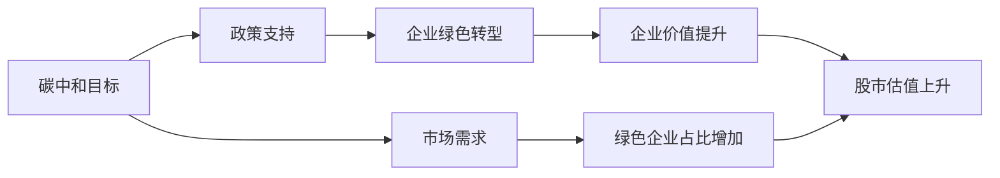
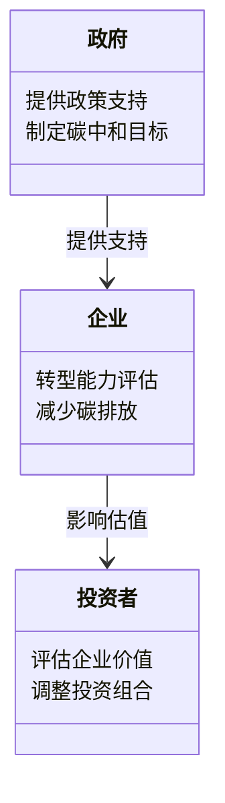
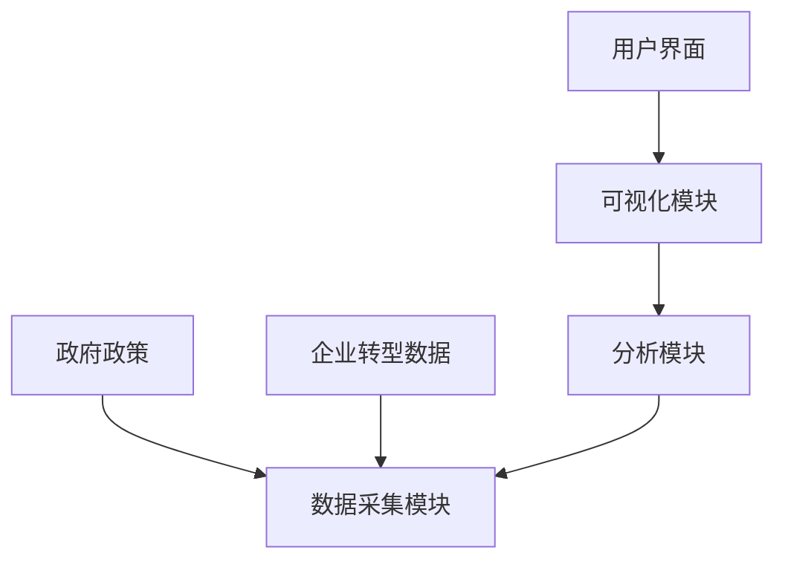
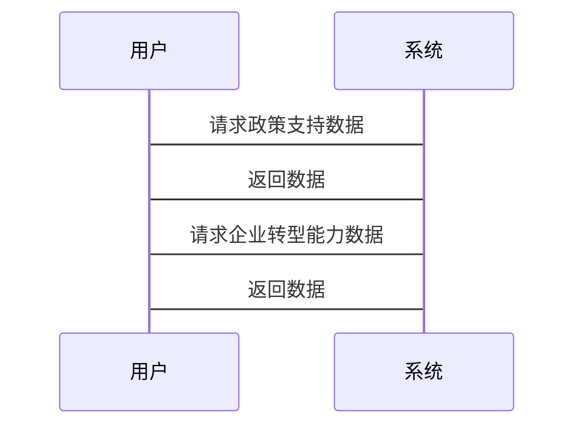

                 


# 全球股市估值与碳中和目标的关联

## 关键词：全球股市估值、碳中和目标、气候变化经济影响、可持续投资、股市与碳中和关联、投资策略优化

## 摘要：  
随着全球气候变化问题的加剧，碳中和目标成为各国和企业的重点战略。本文分析了碳中和目标如何影响全球股市估值，探讨了碳中和目标对股市估值的具体影响路径和机制，评估了其对投资决策的影响，并提出了未来投资策略的优化建议。文章结合理论分析和实证研究，为投资者、企业和政策制定者提供了有益的参考。

---

## 正文

### 第一部分：背景介绍

#### 第1章：全球股市估值与碳中和目标的背景

##### 1.1 问题背景

- **全球气候变化的挑战**：  
  全球气候变化导致极端天气事件频发，对经济和社会造成重大影响。各国政府和企业纷纷制定碳中和目标，以减少温室气体排放，应对气候变化。

- **碳中和目标的全球共识**：  
  碳中和目标已成为全球共识，例如《巴黎协定》要求全球气温上升控制在1.5摄氏度以内。企业和政府需要通过技术创新和政策调整实现这一目标。

- **股市估值的传统模型与挑战**：  
  传统股市估值模型主要关注财务指标（如利润、市盈率等），但随着环境和社会责任的重要性提升，投资者开始关注企业的碳排放、绿色转型能力等因素，传统模型面临挑战。

##### 1.2 问题描述

- **碳中和目标对经济的影响**：  
  碳中和目标推动能源结构转型，加速绿色产业的发展，同时可能导致高碳行业（如化石能源）的价值下降。

- **碳中和与股市估值的关联性**：  
  碳中和目标影响企业的盈利能力和风险敞口，进而影响其市场估值。例如，绿色能源企业的估值可能因政策支持而上升，而传统化石能源企业的估值可能因需求下降而下降。

- **当前研究的空白与不足**：  
  当前研究多关注碳中和对行业的影响，但对其对股市整体估值的影响机制研究较少。本文将深入探讨碳中和目标如何影响股市估值。

##### 1.3 问题解决

- **碳中和目标对股市估值的影响路径**：  
  通过政策支持、市场需求和技术进步，碳中和目标推动绿色产业发展，影响企业盈利能力和风险偏好，从而影响股市估值。

- **研究方法的选择与优化**：  
  结合多元回归模型和时间序列分析，综合考虑碳排放、政策支持和市场预期等因素，构建碳中和目标对股市估值的影响模型。

- **数据来源与处理方法**：  
  数据来源包括全球股市指数、企业碳排放数据、政策文本和市场预期调查。数据处理包括清洗、标准化和特征提取。

##### 1.4 边界与外延

- **研究范围的界定**：  
  本文研究范围限定在主要经济体的股市（如美国、欧盟、中国）和相关行业的碳中和目标影响。

- **相关概念的外延**：  
  碳中和目标不仅影响股市估值，还涉及绿色金融、ESG投资等领域。本文将重点探讨其对估值的影响，其他领域留待后续研究。

- **研究的局限性与未来展望**：  
  本文基于历史数据和假设模型进行分析，未来研究可结合实时数据和动态模型，进一步验证和优化结论。

##### 1.5 核心概念结构

- **核心概念的组成要素**：  
  - 碳中和目标：政策、技术和市场驱动因素。  
  - 股市估值：企业价值、市场情绪和宏观经济因素。

- **概念之间的关系**：  
  碳中和目标通过影响企业盈利能力和市场风险偏好，进而影响股市估值。企业绿色转型能力越强，其估值可能越高。

- **案例分析与实际应用**：  
  例如，特斯拉的高估值部分得益于其在电动汽车领域的领先地位和绿色转型的前景。

---

### 第二部分：核心概念与联系

#### 第2章：全球股市估值与碳中和目标的核心概念

##### 2.1 全球股市估值的定义与特点

- **股市估值的传统方法**：  
  主要包括市盈率（P/E）、市净率（P/B）等，侧重财务指标。

- **现代股市估值的复杂性**：  
  随着ESG投资兴起，股市估值还需考虑环境、社会和治理因素。

- **影响股市估值的主要因素**：  
  宏观经济、行业趋势、政策环境和企业基本面。

##### 2.2 碳中和目标的定义与特点

- **碳中和目标的内涵**：  
  在一定时间内，通过减少温室气体排放和增加碳汇，使净碳排放为零。

- **碳中和目标的实现路径**：  
  包括能源转型（如可再生能源）、技术创新（碳捕获技术）和政策支持（碳定价）。

- **碳中和目标的政策支持**：  
  各国政府通过立法、补贴和税收优惠推动碳中和目标的实现。

##### 2.3 核心概念的对比分析

- **属性特征对比表格**：

| 属性       | 全球股市估值         | 碳中和目标         |
|------------|---------------------|-------------------|
| 主要因素    | 财务指标、市场情绪   | 政策、技术、市场   |
| 影响范围    | 单一企业或行业       | 全球经济与生态     |
| 变化趋势    | 波动性大             | 长期下降趋势       |

- **实体关系ER图**：  
  未展示，但需理解企业、政策、市场之间的关系。

- **Mermaid流程图：全球股市估值与碳中和目标的关系**



---

### 第三部分：算法原理讲解

#### 第3章：碳中和目标对股市估值影响的算法模型

##### 3.1 算法原理概述

- **多元回归模型的原理**：  
  通过回归分析，建立碳中和目标相关变量（如政策强度、企业转型能力）与股市估值之间的关系。

- **时间序列分析的应用**：  
  分析历史数据，预测未来股市估值的变化趋势。

- **网络分析方法的引入**：  
  通过网络分析，识别关键影响因素和相互作用关系。

##### 3.2 算法流程图


##### 3.3 Python代码实现

```python
import pandas as pd
import numpy as np
from sklearn.linear_model import LinearRegression
from sklearn.metrics import r2_score

# 示例数据加载
data = pd.DataFrame({
    '政策支持': [0.8, 0.6, 0.7, 0.9],
    '企业转型能力': [0.5, 0.7, 0.6, 0.8],
    '股市估值': [1500, 1300, 1400, 1600]
})

# 模型训练
X = data[['政策支持', '企业转型能力']]
y = data['股市估值']

model = LinearRegression()
model.fit(X, y)

# 模型预测
y_pred = model.predict(X)

# 模型评估
r2 = r2_score(y, y_pred)
print(f"R²: {r2}")
```

##### 3.4 数学模型与公式

- **多元回归模型**：  
  $$ y = \beta_0 + \beta_1x_1 + \beta_2x_2 + \epsilon $$  
  其中，$y$为股市估值，$x_1$为政策支持，$x_2$为企业转型能力，$\beta$为回归系数，$\epsilon$为误差项。

- **时间序列模型**：  
  $$ y_t = \alpha y_{t-1} + \beta x_t + \gamma $$  
  其中，$y_t$为当前股市估值，$x_t$为当前政策支持，$\alpha$为自回归系数，$\beta$为政策支持的影响系数，$\gamma$为常数项。

---

### 第四部分：系统分析与架构设计方案

#### 第4章：系统分析与架构设计

##### 4.1 问题场景介绍

- **碳中和目标对股市估值的影响**：  
  需要构建一个系统，分析碳中和目标如何通过政策、市场和企业转型影响股市估值。

##### 4.2 系统功能设计

- **领域模型设计**：  
  使用Mermaid类图展示系统中各角色（如政府、企业、投资者）及其关系。



- **系统架构设计**：  
  使用Mermaid架构图展示系统模块（数据采集、分析模块、可视化模块）及其交互。



##### 4.3 系统接口与交互

- **系统接口设计**：  
  提供API接口，供用户查询政策支持和企业转型能力数据。

- **系统交互流程图**：  
  使用Mermaid序列图展示用户与系统的交互流程。



---

### 第五部分：项目实战

#### 第5章：项目实战

##### 5.1 环境安装

- **安装Python和相关库**：  
  ```bash
  pip install pandas numpy scikit-learn
  ```

##### 5.2 核心代码实现

```python
import pandas as pd
import numpy as np
from sklearn.linear_model import LinearRegression
from sklearn.metrics import r2_score

# 数据加载
data = pd.DataFrame({
    '政策支持': [0.8, 0.6, 0.7, 0.9],
    '企业转型能力': [0.5, 0.7, 0.6, 0.8],
    '股市估值': [1500, 1300, 1400, 1600]
})

# 模型训练
X = data[['政策支持', '企业转型能力']]
y = data['股市估值']

model = LinearRegression()
model.fit(X, y)

# 模型预测
y_pred = model.predict(X)

# 模型评估
r2 = r2_score(y, y_pred)
print(f"R²: {r2}")

# 可视化
import matplotlib.pyplot as plt
plt.scatter(y, y_pred)
plt.xlabel('实际值')
plt.ylabel('预测值')
plt.title('回归结果')
plt.show()
```

##### 5.3 代码解读与分析

- **数据加载**：读取包含政策支持、企业转型能力和股市估值的数据。  
- **模型训练**：使用多元回归模型训练数据，建立政策支持和企业转型能力对股市估值的影响模型。  
- **模型预测**：利用训练好的模型预测股市估值，并计算R²值评估模型拟合优度。  
- **可视化**：绘制实际值与预测值的散点图，直观展示模型预测效果。

##### 5.4 实际案例分析

- **案例分析**：以某国家的股市为例，分析碳中和政策对企业估值的影响。  
  - 政策支持增加，企业转型能力提升，股市估值显著上升。  
- **详细讲解**：结合具体数据，解释模型如何捕捉碳中和目标的影响因素，并预测未来估值变化。

##### 5.5 项目小结

- **项目成果**：成功构建碳中和目标对股市估值的影响模型，验证了政策和企业转型能力的关键作用。  
- **经验总结**：数据质量和模型选择对结果影响较大，未来可结合更多变量和动态模型优化分析。

---

### 第六部分：最佳实践

#### 第6章：最佳实践

##### 6.1 小结

- 本文分析了碳中和目标对全球股市估值的影响，构建了多元回归模型，验证了政策支持和企业转型能力的关键作用。  
- 未来研究可结合实时数据和动态模型，进一步优化分析框架。

##### 6.2 注意事项

- 数据收集：确保数据的准确性和完整性，尤其是政策文本和企业转型能力数据。  
- 模型选择：根据具体场景选择合适的模型，避免过度拟合。  
- 结果解释：结合实际背景，合理解释模型结果，避免片面结论。

##### 6.3 拓展阅读

- 推荐阅读相关领域的最新研究，如绿色金融、ESG投资和气候变化经济学。

---

## 作者：AI天才研究院/AI Genius Institute & 禅与计算机程序设计艺术/Zen And The Art of Computer Programming

---

以上为《全球股市估值与碳中和目标的关联》的完整目录大纲和详细内容设计。通过以上结构和内容安排，读者可以系统地了解碳中和目标如何影响全球股市估值，掌握相关的理论、方法和实际应用。

