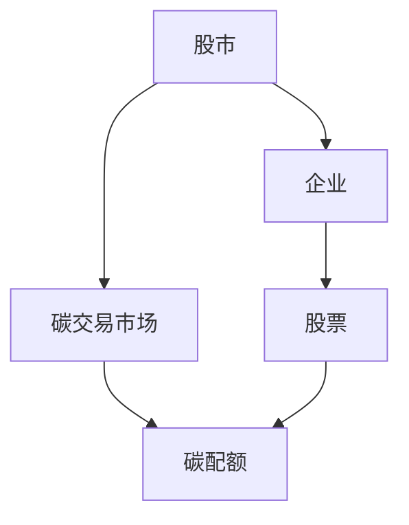
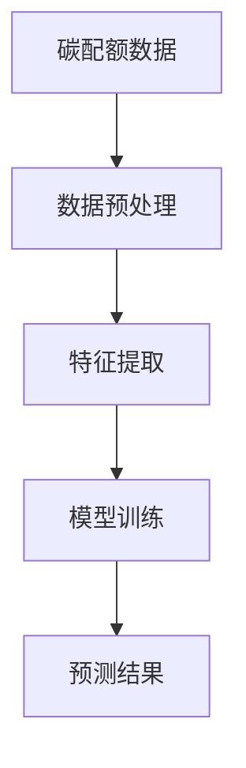
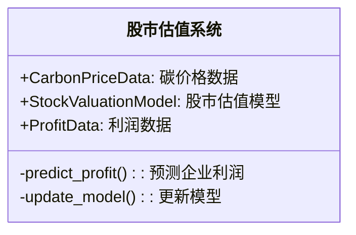
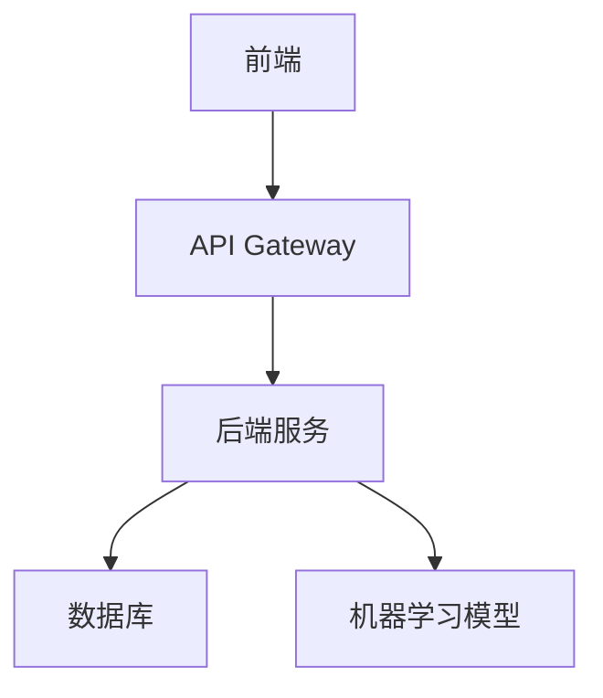
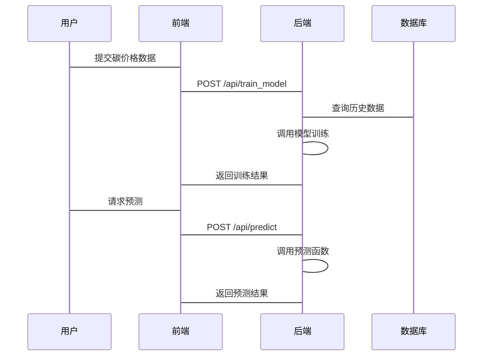

                 


# 全球股市估值与碳交易市场发展的关系

> 关键词：全球股市估值、碳交易市场、经济发展、环境保护、气候变化、金融市场

> 摘要：本文探讨了全球股市估值与碳交易市场之间的关系，分析了股市估值的基本概念、碳交易市场的运作机制，以及它们如何相互影响。通过数学模型和算法原理，本文揭示了碳交易市场对股市估值的潜在影响，为投资者和政策制定者提供了新的视角和策略。

---

## 第一部分: 全球股市估值与碳交易市场发展的背景与概念

### 第1章: 全球股市估值与碳交易市场的背景介绍

#### 1.1 全球股市估值概述
##### 1.1.1 股市估值的基本概念
股市估值是通过对上市公司未来现金流的预测，评估其股票的内在价值。常见的估值方法包括市盈率（P/E）、市净率（P/B）、股息率等。这些指标帮助投资者判断股票是否被高估或低估。

##### 1.1.2 全球股市估值的发展现状
随着全球经济一体化，股市估值已成为衡量企业价值的重要工具。近年来，全球股市规模不断扩大，投资者对估值方法的需求也在增加。

##### 1.1.3 股市估值与经济发展的关系
股市估值不仅是企业价值的体现，还反映了整体经济的健康状况。经济繁荣时，股市估值通常上升；经济衰退时，估值可能下降。

#### 1.2 碳交易市场的基本概念
##### 1.2.1 碳交易市场的定义
碳交易市场是通过买卖碳配额或信用，实现减少温室气体排放的市场。企业可以购买碳配额来抵消其排放，或出售多余的配额以获取收益。

##### 1.2.2 碳交易市场的历史发展
碳交易市场起源于《京都议定书》，2005年欧盟建立了第一个碳交易体系。此后，全球多个地区建立了碳市场，如美国的RGGI和加州的碳市场。

##### 1.2.3 碳交易市场与环境保护的关系
碳交易市场通过经济手段激励企业减少排放，是应对气候变化的重要工具。它将环境成本纳入经济体系，推动了绿色经济的发展。

#### 1.3 股市估值与碳交易市场的关系
##### 1.3.1 问题背景与问题描述
随着气候变化问题的加剧，碳交易市场逐渐成为全球经济的重要组成部分。然而，碳市场的发展对股市估值有何影响？这是本文探讨的核心问题。

##### 1.3.2 问题解决的思路与方法
通过建立数学模型，分析碳价格波动对股市估值的影响，提出预测和优化策略。

##### 1.3.3 边界与外延
本文仅关注碳交易市场对股市估值的影响，不考虑其他因素如货币政策或地缘政治的影响。

##### 1.3.4 核心概念与核心要素组成
核心概念包括股市估值、碳配额价格、企业减排成本。核心要素包括碳价格波动、企业利润变化、投资者预期调整。

---

### 第2章: 股市估值与碳交易市场的核心概念与联系

#### 2.1 核心概念原理
##### 2.1.1 股市估值的原理
股市估值基于对企业未来盈利能力的预测。企业减排成本的变化会影响其利润，进而影响股票估值。

##### 2.1.2 碳交易市场的原理
碳交易市场通过供需机制确定碳配额价格。企业通过购买或出售配额，实现减排目标。

#### 2.2 核心概念属性特征对比
| 特性         | 股市估值          | 碳交易市场       |
|--------------|-------------------|------------------|
| 核心目标     | 评估企业价值      | 减少碳排放        |
| 参与主体     | 投资者、企业       | 企业、政府机构    |
| 影响因素     | 利润、现金流      | 碳配额、政策      |
| 变化趋势     | 与企业绩效相关    | 与政策和供需相关  |

#### 2.3 ER实体关系图架构


---

## 第二部分: 股市估值与碳交易市场关系的算法原理

### 第3章: 股市估值与碳交易市场关系的算法原理

#### 3.1 算法原理
##### 3.1.1 算法思路
通过回归分析，将碳配额价格变化与企业利润变化联系起来，建立股市估值的预测模型。

##### 3.1.2 数据流图


#### 3.2 算法实现
##### 3.2.1 核心代码
```python
import pandas as pd
import numpy as np
from sklearn.linear_model import LinearRegression

# 数据预处理
def preprocess(data):
    # 假设data包含碳配额价格和企业利润数据
    data['Carbon_Price'] = data['Carbon_Price'].fillna(data['Carbon_Price'].mean())
    data['Profit'] = data['Profit'].apply(lambda x: x if x > 0 else 0)
    return data

# 模型训练
def train_model(data):
    X = data[['Carbon_Price']]
    y = data['Profit']
    model = LinearRegression()
    model.fit(X, y)
    return model

# 预测
def predict(model, new_data):
    new_carbon_price = new_data['Carbon_Price'].values
    predictions = model.predict(new_carbon_price.reshape(-1, 1))
    return predictions
```

##### 3.2.2 代码解读
- `preprocess`函数：处理缺失值和异常值。
- `train_model`函数：使用线性回归模型训练数据。
- `predict`函数：基于训练好的模型，预测新的碳价格对企业利润的影响。

#### 3.3 数学模型与公式
##### 3.3.1 线性回归模型
$$ y = \beta_0 + \beta_1 x + \epsilon $$

其中，$y$是企业利润，$x$是碳配额价格，$\beta_0$是截距，$\beta_1$是回归系数，$\epsilon$是误差项。

##### 3.3.2 碳价格对股市估值的影响
$$ Valuation = \alpha \times Profit + \beta \times Carbon\_Price + \gamma $$

---

## 第三部分: 系统分析与架构设计

### 第4章: 系统分析与架构设计方案

#### 4.1 问题场景介绍
我们开发一个实时监控系统，帮助投资者分析碳交易市场对企业利润的影响，进而调整股市估值模型。

#### 4.2 项目介绍
项目目标：建立实时监控系统，分析碳价格波动对股市估值的影响。主要功能包括数据采集、模型训练、预测分析和结果展示。

#### 4.3 系统功能设计
##### 4.3.1 领域模型


##### 4.3.2 系统架构


#### 4.4 接口和交互设计
##### 4.4.1 序列图


---

## 第四部分: 项目实战

### 第5章: 项目实战

#### 5.1 环境安装
需要安装Python、Pandas、Scikit-learn和Mermaid工具。

#### 5.2 核心代码实现
##### 5.2.1 数据采集与处理
```python
import requests
import pandas as pd

# 从公开API获取碳配额数据
def fetch_carbon_data(api_key):
    url = f"https://api.carbonpriceapi.com/v1/price?api_key={api_key}"
    response = requests.get(url)
    data = response.json()
    return pd.DataFrame(data)
```

##### 5.2.2 模型训练与预测
```python
from sklearn.ensemble import RandomForestRegressor

def train_random_forest(X_train, y_train):
    model = RandomForestRegressor(n_estimators=100, random_state=42)
    model.fit(X_train, y_train)
    return model
```

#### 5.3 代码解读与分析
- 数据采集函数：从API获取碳配额数据并转换为DataFrame。
- 模型训练函数：使用随机森林算法训练模型，预测碳价格对企业利润的影响。

#### 5.4 案例分析
以某企业为例，假设碳配额价格上涨10%，预测其利润变化。通过模型计算，利润可能下降5%，进而影响股票估值。

---

## 第五部分: 最佳实践与总结

### 第6章: 最佳实践

#### 6.1 小结
本文通过数学模型和算法，分析了碳交易市场对股市估值的影响，提出了实时监控系统的构建方法。

#### 6.2 注意事项
- 数据质量：确保数据准确无误。
- 模型选择：根据实际情况选择合适的算法。
- 风险管理：考虑模型的局限性和市场不确定性。

#### 6.3 拓展阅读
建议进一步研究碳交易市场的其他影响因素，如政策变化和技术创新。

---

## 作者：AI天才研究院/AI Genius Institute & 禅与计算机程序设计艺术 /Zen And The Art of Computer Programming

---

感谢您的阅读！希望本文能为您提供新的视角和思路，帮助您更好地理解全球股市估值与碳交易市场发展的关系。

