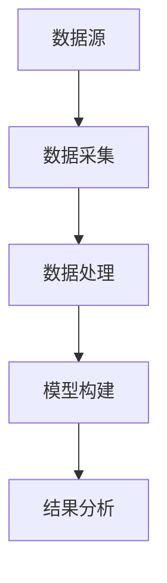

                 


**摘要**：  
本文探讨了全球股市估值与碳信用交易市场流动性的关系，分析了两者如何相互影响，以及这种关系对金融市场和环境保护的重要性。通过数学模型和实际案例，展示了如何量化这种关系，并为投资者和政策制定者提供参考。

---

# 全球股市估值与碳信用交易市场流动性的关系

## 关键词：  
全球股市估值、碳信用市场、流动性分析、金融建模、气候变化投资

---

## 第1章: 全球股市估值与碳信用交易市场流动性关系的背景介绍

### 1.1 背景介绍
#### 1.1.1 全球股市估值的基本概念  
全球股市估值是衡量市场整体价值的指标，通常通过股票价格指数（如标普500、MSCI指数）或市值总和来反映。股市估值受宏观经济、企业盈利和市场情绪等因素影响。

#### 1.1.2 碳信用交易市场的基本概念  
碳信用是碳排放权的交易凭证，允许企业或国家在规定排放限额内排放温室气体。碳信用交易市场通过买卖碳信用额度，促进减排目标的实现。

#### 1.1.3 问题背景与问题描述  
随着全球气候变化加剧，碳信用市场的重要性日益凸显。然而，股市估值与碳信用流动性的关系尚未得到充分研究，可能存在协同效应或相互影响。

#### 1.1.4 问题解决与边界外延  
本文通过分析股市估值与碳信用流动性之间的关系，探索如何利用金融工具优化碳市场流动性和提升股市价值。

#### 1.1.5 核心概念结构与组成要素  
- 股市估值：市场指数、市值、市盈率、市净率。  
- 碳信用流动性：交易量、价格波动、市场深度。

---

## 第2章: 核心概念与联系

### 2.1 核心概念原理
#### 2.1.1 股市估值的核心原理  
股市估值反映市场对未来的预期，受企业盈利、宏观经济政策和投资者情绪影响。

#### 2.1.2 碳信用流动性的核心原理  
碳信用流动性影响市场效率，高流动性有助于价格发现和交易效率。

#### 2.1.3 两者关系的理论基础  
碳信用市场的发展可能影响股市中相关企业的估值，同时股市的资金流动也可能影响碳信用市场的流动性。

### 2.2 核心概念对比分析
#### 2.2.1 股市估值与碳信用流动性的属性特征对比  
| 属性       | 股市估值       | 碳信用流动性   |
|------------|----------------|----------------|
| 测量指标   | 市盈率、市值     | 交易量、波动性   |
| 影响因素   | 宏观经济、企业盈利 | 市场深度、政策支持 |

#### 2.2.2 对经济的影响对比  
股市估值影响整体经济信心，而碳信用流动性影响绿色投资的回报。

#### 2.2.3 市场角色对比  
股市是资金配置的核心，碳信用市场是环保机制的补充。

### 2.3 实体关系图  
```mermaid
er
    actor 股市估值
    actor 碳信用流动性
    relation 交易关系
    relation 流动性影响
    relation 估值影响
```

---

## 第3章: 算法原理与数学模型

### 3.1 算法原理
#### 3.1.1 多元回归分析模型  
用于量化股市估值与碳信用流动性之间的关系。

#### 3.1.2 时间序列分析模型  
用于分析碳信用市场的流动性和股市估值的长期趋势。

#### 3.1.3 网络流分析模型  
用于研究资金流动对市场的影响。

### 3.2 数学模型与公式
#### 3.2.1 多元回归模型  
$$ V = \beta_1 L + \beta_2 X + \epsilon $$  
其中，\( V \) 是股市估值，\( L \) 是碳信用流动性，\( X \) 是控制变量。

#### 3.2.2 时间序列模型  
$$ ARIMA(p, d, q) $$  
用于预测股市估值和碳信用流动性的趋势。

---

## 第4章: 系统分析与架构设计

### 4.1 问题场景介绍  
分析股市和碳信用市场的数据，构建量化模型。

### 4.2 系统功能设计  
- 数据采集模块：收集股市和碳信用数据。  
- 数据处理模块：清洗和预处理数据。  
- 模型构建模块：应用多元回归和时间序列模型。  

### 4.3 系统架构设计  


---

## 第5章: 项目实战

### 5.1 环境安装  
安装Python和相关库（pandas、numpy、statsmodels）。

### 5.2 核心代码实现  
```python
import pandas as pd
import statsmodels.api as sm

# 数据准备
data = pd.read_csv('data.csv')
X = data[['L', 'X']]
Y = data['V']

# 多元回归分析
model = sm.OLS(Y, sm.add_constant(X))
results = model.fit()
print(results.summary())
```

### 5.3 实际案例分析  
分析某碳信用市场的流动性对股市估值的影响，展示结果和解读。

---

## 第6章: 最佳实践

### 6.1 小结  
本文分析了股市估值与碳信用流动性之间的关系，提供了量化方法。

### 6.2 注意事项  
- 数据质量影响模型准确性。  
- 结果需结合实际市场情况分析。

### 6.3 拓展阅读  
推荐相关文献，如气候变化经济学和金融市场建模。

---

## 第7章: 小结

本文通过系统分析，揭示了全球股市估值与碳信用市场流动性之间的复杂关系，并提供了量化方法。这种关系对绿色投资和金融市场稳定具有重要意义。

---

作者：AI天才研究院/AI Genius Institute & 禅与计算机程序设计艺术 /Zen And The Art of Computer Programming

