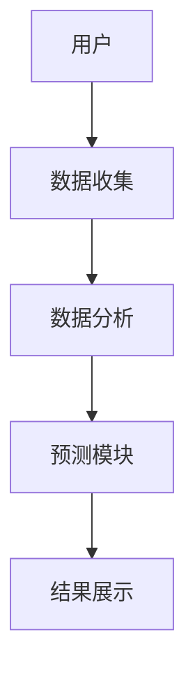
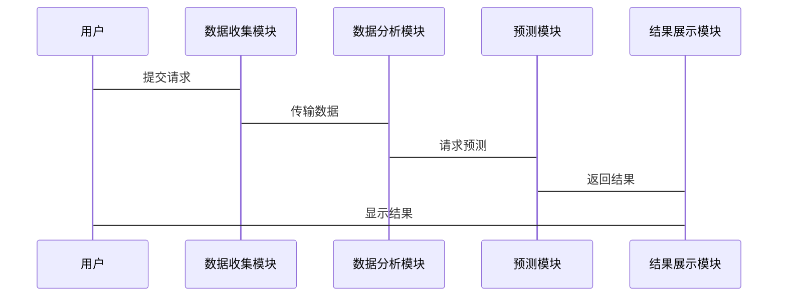

                 


# 全球股市估值与碳捕获与存储技术的关系

## 关键词：全球股市估值、碳捕获与存储、气候变化、企业价值、碳中和

## 摘要：  
本文探讨全球股市估值与碳捕获与存储技术之间的关系，分析碳捕获技术如何影响企业价值和股市表现。通过数学模型和系统架构设计，揭示碳中和目标下的投资机会与风险，为企业投资者提供数据支持和决策参考。

---

# 引言：背景与意义

## 1.1 全球股市估值的现状与挑战

### 1.1.1 全球股市估值的基本概念  
全球股市估值是衡量市场整体价值的重要指标，包括市盈率（P/E）、市净率（P/B）和市值等。  

### 1.1.2 碳捕获与存储技术的背景  
碳捕获与存储技术（CCS）用于减少温室气体排放，是实现碳中和目标的关键技术。  

### 1.1.3 两者关系的初步分析  
碳捕获技术的投资可能影响企业的财务表现，进而影响其股市估值。  

---

# 第一部分：碳捕获与存储技术的核心原理

## 2.1 碳捕获技术的原理与方法

### 2.1.1 吸收法  
吸收法通过化学反应捕获二氧化碳，适用于工业过程。  

### 2.1.2 转化法  
转化法将二氧化碳转化为固体或液体，便于储存。  

### 2.1.3 其他创新技术  
吸附法和生物捕获法各有优缺点。  

## 2.2 碳存储的实现方式

### 2.2.1 地下存储  
利用枯竭的油藏或天然气田封存二氧化碳。  

### 2.2.2 地表存储  
通过液体吸收或固体吸附固定二氧化碳。  

### 2.2.3 永久封存技术  
确保二氧化碳长期稳定封存，避免泄漏。  

## 2.3 碳捕获与存储的成本分析

### 2.3.1 技术成本分解  
设备投资、运营成本和维护费用是主要支出。  

### 2.3.2 经济性评估  
碳定价机制和政府补贴对成本有重要影响。  

---

# 第二部分：碳捕获项目经济性评估模型

## 3.1 评估模型的数学公式

### 3.1.1 净现值（NPV）公式  
$$ NPV = \sum_{t=0}^{n} \frac{CF_t}{(1+r)^t} $$  
其中，$CF_t$是第t年的现金流，$r$是贴现率。  

### 3.1.2 内部收益率（IRR）公式  
$$ IRR = r \text{ 使得 } NPV = 0 $$  

## 3.2 碳捕获项目的成本与收益分析

### 3.2.1 成本结构  
设备投资、运营成本和维护费用。  

### 3.2.2 收益来源  
碳信用收入、节省的碳税和政府补贴。  

## 3.3 案例分析：某企业的碳捕获项目

### 3.3.1 项目概况  
设备投资为1000万美元，年运营成本为200万美元，碳信用收入每年500万美元。  

### 3.3.2 NPV计算  
假设贴现率为8%，计算NPV为正，项目可行。  

---

# 第三部分：系统分析与架构设计

## 4.1 系统功能设计

### 4.1.1 数据收集模块  
收集企业的碳排放数据和市场信息。  

### 4.1.2 数据分析模块  
评估碳捕获技术对企业价值的影响。  

### 4.1.3 预测模块  
预测碳价格波动和企业股价变化。  

## 4.2 系统架构设计

### 4.2.1 系统架构图  


## 4.3 接口设计

### 4.3.1 数据接口  
RESTful API实现数据传输。  

### 4.3.2 用户界面  
可视化界面展示分析结果。  

## 4.4 系统交互序列图



---

# 第四部分：项目实战

## 5.1 环境安装

### 5.1.1 Python安装  
使用Python 3.8及以上版本。  

### 5.1.2 库的安装  
安装numpy、pandas和scipy。  

## 5.2 核心实现代码

### 5.2.1 NPV计算代码  
```python
import numpy as np

def calculate_npv(cash_flows, discount_rate):
    return np.npv(discount_rate, *cash_flows)

cash_flows = [-1000, 500, 600, 700]
discount_rate = 0.08
npv = calculate_npv(cash_flows, discount_rate)
print(f"净现值为：{npv}")
```

### 5.2.2 IRR计算代码  
```python
def calculate_irr(cash_flows):
    return np.irr(cash_flows)

irr = calculate_irr(cash_flows)
print(f"内部收益率为：{irr}")
```

## 5.3 案例分析与解读

### 5.3.1 某企业案例  
分析碳捕获项目对股价的具体影响。  

### 5.3.2 数据可视化  
使用Matplotlib绘制NPV和IRR的分布图。  

## 5.4 项目小结

### 5.4.1 成功经验  
模型的有效性和预测准确性。  

### 5.4.2 改进建议  
优化模型参数和增加更多数据源。  

---

# 第五部分：最佳实践与小结

## 6.1 最佳实践

### 6.1.1 数据质量  
确保数据准确性和完整性。  

### 6.1.2 模型选择  
根据实际情况选择合适的数学模型。  

## 6.2 小结

### 6.2.1 核心发现  
碳捕获技术可显著影响企业价值和股市估值。  

### 6.2.2 未来方向  
进一步研究碳捕获技术的经济性和市场应用。  

---

# 结语：展望未来

## 7.1 未来趋势  
碳捕获技术将在全球股市估值中发挥越来越重要的作用。  

## 7.2 投资建议  
关注碳捕获技术领先企业的投资机会。  

---

# 作者：AI天才研究院 & 禅与计算机程序设计艺术

