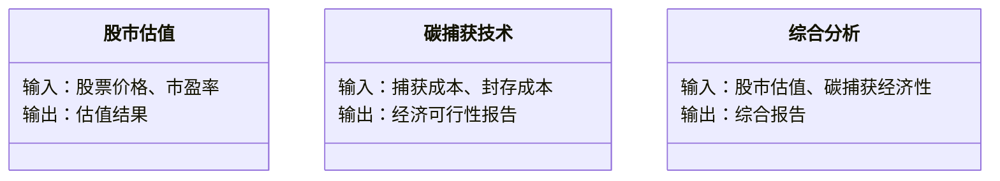
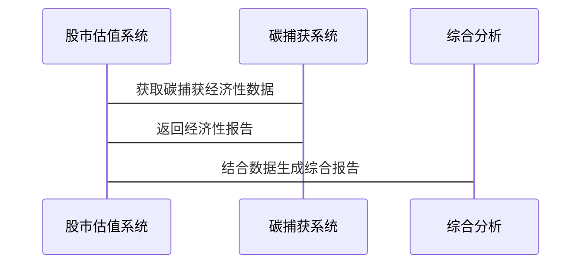

                 


# 全球股市估值与碳捕获与封存技术的经济可行性

> 关键词：全球股市估值，碳捕获与封存技术，经济可行性，股市分析，碳技术经济性

> 摘要：本文探讨了全球股市估值与碳捕获与封存技术的经济可行性之间的关系。通过分析股市估值的核心概念、影响因素以及碳捕获技术的经济可行性，结合数学模型和实际案例，探讨这两者如何相互影响，并为企业和社会提供可行性建议。

---

## 第1章: 全球股市估值概述

### 1.1 股市估值的基本概念

#### 1.1.1 股市估值的定义
股市估值是指对上市公司股票价值的评估，旨在确定其在市场上的合理价格。股票价格反映了企业的内在价值和市场参与者的预期。

#### 1.1.2 股市估值的核心要素
- **企业基本面**：收入、利润、资产、负债等。
- **行业地位**：行业竞争、市场占有率。
- **宏观经济环境**：GDP、利率、通货膨胀。
- **市场情绪**：投资者心理、市场趋势。

#### 1.1.3 股市估值的分类与特点
- **相对估值法**：市盈率（P/E）、市净率（P/B）。
- **绝对估值法**：现金流折现模型（DCF）。
- **技术分析**：K线图、趋势线、成交量。

### 1.2 全球股市估值的影响因素

#### 1.2.1 宏观经济因素
- **GDP增长**：经济繁荣推动股市上涨。
- **利率水平**：低利率环境下，股票更具吸引力。
- **通货膨胀**：适度通胀有利于股市，过高通胀则反之。

#### 1.2.2 行业因素
- **行业周期**：周期性行业波动较大，成长性行业更具潜力。
- **政策支持**：政府政策影响行业估值。

#### 1.2.3 公司基本面因素
- **盈利能力**：净利润率、ROE。
- **财务状况**：资产负债率、现金流。
- **管理团队**：高管能力、战略规划。

#### 1.2.4 市场情绪与投资者行为
- **市场情绪**：投资者乐观或悲观影响股价。
- **资金流动**：资金流入增加推动股价上涨。

---

## 第2章: 碳捕获与封存技术概述

### 2.1 碳捕获与封存技术的基本概念

#### 2.1.1 碳捕获与封存技术的定义
碳捕获与封存技术（CCS）是指将工业过程中产生的二氧化碳捕获并储存，防止其进入大气层的技术。

#### 2.1.2 碳捕获与封存技术的分类
- **燃烧后捕获**：烟气中的二氧化碳捕获。
- **燃烧前捕获**：燃料气体分离。
- **工业过程中捕获**：特定工业过程中的二氧化碳捕获。

#### 2.1.3 碳捕获与封存技术的核心要素
- **捕获技术**：吸收、吸附、膜分离。
- **运输**：管道输送或液化运输。
- **封存**：地下储存、海洋封存。

### 2.2 碳捕获与封存技术的经济可行性分析

#### 2.2.1 碳捕获与封存技术的成本构成
- **捕获成本**：设备投资、运营成本。
- **运输成本**：管道建设和维护。
- **封存成本**：储存地点评估、封存操作。

#### 2.2.2 碳捕获与封存技术的收益来源
- **碳信用**：通过减少碳排放获得碳信用。
- **政府补贴**：政策支持下的财政补贴。
- **技术授权**：技术转让的收入。

#### 2.2.3 碳捕获与封存技术的经济可行性评价指标
- **成本回收期**：投资回报周期。
- **净现值（NPV）**：投资的经济收益。
- **内部收益率（IRR）**：投资的盈利能力。

---

## 第3章: 碳捕获与封存技术的经济可行性分析方法

### 3.1 经济可行性分析的基本原理

#### 3.1.1 经济可行性分析的定义
通过经济指标评估项目在财务上的可行性和盈利能力。

#### 3.1.2 经济可行性分析的核心步骤
- **确定目标**：明确分析目的。
- **收集数据**：成本、收益、市场信息。
- **选择方法**：DCF模型、收益-成本分析。
- **计算评估**：净现值、内部收益率。

#### 3.1.3 经济可行性分析的关键指标
- **净现值（NPV）**：未来现金流的折现值减去初始投资。
- **内部收益率（IRR）**：资金的时间价值。
- **回收期**：投资回收所需时间。

### 3.2 碳捕获与封存技术的经济可行性模型

#### 3.2.1 模型的构建原理
通过DCF模型评估碳捕获项目的经济可行性。

#### 3.2.2 模型的输入变量与输出变量
- **输入变量**：初始投资、年现金流、贴现率。
- **输出变量**：净现值、内部收益率。

#### 3.2.3 模型的验证与优化
- **验证**：与实际案例对比。
- **优化**：调整参数，提高模型准确性。

---

## 第4章: 全球股市估值与碳捕获与封存技术的经济可行性关系分析

### 4.1 股市估值与碳捕获技术的相互作用

#### 4.1.1 碳捕获技术对企业估值的影响
- **正面影响**：降低碳排放成本，提升企业形象。
- **负面影响**：初期投资大，影响短期利润。

#### 4.1.2 碳捕获技术对行业估值的影响
- **行业竞争力**：技术领先的行业更具优势。
- **政策支持**：政府政策推动行业增长。

#### 4.1.3 碳捕获技术对整体股市估值的影响
- **绿色投资趋势**：投资者偏好环保企业。
- **市场预期**：技术创新推动股价上涨。

### 4.2 碳捕获技术的经济可行性对股市估值的影响

#### 4.2.1 经济可行性的提升对股市的影响
- **股价上涨**：技术成熟带来业绩增长。
- **投资者信心**：经济可行增强市场信心。

#### 4.2.2 经济可行性不足对股市的影响
- **股价下跌**：技术不成熟导致市场担忧。
- **投资减少**：经济不可行抑制市场投资。

---

## 第5章: 数学模型与算法实现

### 5.1 股市估值模型

#### 5.1.1 现金流折现模型（DCF）
$$ NPV = \sum_{t=1}^{n} \frac{CF_t}{(1+r)^t} - I $$

#### 5.1.2 市盈率模型
$$ P = \frac{P/E}{Earnings per Share} $$

### 5.2 碳捕获技术经济性模型

#### 5.2.1 成本-收益分析
$$ NPV = \sum_{t=1}^{n} \frac{Revenue_t - Cost_t}{(1+r)^t} $$

---

## 第6章: 系统分析与架构设计

### 6.1 系统功能设计

#### 6.1.1 领域模型（Mermaid 类图）


#### 6.1.2 系统架构设计（Mermaid 架构图）
```mermaid
container 股市估值系统 {
    组件 股票数据采集
    组件 估值模型计算
    组件 结果展示
}
container 碳捕获系统 {
    组件 捕获技术分析
    组件 经济性评估
    组件 数据存储
}
```

### 6.2 系统接口设计

#### 6.2.1 股市估值接口
- 输入：股票代码、日期范围。
- 输出：估值报告。

#### 6.2.2 碳捕获技术接口
- 输入：项目参数。
- 输出：经济可行性报告。

### 6.3 系统交互设计（Mermaid 序列图）


---

## 第7章: 项目实战

### 7.1 环境安装

#### 7.1.1 Python 环境安装
- 安装 Python 和相关库（pandas, numpy, matplotlib）。

### 7.2 核心实现源代码

#### 7.2.1 现金流折现模型实现
```python
def npv_calculator(cash_flows, discount_rate):
    npv = 0
    for t, cf in enumerate(cash_flows):
        npv += cf / (1 + discount_rate) ** t
    return npv
```

#### 7.2.2 碳捕获经济性模型实现
```python
def economic_feasibility(cost, revenue, discount_rate):
    npv = 0
    for t, (c, r) in enumerate(zip(cost, revenue)):
        npv += (r - c) / (1 + discount_rate) ** t
    return npv
```

### 7.3 案例分析与解读

#### 7.3.1 案例分析
假设某企业投资碳捕获技术，初始投资为1000万元，年收益为500万元，贴现率为5%。

#### 7.3.2 计算结果
$$ NPV = \frac{500}{1.05} + \frac{500}{1.05^2} + \cdots - 1000 \approx 100 \text{万元} $$

---

## 第8章: 结论与建议

### 8.1 结论
碳捕获技术的经济可行性对股市估值有重要影响。企业应加强技术研发，政府应提供政策支持。

### 8.2 建议
- **企业**：加大研发投入，优化成本结构。
- **政府**：制定支持政策，提供财政补贴。
- **投资者**：关注绿色投资趋势，合理评估企业价值。

### 8.3 展望
随着技术进步和政策支持，碳捕获技术将在未来发挥更大作用，股市估值也将更加反映绿色经济的价值。

---

## 作者：AI天才研究院/AI Genius Institute & 禅与计算机程序设计艺术 /Zen And The Art of Computer Programming

---

以上就是《全球股市估值与碳捕获与封存技术的经济可行性》的技术博客文章的完整目录和内容框架，希望对您有所帮助！

