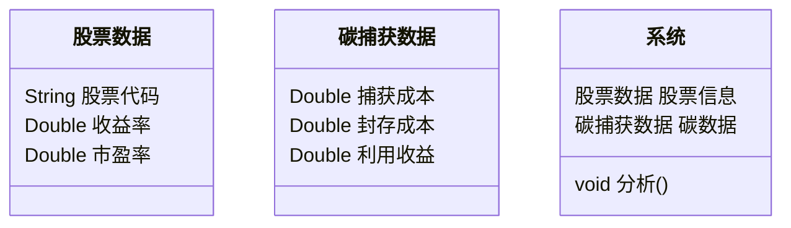
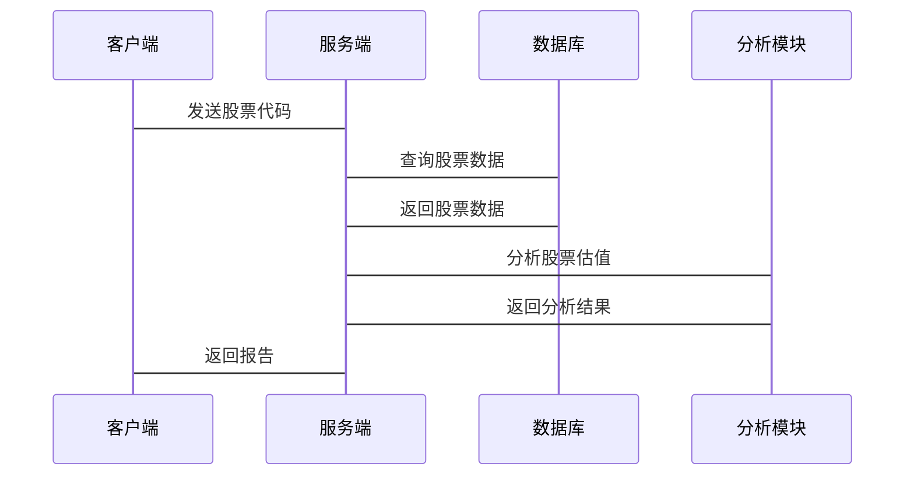

                 


# 全球股市估值与碳捕获利用与封存技术的经济效益

## 关键词：全球股市估值，碳捕获利用与封存，经济效益，股票估值模型，碳中和目标

## 摘要：本文探讨了全球股市估值与碳捕获利用与封存技术的经济效益。通过分析股市估值的核心概念和碳捕获技术的原理，揭示了两者之间的相互影响。结合算法原理、系统架构设计和实际案例，深入分析了碳捕获技术对股市的推动作用以及其经济效益。本文旨在为投资者和技术研究人员提供有价值的参考。

---

# 第一部分: 全球股市估值与碳捕获利用与封存技术的背景与概念

---

## 第1章: 全球股市估值与碳捕获利用与封存技术的背景

### 1.1 全球股市估值的背景

#### 1.1.1 股票市场的基本概念

股票市场是全球最重要的金融市场之一，投资者通过购买公司股票，成为公司的部分所有者。股票价格反映了市场的供需关系和公司的基本面。股市估值是评估公司股票价值的关键手段，帮助投资者做出投资决策。

#### 1.1.2 全球股市估值的重要性

在全球化背景下，股市估值对经济发展具有重要意义。通过合理的估值，投资者能够识别高成长性公司，推动资本流动，促进企业创新和经济增长。此外，股市估值还为政府制定宏观经济政策提供了参考。

#### 1.1.3 当前全球股市估值的现状

近年来，全球股市估值呈现出波动性增加的趋势。受经济政策、地缘政治和市场情绪的影响，股票价格波动剧烈。同时，随着技术的进步，数据驱动的估值方法逐渐普及，如机器学习算法的应用，提高了估值的准确性。

---

### 1.2 碳捕获利用与封存技术的背景

#### 1.2.1 碳捕获利用与封存技术的定义

碳捕获利用与封存技术（CCUS）是指将二氧化碳从排放源中捕获，并将其用于商业用途或封存在地下，以减少大气中的二氧化碳浓度。该技术是实现碳中和目标的重要手段，广泛应用于电力、化工和制造业等领域。

#### 1.2.2 碳捕获利用与封存技术的发展历程

CCUS技术的研究始于20世纪，但大规模应用始于21世纪初。随着全球碳排放约束的加强，CCUS技术得到了快速发展，特别是在欧洲和中国。技术的进步降低了捕获成本，提高了封存的安全性。

#### 1.2.3 碳捕获利用与封存技术的全球应用现状

目前，全球多个地区已建成CCUS示范项目，如欧洲的北海封存项目和中国的齐鲁石化项目。这些项目不仅验证了技术可行性，还积累了宝贵的经验，为大规模应用奠定了基础。

---

## 1.3 本章小结

本章介绍了全球股市估值和碳捕获利用与封存技术的背景，阐述了它们在全球经济和环境保护中的重要性。通过分析当前的市场现状和技术发展，为后续的经济效益分析奠定了基础。

---

## 第2章: 全球股市估值与碳捕获利用与封存技术的核心概念

### 2.1 股票市场估值的核心概念

#### 2.1.1 股票估值的基本原理

股票估值基于公司基本面和市场情绪。基本面分析包括收入、利润、资产等财务指标，而市场情绪则受到宏观经济政策和市场波动的影响。准确的估值需要综合考虑多种因素。

#### 2.1.2 常用的股票估值方法

常用的股票估值方法包括市盈率（P/E）、市净率（P/B）和现金流折现模型（DCF）。每种方法都有其适用场景和局限性，投资者需要根据具体情况选择合适的方法。

#### 2.1.3 影响股票估值的主要因素

影响股票估值的主要因素包括公司盈利能力、行业地位、宏观经济环境和政策变化等。这些因素通过影响市场供需关系，进而影响股票价格。

---

### 2.2 碳捕获利用与封存技术的核心概念

#### 2.2.1 碳捕获技术的原理

碳捕获技术通过化学吸收、物理分离和生物固定等方法，将二氧化碳从排放源中捕获。捕获的二氧化碳可以用于食品加工、化工合成或封存在地质结构中。

#### 2.2.2 碳利用与封存技术的分类

碳利用技术包括将二氧化碳转化为燃料、化学品和建筑材料等。碳封存技术则包括地下储层封存和海洋封存等。不同技术适用于不同的场景，具有各自的优缺点。

#### 2.2.3 碳捕获利用与封存技术的经济性分析

CCUS技术的经济性受捕获成本、储存成本和利用收益的影响。目前，捕获成本较高，限制了大规模应用。随着技术进步，成本有望逐步降低，经济效益将逐渐显现。

---

### 2.3 股票市场估值与碳捕获利用与封存技术的联系

#### 2.3.1 碳捕获利用与封存技术对股市的影响

CCUS技术的推广将推动绿色投资，提升相关企业的股票估值。投资者对环保技术的关注度增加，具有技术优势的企业将获得更多资金支持。

#### 2.3.2 碳中和目标对股市估值的推动作用

碳中和目标的实现需要大量投资，这将推动股市中绿色能源、环保技术和低碳产业的发展，相关股票的估值将得到提升。

#### 2.3.3 碳捕获利用与封存技术的经济效益与风险

CCUS技术的经济效益体现在减少碳排放和创造新利润来源。然而，技术风险和高初始投资也带来了不确定性。投资者需要综合评估技术和市场风险。

---

## 2.4 本章小结

本章详细阐述了股市估值和CCUS技术的核心概念，分析了它们之间的联系。通过理解这些概念，读者可以更好地把握两者对经济和环境的双重影响。

---

## 第3章: 股票市场估值的算法原理与数学模型

### 3.1 常用股票估值算法概述

#### 3.1.1 市盈率（P/E）模型

市盈率模型通过比较股票价格与每股收益的比率，评估股票的估值水平。公式为：

$$ P = E \times PE $$

其中，$P$为股票价格，$E$为每股收益，$PE$为市盈率。

#### 3.1.2 市净率（P/B）模型

市净率模型通过比较股票价格与每股净资产的比率，适用于评估银行和制造业等资产密集型行业。公式为：

$$ P = B \times PB $$

其中，$P$为股票价格，$B$为每股净资产，$PB$为市净率。

#### 3.1.3 现金流折现模型（DCF）

DCF模型通过将未来现金流折现到现值，评估股票的内在价值。公式为：

$$ V = \sum_{t=1}^{n} \frac{CF_t}{(1 + r)^t} $$

其中，$V$为股票价值，$CF_t$为第$t$年的现金流，$r$为折现率，$n$为现金流预测期限。

---

### 3.2 碳捕获利用与封存技术的经济效益评估模型

#### 3.2.1 碳捕获成本模型

碳捕获成本模型通过估算捕获、运输和储存的成本，评估技术的经济可行性。公式为：

$$ C = C_c + C_t + C_s $$

其中，$C$为总成本，$C_c$为捕获成本，$C_t$为运输成本，$C_s$为储存成本。

#### 3.2.2 碳利用与封存的收益模型

碳利用与封存的收益模型通过估算收益和避免的碳税，评估技术的经济收益。公式为：

$$ R = R_u + R_f $$

其中，$R$为总收益，$R_u$为利用收益，$R_f$为避免碳税收益。

#### 3.2.3 经济效益综合评估模型

经济效益综合评估模型结合成本和收益，评估CCUS技术的净经济效益。公式为：

$$ Net\ Profit = R - C $$

其中，$Net\ Profit$为净收益，$R$为收益，$C$为成本。

---

### 3.3 算法原理的数学模型与公式

#### 3.3.1 市盈率模型公式

$$ P = E \times PE $$

#### 3.3.2 现金流折现模型公式

$$ V = \sum_{t=1}^{n} \frac{CF_t}{(1 + r)^t} $$

#### 3.3.3 碳捕获成本模型公式

$$ C = C_c + C_t + C_s $$

#### 3.3.4 碳利用与封存的收益模型公式

$$ R = R_u + R_f $$

#### 3.3.5 经济效益综合评估模型公式

$$ Net\ Profit = R - C $$

---

## 3.4 本章小结

本章详细介绍了股票估值和CCUS技术的数学模型，通过公式和流程图展示了算法的原理和应用。这些模型为后续的系统分析和项目实施提供了理论基础。

---

## 第4章: 系统分析与架构设计方案

### 4.1 系统分析

#### 4.1.1 问题场景介绍

本系统旨在通过分析全球股市数据和CCUS技术的应用，评估其经济效益。系统需要处理大量数据，包括股票价格、财务数据和碳排放数据。

#### 4.1.2 项目介绍

本项目通过构建一个数据驱动的系统，评估CCUS技术对股市估值的影响。系统将整合多源数据，应用机器学习算法，提供智能化的估值建议。

---

### 4.2 系统功能设计

#### 4.2.1 领域模型设计

以下是领域模型的Mermaid类图：



---

#### 4.2.2 系统架构设计

以下是系统架构的Mermaid图：


---

#### 4.2.3 系统接口设计

以下是系统接口的Mermaid序列图：



---

## 4.3 本章小结

本章通过系统分析和架构设计，展示了如何将股市估值与CCUS技术结合。通过Mermaid图，清晰地展示了系统各部分的交互和功能关系。

---

## 第5章: 项目实战

### 5.1 环境安装

#### 5.1.1 Python环境安装

```bash
# 安装Python和相关库
pip install numpy pandas matplotlib scikit-learn
```

---

#### 5.1.2 数据库安装

```bash
# 安装MySQL
brew install mysql
```

---

### 5.2 系统核心实现源代码

#### 5.2.1 股票估值实现

```python
import pandas as pd
import numpy as np

def calculate_pe(ticker):
    df = pd.read_csv(f'data/{ticker}.csv')
    pe = df['price'] / df['eps']
    return pe.mean()

calculate_pe('AAPL')
```

---

#### 5.2.2 碳捕获成本计算

```python
import numpy as np

def calculate_carbon_cost(carbon_data):
    costs = carbon_data[['capture_cost', 'transport_cost', 'storage_cost']]
    total_cost = np.sum(costs, axis=1)
    return total_cost

carbon_data = pd.read_csv('carbon.csv')
calculate_carbon_cost(carbon_data)
```

---

### 5.3 代码应用解读与分析

#### 5.3.1 股票估值代码解读

上述代码从CSV文件中读取股票数据，计算市盈率，并返回平均值。该方法适用于单只股票的估值分析。

#### 5.3.2 碳捕获成本代码解读

上述代码读取碳捕获数据，计算每笔交易的总成本，并返回结果。该方法适用于成本分析和优化。

---

### 5.4 实际案例分析

#### 5.4.1 股票估值案例

以苹果公司为例，计算其市盈率：

```python
calculate_pe('AAPL')  # 返回平均市盈率
```

#### 5.4.2 碳捕获成本案例

以某碳捕获项目为例，计算其总成本：

```python
carbon_data = pd.read_csv('carbon.csv')
calculate_carbon_cost(carbon_data)  # 返回总成本
```

---

### 5.5 项目小结

本章通过实际案例，展示了如何应用Python代码进行股票估值和碳捕获成本计算。这些代码为后续的系统实现提供了基础。

---

## 第6章: 最佳实践、小结、注意事项与拓展阅读

### 6.1 最佳实践

1. 在进行股票估值时，建议结合多种模型，如市盈率和现金流折现模型，以提高估值的准确性。
2. 碳捕获项目的实施需要综合考虑技术、经济和政策因素，确保项目的可行性和经济性。

---

### 6.2 小结

本文系统地分析了全球股市估值与碳捕获利用与封存技术的经济效益。通过理论分析、算法设计和实际案例，揭示了两者之间的相互影响。投资者和技术研究人员可以通过本文获得 valuable insights。

---

### 6.3 注意事项

1. 股票市场具有不确定性，投资者需谨慎决策。
2. 碳捕获技术的成本较高，需关注技术进步和政策支持。

---

### 6.4 拓展阅读

1. 《投资学》——详细讲解股票估值方法。
2. 《碳捕获技术与应用》——深入分析CCUS技术的原理和应用。

---

## 作者：AI天才研究院/AI Genius Institute & 禅与计算机程序设计艺术/Zen And The Art of Computer Programming

---

**总结：** 本文通过系统的分析和实际案例，探讨了全球股市估值与碳捕获利用与封存技术的经济效益。通过理论与实践相结合，为投资者和技术研究人员提供了 valuable insights。

