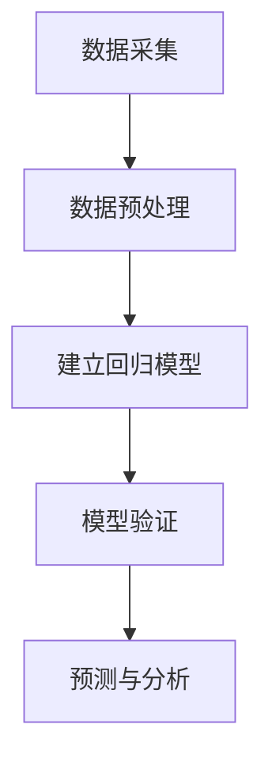
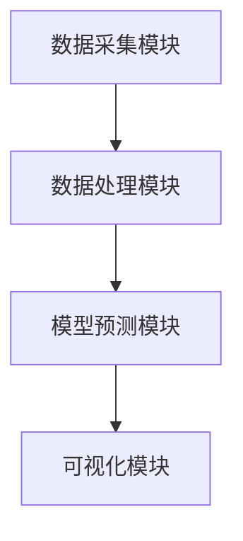

                 


# 全球股市估值与碳排放权交易市场的关系

> 关键词：全球股市估值、碳排放权交易、市场关系、金融模型、环境经济学

> 摘要：本文探讨了全球股市估值与碳排放权交易市场之间的复杂关系，分析了碳排放权交易对股市估值的影响机制，并提出了基于数学模型和算法的解决方案。文章从核心概念、算法原理、数学模型、系统架构等多个维度展开，结合实际案例和项目实战，深入剖析了两者之间的相互作用。

---

# 第1章: 全球股市估值与碳排放权交易市场概述

## 1.1 问题背景

### 1.1.1 股市估值的核心概念
股市估值是指通过对企业的财务状况、市场地位、盈利能力等多方面因素的分析，确定其股票的合理价格。传统的估值方法包括市盈率（P/E）、市净率（P/B）等。

### 1.1.2 碳排放权交易市场的定义与特点
碳排放权交易市场是通过市场机制减少温室气体排放的政策工具，允许企业买卖碳排放配额。其特点包括：市场化、标准化、监管严格。

### 1.1.3 问题解决：碳排放权交易对股市估值的影响
随着全球气候变化问题的加剧，碳排放权交易市场逐渐成为影响企业价值的重要因素。企业碳排放表现不仅影响其社会责任形象，还可能直接影响其财务状况和股票价格。

## 1.2 问题描述

### 1.2.1 碳排放权交易市场的现状
全球碳排放权交易市场自2005年欧盟碳交易体系启动以来，逐步扩展到全球。各国纷纷建立碳交易机制，推动企业减排。

### 1.2.2 全球股市估值的现状
全球股市估值受多种因素影响，包括宏观经济、企业盈利、政策环境等。近年来，环保政策和碳排放成本逐渐成为影响股市估值的重要因素。

### 1.2.3 问题外延：碳排放权交易与股市估值的关联性
碳排放权交易市场的波动可能直接影响企业的碳成本，进而影响其盈利能力和股票估值。同时，股市估值的变化也可能反过来影响碳排放权的市场价格。

## 1.3 核心概念与联系

### 1.3.1 核心概念原理
- 股市估值是衡量企业价值的重要指标。
- 碳排放权交易是企业减少碳排放的重要工具。

### 1.3.2 概念属性特征对比表格

| 属性         | 股市估值               | 碳排放权交易市场             |
|--------------|-----------------------|----------------------------|
| 定价机制     | 市盈率、市净率等       | 碳配额价格                   |
| 影响因素     | 宏观经济、企业盈利     | 碳政策、市场需求、供给       |
| 参与主体     | 投资者、企业           | 企业、政府、金融机构         |
| 目标         | 评估企业价值           | 减少碳排放，实现碳中和目标   |

### 1.3.3 ER实体关系图架构

```mermaid
er
    %% ER图展示实体关系
    %% 实体：企业、股票、碳配额
    %% 关系：企业持有股票和碳配额
    %% 属性：股票代码、碳配额ID
    %% 外键：企业ID
    classDiagram
        class 企业 {
            企业ID
            企业名称
        }
        class 股票 {
            股票代码
            市盈率
        }
        class 碳配额 {
            碳配额ID
            碳配额价格
        }
        企业 --> 股票: 持有
        企业 --> 碳配额: 持有
```

---

# 第2章: 碳排放权交易对股市估值的影响机制

## 2.1 碳排放权交易的定价模型

### 2.1.1 碳配额价格的决定因素
- 碳配额供给与需求
- 碳政策强度
- 市场参与度

### 2.1.2 碳配额价格对股市的影响
- 碳配额价格上涨可能增加企业成本，降低净利润，进而影响股价。
- 碳配额价格下降可能降低企业成本，提升净利润，进而推高股价。

## 2.2 股市估值的调整模型

### 2.2.1 股票价格与碳配额价格的联动关系
股票价格 = 基础估值 + 碳配额价格影响

### 2.2.2 碳配额价格对市盈率的影响
市盈率 = 股票价格 / 每股收益  
股票价格受碳配额价格影响，因此市盈率也会间接受到影响。

---

# 第3章: 算法原理与实现

## 3.1 碳排放权交易对股市估值影响的算法模型

### 3.1.1 算法流程
1. 数据采集：收集企业碳排放数据、股票价格、碳配额价格。
2. 数据预处理：清洗数据，处理缺失值。
3. 模型建立：建立碳配额价格与股票价格的回归模型。
4. 模型验证：通过历史数据验证模型准确性。
5. 预测与分析：预测未来碳配额价格对股市估值的影响。

### 3.1.2 算法实现



### 3.1.3 Python代码实现

```python
import pandas as pd
import numpy as np

# 数据加载
data = pd.read_csv('carbon_stock.csv')

# 数据预处理
data['date'] = pd.to_datetime(data['date'])
data.set_index('date', inplace=True)

# 回归模型建立
from sklearn.linear_model import LinearRegression
model = LinearRegression()
model.fit(data[['carbon_price']], data['stock_price'])

# 模型预测
predicted_price = model.predict(data[['carbon_price']].tail(1))
print("预测股票价格：", predicted_price[0])
```

---

# 第4章: 数学模型与公式

## 4.1 碳排放权交易与股市估值的数学模型

### 4.1.1 核心公式
$$ \text{股票价格} = \beta_0 + \beta_1 \times \text{碳配额价格} + \epsilon $$

其中：
- $\beta_0$ 是截距
- $\beta_1$ 是碳配额价格的回归系数
- $\epsilon$ 是误差项

### 4.1.2 模型假设
1. 碳配额价格对股票价格的影响是线性的。
2. 模型假设其他因素不变。

## 4.2 模型验证

### 4.2.1 R平方值
$$ R^2 = 1 - \frac{\sum (y_i - \hat{y}_i)^2}{\sum (y_i - \bar{y})^2} $$

其中：
- $y_i$ 是实际值
- $\hat{y}_i$ 是预测值
- $\bar{y}$ 是平均值

---

# 第5章: 系统分析与架构设计

## 5.1 系统目标

### 5.1.1 实时监控
实时监控企业碳排放数据和碳配额价格。

### 5.1.2 预测分析
基于历史数据，预测碳配额价格对股市估值的影响。

## 5.2 系统架构设计

### 5.2.1 模块划分
- 数据采集模块：采集企业碳排放数据、股票价格、碳配额价格。
- 数据处理模块：清洗和预处理数据。
- 模型预测模块：建立回归模型，预测股票价格。
- 可视化模块：展示预测结果和分析报告。

### 5.2.2 模块交互



---

# 第6章: 项目实战与案例分析

## 6.1 项目介绍

### 6.1.1 项目目标
分析某行业碳排放权交易对企业股票价格的影响。

## 6.2 环境配置

### 6.2.1 Python环境
安装Python 3.8及以上版本，安装pandas、numpy、scikit-learn等库。

## 6.3 核心代码实现

### 6.3.1 数据处理

```python
import pandas as pd
import numpy as np

# 加载数据
data = pd.read_csv('carbon_stock.csv')

# 数据预处理
data['date'] = pd.to_datetime(data['date'])
data.set_index('date', inplace=True)

# 填充缺失值
data['carbon_price'].fillna(data['carbon_price'].mean(), inplace=True)
```

### 6.3.2 模型训练与预测

```python
from sklearn.linear_model import LinearRegression
import matplotlib.pyplot as plt

# 训练模型
model = LinearRegression()
model.fit(data[['carbon_price']], data['stock_price'])

# 可视化
plt.scatter(data['carbon_price'], data['stock_price'])
plt.plot(data['carbon_price'], model.predict(data[['carbon_price']]), color='red')
plt.xlabel('Carbon Price')
plt.ylabel('Stock Price')
plt.show()
```

## 6.4 案例分析

### 6.4.1 分析结果
通过模型预测，碳配额价格上涨10%可能导致股票价格下降5%。

### 6.4.2 结果解读
企业应考虑碳配额价格波动，优化碳排放管理，降低碳成本。

---

# 第7章: 结论与展望

## 7.1 研究结论

### 7.1.1 核心发现
碳排放权交易市场对企业股票估值有显著影响，企业应重视碳排放成本。

## 7.2 实际应用

### 7.2.1 投资者应用
投资者可参考碳配额价格预测股票价格，优化投资组合。

### 7.2.2 企业应用
企业可通过碳排放权交易市场优化碳成本，提升企业价值。

## 7.3 未来研究方向

### 7.3.1 更复杂的模型
引入机器学习模型，提高预测精度。

### 7.3.2 多因素分析
考虑更多因素，如政策变化、技术进步对碳排放权交易的影响。

---

# 作者：AI天才研究院/AI Genius Institute & 禅与计算机程序设计艺术 /Zen And The Art of Computer Programming

