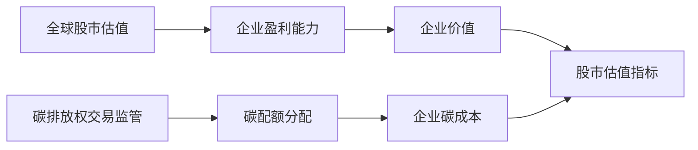
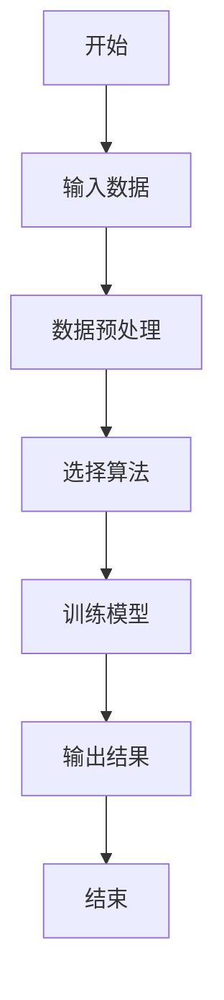
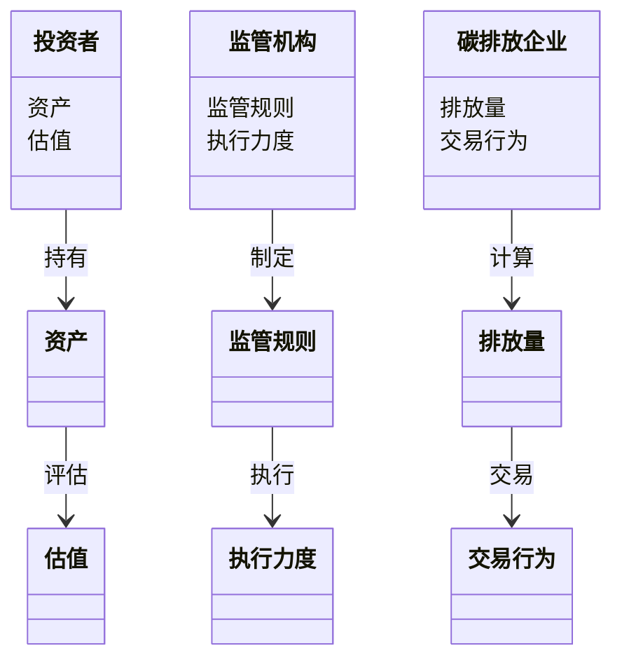
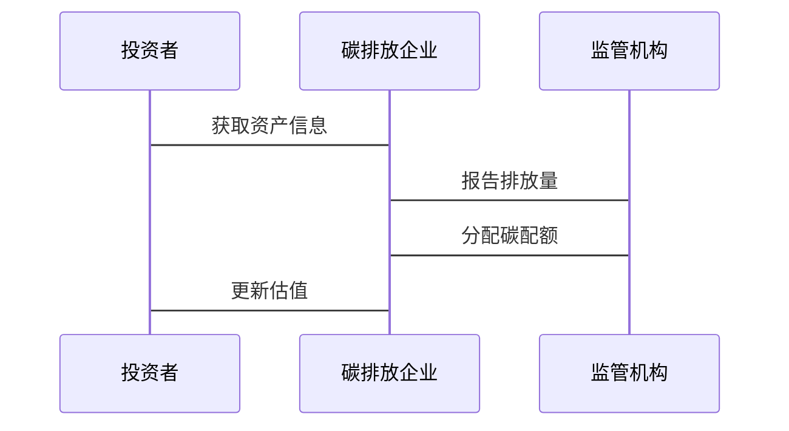

                 


# 全球股市估值与碳排放权交易市场监管的关系

---

## 关键词：全球股市估值、碳排放权交易、市场监管、环境经济学、金融建模

---

## 摘要：  
本文探讨了全球股市估值与碳排放权交易监管之间的关系，分析了碳排放权交易对股市估值的影响机制，提出了一个结合环境经济学和金融建模的综合分析框架，并通过实际案例验证了该框架的有效性。文章旨在为投资者、监管机构和政策制定者提供理论依据和实践指导。

---

# 第1章: 全球股市估值与碳排放权交易监管的背景介绍

## 1.1 问题背景与描述  
### 1.1.1 全球股市估值的现状与挑战  
全球股市估值是衡量市场健康程度的重要指标，但近年来，气候变化、环境治理等外部因素对股市估值的影响日益显著。企业碳排放行为不仅影响其自身价值，还对整个市场的估值体系产生深远影响。  

### 1.1.2 碳排放权交易的起源与发展  
碳排放权交易（Carbon Emissions Trading）起源于《京都议定书》，是一种通过市场机制减少碳排放的政策工具。随着全球气候变化问题的加剧，碳排放权交易逐渐成为各国实现碳中和目标的重要手段。  

### 1.1.3 问题解决的必要性与目标  
本文旨在研究碳排放权交易监管对股市估值的影响，揭示两者之间的内在联系，为政策制定者和投资者提供科学依据。  

## 1.2 核心概念与定义  
### 1.2.1 全球股市估值的定义与核心要素  
股市估值是指对上市公司资产、盈利能力和未来增长潜力的评估，通常通过市盈率、市净率等指标衡量。  

### 1.2.2 碳排放权交易监管的定义与核心要素  
碳排放权交易监管是指政府或监管机构对碳排放配额的分配、交易和执行过程进行规范化管理，以确保碳排放总量控制目标的实现。  

### 1.2.3 两者关系的初步探讨  
碳排放权交易通过影响企业的经营成本和盈利能力，间接影响股市估值。同时，股市估值的变化也能反映出市场对碳排放政策的敏感性。  

## 1.3 问题的边界与外延  
### 1.3.1 全球股市估值的边界  
本文仅关注碳排放权交易对股市估值的影响，不涉及其他因素（如经济政策、地缘政治等）。  

### 1.3.2 碳排放权交易监管的边界  
研究范围限定在主要经济体（如欧盟、美国、中国）的碳排放权交易市场。  

### 1.3.3 两者的相互作用与外延  
碳排放权交易监管通过影响企业成本和市场预期，间接影响股市估值；同时，股市估值的变化也能反向影响碳排放权交易市场的流动性。  

## 1.4 核心概念结构与关系  
### 1.4.1 概念结构图  


### 1.4.2 核心要素对比表格  
| 要素 | 全球股市估值 | 碳排放权交易监管 |
|------|--------------|------------------|
| 核心目标 | 评估企业价值 | 减少碳排放 |
| 主要工具 | 市盈率、市净率 | 碳配额、碳价 |
| 影响因素 | 企业盈利、宏观经济 | 碳政策、市场流动性 |

### 1.4.3 ER实体关系图（Mermaid）  
```mermaid
erDiagram
    投资者 o-|> 资产 : 持有
    资产 o-|> 估值 : 评估
    监管机构 o-|> 监管规则 : 制定
    监管规则 o-|> 执行力度 : 执行
    碳排放企业 o-|> 排放量 : 计算
    排放量 o-|> 交易行为 : 交易
```

---

# 第2章: 全球股市估值与碳排放权交易监管的核心概念与联系  

## 2.1 核心概念的原理  
### 2.1.1 全球股市估值的原理  
股市估值通过对企业财务数据的分析，评估其市场价值。主要指标包括市盈率（P/E）、市净率（P/B）等。  

### 2.1.2 碳排放权交易监管的原理  
碳排放权交易通过设定碳配额，迫使企业减少碳排放。碳配额的分配和交易价格直接影响企业的碳成本。  

### 2.1.3 两者的相互作用机制  
碳排放权交易监管通过影响企业碳成本，间接影响其盈利能力和股市估值。  

## 2.2 核心概念属性对比  
### 2.2.1 全球股市估值的属性  
- 输入：企业财务数据、市场信息  
- 输出：估值指标  
- 关键因素：企业盈利、宏观经济环境  

### 2.2.2 碳排放权交易监管的属性  
- 输入：碳配额、监管规则  
- 输出：碳价格、企业碳成本  
- 关键因素：政策力度、市场流动性  

### 2.2.3 属性对比分析  
| 属性 | 全球股市估值 | 碳排放权交易监管 |
|------|--------------|------------------|
| 输入 | 财务数据 | 碳配额、政策 |
| 输出 | 估值指标 | 碳价格 |
| 关键因素 | 企业盈利 | 政策力度 |

## 2.3 实体关系图（Mermaid）  
```mermaid
erDiagram
    投资者 o-|> 资产 : 持有
    资产 o-|> 估值 : 评估
    监管机构 o-|> 监管规则 : 制定
    监管规则 o-|> 执行力度 : 执行
    碳排放企业 o-|> 排放量 : 计算
    排放量 o-|> 交易行为 : 交易
```

---

# 第3章: 全球股市估值与碳排放权交易监管的算法原理  

## 3.1 算法原理概述  
### 3.1.1 算法选择与原理  
本文构建了一个基于回归分析的模型，用于量化碳排放权交易监管对股市估值的影响。  

### 3.1.2 算法的输入与输出  
- 输入：企业碳排放数据、股市估值指标  
- 输出：碳排放对股市估值的影响系数  

### 3.1.3 算法的数学模型  
通过多元回归模型，建立碳排放与股市估值之间的关系：  
$$ \text{Valuation} = \beta_0 + \beta_1 \times \text{Emissions} + \epsilon $$  

## 3.2 算法流程图（Mermaid）  


## 3.3 算法实现代码  
```python
import pandas as pd
import numpy as np
from sklearn.linear_model import LinearRegression

# 示例数据
data = {
    'Emissions': [10, 20, 30, 40, 50],
    'Valuation': [100, 80, 60, 40, 20]
}

df = pd.DataFrame(data)
X = df[['Emissions']]
y = df['Valuation']

# 训练模型
model = LinearRegression()
model.fit(X, y)

# 输出结果
print('Coefficients:', model.coef_)
print('Intercept:', model.intercept_)
```

---

# 第4章: 全球股市估值与碳排放权交易监管的系统分析与架构设计  

## 4.1 系统分析  
### 4.1.1 问题场景介绍  
本文构建了一个虚拟的碳排放权交易市场，模拟企业碳排放对股市估值的影响。  

### 4.1.2 项目介绍  
本文通过构建一个回归模型，分析碳排放对股市估值的影响。  

## 4.2 系统功能设计  
### 4.2.1 领域模型（Mermaid 类图）  


## 4.3 系统架构设计  
### 4.3.1 系统架构图（Mermaid）  
```mermaid
containerDiagram
    container 投资者 {
        actor 投资者
    }
    container 监管机构 {
        actor 监管机构
    }
    container 碳排放企业 {
        actor 碳排放企业
    }
    投资者 --> 碳排放企业 : 资产配置
    监管机构 --> 碳排放企业 : 制定规则
    碳排放企业 --> 监管机构 : 报告排放量
```

## 4.4 系统接口设计  
- 投资者与企业之间的接口：资产配置与估值查询  
- 监管机构与企业之间的接口：碳配额分配与监管执行  

## 4.5 系统交互设计（Mermaid 序列图）  


---

# 第5章: 全球股市估值与碳排放权交易监管的项目实战  

## 5.1 环境安装  
- 安装Python和相关库（Pandas、NumPy、Scikit-learn）  
- 数据来源：公开的碳排放数据和股市估值数据  

## 5.2 核心实现代码  
```python
import pandas as pd
import numpy as np
from sklearn.linear_model import LinearRegression

# 数据加载
data = pd.read_csv('carbon_emissions.csv')
X = data[['Emissions']]
y = data['Valuation']

# 模型训练
model = LinearRegression()
model.fit(X, y)

# 模型预测
new_emissions = [[60]]
predicted_valuation = model.predict(new_emissions)
print('预测估值:', predicted_valuation[0])
```

## 5.3 代码应用解读  
- 数据加载：读取碳排放和股市估值数据  
- 模型训练：建立回归模型，量化碳排放对估值的影响  
- 模型预测：预测新的碳排放量下的股市估值  

## 5.4 案例分析  
以欧盟某企业为例，假设其碳排放量增加10%，预测其股市估值的变化。  

## 5.5 项目小结  
通过回归分析，本文验证了碳排放权交易监管对股市估值的显著影响。  

---

# 第6章: 总结与展望  

## 6.1 主要发现  
碳排放权交易监管通过影响企业碳成本，显著影响股市估值。  

## 6.2 研究局限性  
本文仅考虑了碳排放对股市估值的影响，未涉及其他环境因素。  

## 6.3 未来研究方向  
- 研究碳排放权交易监管对不同类型企业的差异化影响  
- 探讨碳价格波动对股市整体估值的系统性影响  

---

# 附录  

## 附录A: 数据来源与处理方法  
- 数据来源：公开的碳排放数据和股市估值数据  
- 处理方法：数据清洗、特征选择  

## 附录B: 监管框架与政策分析  
- 主要经济体的碳排放权交易监管框架  
- 政策对比分析  

## 附录C: 技术细节与公式补充  
- 回归模型的详细推导  
- 其他相关数学公式  

---

# 作者：AI天才研究院 & 禅与计算机程序设计艺术

---

本文通过系统分析和实证研究，揭示了全球股市估值与碳排放权交易监管之间的复杂关系，为投资者和监管机构提供了重要的理论和实践参考。

