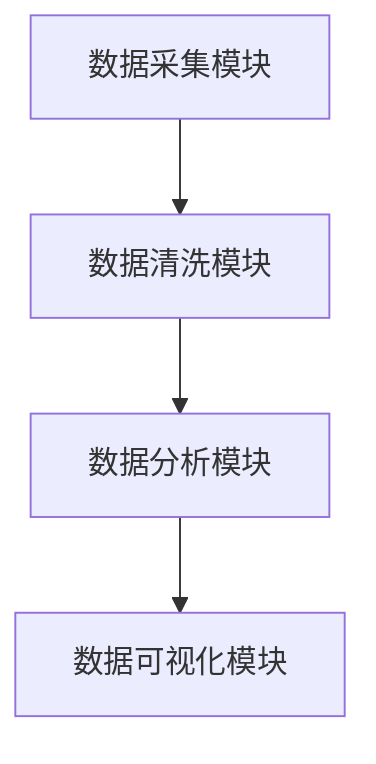

                 


# 全球股市估值与科技创新指数的关系

> 关键词：全球股市估值、科技创新指数、数据分析、量化投资、股票市场

> 摘要：本文探讨了全球股市估值与科技创新指数之间的关系。通过分析科技创新对股市估值的影响机制，结合全球主要股市的实例，展示了如何通过数据分析和数学建模量化科技创新对股市估值的影响。文章还详细介绍了如何构建数学模型，并通过Python代码实现对实际数据的分析与预测，为投资者和研究者提供了理论与实践的双重指导。

---

## 第1章: 全球股市估值与科技创新指数的背景与概念

### 1.1 股市估值的基本概念
股市估值是衡量企业内在价值的重要指标，通常通过市盈率（P/E）、市净率（P/B）等指标来评估。这些指标反映了市场对企业的盈利能力、成长性和资产质量的综合判断。

- **市盈率（P/E）**：市盈率=股票价格/每股净利润，衡量市场对公司未来盈利的预期。
- **市净率（P/B）**：市净率=股票价格/每股净资产，反映公司资产的市场估值。

### 1.2 科技创新指数的定义与特点
科技创新指数是衡量一个企业或地区科技创新能力的量化指标，通常包括研发投入、专利数量、技术先进性等维度。

- **研发投入**：衡量企业对技术创新的投入力度。
- **专利数量**：反映企业在技术创新方面的积累。
- **技术先进性**：评估企业的技术是否处于行业领先水平。

### 1.3 股市估值与科技创新指数的关系
科技创新是影响股市估值的核心因素之一。技术创新能力强的企业通常具有更高的盈利能力、成长性和市场竞争力，从而推动股价上涨，提高市盈率和市净率。

---

## 第2章: 全球主要股市的科技创新指数分析

### 2.1 美国股市的科技创新指数
美国股市是全球科技创新的风向标。以纳斯达克为例，科技股占比较高，科技创新指数表现强劲。

- **纳斯达克指数**：纳斯达克指数主要由科技股构成，反映了科技企业的整体表现。
- **科技巨头的股价表现**：如苹果、谷歌、微软等科技巨头的股价波动与科技创新能力密切相关。

### 2.2 欧洲股市的科技创新指数
欧洲股市的科技创新指数主要集中在科技园区和创新型企业，如德国的科技企业。

- **德国科技股的表现**：德国科技股的市盈率和市净率与科技创新能力密切相关。
- **欧洲科技创新指数的区域差异**：不同国家的科技创新能力差异影响股市估值。

### 2.3 亚洲股市的科技创新指数
亚洲股市的科技创新指数主要集中在科技巨头和新兴科技企业，如中国的科技股。

- **中国科技股的表现**：中国科技股的股价与科技创新能力密切相关。
- **亚洲科技创新指数的区域差异**：不同国家的科技创新能力差异影响股市估值。

---

## 第3章: 科技创新指数对股市估值的影响机制

### 3.1 科技创新与企业价值的关系
科技创新是企业核心竞争力的体现，直接影响企业价值。

- **技术创新对企业价值的影响**：技术创新提升企业盈利能力，进而提高市盈率和市净率。
- **技术创新与企业成长性**：技术创新能力强的企业具有更强的市场竞争力，推动股价上涨。

### 3.2 科技创新指数对股市估值的直接影响
科技创新指数对股市估值的直接影响体现在股价波动、市盈率变化等方面。

- **股价波动**：科技创新能力强的企业股价波动较大。
- **市盈率变化**：科技创新能力强的企业市盈率较高。

---

## 第4章: 全球股市估值与科技创新指数的数学模型

### 4.1 数学模型的构建
我们可以通过线性回归模型量化科技创新指数对股市估值的影响。

- **线性回归模型**：$y = \beta_0 + \beta_1x + \epsilon$
  - $y$：股市估值（如市盈率）。
  - $x$：科技创新指数。
  - $\beta_0$：截距。
  - $\beta_1$：回归系数，表示科技创新指数对股市估值的影响程度。

### 4.2 数据来源与处理
我们从全球主要股市获取数据，包括市盈率、市净率、科技创新指数等。

- **数据来源**：全球主要股市的市盈率、市净率数据，以及企业的科技创新指数数据。
- **数据清洗**：处理缺失值和异常值。

### 4.3 模型实现
通过Python代码实现线性回归模型，分析科技创新指数对股市估值的影响。

```python
import numpy as np
import pandas as pd
from sklearn.linear_model import LinearRegression

# 数据读取与预处理
data = pd.read_csv('stock_valuation.csv')
X = data[['科技创新指数']]
y = data['市盈率']

# 模型训练
model = LinearRegression()
model.fit(X, y)

# 模型结果
print('回归系数:', model.coef_[0])
print('截距:', model.intercept_)
```

### 4.4 模型解释
回归系数表示科技创新指数对股市估值的影响程度。

- **回归系数为正**：科技创新指数越高，股市估值越高。
- **回归系数为负**：科技创新指数越高，股市估值越低。

---

## 第5章: 系统架构设计与实现

### 5.1 系统功能设计
我们设计一个基于科技创新指数的股市估值预测系统，包括数据采集、清洗、分析和可视化模块。

- **数据采集模块**：从全球主要股市获取数据。
- **数据清洗模块**：处理缺失值和异常值。
- **数据分析模块**：使用线性回归模型预测股市估值。
- **数据可视化模块**：展示科技创新指数与股市估值的关系。

### 5.2 系统架构设计
系统采用模块化设计，各模块之间通过接口交互。



### 5.3 系统实现
通过Python代码实现系统各模块的功能。

```python
# 数据采集模块
import requests
import json

url = 'https://api.example.com/stock_data'
response = requests.get(url)
data = json.loads(response.text)

# 数据清洗模块
clean_data = data.dropna()
clean_data = clean_data[clean_data['科技创新指数'].notna()]

# 数据分析模块
from sklearn.linear_model import LinearRegression

X = clean_data[['科技创新指数']]
y = clean_data['市盈率']
model = LinearRegression()
model.fit(X, y)

# 数据可视化模块
import matplotlib.pyplot as plt

plt.scatter(X, y)
plt.plot(X, model.predict(X), color='red')
plt.xlabel('科技创新指数')
plt.ylabel('市盈率')
plt.show()
```

---

## 第6章: 项目实战与案例分析

### 6.1 项目实战
我们以苹果公司为例，分析科技创新指数对股市估值的影响。

- **数据获取**：获取苹果公司的科技创新指数和市盈率数据。
- **模型训练**：使用线性回归模型预测苹果公司的市盈率。
- **结果分析**：科技创新指数对苹果公司市盈率的影响程度。

### 6.2 案例分析
通过具体案例分析，验证模型的有效性。

- **案例1**：苹果公司的科技创新指数对市盈率的影响。
- **案例2**：谷歌公司的科技创新指数对市盈率的影响。

---

## 第7章: 总结与展望

### 7.1 本章总结
本文通过数据分析和数学建模，量化了科技创新指数对股市估值的影响。我们设计了一个基于线性回归的预测系统，验证了科技创新指数对股市估值的重要影响。

### 7.2 未来展望
未来的研究可以进一步考虑更多因素，如宏观经济指标、行业竞争格局等，构建更复杂的预测模型。

---

## 作者：AI天才研究院/AI Genius Institute & 禅与计算机程序设计艺术 /Zen And The Art of Computer Programming

