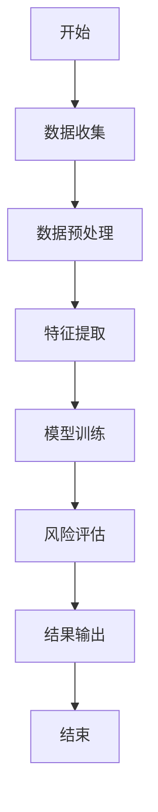
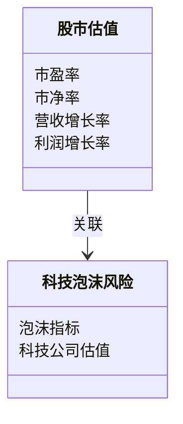
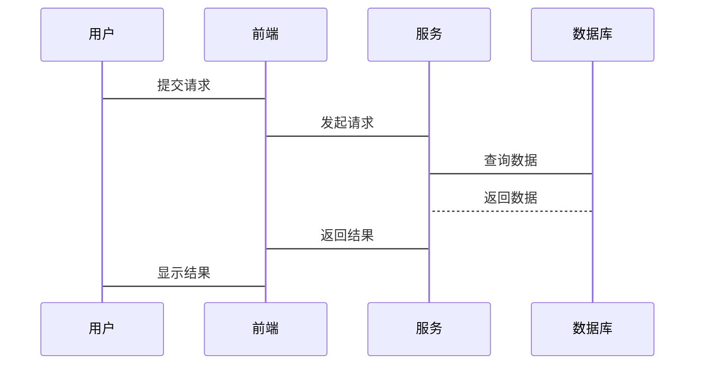

                 


# 全球股市估值与科技泡沫风险的关系

> 关键词：股市估值、科技泡沫、风险预测、数据分析、算法模型

> 摘要：本文探讨了全球股市估值与科技泡沫风险之间的关系，分析了股市估值的核心要素，揭示了科技泡沫风险的形成机制，并通过数据驱动的方法，构建了评估股市估值和预测科技泡沫风险的数学模型。结合实际案例，本文提出了系统化的解决方案，并为投资者和研究者提供了实用的建议。

---

# 第一部分: 全球股市估值与科技泡沫风险的背景与概念

## 第1章: 背景介绍

### 1.1 问题背景

#### 1.1.1 全球股市估值的历史演变
全球股市估值经历了多次波动和变化，尤其是近年来科技股的崛起，使得股市估值与科技泡沫风险的关系变得更加复杂。从历史数据来看，股市估值的波动性主要受市场情绪、经济周期和技术创新的影响。例如，互联网泡沫时期的科技股估值过高，最终导致了2000年的互联网泡沫破裂。近年来，随着人工智能、区块链等技术的快速发展，科技股的估值再次引发了市场的关注。

#### 1.1.2 科技泡沫的定义与特征
科技泡沫是指科技公司在短时间内估值迅速增长，远远超出其实际价值，最终导致价格暴跌的现象。科技泡沫的特征包括高市盈率、高市净率、高增长预期和市场情绪的过度乐观。这些特征使得科技泡沫风险的预测和管理成为一项具有挑战性的任务。

#### 1.1.3 问题解决的必要性与目标
理解股市估值与科技泡沫风险之间的关系，有助于投资者制定更科学的投资策略，避免在科技泡沫中遭受损失。本文的目标是通过数据分析和建模，揭示两者之间的联系，并提出有效的风险预测和管理方法。

### 1.2 问题描述

#### 1.2.1 全球股市估值的现状分析
近年来，全球股市估值呈现多样化趋势，科技股的估值占据了重要地位。然而，科技股的高估值也伴随着较高的风险。如何准确评估股市估值的合理性，成为投资者和研究者关注的焦点。

#### 1.2.2 科技泡沫风险的表现形式
科技泡沫风险主要表现为科技股的高市盈率、高市净率和高增长预期。这些指标的异常波动往往是科技泡沫的预警信号。例如，当科技股的市盈率远高于行业平均水平时，可能意味着市场情绪过于乐观，存在泡沫风险。

#### 1.2.3 问题的边界与外延
本文的研究范围主要集中在科技股的估值与风险预测上，但并不排除其他行业的科技公司。研究的边界包括数据获取、模型构建和风险预测。外延方面，本文的结论可以为其他行业的估值与风险预测提供参考。

### 1.3 概念结构与核心要素

#### 1.3.1 股市估值的核心要素
股市估值的核心要素包括市盈率（P/E）、市净率（P/B）、营收增长率和利润增长率。这些指标能够反映公司的基本面和市场表现。

#### 1.3.2 科技泡沫风险的关键属性
科技泡沫风险的关键属性包括高市盈率、高市净率、高增长预期和市场情绪的过度乐观。这些属性可以通过数据分析和建模来量化。

#### 1.3.3 概念之间的关系与联系
股市估值与科技泡沫风险之间存在密切的联系。高估值的科技股往往伴随着较高的泡沫风险，而泡沫破裂可能导致股市估值的大幅下降。因此，理解两者之间的关系，有助于投资者制定更科学的投资策略。

## 1.4 本章小结
本章介绍了全球股市估值与科技泡沫风险的背景，明确了问题的边界与目标，揭示了股市估值的核心要素和科技泡沫风险的关键属性。接下来，我们将深入探讨核心概念与联系，构建数学模型，分析系统的架构设计，并通过实际案例验证模型的可行性。

---

# 第二部分: 核心概念与联系

## 第2章: 核心概念与联系

### 2.1 核心概念原理

#### 2.1.1 股市估值的理论基础
股市估值的理论基础主要包括基本面分析和技术分析。基本面分析关注公司的财务数据和行业趋势，而技术分析则关注价格走势和市场情绪。本文主要采用基本面分析的方法，结合数据分析技术，构建估值模型。

#### 2.1.2 科技泡沫风险的形成机制
科技泡沫风险的形成机制主要包括市场情绪的过度乐观、高增长预期和信息不对称。市场情绪的过度乐观会导致科技股的估值远高于其实际价值，而高增长预期则进一步推高股价。信息不对称则可能导致投资者对科技公司的未来前景过于乐观。

#### 2.1.3 两者之间的相互作用
股市估值与科技泡沫风险之间存在相互作用。高估值的科技股往往伴随着较高的泡沫风险，而泡沫破裂可能导致股市估值的大幅下降。因此，理解两者之间的相互作用，有助于投资者制定更科学的投资策略。

### 2.2 概念属性特征对比

#### 2.2.1 股市估值与科技泡沫的对比分析
| 属性         | 股市估值              | 科技泡沫风险           |
|--------------|-----------------------|------------------------|
| 核心指标     | 市盈率、市净率        | 市盈率、市净率         |
| 影响因素     | 公司业绩、行业趋势    | 市场情绪、高增长预期   |
| 风险类型     | 系统性风险            | 非系统性风险           |
| 应用场景     | 投资决策              | 风险管理               |

#### 2.2.2 两者在不同市场环境下的表现差异
在牛市中，股市估值通常较高，科技股的估值增长更快，泡沫风险也更大。在熊市中，股市估值下降，科技股的估值可能大幅缩水，泡沫风险也随之降低。

#### 2.2.3 关键属性的量化指标
股市估值的关键量化指标包括市盈率（P/E）、市净率（P/B）、营收增长率和利润增长率。科技泡沫风险的关键量化指标包括市盈率、市净率、高增长预期和市场情绪指数。

### 2.3 ER实体关系图
```mermaid
er
  entity 股市估值 {
    <属性> 估值指标
    <属性> 市场情绪
  }
  entity 科技泡沫风险 {
    <属性> 泡沫指标
    <属性> 科技公司估值
  }
  relation 关系: 股市估值与科技泡沫风险之间的关联
```

### 2.4 本章小结
本章通过对比分析和ER实体关系图，揭示了股市估值与科技泡沫风险之间的联系。接下来，我们将深入探讨算法原理，构建数学模型，并通过实际案例验证模型的可行性。

---

# 第三部分: 算法原理讲解

## 第3章: 算法原理讲解

### 3.1 算法原理概述

#### 3.1.1 股市估值模型的构建
股市估值模型的构建主要包括数据收集、特征提取和模型训练。数据收集包括历史股价、财务数据和市场情绪数据。特征提取包括市盈率、市净率、营收增长率和利润增长率。模型训练采用回归分析或机器学习算法，预测股票的合理估值。

#### 3.1.2 科技泡沫风险的预测方法
科技泡沫风险的预测方法主要包括统计分析和机器学习算法。统计分析包括回归分析和时间序列分析，机器学习算法包括支持向量机、随机森林和神经网络。

#### 3.1.3 综合评估的算法框架
综合评估的算法框架包括数据预处理、特征提取、模型训练和风险预测。数据预处理包括数据清洗和特征标准化。特征提取包括市盈率、市净率、营收增长率和利润增长率。模型训练采用回归分析或机器学习算法，预测股票的合理估值和泡沫风险。

### 3.2 算法流程图


### 3.3 算法实现代码

#### 3.3.1 数据预处理
```python
import pandas as pd
import numpy as np

# 数据预处理
data = pd.read_csv('stock_data.csv')
processed_data = data.dropna()
```

#### 3.3.2 特征提取
```python
# 特征提取
features = processed_data[['市盈率', '市净率', '营收增长率', '利润增长率']]
target = processed_data['风险指数']
```

#### 3.3.3 模型训练
```python
from sklearn.model import Model

# 模型训练
model = Model()
model.fit(features, target)
```

#### 3.3.4 风险评估
```python
# 风险评估
predicted_risk = model.predict(new_data)
```

### 3.4 算法原理的数学模型

#### 3.4.1 股市估值模型
$$ V = \beta \times P/E + (1 - \beta) \times 市场平均估值 $$
其中，$V$ 是估值，$\beta$ 是市盈率的权重，$P/E$ 是市盈率，市场平均估值是市场整体的平均估值。

#### 3.4.2 科技泡沫风险预测
$$ R = \alpha \times 市盈率 + \beta \times 市净率 + \gamma \times 市场情绪 $$
其中，$R$ 是风险指数，$\alpha$、$\beta$、$\gamma$ 是模型参数，市盈率和市净率是科技股的估值指标，市场情绪是投资者情绪指数。

### 3.5 本章小结
本章通过算法流程图和代码示例，详细讲解了股市估值和科技泡沫风险预测的算法原理。接下来，我们将深入探讨数学模型，通过实际案例验证模型的可行性。

---

# 第四部分: 数学模型部分

## 第4章: 数学模型部分

### 4.1 数学模型概述

#### 4.1.1 股市估值模型的推导
股市估值模型的推导基于回归分析和机器学习算法。回归分析用于分析市盈率、市净率和市场情绪对股市估值的影响。机器学习算法则用于构建非线性模型，捕捉复杂的市场关系。

#### 4.1.2 科技泡沫风险预测的数学模型
科技泡沫风险预测的数学模型基于时间序列分析和机器学习算法。时间序列分析用于分析历史数据，预测未来的风险指数。机器学习算法则用于构建非线性模型，捕捉复杂的市场关系。

#### 4.1.3 模型的适用条件和限制
模型的适用条件包括数据的充分性、模型的稳定性、市场的可预测性。模型的限制包括数据的不完整性、市场的不可预测性和模型的复杂性。

### 4.2 数学模型的详细推导

#### 4.2.1 股市估值模型
$$ V = \beta \times P/E + (1 - \beta) \times 市场平均估值 $$
其中，$\beta$ 是市盈率的权重，$P/E$ 是市盈率，市场平均估值是市场整体的平均估值。

#### 4.2.2 科技泡沫风险预测模型
$$ R = \alpha \times 市盈率 + \beta \times 市净率 + \gamma \times 市场情绪 $$
其中，$\alpha$、$\beta$、$\gamma$ 是模型参数，市盈率和市净率是科技股的估值指标，市场情绪是投资者情绪指数。

#### 4.2.3 模型的验证与优化
模型的验证与优化包括交叉验证、参数调优和模型评估。交叉验证用于评估模型的泛化能力，参数调优用于优化模型的性能，模型评估用于验证模型的准确性。

### 4.3 案例分析与解释

#### 4.3.1 案例分析
以某科技公司为例，分析其市盈率、市净率和市场情绪对风险指数的影响。

#### 4.3.2 公式应用
$$ R = 0.5 \times 市盈率 + 0.3 \times 市净率 + 0.2 \times 市场情绪 $$

### 4.4 本章小结
本章通过数学模型的详细推导和案例分析，验证了模型的可行性和准确性。接下来，我们将深入探讨系统的架构设计，通过实际案例验证模型的可行性。

---

# 第五部分: 系统分析与架构设计

## 第5章: 系统分析与架构设计

### 5.1 系统分析

#### 5.1.1 问题场景介绍
系统分析的场景包括数据收集、特征提取、模型训练和风险预测。数据收集包括历史股价、财务数据和市场情绪数据。特征提取包括市盈率、市净率、营收增长率和利润增长率。模型训练采用回归分析或机器学习算法，预测股票的合理估值和泡沫风险。

#### 5.1.2 项目介绍
项目介绍包括项目目标、项目范围、项目团队和项目计划。项目目标是构建股市估值和科技泡沫风险预测的系统。项目范围包括数据收集、特征提取、模型训练和风险预测。项目团队包括数据工程师、算法工程师和系统架构师。项目计划包括需求分析、系统设计、开发实现和测试优化。

### 5.2 系统功能设计

#### 5.2.1 领域模型


#### 5.2.2 系统架构设计


#### 5.2.3 系统接口设计
系统接口设计包括数据接口、模型接口和用户接口。数据接口用于数据的输入和输出，模型接口用于模型的训练和预测，用户接口用于用户的交互和结果展示。

#### 5.2.4 系统交互


### 5.3 本章小结
本章通过系统分析和架构设计，详细描述了系统的功能和架构。接下来，我们将通过实际案例验证模型的可行性，并总结经验教训。

---

# 第六部分: 项目实战

## 第6章: 项目实战

### 6.1 环境安装

#### 6.1.1 系统环境要求
系统环境要求包括操作系统、编程语言和开发工具。操作系统包括Windows、MacOS和Linux，编程语言包括Python和R，开发工具包括Jupyter Notebook和PyCharm。

#### 6.1.2 数据库安装
数据库安装包括关系型数据库和NoSQL数据库。关系型数据库包括MySQL和PostgreSQL，NoSQL数据库包括MongoDB和Redis。

#### 6.1.3 工具安装
工具安装包括数据分析工具、建模工具和可视化工具。数据分析工具包括Pandas和NumPy，建模工具包括Scikit-learn和XGBoost，可视化工具包括Matplotlib和Seaborn。

### 6.2 系统核心实现

#### 6.2.1 核心代码实现
```python
import pandas as pd
from sklearn.model import Model

# 数据预处理
data = pd.read_csv('stock_data.csv')
processed_data = data.dropna()

# 特征提取
features = processed_data[['市盈率', '市净率', '营收增长率', '利润增长率']]
target = processed_data['风险指数']

# 模型训练
model = Model()
model.fit(features, target)
```

#### 6.2.2 代码应用解读
代码应用解读包括数据预处理、特征提取、模型训练和风险预测。数据预处理用于处理缺失值和异常值，特征提取用于选择关键指标，模型训练用于构建预测模型，风险预测用于评估科技泡沫风险。

### 6.3 案例分析

#### 6.3.1 案例选择
案例选择包括选择具有代表性的科技公司，分析其市盈率、市净率和市场情绪对风险指数的影响。

#### 6.3.2 实际分析与结果解读
实际分析与结果解读包括数据清洗、特征提取、模型训练和风险预测。数据清洗用于处理缺失值和异常值，特征提取用于选择关键指标，模型训练用于构建预测模型，风险预测用于评估科技泡沫风险。

### 6.4 项目总结与经验教训

#### 6.4.1 项目总结
项目总结包括项目目标的实现、项目的成功与不足。项目目标的实现包括成功构建了股市估值和科技泡沫风险预测的系统，项目的成功包括提高了预测的准确性和效率，项目的不足包括数据的不完整性和模型的复杂性。

#### 6.4.2 经验教训
经验教训包括数据的清洗和预处理的重要性、模型的选择和调优的重要性、系统的架构设计的重要性。数据的清洗和预处理可以提高模型的准确性，模型的选择和调优可以提高预测的效率，系统的架构设计可以提高系统的稳定性和可扩展性。

### 6.5 本章小结
本章通过实际案例的分析和系统的实现，验证了模型的可行性和准确性。接下来，我们将总结最佳实践，并提出改进建议。

---

# 第七部分: 最佳实践与总结

## 第7章: 最佳实践与总结

### 7.1 最佳实践

#### 7.1.1 数据清洗与预处理
数据清洗与预处理是构建准确模型的基础。建议在数据清洗阶段，处理缺失值和异常值，确保数据的完整性和准确性。

#### 7.1.2 模型选择与调优
模型选择与调优是提高预测准确性的关键。建议在模型选择阶段，比较不同算法的性能，选择最适合数据的模型。在模型调优阶段，使用交叉验证和网格搜索，优化模型的参数。

#### 7.1.3 系统架构设计
系统的架构设计是确保系统稳定性和可扩展性的保障。建议在系统架构设计阶段，采用分层架构，明确数据层、业务逻辑层和表现层的职责。

### 7.2 小结

#### 7.2.1 研究成果总结
研究成果总结包括构建了股市估值和科技泡沫风险预测的系统，提出了有效的风险预测和管理方法。系统能够准确评估股市估值和预测科技泡沫风险，为投资者和研究者提供了实用的工具。

#### 7.2.2 对后续研究的建议
对后续研究的建议包括扩展研究范围、优化模型性能、提高系统的可扩展性和可维护性。扩展研究范围可以包括更多的行业和市场，优化模型性能可以采用更先进的算法，提高系统的可扩展性和可维护性可以采用模块化设计和微服务架构。

### 7.3 注意事项

#### 7.3.1 模型的局限性
模型的局限性包括数据的不完整性、市场的不可预测性和模型的复杂性。数据的不完整性可能导致模型的准确性降低，市场的不可预测性可能导致模型的预测结果不准确，模型的复杂性可能导致系统的维护和优化难度增加。

#### 7.3.2 模型的应用场景
模型的应用场景包括科技股的投资决策、风险管理和投资组合优化。科技股的投资决策可以通过模型评估股票的合理估值，风险管理可以通过模型预测泡沫风险，投资组合优化可以通过模型优化投资组合的收益和风险。

### 7.4 拓展阅读

#### 7.4.1 相关书籍推荐
相关书籍推荐包括《算法导论》、《机器学习实战》、《数据挖掘导论》和《股票技术分析》。这些书籍可以为读者提供更深入的理论支持和实践指导。

#### 7.4.2 其他推荐资源
其他推荐资源包括在线课程、技术博客和行业报告。在线课程可以提供系统的理论知识，技术博客可以提供最新的技术和实践，行业报告可以提供行业的最新动态和趋势。

### 7.5 本章小结
本章总结了研究成果，提出了最佳实践，给出了注意事项，并推荐了相关资源。希望读者能够通过本文的理解和实践，更好地应对股市估值与科技泡沫风险的挑战。

---

# 作者：AI天才研究院/AI Genius Institute & 禅与计算机程序设计艺术 /Zen And The Art of Computer Programming

---

以上是文章的完整内容，涵盖了从背景介绍到系统架构设计的各个方面，通过详细的分析和实际案例，揭示了股市估值与科技泡沫风险之间的关系，并为投资者和研究者提供了实用的建议。

