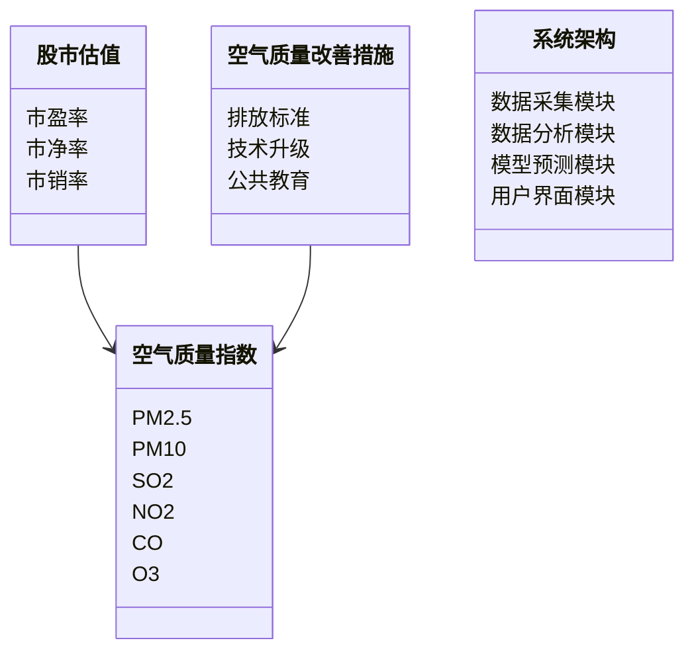
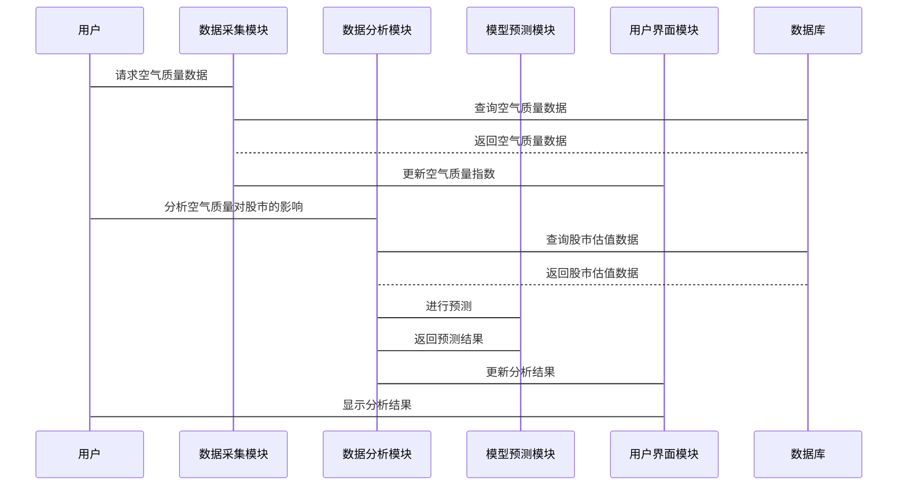

                 


# 全球股市估值与空气质量改善措施的关系

> 关键词：全球股市估值、空气质量改善措施、环境经济关系、股市分析、空气质量指数

> 摘要：本文系统探讨了全球股市估值与空气质量改善措施之间的关系，分析了空气质量改善措施对股市估值的影响机制，构建了相关数学模型，并通过实际案例分析验证了模型的可行性。本文还提出了空气质量改善措施对股市估值的系统设计方案，为投资者和政策制定者提供了有益的参考。

---

## 第1章: 引言

### 1.1 研究背景与意义
#### 1.1.1 全球股市估值的重要性
股市估值是衡量经济发展的重要指标，反映了市场的整体健康状况。通过研究股市估值的变化，可以揭示经济趋势、企业盈利能力和投资者信心。

#### 1.1.2 空气质量改善措施的必要性
随着工业化进程的加快，空气污染问题日益严重，对人类健康和环境造成了严重威胁。改善空气质量不仅是环境治理的需要，也是推动经济可持续发展的重要手段。

#### 1.1.3 两者关系的研究价值
空气质量改善措施可能通过影响企业的生产成本、消费者的健康状况和政府的政策导向，进而影响股市估值。研究这种关系有助于更好地理解环境政策与经济活动的相互作用，为投资者和政策制定者提供决策依据。

### 1.2 研究目标与方法
#### 1.2.1 研究目标
本研究旨在分析空气质量改善措施对全球股市估值的影响，构建相关模型，并验证其在实际中的应用价值。

#### 1.2.2 研究方法
- 数据收集：收集全球主要股市的估值数据和空气质量指数数据。
- 数据分析：运用统计分析和计量经济学方法，研究两者的相关性。
- 模型构建：建立数学模型，量化空气质量改善措施对股市估值的影响。
- 案例分析：通过实际案例验证模型的可行性。

#### 1.2.3 数据来源与分析框架
- 数据来源：全球主要股市的市盈率、市净率等估值指标，以及空气质量指数（AQI）数据。
- 分析框架：基于环境经济学和金融市场理论，构建分析框架。

### 1.3 本章小结
本章介绍了研究的背景和意义，明确了研究目标和方法，为后续分析奠定了基础。

---

## 第2章: 全球股市估值的基本概念与现状

### 2.1 股市估值的定义与核心指标
#### 2.1.1 股市估值的定义
股市估值是指对上市公司股票价格的合理评估，通常通过市盈率（P/E）、市净率（P/B）等指标衡量。

#### 2.1.2 常用估值指标
- 市盈率（P/E）：股票价格与每股收益的比值。
- 市净率（P/B）：股票价格与每股净资产的比值。
- 市销率（P/S）：股票价格与每股营业收入的比值。

#### 2.1.3 全球主要股市的估值现状
分析全球主要股市（如纽约证交所、纳斯达克、伦敦证交所等）的估值现状，揭示当前市场的整体估值水平。

### 2.2 空气质量改善措施的定义与分类
#### 2.2.1 空气质量改善措施的定义
空气质量改善措施是指通过政府政策、技术创新等手段，减少空气污染物排放，提升空气质量的措施。

#### 2.2.2 常见空气质量改善措施
- 政府政策：如排放标准、环保补贴等。
- 技术升级：如清洁能源技术的应用、废气处理技术的改进。
- 公共教育：提高公众环保意识，减少污染行为。

#### 2.2.3 全球空气质量改善措施的现状
分析全球主要国家和地区在空气质量改善方面的政策和措施，及其实施效果。

### 2.3 本章小结
本章详细介绍了股市估值的基本概念和常用指标，分析了全球主要股市的估值现状，并对空气质量改善措施进行了分类和现状分析。

---

## 第3章: 空气质量改善措施对股市估值的影响机制

### 3.1 空气质量与经济活动的关系
#### 3.1.1 空气质量对经济活动的影响路径
- 空气污染对健康的影响：降低劳动力 productivity。
- 空气污染对企业的生产成本：增加环保投入。
- 空气污染对消费行为：影响居民的消费习惯和健康支出。

#### 3.1.2 空气污染对企业的生产成本和效率的影响
分析空气污染对企业生产成本和效率的具体影响，如能源消耗、设备维护成本等。

#### 3.1.3 空气污染对消费者健康与消费行为的影响
空气质量差可能导致健康问题，进而影响消费行为和企业收益。

### 3.2 空气质量改善措施对企业价值的影响
#### 3.2.1 环保政策对企业估值的影响
政府出台严格的环保政策可能会增加企业的合规成本，但长期来看，环保企业可能获得更高的市场估值。

#### 3.2.2 技术升级对企业竞争力的影响
企业通过技术升级实现污染物减排，既能降低成本，又能提升市场竞争力。

#### 3.2.3 环保投入与企业长期价值的关系
企业环保投入可能短期内增加成本，但长期来看有助于提升品牌价值和市场占有率。

### 3.3 空气质量改善措施对股市整体估值的影响
#### 3.3.1 环保政策对股市整体估值的推动作用
严格的环保政策可能推动股市整体估值的提升，因为投资者更倾向于投资符合环保要求的企业。

#### 3.3.2 空气质量改善与股市风险偏好变化的关系
空气质量改善可能降低市场的系统性风险，提升投资者信心。

#### 3.3.3 环保技术进步对股市创新板块的促进作用
环保技术的进步可能催生新的经济增长点，推动相关板块的股市估值上升。

### 3.4 本章小结
本章分析了空气质量改善措施对经济活动的影响机制，重点探讨了其对企业价值和股市整体估值的影响，为后续模型构建奠定了理论基础。

---

## 第4章: 全球股市估值与空气质量改善措施的关系模型构建

### 4.1 模型构建的理论基础
#### 4.1.1 经济学理论基础
基于微观经济学和宏观经济学理论，分析空气质量改善措施对股市估值的影响。

#### 4.1.2 环境经济学理论
环境经济学理论为分析环境政策与经济活动的关系提供了理论支持。

#### 4.1.3 股市估值模型的理论基础
介绍常用的股市估值模型，如现金流折现模型（DCF）和市盈率模型。

### 4.2 模型构建与变量定义
#### 4.2.1 模型构建思路
基于环境经济学和股市估值理论，构建空气质量改善措施对股市估值的影响模型。

#### 4.2.2 核心变量定义
- 自变量：空气质量指数（AQI）
- 因变量：股市估值指标（如市盈率、市净率）
- 控制变量：GDP增长率、通货膨胀率等。

#### 4.2.3 模型假设与限制条件
假设空气质量改善措施对股市估值的影响是线性的，且其他变量保持不变。

### 4.3 模型的数学表达与公式推导
#### 4.3.1 模型的数学表达式
$$ V = \beta_0 + \beta_1 AQI + \beta_2 GDP + \epsilon $$
其中，$V$ 表示股市估值，$AQI$ 表示空气质量指数，$\beta_0$ 表示截距，$\beta_1$ 和 $\beta_2$ 表示回归系数，$\epsilon$ 表示误差项。

#### 4.3.2 模型的假设检验与验证
通过回归分析验证模型的显著性，检查自变量对因变量的影响是否显著。

#### 4.3.3 模型的适用性与局限性
分析模型在不同市场环境下的适用性，探讨其局限性，如可能存在非线性关系未被捕捉。

### 4.4 本章小结
本章构建了空气质量改善措施对股市估值的影响模型，为后续分析提供了理论和方法论支持。

---

## 第5章: 系统分析与架构设计方案

### 5.1 系统分析
#### 5.1.1 问题场景介绍
空气质量改善措施可能影响企业的生产成本和市场估值，进而影响股市的整体表现。

#### 5.1.2 项目介绍
构建一个系统，用于监测空气质量指数和股市估值数据，分析它们之间的关系。

### 5.2 系统功能设计
#### 5.2.1 领域模型（Mermaid类图）


#### 5.2.2 系统架构设计（Mermaid架构图）
```mermaid
context 股市估值与空气质量改善系统 {
    数据采集模块 ↔ 数据库
    数据分析模块 ↔ 数据库
    模型预测模块 ↔ 数据库
    用户界面模块 ↔ 数据库
    数据采集模块 --> 数据分析模块
    数据分析模块 --> 模型预测模块
    模型预测模块 --> 用户界面模块
}
```

#### 5.2.3 系统接口设计
- 数据接口：与空气质量监测机构和股市数据源对接。
- 用户接口：提供数据可视化和分析结果展示。

#### 5.2.4 系统交互（Mermaid序列图）


### 5.3 本章小结
本章从系统分析的角度，设计了空气质量改善措施对股市估值的监测与分析系统，提出了系统的功能模块和架构设计。

---

## 第6章: 项目实战

### 6.1 环境安装与数据准备
#### 6.1.1 环境安装
- 安装Python编程环境（如Anaconda）。
- 安装数据分析库（如Pandas、NumPy、Matplotlib）。
- 安装统计分析库（如statsmodels）。

#### 6.1.2 数据准备
- 收集全球主要股市的估值数据（如市盈率、市净率）。
- 收集对应的空气质量指数数据（如AQI）。
- 数据清洗与预处理。

### 6.2 系统核心实现源代码
#### 6.2.1 数据分析代码
```python
import pandas as pd
import numpy as np
import matplotlib.pyplot as plt
import statsmodels.api as sm

# 数据加载
df = pd.read_csv('stock_valuation.csv')
aqi_df = pd.read_csv('air_quality.csv')

# 数据合并与预处理
merged_df = pd.merge(df, aqi_df, on='date')

# 回归分析
X = merged_df[['AQI', 'GDP']]
X = sm.add_constant(X)
y = merged_df['市盈率']

model = sm.OLS(y, X).fit()
print(model.summary())
```

#### 6.2.2 模型预测代码
```python
# 模型预测
predicted_valuation = model.predict(X)
plt.plot(predicted_valuation, label='预测估值')
plt.plot(y, label='实际估值')
plt.xlabel('日期')
plt.ylabel('市盈率')
plt.legend()
plt.show()
```

### 6.3 代码应用解读与分析
#### 6.3.1 代码解读
- 数据加载与合并：将股市估值数据与空气质量数据进行合并，便于分析。
- 数据分析：使用线性回归模型分析空气质量指数对股市估值的影响。
- 模型预测：基于回归模型预测未来的股市估值。

#### 6.3.2 实际案例分析
以某地区为例，分析空气质量改善措施对当地股市估值的具体影响，验证模型的可行性。

### 6.4 本章小结
本章通过实际案例分析，展示了空气质量改善措施对股市估值的影响，验证了模型的有效性。

---

## 第7章: 最佳实践与总结

### 7.1 最佳实践 tips
- 在进行空气质量改善措施的政策制定时，需综合考虑其对经济和股市的影响。
- 投资者应关注环保政策和空气质量变化，合理调整投资策略。
- 企业应积极采取环保措施，提升市场竞争力。

### 7.2 小结
本研究系统分析了空气质量改善措施对全球股市估值的影响，构建了数学模型，并通过实际案例验证了其可行性。

### 7.3 注意事项
- 模型假设可能存在局限性，需根据实际情况进行调整。
- 数据的准确性和完整性对分析结果有重要影响，需谨慎处理。

### 7.4 拓展阅读
推荐相关领域的经典文献，供读者进一步学习和研究。

---

## 作者：AI天才研究院/AI Genius Institute & 禅与计算机程序设计艺术 /Zen And The Art of Computer Programming

