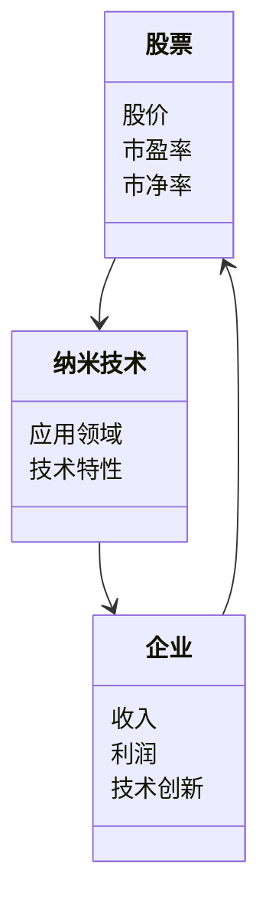
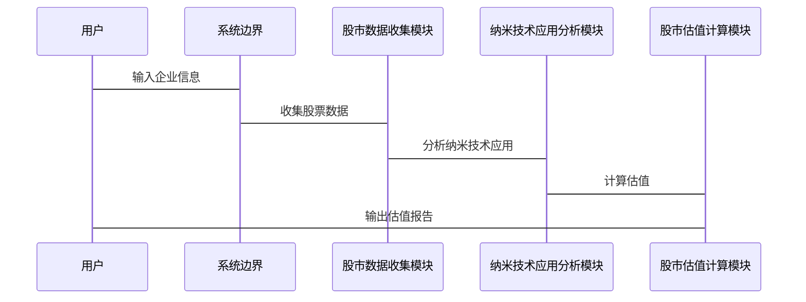

                 


# 全球股市估值与纳米技术应用的关系

> 关键词：全球股市估值，纳米技术应用，股市分析，技术影响，投资策略

> 摘要：本文探讨了全球股市估值与纳米技术应用之间的关系，分析了纳米技术如何影响股市估值，提供了详细的案例分析和系统架构设计，帮助投资者理解技术进步对投资决策的影响。

---

## 第1章: 全球股市估值与纳米技术应用的背景

### 1.1 股市估值的基本概念

#### 1.1.1 股市估值的定义与核心指标

股市估值是通过分析公司财务数据和市场因素，评估其股票的合理价格范围。核心指标包括：

- **市盈率（P/E）**：股价与每股收益的比率，反映市场对公司的盈利预期。
- **市净率（P/B）**：股价与每股净资产的比率，衡量股价与资产价值的关系。
- **股息率**：股息与股价的比率，反映投资回报潜力。

#### 1.1.2 影响股市估值的主要因素

- **宏观经济因素**：GDP增长率、利率、通货膨胀等。
- **公司基本面**：收入、利润、资产负债情况。
- **市场情绪**：投资者信心、市场流动性。

### 1.2 纳米技术的基本概念与应用领域

#### 1.2.1 纳米技术的定义与特点

纳米技术是指在纳米尺度（1-100纳米）操控物质的技术，具有微型化、高强度、高灵敏度等特点。

#### 1.2.2 纳米技术的应用领域

- **医疗领域**：纳米药物 delivery、生物传感器。
- **能源领域**：纳米材料用于高效电池和太阳能板。
- **材料科学**：高强度纳米复合材料。

### 1.3 纳米技术与股市估值的关系初探

#### 1.3.1 纳米技术对产业变革的推动作用

- 纳米技术提高了产品性能，降低了生产成本，推动产业升级。
- 纳米技术的应用为传统产业带来颠覆性创新。

#### 1.3.2 纳米技术对企业竞争力与盈利能力的影响

- 采用纳米技术的企业更具市场竞争力，盈利能力增强。
- 技术壁垒高，竞争对手难以模仿，提升企业市场份额。

#### 1.3.3 纳米技术对企业估值的潜在提升机制

- 纳米技术的应用增加了企业的未来收益预期，提升了市盈率。
- 纳米技术的高附加价值提升了企业的品牌影响力和市场地位。

---

## 第2章: 全球股市估值的理论基础与分析方法

### 2.1 股市估值的理论基础

#### 2.1.1 股票的内在价值与市场价值

- **内在价值**：基于公司未来现金流的现值，DCF模型是常用的评估方法。
- **市场价值**：受市场供需关系和投资者情绪影响。

#### 2.1.2 股票定价模型的原理与应用

- **DCF模型**：通过自由现金流折现计算企业价值，公式如下：
  $$
  \text{企业价值} = \sum_{t=1}^{n} \frac{\text{现金流}}{(1 + r)^t}
  $$
  其中，r是折现率，n是预测年限。

- **PEG比率**：市盈率与盈利增长率的比率，用于评估成长型企业估值的合理性。

#### 2.1.3 股票市场的波动性与投资者行为分析

- 市场波动性受宏观经济、政策、公司新闻等因素影响。
- 投资者行为包括情绪化决策和理性分析，影响市场的短期波动。

### 2.2 纳米技术应用的经济影响分析

#### 2.2.1 纳米技术对生产成本的降低作用

- 纳米材料的高效利用降低了生产过程中的材料浪费。
- 纳米技术优化了制造流程，降低了能耗和人工成本。

#### 2.2.2 纳米技术对产品性能提升的经济效益

- 纳米材料的应用提升了产品的性能，如更高的强度和更好的导电性，从而增加产品附加值。
- 纳米技术在医疗领域的应用提高了治疗效果，降低了医疗成本。

#### 2.2.3 纳米技术对传统产业的颠覆性影响

- 纳米技术的应用改变了传统行业的生产方式，如制造、材料科学等领域。
- 纳米技术推动了绿色经济的发展，促进了可持续发展。

### 2.3 纳米技术与股市估值的关联性分析

#### 2.3.1 纳米技术对企业创新能力和竞争优势的影响

- 采用纳米技术的企业在技术创新方面具有竞争优势，提升了企业的市场地位。
- 纳米技术的应用增强了企业的研发能力，提高了产品的市场竞争力。

#### 2.3.2 纳米技术对企业未来收益的预测与评估

- 纳米技术的应用提高了企业的未来收益预期，提升了市盈率。
- 纳米技术的高附加价值提升了企业的品牌影响力和市场地位。

#### 2.3.3 纳米技术对企业成长性的市场估值提升

- 纳米技术的应用展示了企业的成长潜力，吸引了更多的投资者。
- 纳米技术的广泛应用为企业的持续增长提供了动力。

---

## 第3章: 纳米技术在不同行业的应用与股市估值的影响

### 3.1 医疗行业中的纳米技术应用

#### 3.1.1 纳米药物 delivery系统的应用

- 纳米药物 delivery系统能够提高药物的靶向性和疗效，减少副作用。
- 例如，纳米脂质体用于抗癌药物的靶向 delivery，提升了治疗效果。

#### 3.1.2 纳米生物传感器的应用

- 纳米生物传感器用于疾病的早期检测，提高了诊断的准确性和效率。
- 例如，基于纳米材料的传感器能够快速检测疾病标志物。

### 3.2 能源行业中的纳米技术应用

#### 3.2.1 纳米材料在高效电池中的应用

- 纳米材料用于制造高效太阳能电池，提高了能量转换效率。
- 例如，纳米结构的太阳能电池板具有更高的光电转换效率。

#### 3.2.2 纳米技术在储能设备中的应用

- 纳米材料用于制造高能量密度的电池，延长电池寿命，提升储能能力。
- 例如，纳米碳材料用于超级电容器，提供了更高的储能能力和更快的充放电速度。

### 3.3 纳米技术在材料科学中的应用

#### 3.3.1 纳米复合材料的应用

- 纳米复合材料用于制造高强度、轻质的结构材料，如航空航天领域。
- 例如，纳米碳纤维复合材料用于制造高性能飞机部件，提升了飞机的性能和安全性。

#### 3.3.2 纳米涂层的应用

- 纳米涂层用于制造具有自清洁、防腐蚀等功能的表面材料。
- 例如，纳米涂层用于汽车零部件，提供了更好的防腐蚀性能和更低的维护成本。

### 3.4 纳米技术对股市估值的影响

#### 3.4.1 纳米技术的应用提升了企业的市场竞争力

- 纳米技术的应用使企业的产品更具竞争力，提高了市场份额。
- 例如，采用纳米技术的企业在医疗设备市场中占据了更大的份额，提升了企业的盈利能力。

#### 3.4.2 纳米技术的应用提高了企业的创新能力

- 纳米技术的应用展示了企业的技术创新能力，吸引了更多的投资者。
- 例如，纳米技术的研发投入使企业在未来的技术竞争中占据了优势，提升了企业的市场地位。

---

## 第4章: 系统分析与架构设计方案

### 4.1 问题场景介绍

- 纳米技术的应用对企业估值的影响是一个复杂的过程，涉及多个因素的相互作用。
- 需要构建一个系统模型，分析纳米技术对股市估值的影响路径。

### 4.2 系统功能设计

#### 4.2.1 领域模型（mermaid 类图）



#### 4.2.2 系统架构设计（mermaid 架构图）


#### 4.2.3 系统接口设计

- **输入接口**：接收企业财务数据和纳米技术应用数据。
- **输出接口**：提供股市估值报告和投资建议。

#### 4.2.4 系统交互设计（mermaid 序列图）



---

## 第5章: 项目实战

### 5.1 环境安装

- **工具安装**：安装Python、Pandas、Matplotlib、Scikit-learn等数据分析工具。
- **数据获取**：从金融数据提供商获取历史股价数据和企业财务数据。

### 5.2 核心实现源代码

```python
import pandas as pd
import numpy as np
import matplotlib.pyplot as plt
from sklearn.linear_model import LinearRegression

# 假设我们有一个包含股票数据和纳米技术应用评分的数据框 df
# df 包含 '股价'、'市盈率'、'市净率'、'纳米技术应用评分' 等列

# 使用线性回归模型预测股价与纳米技术应用评分的关系
model = LinearRegression()
model.fit(pd.DataFrame(df, columns=['纳米技术应用评分']), df['股价'])

# 预测股价
predicted_price = model.predict(pd.DataFrame(df, columns=['纳米技术应用评分']))

# 可视化结果
plt.scatter(df['纳米技术应用评分'], df['股价'], color='blue')
plt.plot(df['纳米技术应用评分'], predicted_price, color='red')
plt.xlabel('纳米技术应用评分')
plt.ylabel('股价')
plt.title('股价与纳米技术应用评分的关系')
plt.show()
```

### 5.3 代码应用解读与分析

- **数据获取**：从金融数据源获取相关股票的历史数据，包括股价、市盈率、市净率等。
- **数据预处理**：清洗数据，处理缺失值和异常值。
- **模型训练**：使用线性回归模型分析纳米技术应用评分与股价之间的关系。
- **结果可视化**：绘制散点图和回归线，直观展示两者的关系。

### 5.4 实际案例分析

- **案例1**：某医疗设备公司采用纳米技术提升了产品性能，股价在技术突破后显著上涨。
- **案例2**：某能源公司通过纳米技术优化了电池性能，市盈率和市净率均提升。

### 5.5 项目小结

- 通过实际案例分析，验证了纳米技术应用对股市估值的积极影响。
- 投资者应关注企业纳米技术应用的深度和广度，结合财务数据和市场趋势，做出理性投资决策。

---

## 第6章: 结论与展望

### 6.1 结论

- 纳米技术的应用显著提升了企业的市场竞争力和创新能力。
- 纳米技术对股市估值的影响是多方面的，包括市盈率、市净率等核心指标的提升。
- 投资者应关注纳米技术的应用对企业未来收益的影响，结合技术分析和基本面分析，做出科学的投资决策。

### 6.2 未来展望

- 纳米技术的进一步发展将推动更多行业的变革，带来更多的投资机会。
- 其他前沿技术如人工智能、区块链等也将与纳米技术结合，共同影响股市估值。
- 未来的研究可以深入探讨纳米技术在不同行业中的具体应用及其对股市估值的长期影响。

---

## 作者

作者：AI天才研究院/AI Genius Institute & 禅与计算机程序设计艺术 /Zen And The Art of Computer Programming

---

通过以上内容，我们系统地探讨了全球股市估值与纳米技术应用的关系，结合理论分析、案例研究和系统设计，为投资者提供了有价值的见解和指导。

