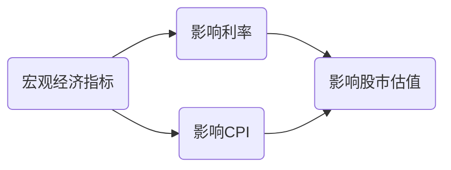
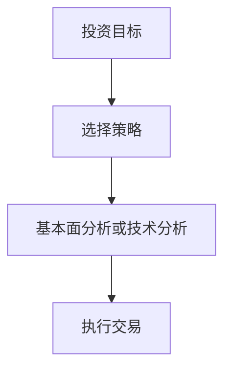
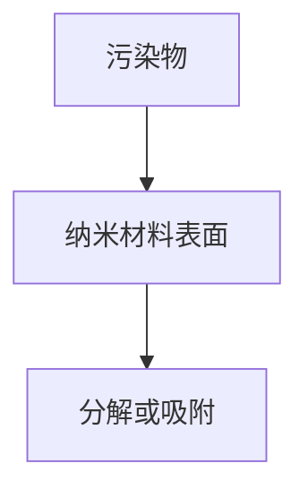
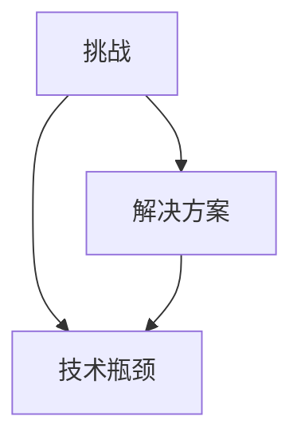
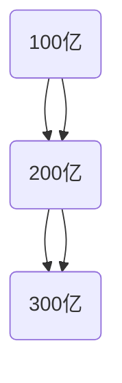
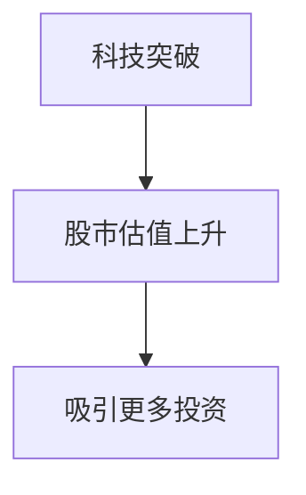

                 


# 全球股市估值与纳米材料在空气净化中的应用

---

## 关键词

- 全球股市估值
- 纳米材料
- 空气净化
- 投资分析
- 科技应用

---

## 摘要

本文探讨了全球股市估值的核心方法及其影响因素，并深入分析了纳米材料在空气净化中的应用。通过结合科技与金融的视角，文章揭示了纳米材料技术如何影响相关企业的市场估值，为投资者提供了新的视角和潜在的投资机会。

---

## 正文

### 第一部分：全球股市估值

#### 第1章：全球股市估值概述

##### 1.1 股市估值的基本概念

股市估值是评估公司股票价值的过程，旨在确定其合理的价格区间。核心概念包括内在价值、市场价值和公平价值。股市估值的重要性体现在帮助投资者做出明智的投资决策，降低投资风险。

##### 1.2 股市估值的核心指标

股市估值的关键指标包括市盈率（P/E）、市净率（P/B）和股息率。这些指标通过比较股票价格与公司业绩指标，帮助投资者评估股票的吸引力。

##### 1.3 股市估值的背景与意义

股市估值在金融市场的稳定性中起着关键作用，通过反映公司基本面和市场情绪，为投资者提供参考依据。

---

##### **图1.1：股市估值核心指标对比表**

| 指标名称 | 公式 | 适用场景 |
|----------|------|----------|
| 市盈率   | P/E = 价格/每股收益 | 评估成长型企业 |
| 市净率   | P/B = 价格/每股净资产 | 评估价值型企业 |
| 股息率   | Dividend Yield = 股息/股价 | 评估收益稳定型企业 |

---

#### 第2章：常用的股市估值方法

##### 2.1 基本分析法

基本分析法通过研究公司财务报表和行业状况来评估股票价值。关键步骤包括财务报表分析（利润表、资产负债表、现金流量表）和行业分析。

##### 2.2 技术分析法

技术分析法基于历史价格数据预测未来趋势，常用工具包括K线图、移动平均线和RSI指标。

##### 2.3 市场情绪分析

市场情绪分析通过投资者行为和市场指标评估市场情绪，帮助判断短期趋势。

---

##### **图2.1：技术分析中的K线图**

```mermaid
chart TD
    A[开] --> B[高]
    B --> C[低]
    C --> D[收]
```

---

#### 第3章：影响股市估值的主要因素

##### 3.1 宏观经济因素

宏观经济指标如GDP、CPI和利率对股市估值有直接影响。利率上升通常导致股市估值下降，反之亦然。

##### 3.2 公司特定因素

公司业绩、管理团队和竞争优势直接影响股票价值。盈利增长和成本控制是关键因素。

##### 3.3 市场流动性

市场流动性影响供需关系，进而影响股票价格。流动性充裕时，股市估值上升。

---

##### **图3.1：宏观经济因素影响股市估值的流程图**



---

#### 第4章：投资策略与风险管理

##### 4.1 价值投资策略

价值投资强调长期持有优质股票，关注公司基本面，寻找被市场低估的投资标的。

##### 4.2 技术交易策略

技术交易策略基于价格和成交量分析，适用于短期投资。

##### 4.3 风险管理

风险管理是投资成功的关键，包括分散投资、止损设置和定期 portfolio 再平衡。

---

##### **图4.1：投资策略选择流程图**



---

### 第二部分：纳米材料在空气净化中的应用

#### 第5章：纳米材料的基本概念与制备方法

##### 5.1 纳米材料的定义与性质

纳米材料是指尺寸在纳米尺度（1-100纳米）的材料，具有独特的物理和化学性质，如高比表面积和量子效应。

##### 5.2 纳米材料的制备方法

制备方法包括物理法（如球磨法）和化学法（如溶胶-凝胶法），每种方法都有其优缺点。

---

##### **图5.1：纳米材料制备方法比较**

| 方法名称 | 描述 | 优点 | 缺点 |
|----------|------|------|------|
| 球磨法   | 机械研磨 | 成本低 | 适用于简单形状 |
| 溶胶-凝胶法 | 化学合成 | 纯度高 | 成本高 |

---

#### 第6章：纳米材料在空气净化中的应用

##### 6.1 纳米材料的空气净化机制

纳米材料通过物理吸附、化学反应和催化作用净化空气，如去除甲醛和PM2.5。

##### 6.2 典型纳米材料的应用

常用纳米材料包括二氧化钛（TiO2）和氧化锌（ZnO），用于制备高效空气净化器。

---

##### **图6.1：纳米材料空气净化机制示意图**



---

#### 第7章：纳米材料应用的挑战与解决方案

##### 7.1 制备成本高

纳米材料的制备成本较高，解决方案包括优化工艺和批量生产。

##### 7.2 应用技术难度大

技术复杂性要求加强研发投入和人才培养。

---

##### **图7.1：纳米材料应用挑战与解决方案**



---

#### 第8章：纳米材料的商业化与市场前景

##### 8.1 纳米材料的商业化现状

纳米材料在空气净化领域的应用逐渐成熟，市场增长迅速。

##### 8.2 市场前景分析

随着环保需求增加，纳米材料市场前景广阔，预计未来几年将保持高增长率。

---

##### **图8.1：纳米材料市场增长预测图**



---

### 第三部分：全球股市估值与纳米材料应用的交叉影响

#### 第9章：科技与金融的互动

##### 9.1 纳米材料技术对股市的影响

纳米材料技术的突破可能提升相关企业的市场估值，吸引更多投资者关注。

##### 9.2 股市资金对纳米材料研发的支持

股市资金的流入为纳米材料技术的研发和商业化提供了资金支持。

---

##### **图9.1：科技与金融的相互作用**



---

## 作者

**作者：AI天才研究院 & 禅与计算机程序设计艺术**

---

以上是《全球股市估值与纳米材料在空气净化中的应用》的完整目录和文章内容。

