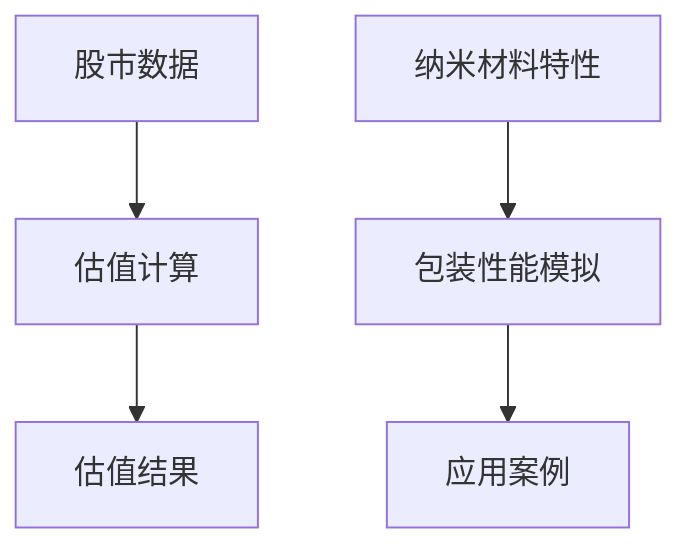

                 


# 全球股市估值与纳米材料在食品包装中的应用

---

## 关键词：全球股市估值、纳米材料、食品包装、股市分析、材料科学

---

## 摘要

本文探讨了全球股市估值与纳米材料在食品包装中的应用。首先，分析了股市估值的核心概念、影响因素及常用方法，结合实际案例深入解读。其次，介绍了纳米材料的特性及其在食品包装中的创新应用，如防腐、检测、环保等方面，结合数学模型和实验案例。最后，通过系统架构和项目实战，展示了如何将股市估值与纳米材料应用相结合，推动技术与经济的双重进步。

---

## 第一部分：全球股市估值

### 第1章：全球股市估值概述

#### 1.1 股市估值的基本概念

股市估值是指对上市公司股权价值的评估，通常通过市盈率（P/E）、市净率（P/B）等指标衡量。它是投资者决策的重要依据，影响股市的长期健康发展。

- **市盈率（P/E）**：计算公式为 $$\text{P/E} = \frac{\text{股价}}{\text{每股收益}}$$，反映了市场对公司的盈利预期。
- **市净率（P/B）**：计算公式为 $$\text{P/B} = \frac{\text{股价}}{\text{每股净资产}}$$，适用于资产密集型行业。

#### 1.2 股市估值的背景与现状

全球股市估值受宏观经济、行业周期和公司基本面影响。例如，2020年新冠疫情导致全球股市估值波动，但科技股估值上升，反映了市场对未来的信心。

#### 1.3 股市估值的核心要素

- **宏观经济**：GDP、利率、通货膨胀。
- **行业周期**：行业增长阶段影响估值。
- **公司基本面**：收入、利润、财务状况。

### 第2章：影响股市估值的主要因素

#### 2.1 宏观经济因素

- **GDP增长**：推动股市估值上升。
- **利率变化**：低利率环境抬高估值。
- **通货膨胀**：高通胀可能压低估值。

#### 2.2 行业因素

- **行业周期**：成熟行业估值稳定，新兴行业估值波动大。
- **行业政策**：政策支持提升估值。

#### 2.3 公司基本面因素

- **盈利能力**：高利润公司估值高。
- **财务状况**：健康的财务状况支撑高估值。
- **管理团队**：优秀管理团队带来高估值。

### 第3章：股市估值的方法与模型

#### 3.1 常用估值方法

- **相对估值法**：使用P/E、P/B等指标。
- **绝对估值法**：使用DCF模型。

#### 3.2 股权自由现金流模型

- **DCF模型**：计算公司未来现金流的现值。

$$\text{企业价值} = \sum_{t=1}^{n} \frac{\text{现金流}}{(1 + r)^t}$$

其中，r为折现率，n为预测年限。

#### 3.3 行业比较法

- 比较同行业公司估值，确定目标公司合理估值。

### 第4章：行业分析与案例

#### 4.1 行业分析

- **科技行业**：高增长，高估值。
- **金融行业**：受利率影响大。

#### 4.2 案例分析

- **苹果公司**：高市盈率，反映了市场对其创新能力和盈利能力的信心。

---

## 第二部分：纳米材料在食品包装中的应用

### 第5章：纳米材料的基本概念

#### 5.1 纳米材料的定义与特性

纳米材料是指尺度在纳米级别的材料，具有独特的物理和化学性质。例如，纳米级的金属氧化物具有抗菌性能。

#### 5.2 纳米材料在食品包装中的优势

- **防腐性**：纳米材料可抑制细菌生长。
- **检测性**：纳米传感器可检测食品中的有害物质。

### 第6章：纳米材料在食品包装中的具体应用

#### 6.1 纳米材料的防腐应用

- **纳米银**：用于食品包装，抑制细菌生长。
- **纳米氧化锌**：具有抗菌和防腐功能。

#### 6.2 纳米材料的检测应用

- **纳米传感器**：检测食品中的重金属和有害物质。

### 第7章：纳米材料在食品包装中的优势与挑战

#### 7.1 纳米材料的优势

- **环保性**：可降解，减少污染。
- **性能提升**：增强包装的机械和阻隔性能。

#### 7.2 纳米材料的挑战

- **成本问题**：纳米材料生产成本高。
- **健康风险**：纳米材料对人体和环境的影响需进一步研究。

### 第8章：纳米材料在食品包装中的未来趋势

#### 8.1 纳米材料的创新应用

- **智能包装**：具有温控和气体阻隔功能。
- **活性包装**：释放气体或化学物质，保持食品新鲜。

#### 8.2 纳米材料的可持续发展

- **绿色生产**：采用环保工艺生产纳米材料。

---

## 第三部分：系统架构与项目实战

### 第9章：系统架构设计

#### 9.1 系统功能设计

- **股市估值模块**：计算股票估值。
- **纳米材料应用模块**：模拟纳米材料在包装中的性能。

#### 9.2 系统架构图



### 第10章：项目实战

#### 10.1 环境配置

- **股市估值工具**：Python、Pandas、NumPy。
- **纳米材料模拟**：Matlab、COMSOL。

#### 10.2 核心实现代码

- **股市估值代码**：

```python
def calculate_pe(revenue, net_income):
    pe = revenue / net_income
    return pe
```

- **纳米材料模拟代码**：

```matlab
function stress = simulate_stress(nano_material, load)
    stress = nano_material * load;
end
```

#### 10.3 实验与结果分析

- **实验设计**：测试纳米材料在不同条件下的性能。
- **结果分析**：展示实验数据和图表。

### 第11章：小结与最佳实践

#### 11.1 小结

- 股市估值需结合宏观经济和公司基本面。
- 纳米材料在食品包装中具有广阔前景。

#### 11.2 最佳实践

- 定期更新股市估值模型。
- 加强纳米材料的环境影响研究。

---

## 结论

股市估值和纳米材料在食品包装中的应用都具有重要意义。股市估值帮助投资者做出明智决策，而纳米材料的应用提升了食品包装的性能和环保性。未来，随着技术进步，这两个领域将继续推动经济发展和科技创新。

---

## 作者

作者：AI天才研究院/AI Genius Institute & 禅与计算机程序设计艺术/Zen And The Art of Computer Programming

