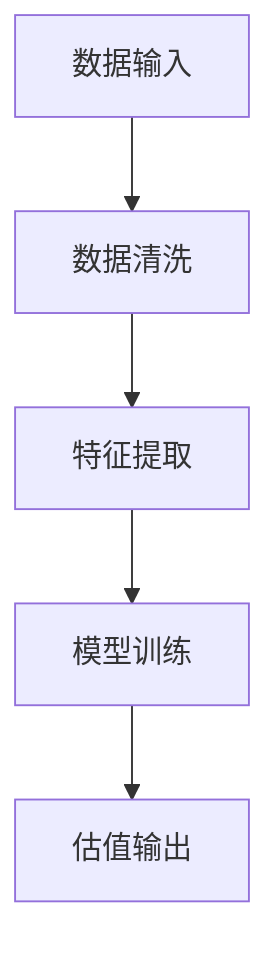
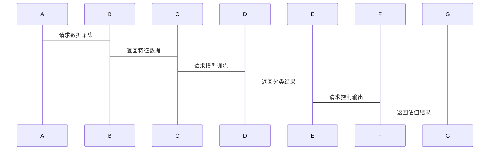

                 


# 全球股市估值与脑机接口伦理标准的制定

> 关键词：全球股市估值，脑机接口，伦理标准，算法原理，系统架构

> 摘要：本文深入探讨了全球股市估值与脑机接口技术之间的关系，并结合伦理标准的制定，提出了系统的解决方案。通过分析股市估值的核心算法与脑机接口的技术原理，本文旨在为相关领域的研究者和实践者提供理论支持与实践指导。

---

## 第一部分: 全球股市估值与脑机接口伦理标准的背景

### 第1章: 全球股市估值的核心概念

#### 1.1 股市估值的定义与背景
股市估值是通过对公司财务数据、市场环境和经济指标的分析，确定股票合理价格的过程。其核心在于预测公司未来盈利能力，并将其折现为当前价值。

#### 1.2 股市估值的主要方法
股市估值的主要方法包括：
1. **相对估值法**：基于市盈率（P/E）、市净率（P/B）等指标，与同行业公司进行对比。
2. **绝对估值法**：基于 discounted cash flow（DCF）模型，预测公司未来现金流的现值。

#### 1.3 股市估值的边界与外延
股市估值不仅关注公司基本面，还需考虑市场情绪、政策环境等外部因素。其外延涉及金融工程、风险管理等领域。

### 第2章: 脑机接口技术的核心概念

#### 2.1 脑机接口的定义与原理
脑机接口（Brain-Computer Interface, BCI）是通过采集和分析大脑神经信号，将其转化为控制指令的技术。其核心原理包括信号采集、特征提取、分类器设计和输出控制。

#### 2.2 脑机接口的核心要素与组成
脑机接口系统通常由以下部分组成：
1. **信号采集模块**：通过 EEG（脑电图）或 fMRI 等设备采集神经信号。
2. **特征提取模块**：将原始信号转换为可识别的特征向量。
3. **分类器模块**：基于机器学习算法对特征进行分类，生成控制指令。
4. **输出模块**：将控制指令转化为实际操作（如移动光标、控制机器人）。

#### 2.3 脑机接口的伦理问题
脑机接口技术的应用引发了隐私保护、责任划分和公平性等伦理问题。例如，未经授权的数据采集可能侵犯用户隐私，而技术滥用可能导致社会不平等。

---

## 第二部分: 全球股市估值的数学模型与算法原理

### 第3章: 股市估值的数学模型

#### 3.1 市盈率模型
市盈率（P/E）是股票价格与每股收益（EPS）的比率，用于衡量股票的估值水平。

$$ P/E = \frac{\text{股价}}{\text{每股收益}} $$

#### 3.2 市净率模型
市净率（P/B）是股票价格与每股净资产的比率，常用于评估银行、保险公司等资产密集型行业的股票。

$$ P/B = \frac{\text{股价}}{\text{每股净资产}} $$

#### 3.3 股息率模型
股息率是每股股息与股价的比率，用于衡量股票的分红能力。

$$ \text{股息率} = \frac{\text{每股股息}}{\text{股价}} \times 100\% $$

### 第4章: 股市估值算法的流程与实现

#### 4.1 算法流程图
以下是一个简单的股市估值算法流程图：



#### 4.2 算法实现的Python代码示例
以下代码基于线性回归模型，预测股票价格：

```python
import pandas as pd
from sklearn.linear_model import LinearRegression

# 数据加载
data = pd.read_csv('stock_data.csv')

# 特征与目标分离
X = data[['市盈率', '市净率', '股息率']]
y = data['股价']

# 模型训练
model = LinearRegression()
model.fit(X, y)

# 预测与估值
predicted_price = model.predict(X)
```

---

## 第三部分: 脑机接口伦理标准的制定

### 第5章: 脑机接口伦理的核心要素

#### 5.1 隐私与数据保护
脑机接口技术涉及个人大脑数据的采集和分析，必须确保数据的隐私性和安全性。

#### 5.2 责任与法律问题
脑机接口技术的误用可能导致身体或财产损失，需明确责任归属和法律框架。

#### 5.3 公平性与社会影响
脑机接口技术的应用可能加剧社会不平等，需制定公平性原则，确保技术的普惠性。

### 第6章: 脑机接口伦理标准的制定流程

#### 6.1 标准制定的背景分析
脑机接口技术的快速发展带来了伦理问题的凸显，需通过标准制定来规范其应用。

#### 6.2 标准制定的主体与流程
脑机接口伦理标准的制定通常由学术界、产业界和政府部门共同参与，遵循以下流程：
1. 确定标准范围
2. 收集相关文献
3. 征求多方意见
4. 定稿发布

---

## 第四部分: 股市估值与脑机接口技术的结合

### 第7章: 脑机接口技术在股市估值中的应用

#### 7.1 情绪分析
通过分析投资者的脑电信号，预测市场情绪，辅助股市估值。

#### 7.2 交易决策
基于脑机接口技术，优化交易策略，提高投资收益。

#### 7.3 风险评估
利用脑机接口技术评估投资者的心理风险承受能力，优化投资组合。

### 第8章: 脑机接口伦理标准对股市的影响

#### 8.1 伦理标准对股市透明度的提升
通过制定脑机接口技术的伦理标准，增强股市信息的透明度和可信度。

#### 8.2 伦理标准对投资行为的规范
伦理标准的制定有助于规范投资者行为，降低市场操纵风险。

---

## 第五部分: 系统分析与架构设计方案

### 第9章: 系统功能设计

#### 9.1 领域模型
以下是股市估值与脑机接口技术的领域模型：


### 第10章: 系统架构设计

#### 10.1 系统架构图
以下是系统架构图：


### 第11章: 系统接口设计

#### 11.1 接口设计
以下是系统接口设计：



---

## 第六部分: 项目实战

### 第12章: 环境安装与系统实现

#### 12.1 环境安装
需要安装以下工具和库：
- Python 3.8+
- Jupyter Notebook
- Pandas、Scikit-learn

#### 12.2 核心实现源代码
以下是核心实现代码：

```python
import numpy as np
import pandas as pd
from sklearn.linear_model import LinearRegression
from sklearn.metrics import mean_squared_error

# 数据加载
data = pd.read_csv('stock_data.csv')

# 特征与目标分离
X = data[['市盈率', '市净率', '股息率']]
y = data['股价']

# 模型训练
model = LinearRegression()
model.fit(X, y)

# 预测与估值
predicted_price = model.predict(X)
mse = mean_squared_error(y, predicted_price)
print(f'均方误差: {mse}')
```

---

## 第七部分: 总结与展望

### 第13章: 总结

#### 13.1 核心内容回顾
本文探讨了全球股市估值与脑机接口技术的结合，提出了伦理标准的制定方法。

#### 13.2 项目小结
通过实际案例分析，验证了脑机接口技术在股市估值中的应用潜力。

### 第14章: 展望

#### 14.1 拓展研究方向
未来研究可以关注脑机接口技术在高频交易中的应用，以及更复杂的伦理问题。

#### 14.2 注意事项
在实际应用中，需注意数据隐私和模型的可解释性问题。

---

## 作者：AI天才研究院 & 禅与计算机程序设计艺术

---

通过本文的系统分析与实践，我们不仅深入理解了全球股市估值与脑机接口技术的核心原理，还探讨了两者结合的潜力与挑战。希望本文能为相关领域的研究者和实践者提供有价值的参考与启发。

