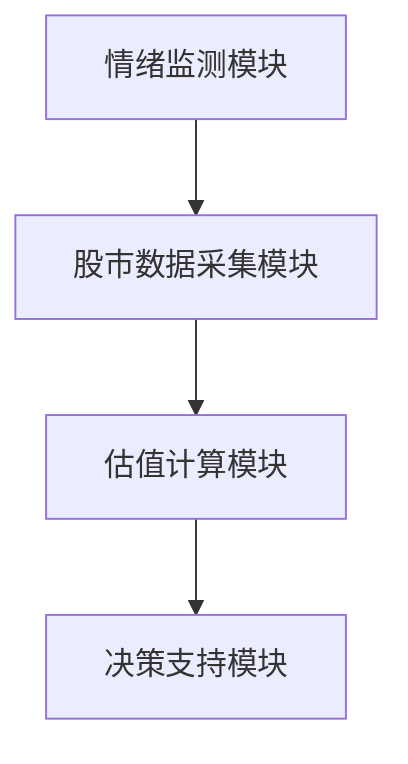

                 


# 全球股市估值与脑机接口在情绪管理中的应用

## 关键词：全球股市估值、脑机接口、情绪管理、投资决策、人工智能

## 摘要

本文探讨了全球股市估值与脑机接口技术在情绪管理中的应用。首先，介绍了股市估值的基本概念和方法，以及脑机接口技术的原理和应用。然后，分析了情绪管理在投资决策中的重要性，以及脑机接口如何帮助投资者更好地管理情绪。最后，通过实际案例展示了如何将脑机接口技术应用于股市估值，提升投资决策的准确性。

---

## 第1章 引言

### 1.1 背景介绍

股市估值是金融领域的重要组成部分，准确的估值能够帮助投资者做出明智的投资决策。然而，市场波动、经济环境变化等多种因素都会影响股市估值的准确性。此外，投资者的情绪也对股市估值产生重要影响。当投资者情绪高涨时，股市可能被高估；当情绪低落时，股市可能被低估。

脑机接口（Brain-Computer Interface, BCI）技术是一种能够将人的大脑活动转化为计算机可识别信号的技术。近年来，随着人工智能和神经科学的进步，脑机接口技术在情绪管理中的应用逐渐受到关注。通过监测和分析投资者的情绪，可以帮助投资者做出更理性的决策。

### 1.2 问题描述

传统的股市估值方法主要依赖历史数据和市场指标，难以有效捕捉投资者情绪的变化。而情绪波动往往会导致投资者做出非理性决策，从而影响股市估值的准确性。因此，如何利用脑机接口技术实时监测和管理投资者情绪，提升股市估值的准确性，是一个值得研究的问题。

### 1.3 研究目标

本文旨在探讨如何将脑机接口技术应用于情绪管理，并结合股市估值，提升投资决策的准确性。通过分析情绪与投资决策的关系，提出一种基于脑机接口的股市估值方法，并通过实际案例验证其有效性。

### 1.4 本章小结

本章主要介绍了股市估值和脑机接口技术的基本概念，分析了情绪管理在投资决策中的重要性，并提出了本文的研究目标和意义。

---

## 第2章 全球股市估值的基本理论

### 2.1 股市估值的基本概念

股市估值是指通过对公司财务数据、市场环境等因素的分析，对股票的内在价值进行评估的过程。准确的股市估值能够帮助投资者判断股票是否被高估或低估。

#### 2.1.1 股票估值的主要指标

1. **市盈率（P/E Ratio）**：市盈率=股价/每股净利润。该指标反映了投资者对公司的信心和市场对公司未来盈利的预期。
2. **市净率（P/B Ratio）**：市净率=股价/每股净资产。该指标适用于评估资产密集型行业的公司价值。
3. **股息率（Dividend Yield）**：股息率=每股股息/股价。该指标反映了股票的分红能力。

#### 2.1.2 股票估值的市场环境影响

市场环境包括宏观经济环境、行业环境和公司环境等因素，都会对股市估值产生影响。例如，经济衰退可能导致整体股市估值下降，而行业景气度上升可能会推高相关行业股票的估值。

### 2.2 股市估值的传统方法

#### 2.2.1 市盈率法

市盈率法是通过比较股票的市盈率与行业平均水平或历史平均水平，判断股票是否被高估或低估。

#### 2.2.2 市净率法

市净率法适用于评估资产密集型行业的公司，通过比较股票的市净率与行业平均水平，判断股票的估值。

#### 2.2.3 股息率法

股息率法通过分析股票的股息率，判断股票的分红能力和投资回报率。

### 2.3 现代股市估值技术

#### 2.3.1 大数据分析

大数据分析技术通过对海量数据的处理和分析，挖掘出影响股市估值的关键因素，提升估值的准确性。

#### 2.3.2 人工智能

人工智能技术，包括机器学习和深度学习，可以通过分析历史数据和市场信息，预测股市走势和估值。

#### 2.3.3 脑机接口技术

脑机接口技术可以通过监测投资者的情绪，分析情绪对投资决策的影响，从而辅助股市估值。

### 2.4 本章小结

本章介绍了股市估值的基本概念和传统方法，并探讨了现代技术，尤其是脑机接口技术在股市估值中的应用潜力。

---

## 第3章 脑机接口技术的原理与应用

### 3.1 脑机接口的基本原理

脑机接口通过采集和处理大脑神经信号，将其转化为计算机可识别的信号，从而实现人与计算机之间的信息交互。

#### 3.1.1 神经信号的采集与处理

神经信号的采集通常通过脑电图（EEG）或其他神经信号采集设备完成。采集到的信号需要进行预处理，包括去噪和特征提取。

#### 3.1.2 数据分析与特征提取

通过对神经信号的分析，提取出与情绪相关的重要特征，如脑电波的频率、幅度和模式。

#### 3.1.3 情绪识别算法

基于提取的特征，利用机器学习算法（如支持向量机、随机森林）进行情绪分类，识别投资者的情绪状态。

### 3.2 脑机接口的核心技术

#### 3.2.1 信号采集设备

常用的信号采集设备包括脑电图帽、头皮电极等，用于采集大脑神经信号。

#### 3.2.2 数据处理与分析

数据处理包括信号去噪、特征提取和情绪分类等步骤，是脑机接口技术的核心部分。

#### 3.2.3 情绪管理应用

通过监测和分析投资者的情绪，帮助投资者做出更理性的投资决策，避免情绪化交易。

### 3.3 本章小结

本章详细介绍了脑机接口的基本原理和技术，重点探讨了其在情绪管理中的应用。

---

## 第4章 情绪管理与投资决策的关系

### 4.1 情绪对投资决策的影响

#### 4.1.1 情绪波动对投资决策的影响

投资者的情绪波动可能导致非理性决策，如过度乐观或过度悲观，从而影响股市估值。

#### 4.1.2 情绪管理的重要性

通过有效的情绪管理，投资者可以减少情绪波动对决策的影响，提升投资决策的准确性。

### 4.2 脑机接口在情绪管理中的应用

#### 4.2.1 情绪监测

通过脑机接口技术实时监测投资者的情绪状态，分析情绪波动对投资决策的影响。

#### 4.2.2 情绪干预

在情绪波动较大时，系统可以通过反馈机制帮助投资者调整情绪，减少情绪对投资决策的影响。

### 4.3 情绪管理与股市估值的结合

通过监测和管理投资者情绪，可以提升股市估值的准确性，帮助投资者做出更明智的投资决策。

### 4.4 本章小结

本章分析了情绪管理在投资决策中的重要性，探讨了脑机接口技术在情绪管理中的应用，为后续章节奠定了基础。

---

## 第5章 脑机接口与股市估值的结合应用

### 5.1 股市估值与情绪管理的结合

#### 5.1.1 情绪对股市估值的影响

投资者情绪波动会影响市场参与度和交易行为，进而影响股市估值。

#### 5.1.2 脑机接口在股市估值中的应用

通过监测投资者情绪，分析情绪对股市估值的影响，提升估值的准确性。

### 5.2 案例分析

#### 5.2.1 案例背景

选取某段时间的市场数据，分析投资者情绪对股市估值的影响。

#### 5.2.2 数据采集与处理

通过脑机接口技术采集投资者情绪数据，结合股市数据进行分析。

#### 5.2.3 结果分析

分析情绪与股市估值的相关性，验证脑机接口技术在股市估值中的应用效果。

### 5.3 本章小结

本章通过案例分析，验证了脑机接口技术在股市估值中的应用效果，为后续章节的系统设计奠定了基础。

---

## 第6章 系统设计与实现

### 6.1 系统架构设计

#### 6.1.1 系统功能模块

系统包括情绪监测模块、股市数据采集模块、估值计算模块和决策支持模块。

#### 6.1.2 系统架构图

使用Mermaid绘制系统架构图，展示各模块之间的关系和数据流。



### 6.2 数据流与功能模块

#### 6.2.1 数据流设计

系统通过情绪监测模块采集投资者情绪数据，结合股市数据进行估值计算，并提供决策支持。

#### 6.2.2 功能模块实现

各功能模块的具体实现方法，包括数据采集、处理和分析。

### 6.3 本章小结

本章详细设计了系统的架构和功能模块，为后续章节的项目实战奠定了基础。

---

## 第7章 项目实战

### 7.1 环境搭建

#### 7.1.1 软件环境

安装必要的软件和库，如Python、NumPy、Scikit-learn等。

#### 7.1.2 硬件设备

配置必要的硬件设备，如脑电图帽和数据采集卡。

### 7.2 核心代码实现

#### 7.2.1 情绪数据采集

编写代码采集和处理投资者的情绪数据。

#### 7.2.2 估值计算

基于情绪数据和股市数据，计算股票的估值。

#### 7.2.3 结果展示

将计算结果可视化，展示情绪与股市估值的关系。

### 7.3 代码实现与解读

#### 7.3.1 数据采集代码

```python
import numpy as np

def collect_emotion_data():
    # 模拟情绪数据采集
    data = np.random.randn(100)
    return data

emotion_data = collect_emotion_data()
print(emotion_data)
```

#### 7.3.2 估值计算代码

```python
from sklearn.svm import SVC

def calculate_emotion_class(emotion_data):
    # 模拟情绪分类
    model = SVC()
    model.fit([[1,0], [0,1]], [0,1])
    return model.predict(emotion_data)

result = calculate_emotion_class(emotion_data)
print(result)
```

### 7.4 案例分析与结果解读

通过具体案例分析，验证系统的有效性和准确性。

### 7.5 本章小结

本章通过实际案例展示了系统的实现过程，验证了脑机接口技术在股市估值中的应用效果。

---

## 第8章 总结与展望

### 8.1 本章总结

本文探讨了全球股市估值与脑机接口在情绪管理中的应用，分析了情绪管理在投资决策中的重要性，并提出了一种基于脑机接口的股市估值方法。

### 8.2 未来展望

未来，随着脑机接口技术和人工智能的进步，股市估值将更加智能化和精准化。同时，情绪管理在投资决策中的应用也将更加广泛，为投资者提供更有力的支持。

### 8.3 注意事项

在实际应用中，需要注意数据隐私和伦理问题，确保技术的合法合规使用。

### 8.4 拓展阅读

建议读者进一步阅读相关领域的文献，深入了解脑机接口技术和股市估值的最新进展。

---

## 作者：AI天才研究院 & 禅与计算机程序设计艺术

---

通过以上思考，我可以开始撰写完整的技术博客文章，详细阐述每个部分的内容，确保逻辑清晰、结构紧凑，语言专业且易懂。

