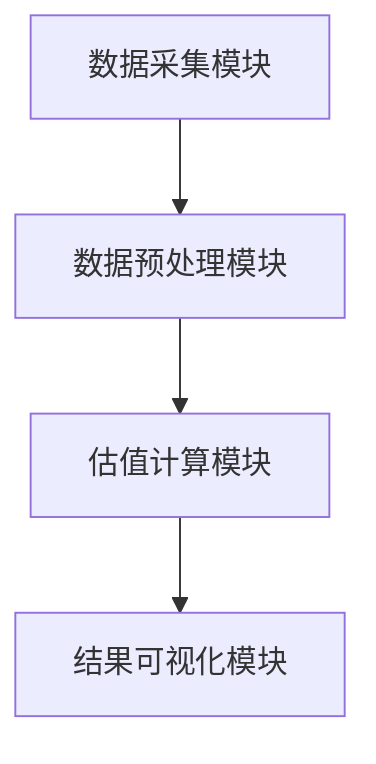

                 

# 全球股市估值与脑机接口在教育个性化中的应用

---

## 关键词：全球股市估值、脑机接口、教育个性化、股市分析、个性化学习

---

## 摘要

本文探讨了全球股市估值与脑机接口技术在教育个性化中的应用，分析了股市估值的核心方法及其技术实现，同时介绍了脑机接口技术在教育领域的潜力。文章从股市估值的基本概念出发，详细讲解了估值算法的数学模型与系统架构，并结合脑机接口技术的特点，分析了其在教育个性化中的应用前景。最后，文章总结了脑机接口技术如何优化股市估值模型，从而为教育个性化提供更精准的支持。

---

## 正文

### 第一部分：全球股市估值

#### 第1章：全球股市估值概述

##### 1.1 股市估值的基本概念

股市估值是通过对企业的财务数据和市场信息进行分析，估算其股票的合理价格范围。核心概念包括：

- **市盈率（P/E）**：市盈率 = 股票价格 / 每股净利润。  
- **市净率（P/B）**：市净率 = 股票价格 / 每股净资产。  
- **现金流折现法（DCF）**：DCF模型通过预测企业未来现金流，折现后计算企业价值。

##### 1.2 全球股市估值的背景与意义

在全球化背景下，股市估值不仅是投资者决策的重要依据，也是经济运行的重要指标。股市估值的意义在于：

- **投资决策支持**：帮助投资者评估股票的合理价格区间。  
- **经济晴雨表**：反映整体经济的健康状况。  
- **企业价值评估**：为并购、融资等提供参考。

##### 1.3 股市估值的主要方法

- **技术分析**：通过价格和成交量的变化预测未来走势。  
- **基本面分析**：基于企业的财务数据进行估值。  
- **行业比较法**：与同行业公司进行横向对比。

##### 1.4 股市估值的关键指标与分析

- **市盈率与市净率**：衡量股票的相对估值水平。  
- **股息率**：反映股票的分红能力。  
- **财务报表分析**：通过利润表、资产负债表、现金流量表评估企业盈利能力。

---

#### 第2章：全球股市估值的数学模型与算法

##### 2.1 股市估值的数学模型

- **市盈率模型**：  
  $$ P = \frac{P/E}{E \times \text{每股收益}} $$
  
- **市净率模型**：  
  $$ P = \frac{P/B}{B \times \text{每股净资产}} $$

- **现金流折现模型（DCF）**：  
  $$ V = \sum_{t=1}^{n} \frac{CF_t}{(1 + r)^t} + \frac{FV}{(1 + r)^n} $$

##### 2.2 股市估值算法的实现

- **数据采集与预处理**：获取企业财务数据和市场数据，清洗异常值。  
- **模型参数计算**：基于历史数据计算市盈率、市净率等指标。  
- **结果分析与验证**：通过历史数据回测验证模型的有效性。

##### 2.3 股市估值的优化与改进

- **参数优化**：通过机器学习算法优化估值模型的参数。  
- **模型改进策略**：结合技术分析和基本面分析，提升估值的准确性。  
- **实证分析**：通过具体案例分析模型的优缺点。

---

#### 第3章：全球股市估值的系统架构与实现

##### 3.1 系统架构设计

系统功能模块包括：  
- 数据采集模块：负责获取企业财务数据和市场数据。  
- 估值计算模块：基于数学模型计算股票估值。  
- 结果可视化模块：生成图表和报告供用户查看。  

系统架构图（Mermaid）：

##### 3.2 数据采集与处理

- 数据来源：企业财报、市场数据、行业报告等。  
- 数据清洗：去除缺失值、异常值，标准化数据格式。  

##### 3.3 系统功能实现

- 股票估值计算：基于市盈率、市净率等指标计算股票的合理价格。  
- 结果可视化：生成折线图、柱状图等展示估值结果。  
- 报告生成：自动生成估值报告，包括财务数据、估值结果和分析建议。  

##### 3.4 系统接口设计

- API设计：提供RESTful API供其他系统调用。  
- 接口测试：通过Postman等工具测试接口的可用性。  

---

### 第二部分：脑机接口在教育个性化中的应用

#### 第4章：脑机接口技术基础

##### 4.1 脑机接口的基本概念

脑机接口（Brain-Computer Interface, BCI）是一种通过采集和分析脑电活动，实现人与计算机直接交互的技术。核心概念包括：

- **脑电信号（EEG）**：通过头皮电极采集大脑产生的电信号。  
- **数据处理**：对脑电信号进行滤波、降噪和特征提取。  
- **分类算法**：基于特征数据进行分类，识别用户的意图。

##### 4.2 脑机接口在教育中的潜力

脑机接口技术可以通过分析学生的脑电信号，了解其注意力、情绪和学习状态，从而为个性化教育提供科学依据。主要应用包括：

- **注意力监测**：实时监测学生的注意力水平，优化教学节奏。  
- **情绪识别**：通过情绪识别调整教学内容，提升学习效果。  
- **个性化学习策略**：根据学生的学习状态动态调整教学计划。  

---

#### 第5章：脑机接口在教育个性化中的应用

##### 5.1 数据采集与分析

- **脑电信号采集**：使用EEG帽采集学生的脑电信号。  
- **数据处理**：通过滤波算法去除噪声，提取注意力和情绪特征。  

##### 5.2 个性化学习策略

- **注意力监测**：通过EEG数据实时监测学生的注意力水平，调整教学内容的难度和节奏。  
- **情绪识别**：基于脑电信号识别学生的情绪状态，优化教学方法。  

##### 5.3 实际案例分析

- **案例1**：通过脑机接口技术优化数学课程的教学策略。  
- **案例2**：利用脑机接口技术提升语言学习的效果。  

---

#### 第6章：脑机接口与股市估值的结合

##### 6.1 脑机接口优化股市估值模型

通过分析投资者的脑电信号，识别其情绪和决策偏好，优化股市估值模型。例如：

- **情绪分析**：通过脑电信号识别投资者的贪婪和恐惧情绪，调整估值模型的参数。  
- **决策优化**：基于脑机接口数据，优化投资决策过程。  

##### 6.2 应用前景

- **个性化投资建议**：通过脑机接口技术提供个性化的投资建议。  
- **风险管理**：基于脑机接口数据预测市场的波动，降低投资风险。  

---

### 结论

本文探讨了全球股市估值与脑机接口在教育个性化中的应用，分析了股市估值的核心方法及其技术实现，同时介绍了脑机接口技术在教育领域的潜力。通过结合脑机接口与股市估值，可以为教育个性化和投资决策提供更精准的支持。

---

## 作者：AI天才研究院/AI Genius Institute & 禅与计算机程序设计艺术 /Zen And The Art of Computer Programming

