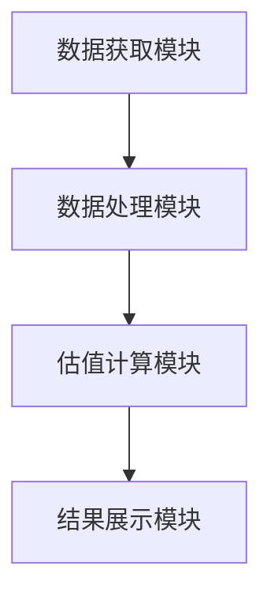

                 


# 全球股市估值与脑机接口在教育中的伦理问题

## 关键词：股市估值，脑机接口，教育应用，伦理问题，人工智能

## 摘要

本文旨在探讨全球股市估值与脑机接口在教育中的伦理问题。首先，我们将深入分析股市估值的核心概念、方法及其系统架构；然后，我们将探讨脑机接口技术的基本原理及其在教育中的应用场景；最后，我们将重点分析这两者在实际应用中的伦理问题，并提出相应的解决方案。通过系统分析和综合评估，本文将为读者提供全面的视角，帮助理解技术与伦理之间的复杂关系。

---

## 第一部分: 全球股市估值分析

### 第1章: 股市估值的基本概念与方法

#### 1.1 股市估值的定义与背景

股市估值是通过对企业的财务数据和市场环境进行分析，确定其股票的合理价格范围。其核心目标是帮助投资者做出明智的投资决策。股市估值的重要性体现在以下几个方面：

- **投资者决策支持**：帮助投资者评估股票的内在价值，避免盲目投资。
- **市场定价参考**：为市场提供合理的股票定价依据，促进市场的公平与效率。
- **风险管理工具**：通过估值分析，投资者可以更好地识别和管理投资风险。

#### 1.2 股市估值的主要方法

股市估值的方法多种多样，主要包括以下几种：

- **相对估值法**：通过比较股票与市场或行业平均水平的比率来评估其价值。常用的比率包括市盈率（P/E）、市净率（P/B）等。
- **绝对估值法**：基于企业的未来现金流折现，计算其内在价值。常用的方法包括现金流折现模型（DCF）和股息贴现模型（DDM）。
- **指数估值法**：通过分析市场整体指数的估值水平，推断个股的合理估值。

#### 1.3 股市估值的数学模型与公式

股市估值的核心在于数学模型的应用。以下是一些常用的估值公式：

- **市盈率法**：$$\text{市盈率} = \frac{\text{股价}}{\text{每股收益}}$$
- **现金流折现模型（DCF）**：$$\text{DCF} = \sum_{t=1}^{n} \frac{\text{CF}_t}{(1+r)^t} + \frac{\text{TV}}{(1+r)^n}$$
  其中，$$\text{CF}_t$$ 表示第 t 年的现金流，$$r$$ 表示折现率，$$\text{TV}$$ 表示终值。

#### 1.4 股市估值的挑战与对策

股市估值面临诸多挑战，例如数据获取的困难、市场波动的影响以及模型假设的局限性。为应对这些挑战，我们可以采取以下对策：

- **优化数据来源**：使用可靠的金融数据源，确保数据的准确性和完整性。
- **动态调整模型**：根据市场变化及时更新估值模型，减少假设偏差的影响。
- **结合多种方法**：综合运用相对估值法和绝对估值法，提高估值结果的准确性。

### 第2章: 股市估值的系统架构与实现

#### 2.1 股市估值系统介绍

股市估值系统是一个复杂的系统工程，其目标是通过自动化的方式对股票进行估值。系统的功能模块包括数据获取、数据处理、估值计算和结果展示。

- **数据获取模块**：通过API接口获取实时股票数据。
- **数据处理模块**：清洗和整理数据，确保数据的可用性。
- **估值计算模块**：基于数学模型计算股票的估值。
- **结果展示模块**：以可视化的方式展示估值结果。

#### 2.2 股市估值系统架构图



#### 2.3 系统接口设计

- **数据接口**：通过API调用金融数据源，数据清洗后存储在数据库中。
- **用户接口**：提供可视化界面，用户可以通过输入股票代码获取估值结果。

#### 2.4 系统实现与代码示例

以下是一个简单的股票估值系统实现示例：

```python
import pandas as pd
import requests

def get_stock_data(ticker):
    url = f"https://api.example.com/stock/{ticker}"
    response = requests.get(url)
    data = response.json()
    return pd.DataFrame(data)

def calculate_shiller_p_e(data):
    # 计算Shiller P/E
    pe = data['Adj Close'].rolling(10).mean() / data['Adj Close']
    return pe

# 示例用法
data = get_stock_data('AAPL')
shiller_pe = calculate_shiller_p_e(data)
print(shiller_pe)
```

---

## 第二部分: 脑机接口在教育中的应用与伦理问题

### 第3章: 脑机接口技术的基本原理

#### 3.1 脑机接口的定义与分类

脑机接口（Brain-Computer Interface，BCI）是一种通过采集和解析大脑电信号，将其转化为可被计算机识别的指令的技术。根据信号采集方式的不同，脑机接口可以分为侵入式和非侵入式两种类型。

#### 3.2 脑机接口的核心技术

脑机接口的核心技术包括信号采集、信号处理和指令生成三个环节。

- **信号采集**：通过 EEG（脑电图）或 fMRI（功能性磁共振成像）等设备采集大脑电信号。
- **信号处理**：对采集到的信号进行滤波、降噪和特征提取。
- **指令生成**：基于处理后的信号，生成相应的控制指令。

#### 3.3 脑机接口在教育中的应用场景

脑机接口在教育中的应用主要体现在以下几个方面：

- **个性化学习**：通过分析学生的大脑活动，制定个性化的学习计划。
- **注意力监测**：实时监测学生的注意力水平，优化教学内容。
- **辅助工具**：帮助有特殊需求的学生（如瘫痪患者）进行学习。

### 第4章: 脑机接口在教育中的伦理问题

#### 4.1 脑机接口在教育中的伦理挑战

脑机接口在教育中的应用引发了诸多伦理问题，例如：

- **隐私问题**：大脑电信号包含大量个人隐私信息，如何确保数据的安全性？
- **公平性问题**：脑机接口技术可能加剧教育资源的不平等分配。
- **自主权问题**：学生在使用脑机接口时，是否会影响其自主决策能力？

#### 4.2 解决脑机接口伦理问题的对策

为应对脑机接口在教育中的伦理问题，我们可以采取以下对策：

- **加强隐私保护**：通过加密技术和数据匿名化处理，确保学生数据的安全。
- **推广公平应用**：制定相关政策，确保脑机接口技术在教育资源分配上的公平性。
- **提高公众意识**：通过教育和宣传，增强学生和家长对脑机接口技术的认识。

---

## 第三部分: 综合分析与解决方案

### 第5章: 全球股市估值与脑机接口的伦理问题

#### 5.1 股市估值中的伦理问题

股市估值中的伦理问题主要体现在以下几个方面：

- **数据滥用**：利用内幕信息进行股票估值，破坏市场公平。
- **利益冲突**：估值机构可能因利益驱动而提供虚假估值结果。
- **技术误导**：过度依赖技术模型，忽视市场的人为因素。

#### 5.2 脑机接口在教育中的伦理问题

如前所述，脑机接口在教育中的应用引发了隐私、公平性和自主权等问题。

#### 5.3 综合分析

股市估值与脑机接口在教育中的伦理问题存在一定的相似性，例如数据滥用、隐私泄露和利益冲突等。这些问题的共同点在于技术的应用可能对社会公平和个体权益造成负面影响。

### 第6章: 解决方案与未来展望

#### 6.1 解决方案

为应对上述伦理问题，我们可以采取以下解决方案：

- **建立监管机制**：制定相关政策法规，规范股市估值和脑机接口技术的应用。
- **加强技术研发**：开发更安全、更可靠的脑机接口技术，减少伦理风险。
- **提高公众意识**：通过教育和宣传，增强公众对技术伦理问题的认识。

#### 6.2 未来展望

随着技术的进步，股市估值和脑机接口在教育中的应用前景广阔。未来，我们需要在技术发展与伦理规范之间找到平衡点，确保技术的应用既能促进社会进步，又不损害个体权益。

---

## 作者

作者：AI天才研究院/AI Genius Institute & 禅与计算机程序设计艺术 /Zen And The Art of Computer Programming

---

以上是《全球股市估值与脑机接口在教育中的伦理问题》的技术博客文章的目录大纲和部分正文内容。如需进一步扩展或修改，请随时告知！

