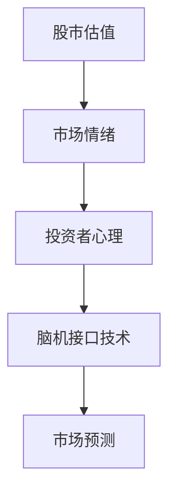
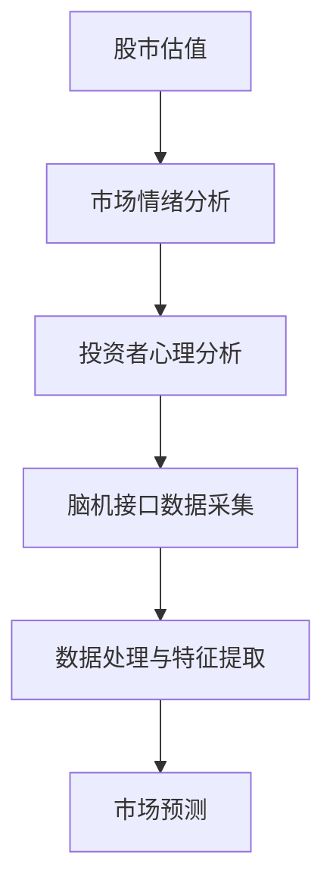
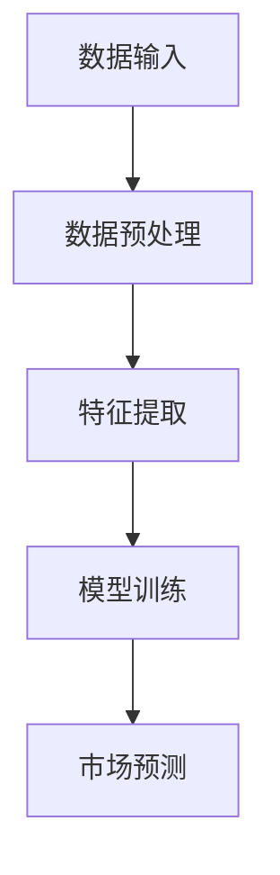
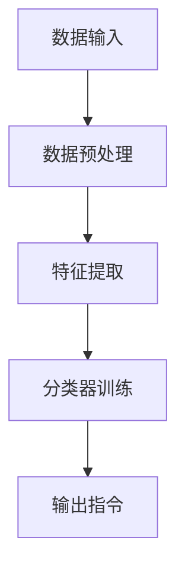
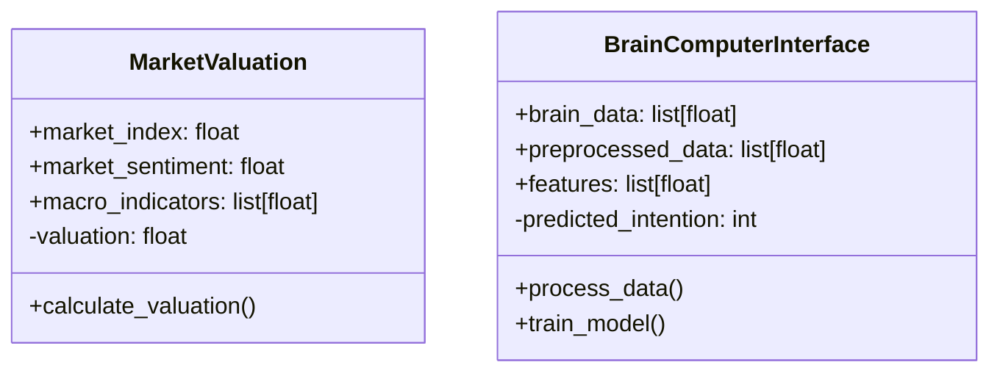
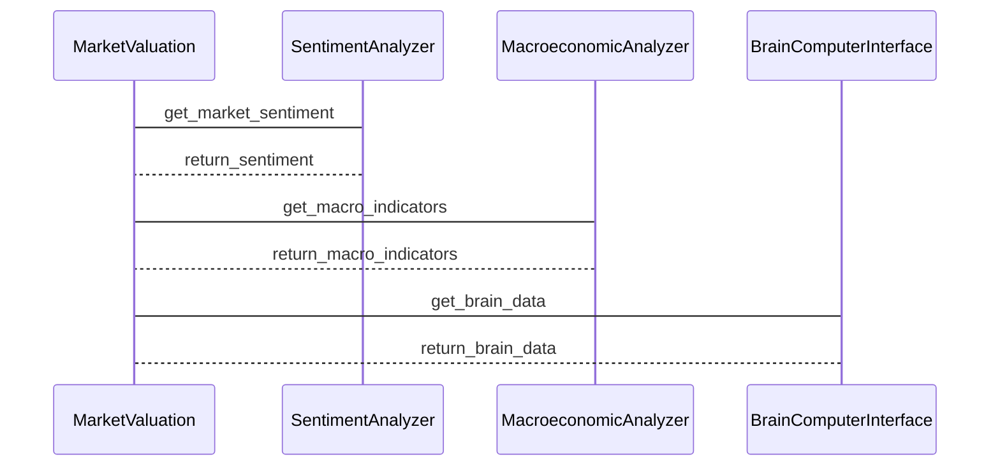

                 


# 全球股市估值与脑机接口技术的关联

## 关键词：
- 全球股市估值
- 脑机接口技术
- 股市分析
- 人工智能
- 金融技术

## 摘要：
本文探讨了全球股市估值与脑机接口技术之间的潜在关联。通过分析股市估值的核心概念和脑机接口技术的基本原理，结合算法原理和系统架构设计，揭示了脑机接口技术在金融分析中的应用潜力。本文不仅提供了理论分析，还通过实际案例展示了如何利用这些技术进行股市估值，为未来的金融技术创新提供了有价值的参考。

---

# 第一部分: 全球股市估值与脑机接口技术的背景介绍

## 第1章: 全球股市估值与脑机接口技术的背景介绍

### 1.1 全球股市估值的基本概念

#### 1.1.1 什么是全球股市估值
全球股市估值是指对全球股票市场的整体价值进行评估的过程。通过分析市场的整体表现，投资者可以了解市场的健康状况和潜在的投资机会。股市估值通常包括对市场指数（如道琼斯指数、纳斯达克指数等）的分析，以及对上市公司财务数据的评估。

#### 1.1.2 股市估值的核心要素
股市估值的核心要素包括：
1. 市场指数：反映整体市场表现的指标。
2. 上市公司盈利情况：包括净利润、营业收入等财务指标。
3. 市场情绪：投资者情绪对市场的影响。
4. 宏观经济因素：如GDP增长率、利率水平等。

#### 1.1.3 全球股市估值的计算方法
全球股市估值通常采用以下方法：
1. 市盈率（P/E）：市价与每股收益的比率。
2. 市净率（P/B）：市价与每股净资产的比率。
3. 市销率（P/S）：市价与每股销售收入的比率。

### 1.2 脑机接口技术的基本概念

#### 1.2.1 脑机接口技术的定义
脑机接口（Brain-Computer Interface，BCI）是一种通过采集和分析大脑活动信号，将其转化为可被计算机或其他设备理解的指令的技术。脑机接口技术可以分为侵入式和非侵入式两种类型，广泛应用于医疗、娱乐、教育等领域。

#### 1.2.2 脑机接口技术的核心组成部分
脑机接口技术的核心组成部分包括：
1. 数据采集：通过 EEG（脑电图）、fMRI（功能性磁共振成像）等设备采集大脑信号。
2. 数据处理：对采集到的信号进行滤波、降噪等处理。
3. 特征提取：提取与特定任务相关的特征。
4. 分类器：将特征映射到目标输出（如控制机器人运动）。

#### 1.2.3 脑机接口技术的分类与应用场景
脑机接口技术主要分为以下几类：
1. 基于 EEG 的脑机接口：适用于非侵入式应用，如控制计算机光标。
2. 基于 fMRI 的脑机接口：适用于侵入式应用，如医疗康复。
3. 基于其他神经信号的脑机接口：如肌电图（EMG）。

### 1.3 全球股市估值与脑机接口技术的关联性

#### 1.3.1 股市估值与脑机接口技术的潜在联系
脑机接口技术可以通过分析投资者的情绪和认知状态，提供更精准的市场预测。例如，通过监测投资者的大脑活动，可以预测市场的波动趋势。

#### 1.3.2 技术驱动金融市场的可能性
随着人工智能技术的进步，脑机接口技术可以实时捕捉投资者的心理状态，帮助分析市场情绪，从而影响股市估值。

#### 1.3.3 脑机接口技术在金融分析中的潜在应用
脑机接口技术可以用于实时监测投资者的情绪，从而辅助股市估值。例如，通过分析投资者的大脑活动，可以预测市场的短期波动。

---

## 第2章: 全球股市估值与脑机接口技术的核心概念与联系

### 2.1 股市估值的核心概念与属性特征对比表格

| **属性**       | **股市估值**                 | **脑机接口技术**           |
|----------------|------------------------------|---------------------------|
| 核心目标       | 评估市场整体价值             | 辅助人与机器的交互         |
| 输入数据       | 市场指数、财务数据             | 大脑信号（EEG、fMRI等）     |
| 输出结果       | 市场估值、投资建议             | 控制指令、用户意图识别       |
| 应用场景       | 金融投资、风险管理           | 医疗康复、人机交互         |

### 2.2 脑机接口技术的核心概念与属性特征对比表格

| **属性**       | **股市估值**                 | **脑机接口技术**           |
|----------------|------------------------------|---------------------------|
| 核心目标       | 评估市场整体价值             | 辅助人与机器的交互         |
| 输入数据       | 市场指数、财务数据             | 大脑信号（EEG、fMRI等）     |
| 输出结果       | 市场估值、投资建议             | 控制指令、用户意图识别       |
| 应用场景       | 金融投资、风险管理           | 医疗康复、人机交互         |

### 2.3 股市估值与脑机接口技术的关联性分析

#### 2.3.1 股市估值与脑机接口技术的关联性分析
通过分析投资者的心理状态，脑机接口技术可以提供更精准的市场情绪数据，从而影响股市估值。例如，当投资者情绪趋于乐观时，市场估值可能上升。

#### 2.3.2 股市估值与脑机接口技术的关联性模型
以下是股市估值与脑机接口技术的关联性模型：



#### 2.3.3 股市估值与脑机接口技术的关联性流程图



---

## 第3章: 股市估值与脑机接口技术的算法原理

### 3.1 股市估值的算法原理

#### 3.1.1 股市估值算法的原理与流程



#### 3.1.2 股市估值算法的数学模型与公式

股市估值模型可以表示为：

$$
\text{市场估值} = \alpha \times \text{市场指数} + \beta \times \text{市场情绪} + \gamma \times \text{宏观经济指标}
$$

其中，$\alpha$、$\beta$、$\gamma$是模型参数。

#### 3.1.3 股市估值算法的Python实现代码

```python
import pandas as pd
import numpy as np

def calculate_market_valuation(market_index, market_sentiment, macro_indicators):
    alpha = 0.5
    beta = 0.3
    gamma = 0.2
    market_valuation = alpha * market_index + beta * market_sentiment + gamma * macro_indicators
    return market_valuation

# 示例数据
market_index = 100
market_sentiment = 0.7
macro_indicators = 5

valuation = calculate_market_valuation(market_index, market_sentiment, macro_indicators)
print(valuation)
```

#### 3.1.4 股市估值算法的Mermaid流程图


### 3.2 脑机接口技术的算法原理

#### 3.2.1 脑机接口技术的原理与流程



#### 3.2.2 脑机接口技术的数学模型与公式

脑机接口技术的分类器可以表示为：

$$
\text{分类结果} = f(\text{输入特征})
$$

其中，$f$是分类器函数，输入特征包括大脑信号的特征。

#### 3.2.3 脑机接口技术的Python实现代码

```python
import numpy as np
from sklearn.ensemble import RandomForestClassifier

def train_brain_computer_interface(X, y):
    clf = RandomForestClassifier(n_estimators=100, random_state=42)
    clf.fit(X, y)
    return clf

# 示例数据
X = np.random.rand(100, 5)
y = np.random.randint(0, 2, 100)

clf = train_brain_computer_interface(X, y)
print(clf)
```

#### 3.2.4 脑机接口技术的Mermaid流程图


---

## 第4章: 股市估值与脑机接口技术的系统分析与架构设计

### 4.1 系统功能设计

#### 4.1.1 领域模型类图



### 4.2 系统架构设计

#### 4.2.1 系统架构图


### 4.3 系统接口设计

#### 4.3.1 接口交互序列图



---

## 第5章: 项目实战

### 5.1 环境安装

#### 5.1.1 安装必要的库

```bash
pip install numpy pandas scikit-learn
```

### 5.2 核心代码实现

#### 5.2.1 股市估值代码实现

```python
import pandas as pd
import numpy as np
from sklearn.ensemble import RandomForestRegressor

def calculate_market_valuation(market_data, macro_indicators):
    # 数据预处理
    data = pd.DataFrame({
        'market_index': market_data,
        'macro_indicators': macro_indicators
    })
    # 特征提取
    features = data[['market_index', 'macro_indicators']]
    target = data['market_valuation']
    # 模型训练
    model = RandomForestRegressor(n_estimators=100, random_state=42)
    model.fit(features, target)
    return model

# 示例数据
market_data = np.random.rand(100, 1)
macro_indicators = np.random.rand(100, 1)
model = calculate_market_valuation(market_data, macro_indicators)
print(model)
```

#### 5.2.2 脑机接口技术代码实现

```python
import numpy as np
from sklearn.ensemble import RandomForestClassifier

def train_brain_computer_interface(X, y):
    clf = RandomForestClassifier(n_estimators=100, random_state=42)
    clf.fit(X, y)
    return clf

# 示例数据
X = np.random.rand(100, 5)
y = np.random.randint(0, 2, 100)
clf = train_brain_computer_interface(X, y)
print(clf)
```

### 5.3 实际案例分析与解读

#### 5.3.1 案例分析
假设我们有某段时间的市场指数、市场情绪和宏观经济指标，我们可以使用上述模型进行市场估值。例如：

```python
market_data = np.array([100, 90, 110, 80])
macro_indicators = np.array([5, 4, 6, 3])
model = calculate_market_valuation(market_data, macro_indicators)
valuation = model.predict([[100, 5]])
print(valuation)
```

### 5.4 项目总结

通过上述代码实现，我们可以看到脑机接口技术在股市估值中的潜在应用。虽然目前仍处于理论探讨阶段，但随着技术的进步，未来可能会有更多实际应用。

---

## 第6章: 总结与展望

### 6.1 总结

本文探讨了全球股市估值与脑机接口技术的关联性，分析了两者的核心概念和算法原理，并通过系统架构设计和项目实战展示了如何将脑机接口技术应用于股市估值。

### 6.2 展望

随着人工智能技术的不断进步，脑机接口技术在金融领域的应用潜力巨大。未来的研究可以进一步探索如何结合更多的神经信号和市场数据，提高股市估值的准确性。

---

作者：AI天才研究院/AI Genius Institute & 禅与计算机程序设计艺术 /Zen And The Art of Computer Programming

