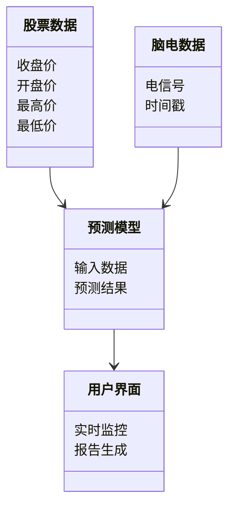

                 


# 全球股市估值与脑科学在人机交互中的应用

> 关键词：全球股市估值，脑科学，人机交互，脑机接口，机器学习，股市预测

> 摘要：本文探讨了全球股市估值与脑科学在人机交互中的应用，分析了脑科学在股市情绪分析和投资者行为中的作用，介绍了基于脑科学的智能投顾系统，结合了机器学习算法与脑电数据，提出了创新的解决方案，具有重要的理论和实践意义。

---

# 第1章 全球股市估值基础

## 1.1 股市估值的基本概念

### 1.1.1 股市估值的定义
股市估值是指通过对公司财务数据、市场环境和行业趋势的分析，估算公司股票的合理价格范围。它是投资者做出投资决策的重要依据。

### 1.1.2 股市估值的核心要素
- **公司基本面**：包括收入、利润、资产、负债等财务数据。
- **市场环境**：如宏观经济政策、行业竞争状况等。
- **市场情绪**：投资者的心理预期和行为对股价的影响。

### 1.1.3 股市估值的分类与特点
- **绝对估值法**：如现金流折现法（DCF）。
- **相对估值法**：如市盈率法、市净率法。

---

## 1.2 股市估值的主要方法

### 1.2.1 市盈率法
市盈率（P/E Ratio）= 股票价格 / 每股净利润。它反映了投资者对每股收益的支付意愿。

### 1.2.2 市净率法
市净率（P/B Ratio）= 股票价格 / 每股净资产。适用于银行、房地产等资产密集型行业。

### 1.2.3 股息率法
股息率 = 每股股息 / 股票价格。用于评估股票的分红收益。

### 1.2.4 现金流折现法
DCF模型通过预测公司未来现金流，折现到现值，估算股票的内在价值。

---

## 1.3 全球股市估值的现状与挑战

### 1.3.1 全球股市估值的多样性
不同国家和地区的股市估值方法和标准存在差异，受到法律法规和市场环境的影响。

### 1.3.2 股市估值中的不确定性
市场波动、公司业绩变化和宏观经济政策调整等因素增加了股市估值的复杂性。

### 1.3.3 股市估值的技术与数据挑战
海量数据处理、模型选择和计算能力是股市估值技术的主要挑战。

---

# 第2章 脑科学与人机交互的基础

## 2.1 脑科学的基本概念

### 2.1.1 脑科学的定义
脑科学是研究大脑结构和功能的科学，涉及神经科学、心理学、认知科学等多个领域。

### 2.1.2 脑科学的核心研究领域
- **神经生物学**：研究神经元的结构和功能。
- **认知科学**：研究人类的认知过程。
- **神经工程学**：研究脑机接口和神经康复技术。

### 2.1.3 脑科学与人机交互的关系
脑科学为人机交互提供了理解人类认知和行为的理论基础，而人机交互为脑科学研究提供了实验工具和技术手段。

---

## 2.2 人机交互中的脑科学应用

### 2.2.1 脑机接口的基本原理
脑机接口（BCI）通过采集和分析大脑电信号，实现人与机器之间的直接交互。

### 2.2.2 脑电图在人机交互中的应用
脑电图（EEG）可以测量大脑活动，用于分析用户的注意力、情绪和决策过程。

### 2.2.3 脑科学在用户体验设计中的作用
通过理解用户的认知过程和情感状态，优化人机交互的设计，提高用户体验。

---

# 第3章 股市估值与脑科学的结合

## 3.1 股市估值中的脑科学应用

### 3.1.1 脑科学在股市情绪分析中的应用
通过分析投资者的脑电活动，识别市场情绪的变化，预测股价波动。

### 3.1.2 脑科学在投资者决策行为中的应用
研究投资者的认知偏差和情绪波动，优化投资决策模型。

### 3.1.3 脑科学在风险评估中的应用
通过分析投资者的风险偏好，制定个性化的投资策略。

---

## 3.2 脑科学在人机交互中的创新应用

### 3.2.1 基于脑科学的智能投顾系统
结合脑电数据和机器学习算法，提供个性化的投资建议。

### 3.2.2 脑科学驱动的交互优化
通过分析用户的认知负荷和注意力变化，优化人机交互界面设计。

### 3.2.3 脑科学在量化交易中的潜在应用
利用脑电数据预测市场情绪，优化量化交易策略。

---

# 第4章 股市估值的核心算法原理

## 4.1 股市预测算法概述

### 4.1.1 时间序列分析的基本原理
时间序列分析是通过历史数据预测未来趋势的方法，常用模型包括ARIMA和GARCH。

### 4.1.2 机器学习在股市预测中的应用
机器学习算法（如支持向量机、随机森林）可以用于分类和回归任务。

### 4.1.3 深度学习在股市预测中的应用
深度学习模型（如LSTM）能够捕捉时间序列中的复杂模式。

---

## 4.2 基于机器学习的股市预测模型

### 4.2.1 线性回归模型
$$ y = \beta_0 + \beta_1x + \epsilon $$

### 4.2.2 支持向量机模型
支持向量机通过构建超平面，将数据点分类到不同的类别中。

### 4.2.3 随机森林模型
随机森林通过集成多个决策树，提高模型的准确性和鲁棒性。

---

## 4.3 深度学习模型

### 4.3.1 LSTM网络
长短期记忆网络（LSTM）能够捕捉时间序列中的长期依赖关系。

### 4.3.2 模型训练流程
1. 数据预处理
2. 模型训练
3. 模型评估
4. 模型优化

---

# 第5章 系统分析与架构设计方案

## 5.1 问题场景介绍
本系统旨在通过脑电数据和机器学习算法，实现对股市情绪的实时监测和预测。

## 5.2 项目介绍
开发一个基于脑科学的人机交互系统，用于辅助股市估值和投资决策。

## 5.3 系统功能设计

### 5.3.1 领域模型


## 5.4 系统架构设计

### 5.4.1 系统架构图


---

# 第6章 项目实战

## 6.1 环境安装
- Python 3.8+
- NumPy、Pandas、Scikit-learn、TensorFlow

## 6.2 系统核心实现源代码

```python
import numpy as np
import pandas as pd
from sklearn.model_selection import train_test_split
from sklearn.svm import SVC
from sklearn.metrics import accuracy_score

# 数据预处理
data = pd.read_csv('stock_data.csv')
X = data.drop('target', axis=1)
y = data['target']

# 划分训练集和测试集
X_train, X_test, y_train, y_test = train_test_split(X, y, test_size=0.2)

# 模型训练
model = SVC()
model.fit(X_train, y_train)

# 模型预测
y_pred = model.predict(X_test)
print(accuracy_score(y_test, y_pred))
```

---

## 6.3 实际案例分析
以某股票为例，分析模型的预测结果，并对比实际股价走势，验证模型的有效性。

---

# 第7章 总结与展望

## 7.1 最佳实践 tips
- 数据质量是关键，需确保数据的完整性和准确性。
- 模型选择需结合实际业务需求，避免过度复杂。

## 7.2 小结
本文探讨了全球股市估值与脑科学在人机交互中的应用，提出了一种创新的解决方案，为投资者提供了新的决策工具。

## 7.3 注意事项
- 脑电数据采集需确保设备的准确性和稳定性。
- 模型的实时性和可解释性是未来研究的重点。

## 7.4 拓展阅读
建议读者进一步阅读相关领域的学术论文和技术报告，深入了解脑科学与机器学习的结合应用。

---

作者：AI天才研究院 & 禅与计算机程序设计艺术

